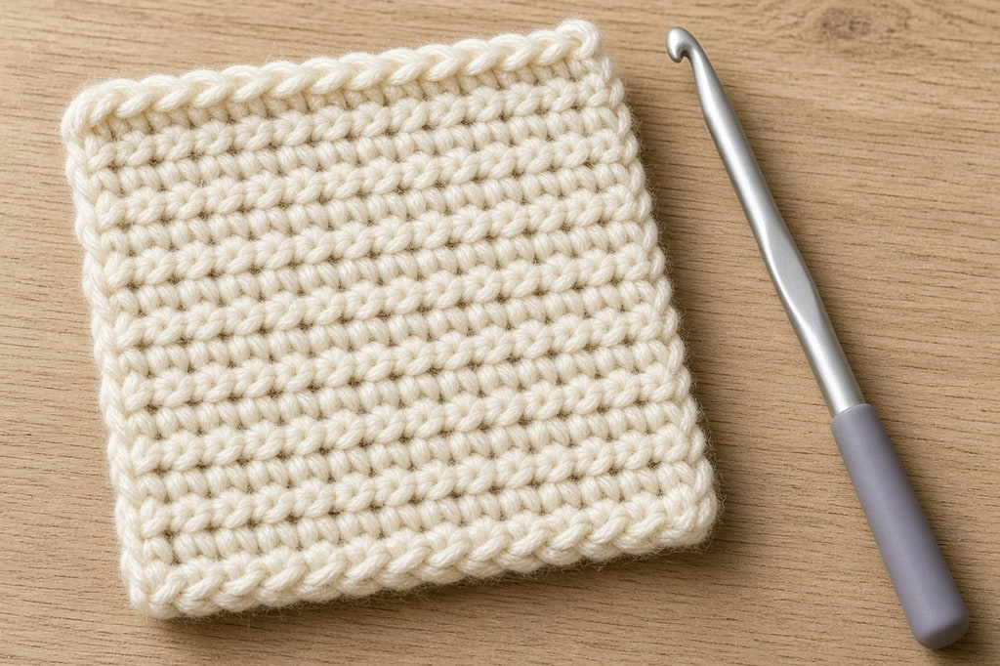
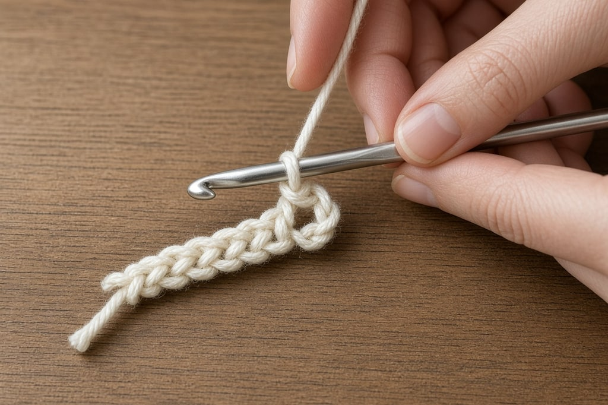
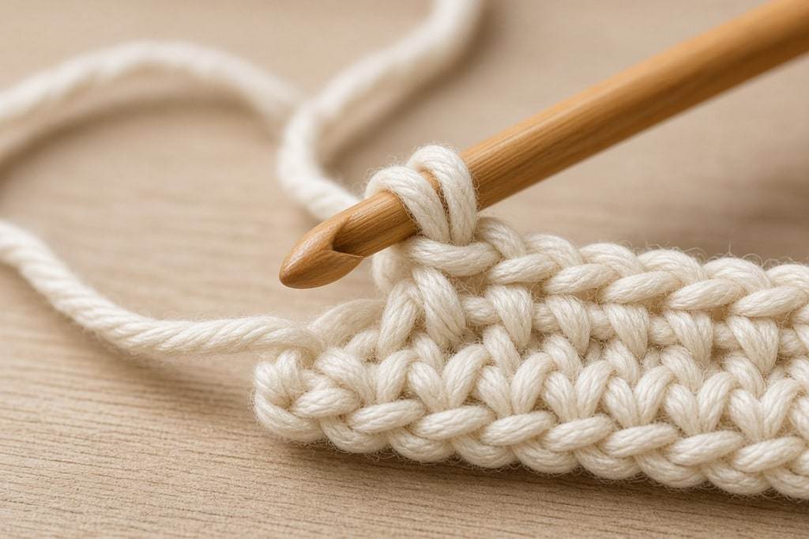
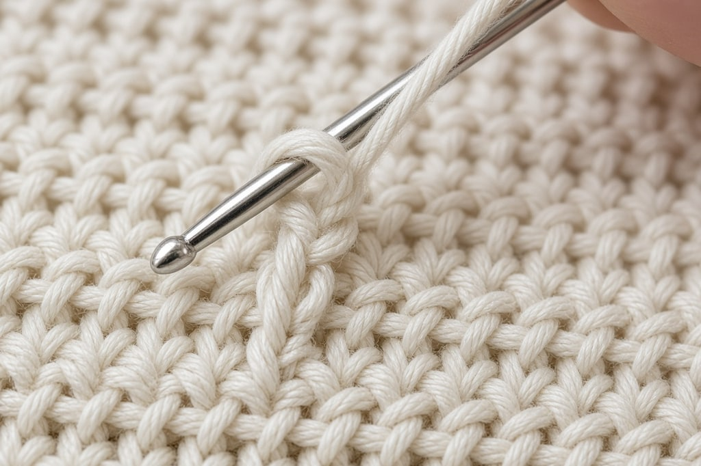

Almost everything in crochet is five stitches. Shells, bobbles, clusters, and puffs are these five combined. Learn them shortest to tallest. Names are **US terms**.

Use medium worsted in a light solid color and a 5 mm (H/8) hook. Dark yarn and variegated yarn hide the structure you need to see.

## The two moves

**Yarn over (`yo`)** — wrap the working yarn over the hook from back to front.

**Pull through** — draw the hook, with yarn on it, back through a loop or a stitch.

The five stitches differ only in how many times you yarn over first, and how many loops you close at a time.

## The foundation chain

Every flat piece starts with a chain.

1. Make a slip knot and put it on the hook.
2. Yarn over.
3. Pull that yarn through the loop on the hook. That is one chain.
4. Repeat for the number the pattern asks for.

Do not count the slip knot or the loop on the hook. Only the finished V-shaped links count. Chain about 20, and keep it loose.

The front of a chain is a row of Vs. The back has a raised bump. Work under one strand of the V, under both, or into the bump. All three are correct. The bump gives the neatest edge. Do the same thing all the way across.

## 1. Slip stitch (`sl st`)

The shortest stitch. It barely adds height. Use it to join rounds, move the hook sideways, or seam.

1. Insert the hook into the stitch.
2. Yarn over.
3. Pull through the stitch and the loop on the hook in one movement.

One loop remains.

## 2. Single crochet (`sc`)

Short, dense, and sturdy. Use it for amigurumi, bags, and dishcloths.

1. Insert the hook into the next stitch.
2. Yarn over and pull up a loop. Two loops on the hook.
3. Yarn over and pull through both loops.

Into a foundation chain, start in the **second chain from the hook**.

## 3. Half double crochet (`hdc`)

Between single and double in height. Softer than single crochet, still fairly dense. Useful for hats and blankets.

1. Yarn over, then insert the hook into the next stitch.
2. Yarn over and pull up a loop. Three loops on the hook.
3. Yarn over and pull through all three loops at once.

You yarn over *before* entering the stitch. That extra wrap is the height. Into a chain, start in the **third chain from the hook**.

## 4. Double crochet (`dc`)

The most-used stitch: tall, quick, and slightly open.

1. Yarn over, then insert the hook into the next stitch.
2. Yarn over and pull up a loop. Three loops on the hook.
3. Yarn over and pull through the **first two loops only**. Two loops remain.
4. Yarn over and pull through the last two loops.

You close the loops in two stages, not all at once. Into a chain, start in the **fourth chain from the hook**.

## 5. Treble crochet (`tr`)

Also written triple crochet. Tall and lacy, for shawls, open patterns, and fabric you want finished fast.

1. Yarn over **twice**, then insert the hook.
2. Yarn over and pull up a loop. Four loops on the hook.
3. Yarn over, pull through the first two loops. Three left.
4. Yarn over, pull through the next two loops. Two left.
5. Yarn over, pull through the last two loops.

Close two loops at a time until one remains. Into a chain, start in the **fifth chain from the hook**. Wrap three times for a double treble, four for a triple treble, then close two loops at a time.

## The pattern behind them

| Stitch | Wraps before inserting | Chain to start in | Turning chain |
| --- | --- | --- | --- |
| `sl st` | 0 | — | — |
| `sc` | 0 | 2nd | 1 |
| `hdc` | 1 | 3rd | 2 |
| `dc` | 1 | 4th | 3 |
| `tr` | 2 | 5th | 4 |

Swatch each stitch about 15 wide and 10 rows tall, then make a dishcloth in single crochet or a scarf in double crochet.

## The mistakes everyone makes

**Chaining too tightly.** The foundation should be looser than the stitches. If row one is a fight, chain with a hook one size larger, then switch back.

**Gaining or losing stitches at the ends.** Nearly always the turning chain. The [full explanation](/crochet-turning-chain/) is its own page.

**The wrong part of the stitch.** Unless the pattern says otherwise, go under **both** top loops. Front loop only and back loop only are variations a pattern will name.

**A hard grip on the yarn.** Tight, uneven stitches usually mean the yarn hand is too tense. Let it run more freely.

## Frequently asked

### Which stitch first?

Chain, then single crochet. Slip stitch is easier, and you cannot make a fabric with it.

### Why does my rectangle have holes?

Double crochet and taller stitches are open. That is the stitch. For solid fabric, use single crochet or half double, or drop a hook size.

### Do I need UK terms?

Only for British or Australian patterns. The same abbreviation is a different stitch in each system. The [abbreviations chart](/crochet-abbreviations-chart/) has the conversion.
