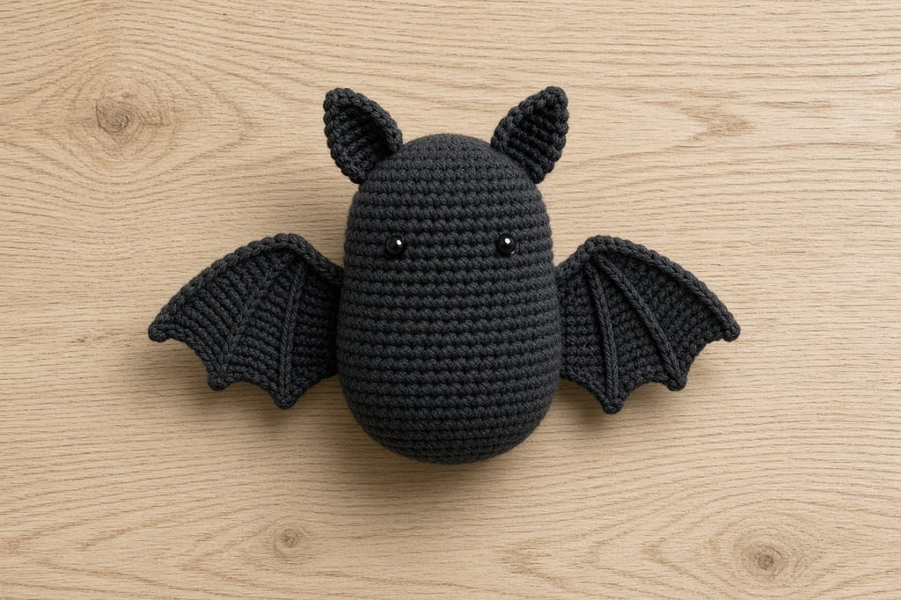
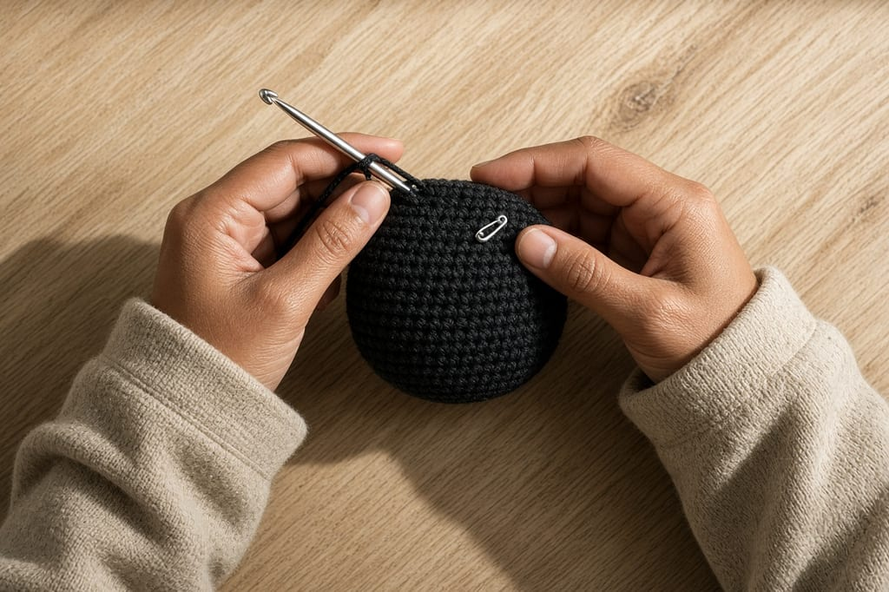
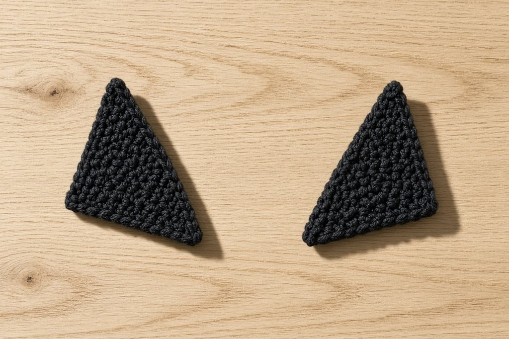
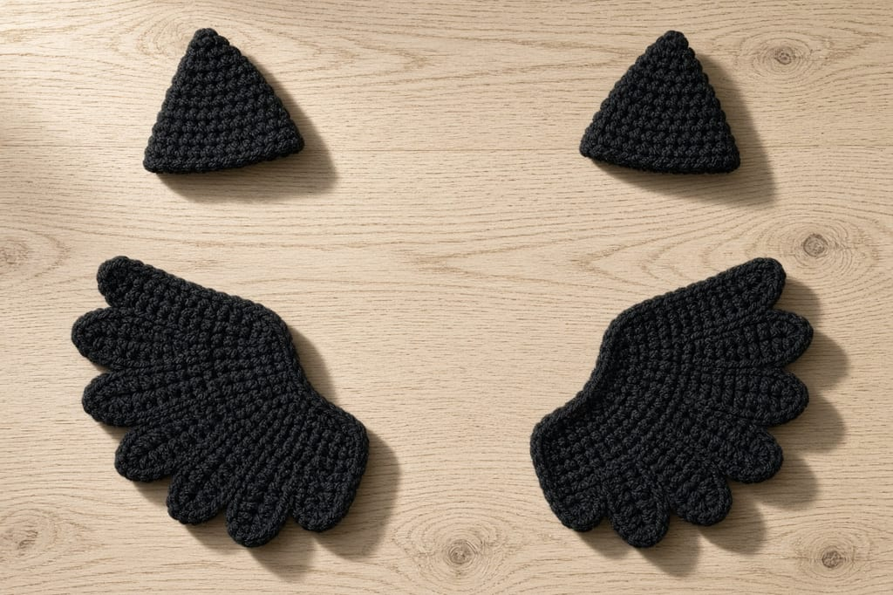
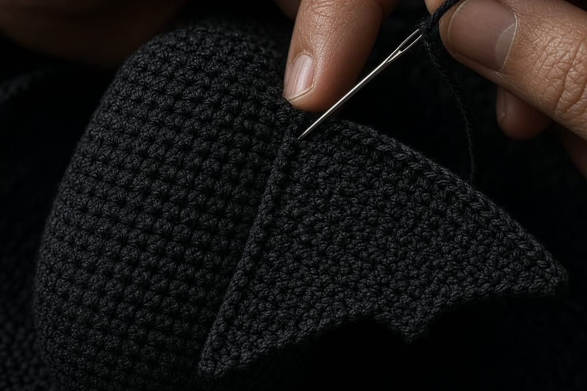
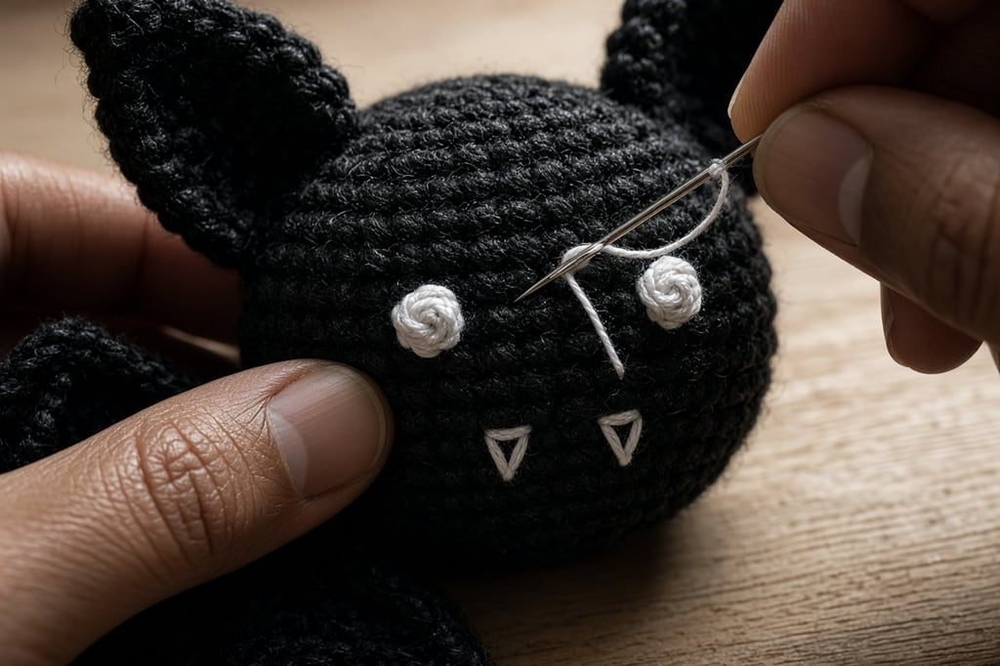

Bats look complicated because of the wings. The body is a small oval. The ears are triangles. The hard part is making two wings the same size and sewing them on so the bat does not look like it is mid-shrug forever.

You should already be comfortable [working in the round](/crochet-in-the-round) and sewing pieces with a yarn needle.

## What you need

- Dark yarn (black, charcoal, deep purple) in a worsted weight — [yarn weight chart](/yarn-weight-chart)
- Scrap of lighter yarn or white for fangs/eyes if you want them
- Hook matched to the yarn ([hook size chart](/crochet-hook-size-conversion-chart))
- Stuffing, yarn needle, stitch markers, pins

US terms: [abbreviations chart](/crochet-abbreviations-chart).

## Step 1: crochet the body

Work a short oval: increase, work even longer than a sphere would need, then decrease.

**Rnd 1.** Magic ring, 6 sc. (6)

**Rnd 2.** Inc around. (12)

**Rnd 3.** *Sc, inc; repeat from * around. (18)

**Rnds 4–8.** Sc around (adjust length for a longer or stubbier body).

Decrease: *sc, sc2tog* around, then sc2tog around, stuffing as you go. Close.

Keep the body firmer than you think. Soft bodies make wings drag the silhouette out of shape.

## Step 2: make two ears

Work flat. Make two.

**Row 1.** Ch 2, 2 sc in second ch from hook. Turn. (2)

**Row 2.** Ch 1, sc in first, 2 sc in last. Turn. (3)

**Row 3.** Ch 1, sc across, 2 sc in last. Turn. (4)

**Row 4.** Ch 1, sc across. Fasten off with a long tail.

Fold a tiny pinch at the base when you sew so the ear cups forward. Sew both ears near the top of the head, slightly toward the front, mirrored.

**Pin both ears before sewing either one.** Symmetry is easier to judge with pins than after the first ear is permanent.

## Step 3: crochet two matching wings

Flat wings read more clearly than tiny 3D ones at small sizes.

**Row 1.** Ch 8, sc in second ch from hook and each ch across. Turn. (7)

**Row 2.** Ch 1, sc2tog, sc across to last 2, sc2tog. Turn.

**Row 3.** Ch 1, sc across. Turn.

**Row 4.** Repeat Row 2.

Continue decreasing at both ends every other row until 3 stitches remain. Work one row even. Fasten off.

For a scalloped lower edge, on a longer starting chain work: *sc, hdc, dc, hdc, sc, skip 1; repeat* along one long edge after the wing shape exists.

Make the second wing by repeating the **same** row counts.

## Step 4: sew the wings on

Pin wings to the sides of the body along the shoulder line, about halfway down the body height, angled slightly upward and back. Sew through both layers of the wing into the body. Reinforce the top inch; that is where gravity pulls.

If a wing droops, sew a second pass higher on the body or tack the mid-wing with a couple of hidden stitches.

## Step 5: embroider the face

Two French-knot eyes and a tiny V of white yarn for fangs are plenty. Skip a smile; bats go weird fast when over-embroidered.

## Mistakes that spoil the bat

**Wings sewn too low.** Shoulders, not hips.

**One wing with an extra row.** Count as you go.

**Ears too far apart.** Inside the width of the head, not on the body equator.

**Overstuffed head, empty body.** The bat tips forward.

## Frequently asked

### Can I crochet the wings in the round?

You can, but flat wings photograph and hang more cleanly for small bats.

### What if I only have chunky yarn?

Scale up the wing chain and stop body increases earlier so pieces stay in proportion.

### How do I hang a bat garland?

Leave long tails and thread several bats onto a chain or twine through the tops of the heads.

### What to make next

A [spider and web](/how-to-crochet-a-spider-and-web), a [ghost](/crochet-ghost-amigurumi-for-beginners), [Halloween granny squares](/halloween-granny-square-variations), or the [Halloween card wallet](/halloween-crochet-card-wallet).
