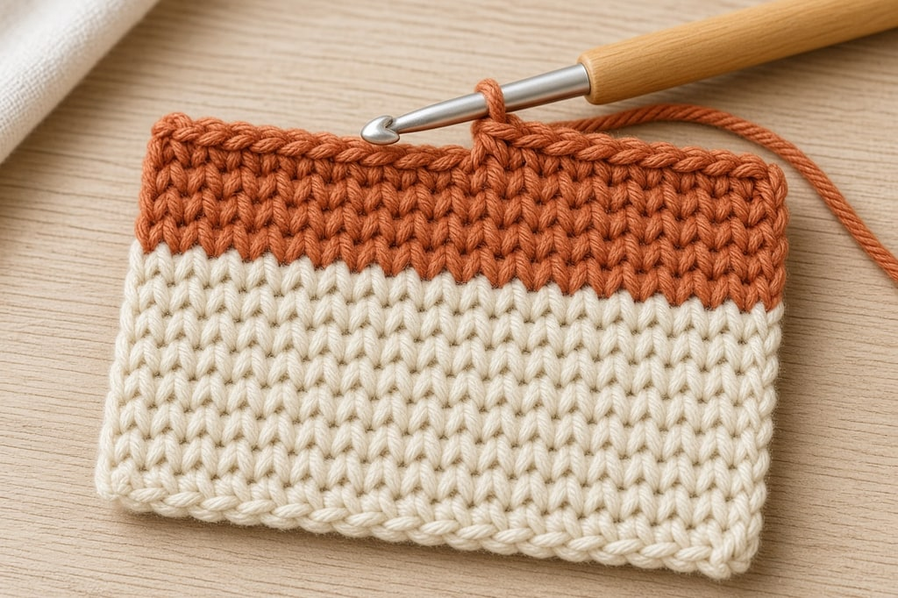
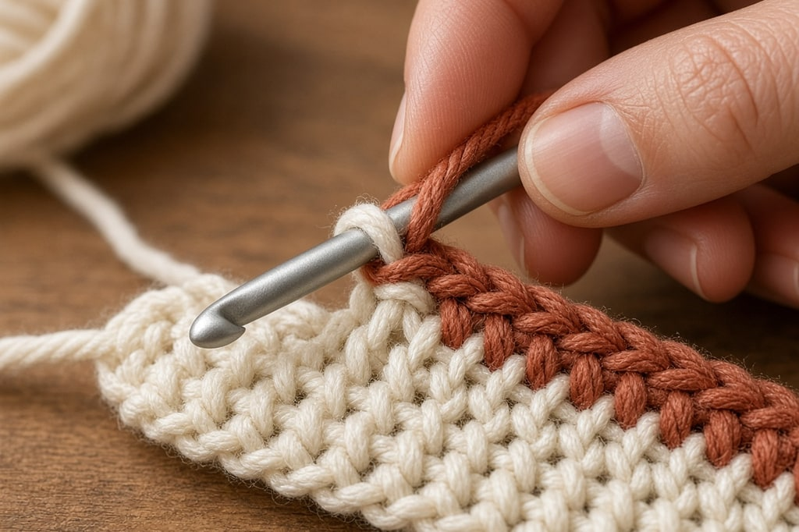
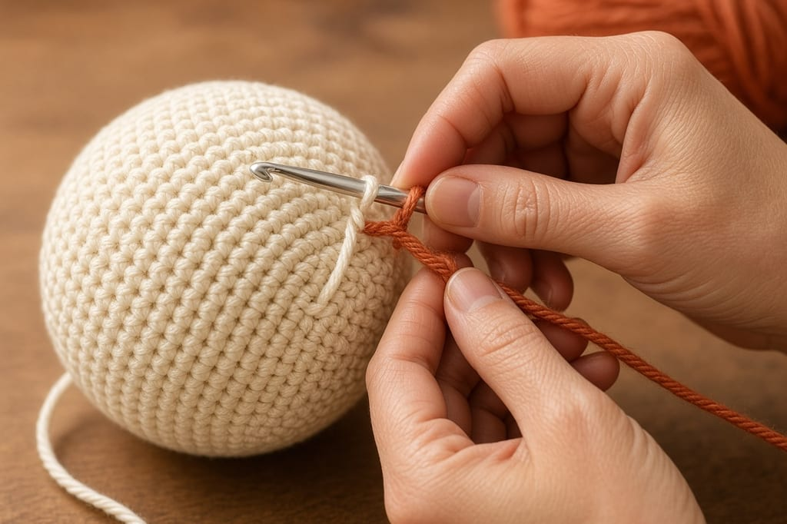

Stripes look clean or messy for one reason. **Change color on the final yarn-over of the last stitch in the old color**, not at the start of the new row.

That is the difference between a straight color line and a dot of the old color at the edge of every row.

## The basic color change

Work the last stitch in the old color until two loops remain on the hook.

1. Stop before the final yarn-over. Two loops are still on the hook.
2. Drop the old color. Yarn over with the new color.
3. Pull the new color through those two loops.

The stitch body stays the old color. The loop on the hook is the new color. Leave both tails about six inches, and keep going.

The same rule holds for every stitch height. The new color always goes in on the yarn-over that closes the stitch.

## Between rows

If you finish the row in the old color, then chain up in the new color, the last stitch of the old row sits at the edge of the new stripe. It reads as a mistake.

Complete the last stitch of the old row with the new color, using the steps above. Turn. The turning chain is already the new color, and the line at the edge is straight.

Work four rows of single crochet. Change the wrong way once, at the start of a row, and the right way once, in the last stitch of the previous row. Hold the swatch next to a window. The difference is obvious.

## Mid-round

Same yarn-over. On a joined round, make the change at the join and the seam hides it.

A spiral has no join, so the color change steps diagonally. That is built into spiral rounds. For stripes, joined rounds avoid it.

You can change in the middle of a row the same way. A clean vertical block of color means managing two yarns at once. That is intarsia, not a simple stripe.

## Carry it, or cut it?

**Carry the unused color up the side** when the stripe is narrow, about four rows or fewer. Leave it at the edge and pick it up when you need it. Catch it lightly against the edge stitches so it does not hang.

**Cut it** when the stripe is wider, about five rows or more. A long float up the side snags, and it pulls the edge in. Cut, leave a six-inch tail, and weave it in.

Do not carry a float across the back of ordinary stripes. That is a different colorwork method, and in a simple stripe it makes a mess.

Even-numbered stripes keep the color you need waiting at the same edge, so you can carry the narrow ones instead of cutting every row.

## A new ball of the same color

Join the new ball on the final yarn-over, the same way. It disappears because both yarns match.

Do not knot it. Knots work to the surface with washing and show as a bump. Weave both tails. Join at the end of a row when you can, so the tails hide in the edge.

The magic knot and the Russian join splice two strands into one continuous yarn. The magic knot is faster and leaves a very small hard point. The Russian join is bulkier, smooth, and secure. Neither suits slippery yarn, or baby items, where woven ends are safer.

The color change sits in the top of the last old stitch. On the wrong side, and on tall stitches, the new color can look as if it bleeds down a little. That is normal. It shows most in double crochet and taller stitches, and least in single crochet, which is why graphic colorwork is usually single crochet.

## Common mistakes

**Changing at the start of the row.** Change in the last stitch of the previous row.

**Pulling the new color tight.** The first stitches of a new color get yanked, and the edge pinches. Keep the first two stitches loose on purpose.

**Cutting the tail too short.** Six inches is the minimum. Longer if you will seam with it. A three-inch tail will not stay woven.

**Weaving a tail along the color boundary.** A dark tail goes through dark stitches. A light tail goes through light stitches. Navy through a cream stripe shows, especially after washing.

**Saving every end for the end.** Weave as you go, or a striped blanket becomes a long finishing job.

## Frequently asked

**Can I change color in the middle of a row?** Yes. Same technique. A clean vertical edge means two yarns in play at once, which is intarsia rather than striping.

**How do I avoid a pile of ends on stripes?** Use even-numbered stripes so the next color is waiting at the same edge, and carry the narrow stripes up the side instead of cutting them.

**Why does the color change look like a step?** You are in a spiral. Joined rounds give stripes a straight join.
