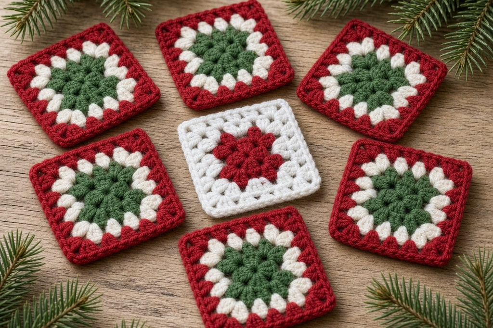
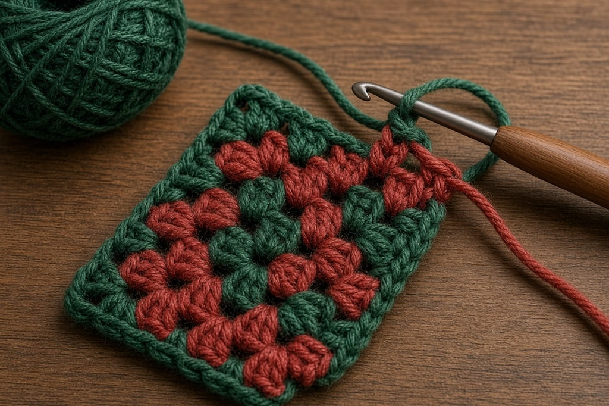
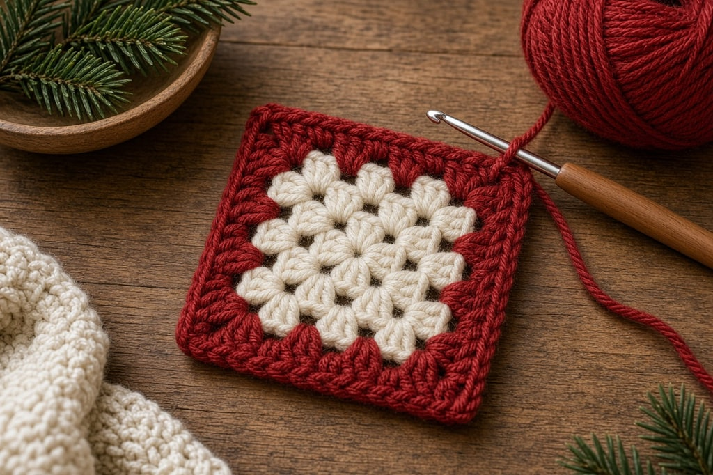

A granny square is the same move over and over: clusters of three double crochets worked into the **gaps**, never into the tops of the stitches. Once that is in your hands, the interesting part is color. Christmas is where those choices go muddy. Four layouts below. None of them changes the stitch.

## What you need

- Worsted-weight yarn ([yarn weight chart](/yarn-weight-chart/)) in red, green, white, and optionally a metallic gold
- A hook that matches the yarn, often a US H/8 (5.0 mm)
- A yarn needle. There will be a lot of ends

US abbreviations throughout.

## The classic square, one color

**Center.** Magic ring, then ch 3 (counts as the first dc), 2 dc into the ring, ch 2. *3 dc into the ring, ch 2; repeat from * three times total. Join to the top of the beginning ch-3. Four clusters, four ch-2 corners.

**Every round after.** In each corner space work (3 dc, ch 2, 3 dc). Along each side, work 3 dc into each ch-space between clusters. Join at the end of the round.

Each round adds one cluster per side. The square grows without a stitch count.

**Work into the spaces, not the stitches.** The hook goes into the gap between clusters, not into the top of a double crochet. A square that goes stiff and loses its holes is what happens when you work into the stitch tops.

## Variation 1: candy-cane rings

Change color by round, alternating red and white, each color for one round or for two. Keep the bands even all the way out. Uneven bands read as a mistake.

Finish on white. A white outer round separates each square from the next. Without it, a field of red-and-white squares turns into one busy cloth.

## Variation 2: star center, quiet border

Work the first two rounds in gold or white, then the rest in a single deep green. The eye lands on one bright center against a calm field. The accent is only two rounds, so a metallic that fights you only has to be fought briefly.

If the center is metallic, hold it with a strand of ordinary worsted rather than working it alone.

## Variation 3: the quartered square

Two colors split the square, half red and half green. The carried-yarn way uses two balls and a swap at the corner. The shortcut is to work each color only to the halfway point across two sides, then join the halves. Most people find the carried-yarn version easier after doing it twice.

Do not carry the unused color loosely across the back. Long floats snag. Catch the float every few stitches, or use a separate small ball for each section.

Complete the last yarn-over of the stitch before the change with the new color. That step is covered in [changing yarn color](/changing-yarn-color-crochet/).

## Variation 4: the Nordic square

Three rounds of cream, one round of red, three more rounds of cream, one round of green. Narrow stripes on a pale ground. It uses very little of the accent colors, so it is the best layout for leftovers, and it looks the least like a novelty project.

## Joining

**Match the edges.** Lay two squares so each cluster faces a cluster. Join without aligning and the corners drift.

**Use one join for the whole set.** Whip stitch through the back loops is flattest. A slip stitch join leaves a ridge, which looks intentional in a contrasting color. Joining as you go is faster and much harder to undo.

**Join in the color you finished on.** White on white disappears. Red on white becomes a grid. Either is fine if you chose it.

Weave ends when you finish each square. Saving them for the end of a blanket is how the project stalls. The method is in [weaving in ends and blocking](/weaving-in-ends-and-blocking/).

## Mistakes that muddy the color

**Red against green with nothing between them.** The two colors are close in value, so the boundary goes muddy at a distance. One round of white or cream between them fixes it.

**Too many colors, or a dark outer round on every square.** Four colors is the ceiling, and three is better. Dark green edges make the whole blanket read as dark green.

**Squares that do not match, or a missed corner.** Metallics often work up tighter than the other yarns in the same brand. Check one square of each colorway before you make a stack. Every corner needs (3 dc, ch 2, 3 dc). Miss one and the square goes off-square on the next round.

## Frequently asked

### How many squares for a blanket?

Make one, measure it, then divide your blanket size by that measurement. Deciding on a square count first is how the finished piece comes out an awkward rectangle.

### Can I mix the four layouts?

Yes, if they share an outer-round color. Mixed squares all edged in cream read as one set. The same squares edged in their own colors read as samples.

### Why is my square curling?

Too few stitches, usually a missed corner. A granny square should lie flat off the hook. Count the clusters on each side and find the short one.
