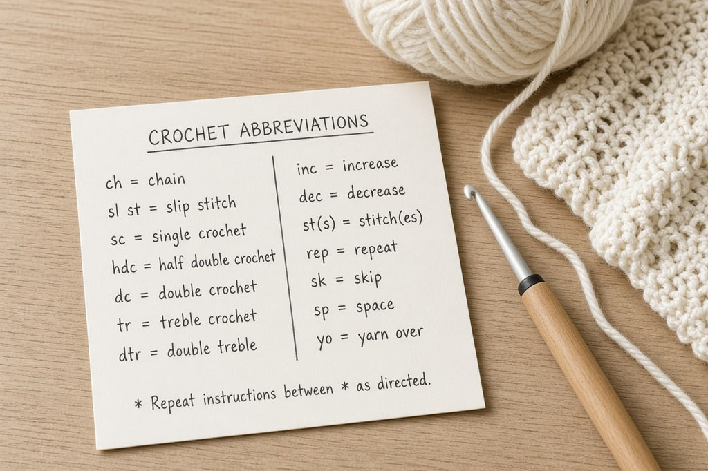
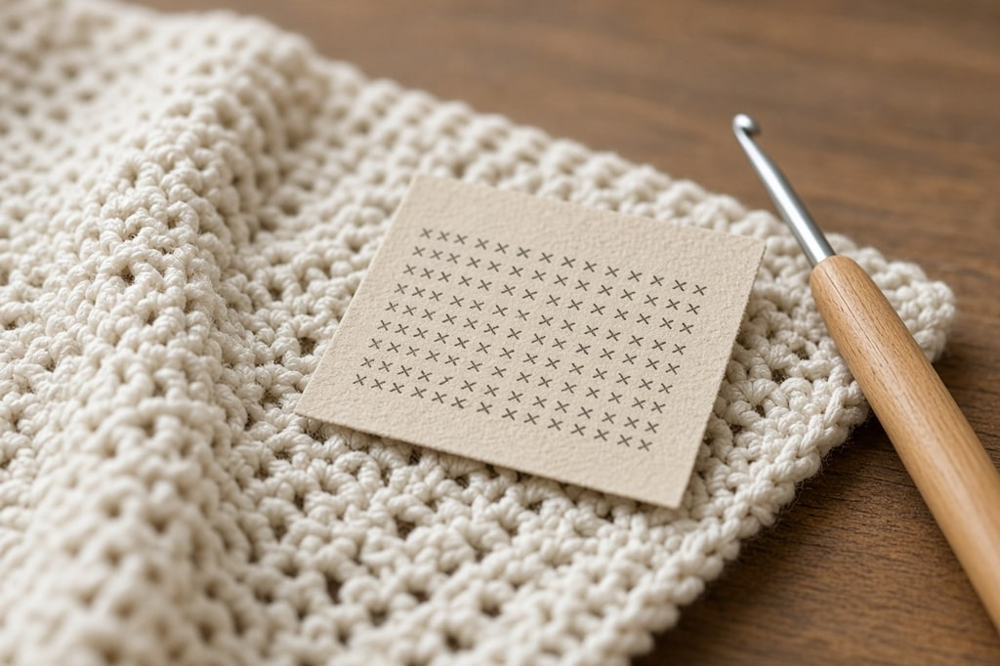
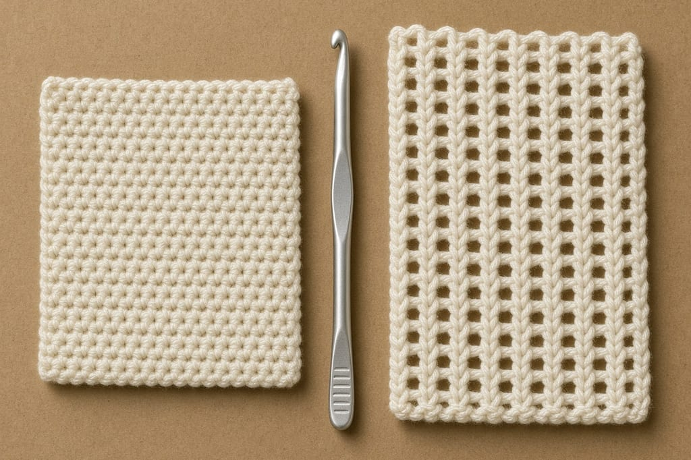

A line like `2 hdc in next st, sk 1, rep from *` is ordinary pattern shorthand. The charts below are US terms, so print the page and keep it with the project.

**If the fabric is the wrong height, check US versus UK before you rip more rows.** The same letters name different stitches. Half as tall as the photo is usually this. The conversion is [further down the page](#us-vs-uk-terms-the-one-that-catches-everyone).

## The stitches

| Abbreviation | Stitch | In plain English |
| --- | --- | --- |
| `ch` | chain | The starting loop-chain. Also used to make gaps and spaces. |
| `sl st` | slip stitch | The shortest stitch. Used to join rounds and travel across without adding height. |
| `sc` | single crochet | The short, dense, basic stitch. |
| `hdc` | half double crochet | Between an `sc` and a `dc` in height. |
| `dc` | double crochet | The tall workhorse stitch. Fast and slightly open. |
| `tr` or `trc` | treble (triple) crochet | Taller than `dc`, noticeably lacy. |
| `dtr` | double treble crochet | Taller again. Mostly seen in lace and shawls. |
| `ttr` | triple treble crochet | Very tall. Rare outside decorative work. |

## Where to put the stitch

| Abbreviation | Meaning | In plain English |
| --- | --- | --- |
| `st` / `sts` | stitch / stitches | The loops along the top of your work. |
| `sp` / `sps` | space / spaces | The gap made by a chain, not a stitch. You work *into the hole*. |
| `lp` / `lps` | loop / loops | The strands on your hook, or the two strands at the top of a stitch. |
| `BLO` | back loop only | Insert the hook under the *far* loop only. Creates a ridged, stretchy fabric. |
| `FLO` | front loop only | Insert the hook under the *near* loop only. |
| `blo` / `flo` | back / front loop | Lowercase versions of the same instruction. Same meaning. |
| `fp` / `bp` | front post / back post | Work around the body of the stitch below rather than into its top. Gives you `fpdc`, `bpdc`, and ribbing. |
| `tch` / `t-ch` | turning chain | The chain(s) at the start of a row that give it height. |
| `ch-sp` | chain space | A space created by a chain. `ch-2 sp` means the gap made by two chains. |

## Actions and counts

| Abbreviation | Meaning | In plain English |
| --- | --- | --- |
| `yo` | yarn over | Wrap the yarn over the hook. |
| `sk` | skip | Pass a stitch without working into it. Usually paired with a chain. |
| `inc` | increase | Add a stitch, normally by working two stitches into one. |
| `dec` | decrease | Remove a stitch by joining two into one. |
| `tog` | together | Worked together as one, as in `dc2tog`. |
| `sc2tog` | single crochet 2 together | A decrease. Two `sc` become one. |
| `dc2tog` | double crochet 2 together | The same idea with double crochet. |
| `inv dec` | invisible decrease | A neater decrease used in amigurumi. Hides the join. |
| `rep` | repeat | Do the marked section again. |
| `beg` | beginning | The start of the row or round. |
| `rnd` / `rnds` | round / rounds | Worked in a spiral or a joined circle, not back and forth. |
| `row` | row | Worked flat, turning at the end. |
| `RS` / `WS` | right side / wrong side | The public face of the fabric versus the back. |
| `pm` | place marker | Put a stitch marker here. You will need it later. |
| `sm` | slip marker | Move the marker up as you pass it. |
| `FO` | fasten off | Cut the yarn and pull it through to secure. |
| `MC` / `CC` | main color / contrast color | Which yarn to use. |
| `MR` | magic ring | An adjustable starting loop for working in the round. |
| `fsc` / `fdc` | foundation single / double crochet | Makes the chain and the first row at the same time. |

## Textured stitches

Designers define these differently. A special-stitches note in the pattern wins over this chart.

| Abbreviation | Name | Roughly |
| --- | --- | --- |
| `cl` | cluster | Several stitches joined at the top. |
| `sh` | shell | Several stitches worked into one stitch, fanning out. |
| `bo` | bobble | A cluster that pops forward. |
| `pc` | popcorn | A rounder, chunkier bobble. |
| `puff` | puff stitch | Several loops drawn up and closed together. |
| `pico` / `p` | picot | A tiny decorative chain bump, common on edgings. |

## US vs UK terms: the one that catches everyone

The names are shifted by one. What the US calls a single crochet, the UK calls a double crochet. A UK `dc` is the short, dense stitch. A US `dc` is the tall one.

| US term | UK term |
| --- | --- |
| slip stitch (`sl st`) | slip stitch (`sl st`) |
| single crochet (`sc`) | double crochet (`dc`) |
| half double crochet (`hdc`) | half treble (`htr`) |
| double crochet (`dc`) | treble (`tr`) |
| treble crochet (`tr`) | double treble (`dtr`) |
| double treble (`dtr`) | triple treble (`trtr`) |

**`sc` means US terms.** UK terminology has no single crochet. **`htr` means UK terms.** "Colour", "tension" instead of "gauge", and grams instead of yards point to a UK or Australian designer. If you cannot tell, assume US terms.

## Reading the punctuation

Parentheses put stitches in one place: `(2 dc, ch 1, 2 dc) in next st`. At the end of a row they are the count, `(12 sts)`. Brackets repeat: `[sc, ch 1] x 6`. An asterisk starts a repeat that runs to the end. A number before a stitch is how many to make (`3 dc`). A number after it is one stitch (`dc3tog`). So `*2 dc in next st, sk 1 st, rep from * to end (24 sts)` finishes at 24.

## Mistakes

Some designers count the starting `ch 3` on a double-crochet row as the first stitch. Others do not. A stitch gained or lost every row is usually this. `ch-2 sp` means the hole, not the chain links. Check US or UK again when you change designers.

## Frequently asked

**Is there an official list?** The Craft Yarn Council publishes the standard US abbreviations. This chart also includes common ones it does not cover, such as `MR` and `FO`.

**Why symbols instead of words?** Stitch diagrams, common in Japanese patterns and lace, draw the motif.

**Do I need to memorize this?** No. About fifteen show up in the first month. Look the rest up.
