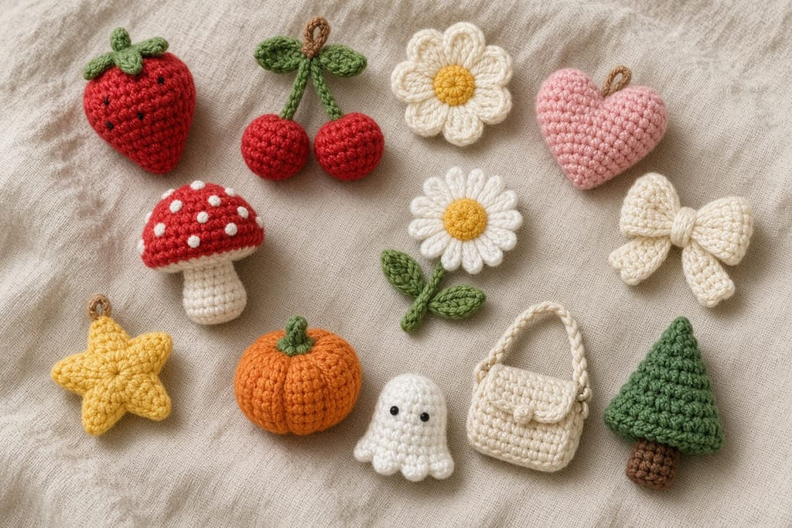
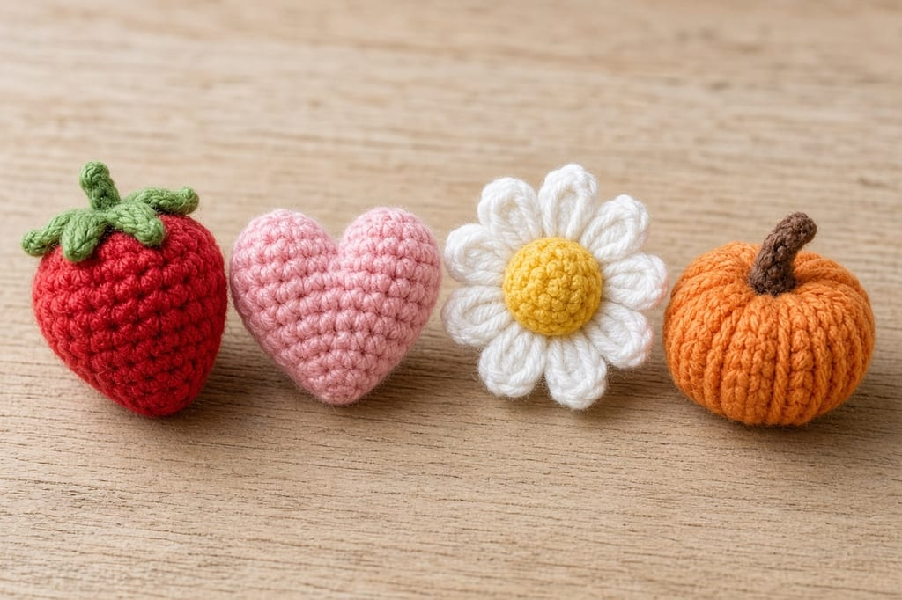
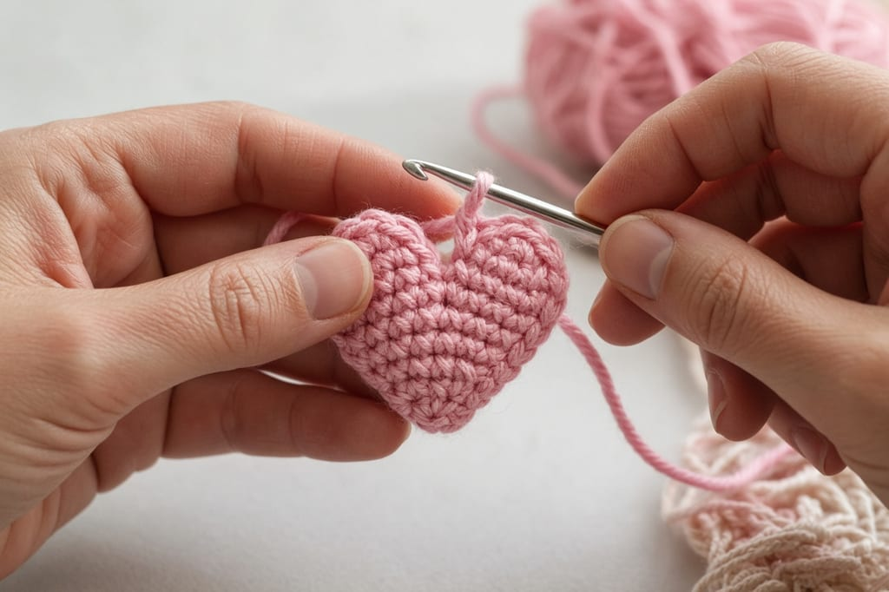
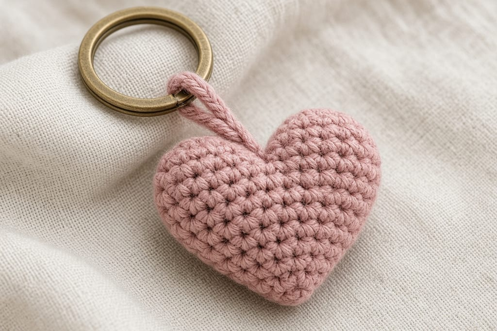
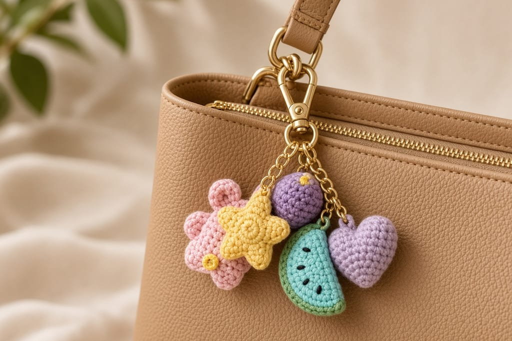

A bag charm is a scrap project that has to survive a zipper pull. If the loop is thin, it saws through in a week. If the charm is heavy, it knocks the bag while you walk.

Below are 12 shapes worth making from leftover worsted cotton. Only the tiny heart has a full stitch pattern. The other eleven are ideas: color, size, and what to watch. They are not tutorials. Do not treat the group photo as proof that each shape has been written out.

US terms. Photos are illustrations. The heart has not been physically tested.

## Shared rules

- Worsted cotton, about **8 to 15 yards** per charm. [Yarn weights](/yarn-weight-chart).
- US G/6 (4.0 mm) or a slightly smaller hook so the fabric stays firm. [Hook chart](/crochet-hook-size-conversion-chart).
- A split ring, plus a chain of about 12 stitches sewn on as the loop.
- Stuff very lightly, or not at all. A charm should stay under an inch and a half.

Sew the loop to a solid part of the charm, weave the tail through the chain three times, and clip the ring on after. Do not crochet around the metal.

## The twelve

**Strawberry.** Red body, green cap. Beginner if you already make small balls. The seeds are embroidered after, with shallow stitches, so the back stays flat against a bag.

**Cherry.** Two tiny red balls and a green chain stem. The stem is the weak point. Chain it a little thicker by holding two strands, or it kinks and snaps.

**Mini flower.** Five petals around a small center. A full-size flower with a different construction is [how to crochet a simple flower](/how-to-crochet-a-simple-flower). That pattern is not a charm. Scale is the whole problem: a flower that looks right at 4 inches looks sparse at 1 inch.

**Tiny heart.** Full pattern below. Beginner. Rows, then two short lobes.

**Bow.** Two loops and a center wrap. Intermediate only because the tails twist. Pin the loops before you wrap the center or the bow collapses into a knot.

**Mini mushroom.** A short white stem and a red cap. Beginner shapes, fiddly sewing. The cap wants to slide off a skinny stem. Sew through the center, not just the edge.

**Daisy.** White petals, yellow center. Same warning as the mini flower. Keep petal counts low or the charm becomes a disk.

**Star.** Five points. Intermediate. Points curl if the decreases are loose. This page does not include a star pattern.

**Pumpkin.** Orange ball, brown seam lines, short stem. A stuffed pumpkin with a full write-up is [how to crochet a pumpkin](/how-to-crochet-a-pumpkin-step-by-step). Use that if you want a bowl-sized pumpkin. A charm is the same idea at scrap size, and it is not written out here.

**Mini ghost.** White blob and two embroidered eyes. A pouch-sized ghost with a drawstring is the [ghost coin pouch](/how-to-crochet-a-ghost-coin-pouch). A charm has no opening.

**Tiny purse.** A flat rectangle folded and seamed, with a strap of chain. Beginner. It is a charm, not a coin purse. Do not expect it to hold anything.

**Mini Christmas tree.** Green triangle, small trunk. A standing tree pattern is [how to crochet a Christmas tree](/how-to-crochet-a-christmas-tree). That one is an ornament-scale project, not this charm.

## Tiny heart pattern

Work in rows. Ch 1 at the end of a row does not count as a stitch.

Chain 2.

**Row 1:** sc in the 2nd chain from the hook. Ch 1, turn. (1)

**Row 2:** inc. Ch 1, turn. (2)

**Row 3:** inc in each stitch. (4)

**Row 4:** inc, sc 2, inc. Ch 1, turn. (6)

**Row 5:** inc, sc 4, inc. Ch 1, turn. (8)

**Row 6:** sc in each stitch. Ch 1, turn. (8)

**Row 7, first lobe:** sc in the next 4 stitches. Ch 1, turn. Leave the other 4 unworked. (4)

**Row 8:** dec, dec. (2)

Fasten off.

**Second lobe:** join the yarn in the first unworked stitch of Row 6. Sc in that stitch and the next 3. Ch 1, turn. (4)

**Next row:** dec, dec. (2)

Fasten off. Weave the ends.

Row 5 is 8 because 6 stitches plus 2 increases equal 8. Each lobe takes 4 of those 8. Two decreases on 4 stitches equal 2.

Chain 12 for the hanger. Sew both ends between the lobes, on the back, so the point hangs down.

## On the bag

One charm on a zipper is enough. Three on the same pull tangle. If you want a set, use separate rings on separate hardware.

## Mistakes

**A loop of one strand.** It wears through. Use the chain, then sew it down so the ring cannot saw one fiber.

**Copying a designer's charm from a photo.** A shape idea is not a license to redraw someone else's pattern. The heart above is the pattern on this page. For the rest, write your own counts or use a project you already have the rights to make.

**Heavy stuffing.** The charm should not thunk against the bag.

Wash a new charm before it lives on a pale bag. Cotton can still drop a little dye, especially red and orange. Rinse it, let it dry, and then clip it on.

## Care

Take the ring off. Hand wash cool. Dry flat. Do not iron. A pressed heart becomes a felted lump if the yarn is wool. Cotton is the safer scrap.

## Frequently asked

**Are all 12 patterns on this page?**

No. The heart is complete. The list is there so you can pick a scrap project and see the attachment method. A missing pattern is not an invitation to invent stitch counts and call them tested.

**Can I sell the hearts?**

Finished hearts, yes. Do not republish the row instructions.

**What yarn should I avoid?**

Eyelash and mohair. The shape disappears, and the loop grabs every sweater you walk past.

## Next

A useful scrap that is not a charm is the [lip balm holder](/how-to-crochet-a-lip-balm-holder). If you want a Halloween piece that holds something, use the [pumpkin treat bag](/how-to-crochet-a-pumpkin-treat-bag) instead of a mini pumpkin charm.
