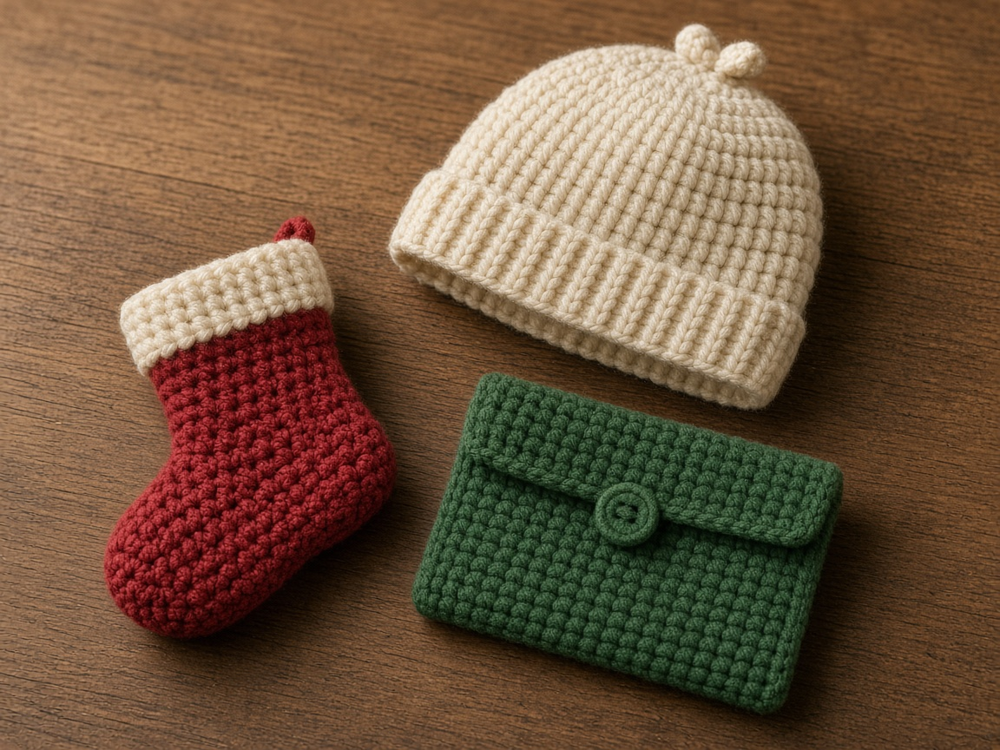

The useful Christmas question is not "what can I invent in December." It is which finished object you can actually complete before the date on the calendar. Every project below already has a tutorial on this site. Yarn that behaves in small holiday stitches is covered in [yarn for Christmas crochet](/yarn-for-christmas-crochet/).

This is a guide to existing tutorials. It is not a new pattern, and the photo is an illustration of the kind of objects those pages describe.

## If you have one evening

- [Christmas gift card holder](/how-to-crochet-a-christmas-gift-card-holder/). A flat pocket. One of the few gifts that is finished when the sewing is done.
- [Mug cozy](/crochet-mug-cozy-for-beginners/). Measure the mug first or it will not close.
- [Snowflake](/how-to-crochet-a-snowflake/). Flat ornaments. The hanging loop matters more than the lace.
- [Simple flower](/how-to-crochet-a-simple-flower/). Sew it to a plain gift or to the mug cozy.
- [Fall leaf](/how-to-crochet-a-fall-leaf/). A small appliqué. The stitch count is on paper, not from a finished leaf.
- [Halloween coasters](/free-pattern-halloween-coasters/). A flat pumpkin disc, plus a granny set. Not a hot pad.

The [ornament ideas](/easy-crochet-christmas-ornaments/) page lists fifteen shapes and writes one flat star in full. Use that star if you want a written pattern, and use the links on that page for the tree and the snowflake.

## If you have a weekend

- [Christmas stocking](/how-to-crochet-a-christmas-stocking/). Bigger than an ornament, still one main piece.
- [Chunky beanie](/how-to-crochet-a-chunky-beanie/). Bulky yarn finishes faster than worsted. Measure the head.
- [Ear warmer](/how-to-crochet-an-ear-warmer/). A good gift when you do not know the hat size.
- [Fingerless gloves](/how-to-crochet-fingerless-gloves/). Make the second glove as a mirror of the first.
- [Book sleeve](/how-to-crochet-a-book-sleeve/). Measure the book. The same shape fits many e-readers if you measure the device instead of guessing a brand size.
- [Wine bottle bag](/how-to-crochet-a-wine-bottle-bag/). The bottle is the form. Crochet to that bottle.

## If you are starting in October

- [Gnome](/how-to-crochet-a-gnome/). Four small pieces. The hat length is what makes it read as a gnome.
- [Christmas tree](/how-to-crochet-a-christmas-tree/). A cone, not a blanket.
- [Beginner scarf](/how-to-crochet-a-beginner-scarf/). One stitch, repeated. Swatch before you trust the width.
- [Hooded scarf](/how-to-crochet-a-hooded-scarf/). Long. Start it before December.
- [Baby blanket](/how-to-crochet-a-baby-blanket/). A plain rectangle. Wash a swatch before you buy all the yarn. No buttons and no appliqués.
- [Slippers](/how-to-crochet-slippers/). A sole that is pure yarn is slippery on wood floors. Read the finishing notes before you gift them.
- [Christmas tree skirt](/how-to-crochet-a-christmas-tree-skirt/). This is the large project. It is the one to start first, not the one to start on the 20th.

## People who do not want another hat

- [Ghost candy bag](/how-to-crochet-a-ghost-candy-bag/) if Halloween yarn is still out, or the [makeup pouch](/how-to-crochet-a-makeup-pouch/) and [pumpkin zipper pouch](/how-to-crochet-a-pumpkin-zipper-pouch/).
- [Laptop sleeve](/how-to-crochet-a-laptop-sleeve/) or [phone case](/how-to-crochet-a-phone-case/) only if you can measure the device. A guessed phone size is a gift that does not fit. A phone with a strap is the [phone crossbody](/how-to-crochet-a-phone-crossbody/).
- [Market bag](/how-to-crochet-a-market-bag/) for someone who actually carries one.
- [Bowl cozy](/how-to-crochet-a-bowl-cozy/) only if you read the heat section first. It is cotton, it is not a hot pad, and it does not claim to be microwave-safe.

## What not to promise

Do not tell someone a project is done when the ends are still hanging out. [Weaving ends](/weaving-in-ends-and-blocking/) is part of the gift. Do not stuff a new amigurumi pattern into the same week as a tree skirt. The [Santa](/crochet-santa-amigurumi-for-beginners/) tutorial is a technique page for that shape, separate from the stocking and the gnome.

## Frequently asked

### Which of these is the best first Christmas project?

The gift card holder or the flat star on the ornament page. Both are small, and both tell you quickly whether your tension will cooperate.

### Can I sell these?

The tutorials explain techniques and original project notes for this site. Selling a finished object you made is ordinary. Copying another designer's published pattern is not, and this page does not grant that.
