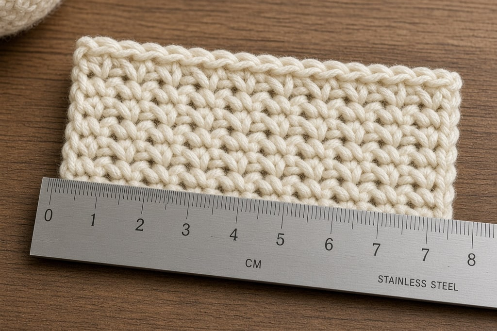
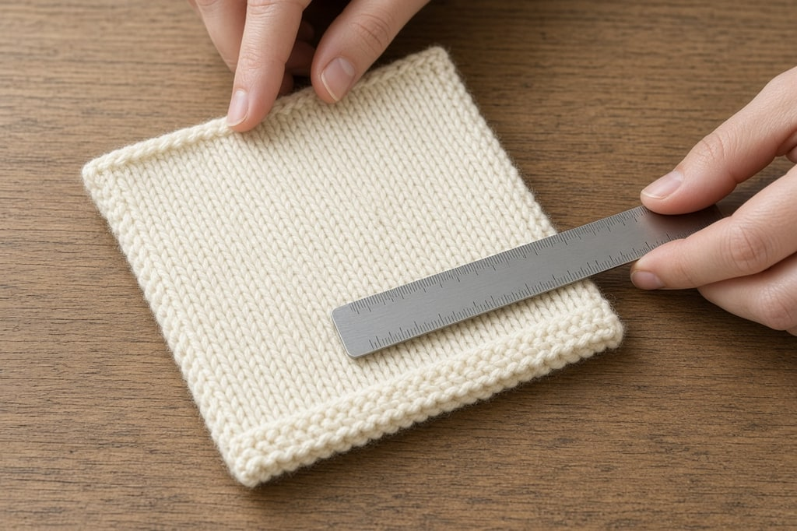
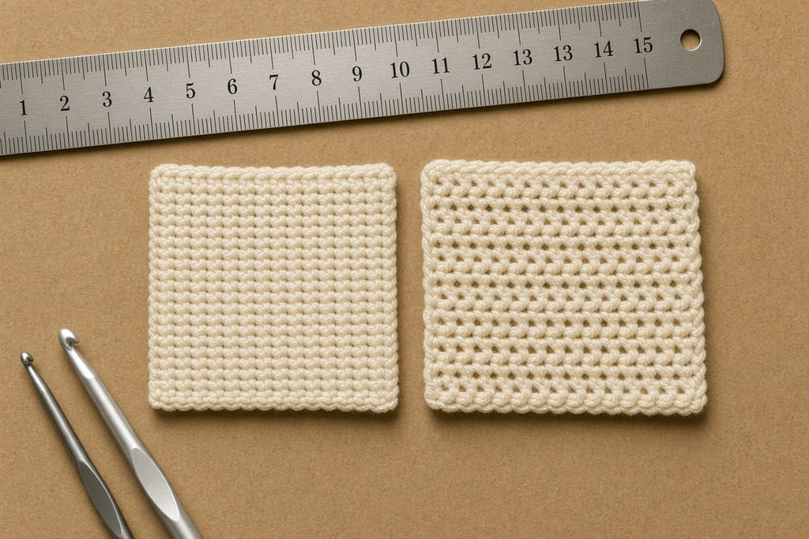

Gauge is the number of stitches and rows that fit into a set measurement, almost always 4 inches. Two people can use the same yarn, hook, and instructions and come out two inches apart, because one of them holds the yarn tighter.

## How to read the gauge line

A pattern will say something like:

> **GAUGE:** 14 sc and 16 rows = 4 inches

Fourteen single crochet stitches across, and sixteen rows tall, should measure four inches. **Stitch gauge** is the width. **Row gauge** is the height.

Sometimes the line is in pattern repeats: "3 shell patterns = 4 inches." Count repeats instead of single stitches.

## Making the swatch

**Make it bigger than 4 inches.** A swatch that is exactly 4 inches includes the edge stitches, and edges are a different tension than the middle. Six inches square lets you measure the center.

**Use the stitch the project uses.** Shell gauge is not single crochet gauge.

**Use the yarn the project uses.** Fiber and twist both change the number.

**Block the swatch if you will block the item.** Cotton and wool change when they are wet and dried flat. Acrylic mostly does not.

Keep the swatch. Pin the ball band to it. A swatch is awkward to put back into the project, and over time the set becomes a record of how each yarn behaves for you.

## Measuring

Lay the swatch flat. Do not hold it up, pin it, stretch it, or smooth it. Crochet will stretch an inch if you ask it to, and then the measurement is a lie.

Put a ruler across the middle. Count the stitches inside 4 inches, including a partial stitch as a fraction. 14½ is a real answer. Turn the ruler and count rows the same way.

A gauge window is a stiff card or metal plate with a 4-inch square hole. Lay it on the swatch and count what shows through.

## Adjusting

**More stitches than the pattern in 4 inches** means each stitch is smaller. You crochet tightly. Go **up** a hook size and swatch again.

**Fewer stitches** means each stitch is bigger. You crochet loosely. Go **down** a hook size.

More stitches in the same space means each one is smaller, so a bigger hook makes them bigger. Change one size at a time. One hook size typically moves stitch gauge by about half a stitch to a full stitch over 4 inches.

Match **stitch gauge** first. Width is what determines fit, and most patterns tell you to work length to a measurement rather than to a row count. If the stitches are right and the rows are off, follow the inch measurements. Where a pattern insists on a row count for shaping, such as armholes or sleeve caps, try another hook and see whether both numbers get closer.

## When you can skip it

Skip gauge for blankets, scarves, dishcloths, coasters, bags, and anything where an inch either way changes nothing.

Do not skip it for hats, sweaters, mittens, gloves, socks, or any fitted garment. Do not skip it for amigurumi either. A loose gauge leaves gaps, and stuffing shows through. Toys are worked tight on purpose.

If being two inches off would bother you, swatch.

## Working to your own gauge

If you cannot hit the pattern gauge, or you prefer the fabric you have, you can plan from your own numbers on a simple shape.

> Your gauge: 12 sc = 4 inches, so 3 stitches per inch.
> You want a 20-inch-wide blanket.
> 3 × 20 = **60 stitches** to start.

The same arithmetic works for length, using your row gauge. It is reliable for rectangles: blankets, scarves, dishcloths, simple shawls. On a fitted garment, every increase and decrease sits on the original numbers, so changing the count means redrafting the shaping.

## Common mistakes

**Measuring the whole swatch, edges included.** Count the middle.

**Stretching the fabric while you measure.** It will tell you a number you cannot repeat.

**Letting gauge drift.** Tension tightens when you are stressed and loosens when you are relaxed. That evens out on a large piece. A different brand of the same millimeter hook can still shift the gauge, because the head and the shaft taper differ. Finish on the hook you started with. A new dye lot or a different color of the same yarn occasionally behaves differently, because dye affects the fiber. Beginners often start tight and loosen as they relax. If the swatch is from your first week, make another one.

**Stopping between sizes without choosing.** Try that size in another brand, or take the closer hook and adjust the stitch count with the arithmetic above.

## Frequently asked

**Do I have to swatch every time?** For garments, yes. Once you know you usually run tight or loose, one swatch is enough to confirm the hook.

**My gauge matches and the item is still the wrong size.** Check the pattern's finished measurements against the person. A correct gauge can still be a size meant for someone else.

**What if only my row gauge is off?** Keep the stitch gauge and work the length in inches. Recalculate only where the pattern shapes from a row count.
