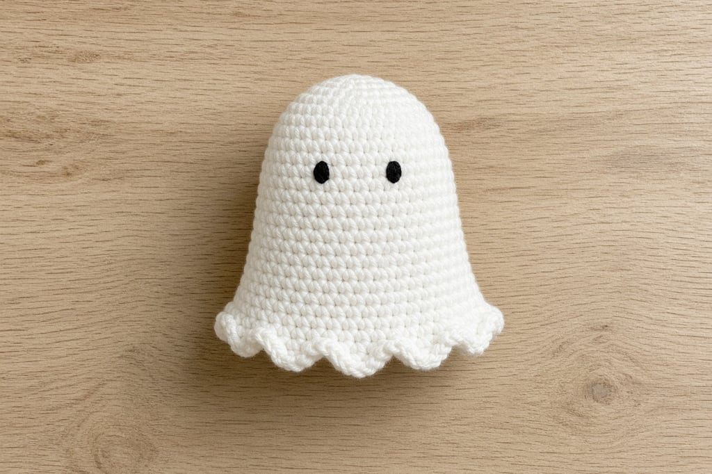
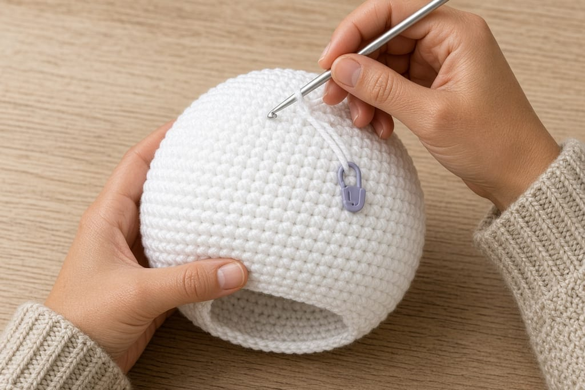
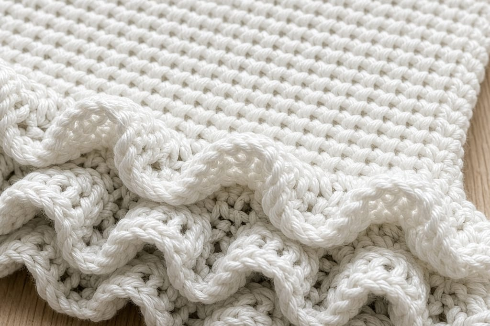
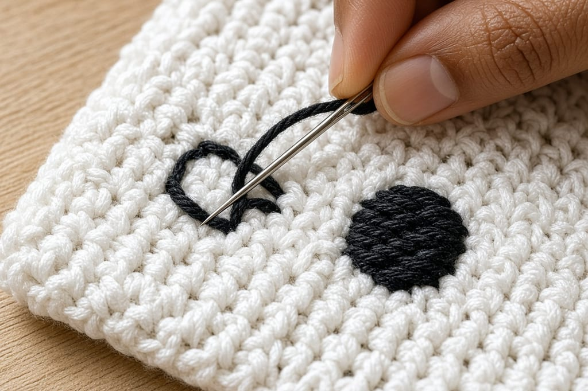
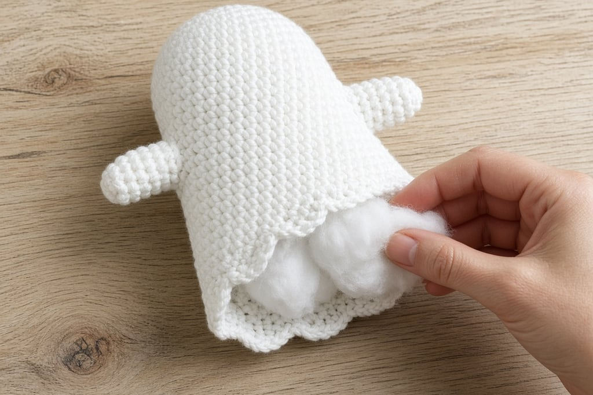

A crochet ghost is one of the friendliest Halloween projects because the silhouette is forgiving. You are not chasing perfect spheres or tiny ears. You need a soft bell shape, a hem that looks a little ragged on purpose, and a face that reads from across the room.

If magic rings still feel shaky, skim [crochet in the round](/crochet-in-the-round) first. This page assumes you can work continuous rounds of single crochet.

## What you need

- White (or cream) worsted-weight yarn — [yarn weight chart](/yarn-weight-chart)
- Small amount of black yarn or embroidery floss for the face
- Hook that matches the yarn ([hook size chart](/crochet-hook-size-conversion-chart))
- Stuffing
- Yarn needle and stitch marker

US abbreviations: see the [abbreviations chart](/crochet-abbreviations-chart).

## Step 1: crochet the head and body

Start at the top of the head and work downward.

**Rnd 1.** Magic ring, 6 sc. (6)

**Rnd 2.** 2 sc in each st. (12)

**Rnd 3.** *Sc, 2 sc in next st; repeat from * around. (18)

**Rnd 4.** *Sc in next 2 sts, 2 sc in next st; repeat from * around. (24)

**Rnd 5.** *Sc in next 3 sts, 2 sc in next st; repeat from * around. (30)

Work even on 30 stitches until the piece is tall enough that the head-and-body reads as one continuous ghost — usually about the diameter of the widest round, or a bit taller for a lankier ghost.

**Mark the face height early.** The eyes sit roughly one-third of the way down from the top. A scrap of contrasting yarn through a stitch saves you from embroidering too low after stuffing.

## Step 2: add the wavy hem

For a closed toy, decrease back down, stuff as you go, and finish. For the classic open ghost:

**Flare round.** *Sc in next 4 sts, 2 sc in next st; repeat from * around (add about six increases once).

**Next round.** Sc around.

**Edging option A — scallops.** *Sc, hdc, dc, hdc, sc in next 5 sts* around. Adjust by eye for a soft wave, not a doily.

**Edging option B — simple picots.** *Sc in next 3 sts, ch 2, sl st in second ch from hook; repeat from * around.

Fasten off and weave ends.

## Step 3: embroider the face

With black yarn or floss, embroider two small oval or round eyes using satin stitch or French knots. A tiny curved mouth is optional; many ghosts look better with eyes only.

Do the embroidery **before** the piece is fully closed if you are making a sealed toy. On an open ghost, weave ends into the stuffing cavity.

Avoid glued-on plastic eyes for anything a child might chew.

## Step 4: stuff so it stands

Stuff the upper two-thirds firmly and leave the hem freer so it drapes.

A tall thin ghost with soft stuffing tips over. Three fixes:

1. Stuff the base of the head and upper body denser than the hem.
2. Drop a small sealed pouch of rice or poly pellets into the bottom before finishing (shelf décor only, not for babies).
3. Widen the increase section so the ghost has a broader footprint.

## Mistakes worth avoiding

**Eyes too low.** Once the hem flares, low eyes look wrong. Place them high.

**Hem increases every round.** One flare round is usually enough.

**Black yarn thicker than the body yarn for the face.** Use floss or a thinner scrap.

**Skipping the marker on a spiral.** Losing the round start shows as a diagonal wobble.

## Frequently asked

### Can I work this in joined rounds instead of a spiral?

Yes. Join and chain 1 at the end of each round if you prefer a clear seam.

### What yarn color besides white?

Gray, pale blue, or glow-in-the-dark acrylic all work. High-contrast embroidery still matters.

### How do I hang it?

Thread a yarn loop through the top before closing, or sew a loop to the magic-ring center. Reinforce with a second pass.

### What to make next

A [pumpkin](/how-to-crochet-a-pumpkin-step-by-step), a [spider](/how-to-crochet-a-spider-and-web), [Halloween granny squares](/halloween-granny-square-variations), or the reel-friendly [Halloween card wallet](/halloween-crochet-card-wallet).
