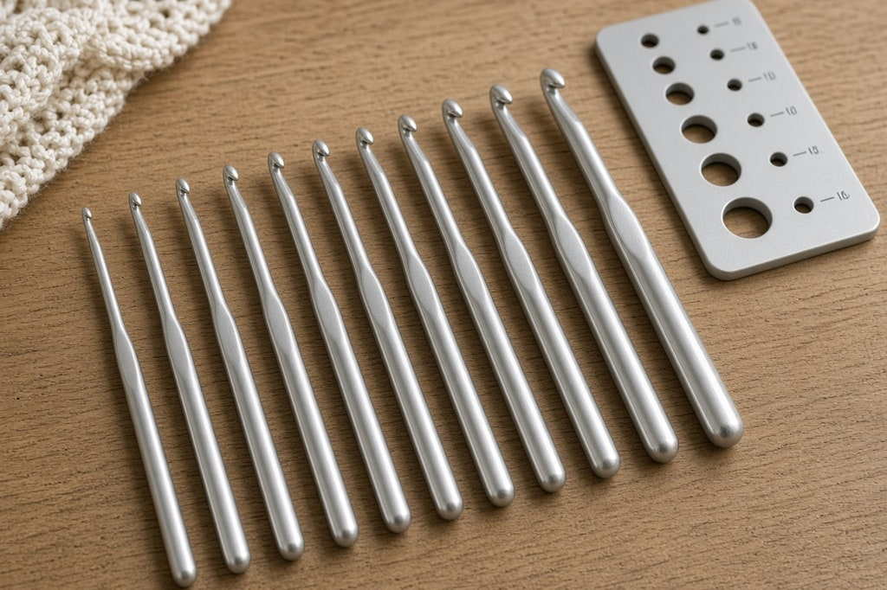
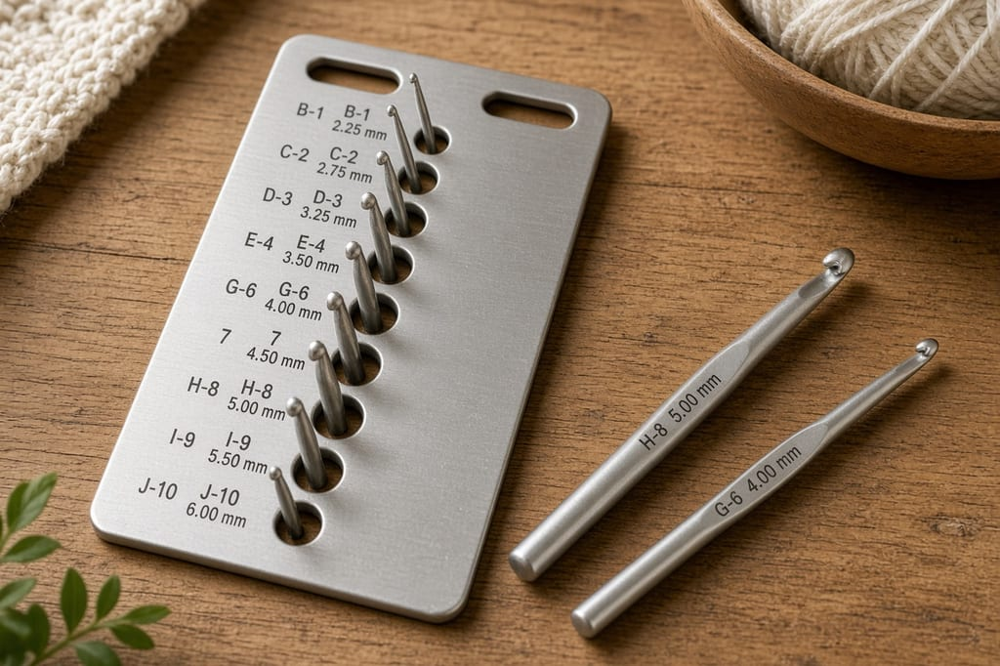
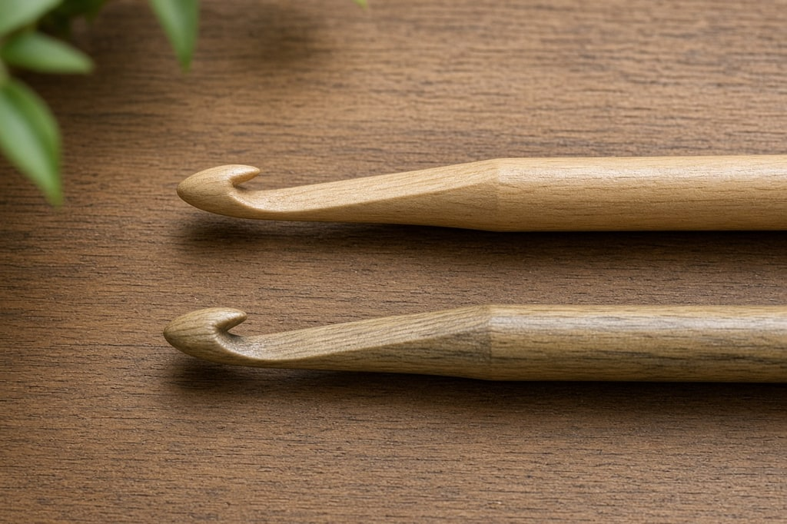

Your pattern calls for a 4 mm hook. Your hook says `G/6`. Are those the same thing?

Yes. **The millimeter measurement is the real size.** Letters and numbers are a US convention manufacturers have never fully agreed on, so a size H from one brand can differ slightly from another. Where a pattern gives both, trust the millimeters.

## Standard hook sizes

These are the aluminum and plastic hooks you use with ordinary yarn, from sock weight up to chunky.

| Millimeters | US size | Legacy UK size | Typical yarn |
| --- | --- | --- | --- |
| 2.25 mm | B/1 | 13 | Lace, thread, fine sock |
| 2.75 mm | C/2 | 11 | Sock, fingering |
| 3.25 mm | D/3 | 10 | Sock, fingering, sport |
| 3.5 mm | E/4 | 9 | Sport, baby |
| 3.75 mm | F/5 | — | Sport, DK |
| 4 mm | G/6 | 8 | DK, light worsted |
| 4.5 mm | 7 | 7 | DK, worsted |
| 5 mm | H/8 | 6 | Worsted |
| 5.5 mm | I/9 | 5 | Worsted, aran |
| 6 mm | J/10 | 4 | Aran, bulky |
| 6.5 mm | K/10½ | 3 | Bulky |
| 8 mm | L/11 | 0 | Bulky, chunky |
| 9 mm | M/13 | 00 | Super bulky |
| 10 mm | N/15 | 000 | Super bulky |
| 15 mm | P/Q | — | Jumbo, roving |
| 16 mm | Q | — | Jumbo |
| 19 mm | S | — | Jumbo, arm-weight |

**About the UK column.** Those numbers run backwards from the metric size, and modern British and Australian patterns give millimeters instead. The column is for vintage patterns and inherited hooks. Measure an old hook rather than trusting the stamp.

## Steel hooks for thread crochet

Steel hooks are a finer, separate system, and **the numbers run in the opposite direction**: a higher number is a smaller hook. Use them for doilies, thread lace, and fine edgings.

| Millimeters | US steel size |
| --- | --- |
| 3.5 mm | 00 |
| 3.25 mm | 0 |
| 2.75 mm | 1 |
| 2.25 mm | 2 |
| 2.1 mm | 3 |
| 2 mm | 4 |
| 1.9 mm | 5 |
| 1.8 mm | 6 |
| 1.65 mm | 7 |
| 1.5 mm | 8 |
| 1.4 mm | 9 |
| 1.3 mm | 10 |
| 1.1 mm | 11 |
| 1 mm | 12 |
| 0.85 mm | 13 |
| 0.75 mm | 14 |

A steel size 2 and a standard B/1 are both 2.25 mm. The difference is the shape of the shaft and the head, not the diameter.

## Which hook does your yarn want?

The hook on a yarn label is a starting point, not a rule.

| Yarn weight | Common names | Suggested hook |
| --- | --- | --- |
| 0 — Lace | thread, 10-count crochet cotton | 1.4–2.25 mm (steel 8 to B/1) |
| 1 — Super fine | sock, fingering, baby | 2.25–3.5 mm (B/1 to E/4) |
| 2 — Fine | sport, baby | 3.5–4.5 mm (E/4 to 7) |
| 3 — Light | DK, light worsted | 4.5–5.5 mm (7 to I/9) |
| 4 — Medium | worsted, afghan, aran | 5.5–6.5 mm (I/9 to K/10½) |
| 5 — Bulky | chunky, craft, rug | 6.5–9 mm (K/10½ to M/13) |
| 6 — Super bulky | super chunky, roving | 9–15 mm (M/13 to Q) |
| 7 — Jumbo | jumbo, arm-weight | 15 mm and larger (Q and up) |

**Amigurumi.** Go one or two sizes smaller than the label so stuffing does not show through. Worsted on a 3.5 mm or 4 mm hook, rather than 5.5 mm, makes a firm toy.

**Blankets and shawls.** Go one size larger. At the label's gauge, a blanket often feels stiff.

## Common mistakes

**Trusting the letter on the handle.** There is no enforced standard. A size I is usually 5.5 mm, but some manufacturers have sold it as 5.25 mm or 5.75 mm. There is no US letter in common use for 3.75 mm, so F/5 gets applied to both 3.75 mm and 4 mm depending on who made the hook. Japanese hooks, and many ergonomic sets, are labeled only in millimeters. A hook gauge — a small metal plate with graduated holes — settles this for every hook you own, including unlabeled ones.

**Using the pattern's hook without checking gauge.** That hook size exists to get you to the pattern's **gauge**. If your tension is tighter than the designer's, the item comes out smaller. If your tension is loose, it comes out larger.

1. Start with the hook the pattern asks for.
2. Work the gauge swatch it specifies, usually a 4-inch square.
3. Too small means your stitches are tight, so go **up** a hook size. Too large means go **down**.
4. Swatch again with the new hook.

Skip this on a coaster. On a sweater, it saves a project that does not fit. If you crochet for hours or your hands ache, an ergonomic handle helps, covered in the [hooks and yarn guides](/gear).

## Frequently asked

**Can I use a different hook than the pattern says?** Yes, if you hit the gauge. For scarves, blankets, and dishcloths, use what feels good.

**What does the ½ mean in K/10½?** It is a size name, not a fraction of anything measurable. K/10½ is 6.5 mm.

**Which hook should I learn on?** A 5 mm (H/8) with a medium worsted yarn in a light, solid color. Big enough to see what your hands are doing, and light yarn shows the stitch so you can tell when something has gone wrong.
