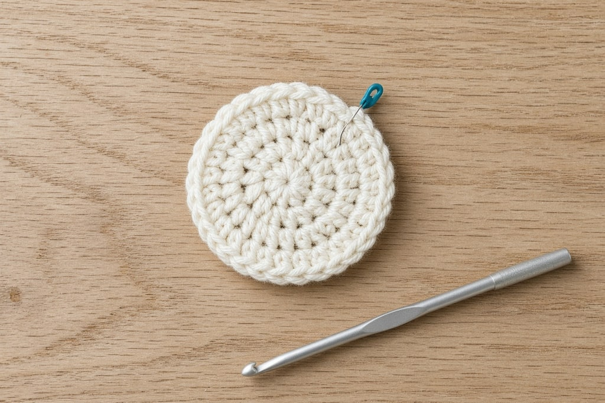
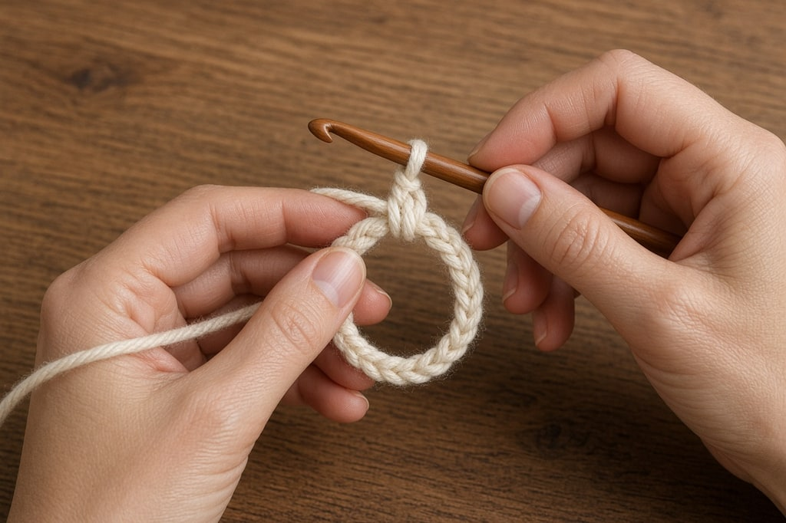
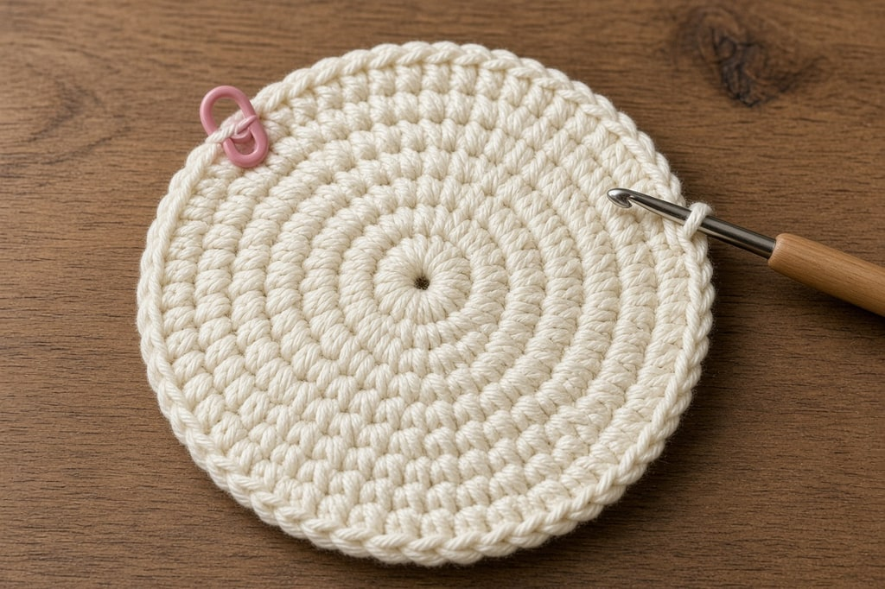

Working in the round means crocheting in a continuous circle instead of turning at the end of a row. How you close the center, whether you join or spiral, and how fast you increase decide whether you get a hat, a toy, or a flat circle.

## Do not turn

The right side faces you the whole time, and you keep traveling the same direction. Every round is a right-side round. If a pattern wants you to turn, for texture, it will say so.

## The magic ring

The magic ring, also called a magic circle or adjustable ring, is a loop you stitch into and then pull shut. Use it when the center must be solid: amigurumi, crown-first hats, closed motifs.

Chain four or five and slip stitch to the first chain when a small hole is fine: doilies, open motifs, most granny squares. On a stuffed toy that hole shows the stuffing.

**1. Make the loop.** Lay the yarn across your palm, tail down about six inches. Wrap the working yarn around two fingers so the working strand crosses **over** the tail. Where they cross, the ring is two strands.

**2. Insert and pull up a loop.** Slide the hook under both strands, catch the working yarn, and draw it back through. Chain one. That chain anchors the ring and does not count as a stitch.

**3. Work the first round over both strands,** the loop and the tail together. The round feels floppy because you are stitching around a loop, not into stitches. That is normal.

**4. Close it last.** When the round is finished, pull the tail until the center disappears.

**5. Join or continue.** Slip stitch into the first stitch for joined rounds. For a spiral, put a marker in the first stitch and keep going.

**Do not pull the tail until the round is finished.** Closing early locks the ring at a size you cannot stitch into, and you will undo the round.

Taller stitches need more of them in the first round. Use the pattern's number. This table is only a typical start.

| First round | Typical count | Common use |
| --- | --- | --- |
| single crochet | 6 | Amigurumi, toys |
| half double crochet | 8 | Denser hats, small motifs |
| double crochet | 12 | Granny squares, hats, circular motifs |
| treble crochet | 16 | Open lace motifs |

## Joined rounds or a spiral

**Joined rounds.** Slip stitch into the first stitch, chain up, and start again. The joins stack into a seam. Use them for granny squares, a new color each round, striped hats, and lace. Motifs join because each round starts in a set place, often a corner. On a plain hat the seam shows.

The join steps up. For a last round, cut the yarn, thread it through the first stitch, and pull until the close looks like a stitch. To skip the chain-up, put a slip knot on the hook and work the first stitch directly. That removes the gap when every round is a new color.

**Spirals.** Do not join. Keep going into the first stitch. No seam. Usual for amigurumi, plain hats, and socks, and simpler to learn. A hat can spiral, then finish the brim with one joined round.

Mark the first stitch and move the marker each round. A split ring, safety pin, paperclip, yarn scrap, or bobby pin works. The rounds look the same, so memory fails.

**A spiral ends on a small step.** The last stitch sits one stitch-height above the fabric around it. On a toy the step hides in a seam. On a hat brim, work one or two slip stitches down into the previous round to taper it, or finish with a single joined round.

## Circle or tube? The increases decide

**Keep increasing** and the fabric stays flat. In single crochet, add as many stitches each round as the first round had: 6, then 12, 18, 24, 30. **Stop increasing** and it becomes a tube. A hat stops once the flat circle matches the crown, then works even for the depth. A toy body is that tube, decreased later. The mechanics are in [increases and decreases](/crochet-increase-decrease).

Cupping means too few increases: a hat or a toy, and a problem only if you wanted a coaster. Ruffling means too many. The edge cannot hold the extra fabric flat.

Insert under **both** top loops unless the pattern says otherwise. Those loops are in [basic stitches](/basic-crochet-stitches). `BLO`, back loop only, every round makes a hat's ribbed brim.

## Mistakes

**The ring will not close.** The hook caught one strand. Undo it.

**It closed, then loosened.** Weave the tail through the back before you stuff.

**The first round looks like a hexagon.** Six single crochets look angular for two or three rounds. If it stays that way, spread the increases, as in `[sc in next 3, 2 sc in next] 6 times`.

**The start disappeared.** That was a spiral with no marker.

**A seam up the side.** Joined rounds. A spiral has no seam.

**A circle that became a bowl.** Too few increases. Right for a hat.

**A gap at every join.** The chain-up is thinner than a stitch. Use a standing stitch, or chain one fewer than the stitch height.

**A center too tight to stitch into.** Leave the starting ring about the size of a dime.

## Frequently asked

**Is a magic ring the same as a magic circle?** Yes. Same method, along with "adjustable ring." Patterns use all three names.

**Do I have to start with a magic ring?** No. A chain ring is correct wherever a small center hole does not matter.

**Does the chain-up count as a stitch?** It depends on the pattern. Check the round's count and stay consistent. More is in [turning chains](/crochet-turning-chain).
