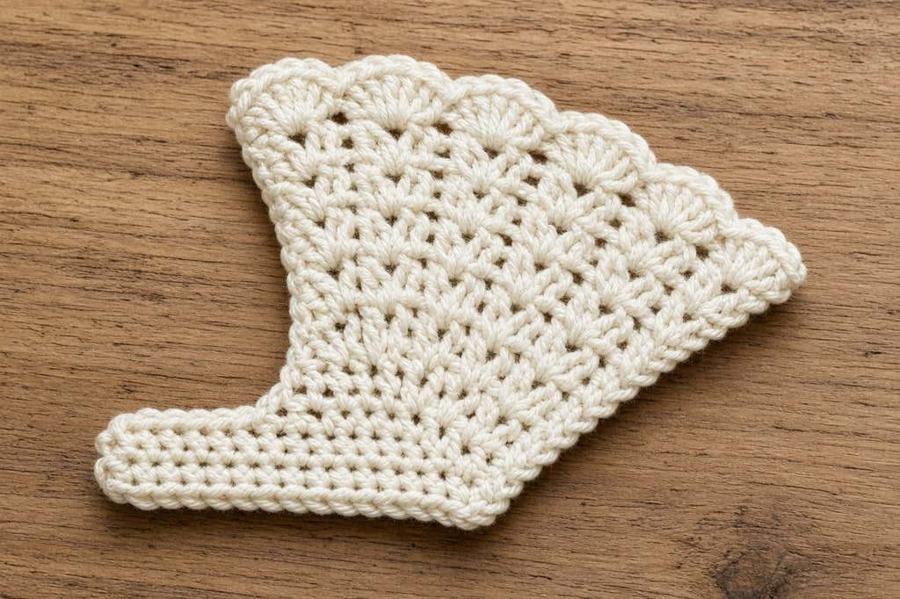
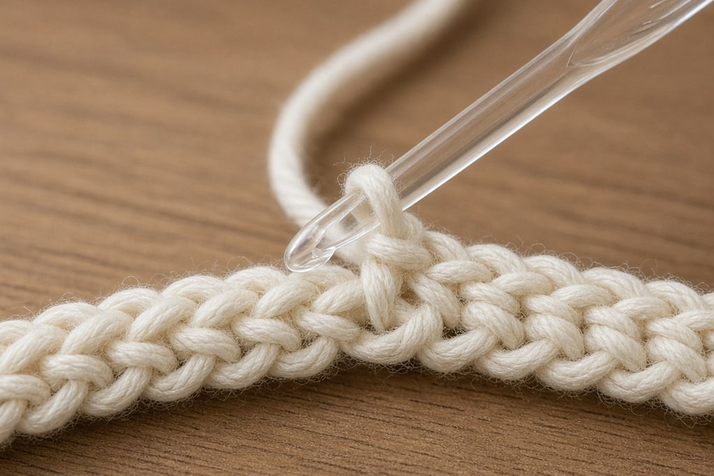
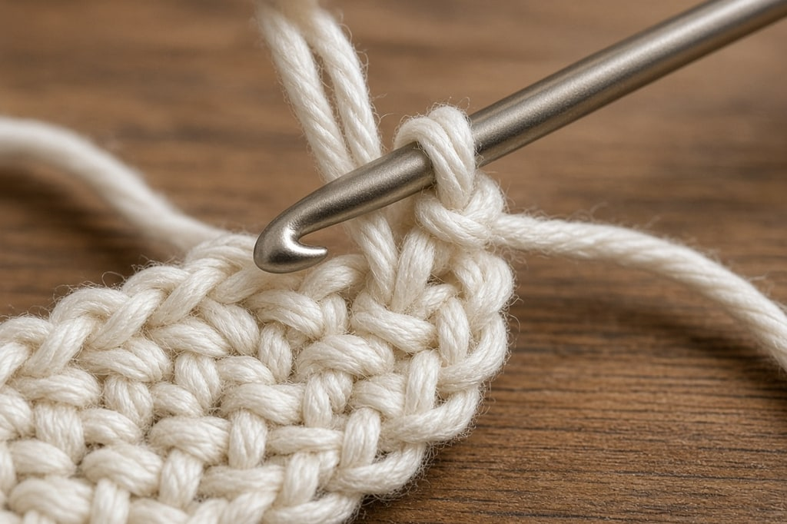

Hats, toys, garments, circles, anything that is not a rectangle: you add stitches in some places and remove them in others. The two moves work the same way at every stitch height.

## Increasing

**An increase is two stitches worked into the same place.** The extra stitch makes the fabric wider.

1. Work a stitch into the next stitch.
2. Work a second stitch of the same kind into that same stitch.

Your count has gone up by one. This is the same for single, half double, double, and treble crochet. Patterns write `2 sc in next st` or `2 dc in next st`. `inc` means the same thing.

`3 dc in next st` adds two stitches. Shells and fans are this move, used as a texture instead of as shaping.

## Decreasing

**A decrease turns two stitches into one.** You work each stitch until the last step, leave those loops on the hook, and close them together.

Patterns write `sc2tog`, `hdc2tog`, `dc2tog`. `dc3tog` turns three stitches into one. `dec` is the older, vaguer word for the same idea. The longer name tells you the stitch and how many.

### Single crochet (`sc2tog`)

1. Insert the hook, yarn over, pull up a loop. Two loops on the hook.
2. Insert the hook into the next stitch, yarn over, pull up a loop. Three loops on the hook.
3. Yarn over and pull through all three.

### Half double (`hdc2tog`)

1. Yarn over, insert the hook, yarn over, pull up a loop. Three loops.
2. Yarn over, insert the hook into the next stitch, yarn over, pull up a loop. Five loops.
3. Yarn over and pull through all five.

### Double crochet (`dc2tog`)

1. Yarn over, insert the hook, yarn over, pull up a loop, yarn over, pull through two loops. Two loops remain.
2. Repeat in the next stitch, stopping at the same point. Three loops remain.
3. Yarn over and pull through all three.

That is the rule at any height, including trebles: stop one step short on each stitch, then finish them together.

## The invisible decrease

Standard `sc2tog` leaves a small bump. On a stuffed toy those bumps sit in plain sight. The invisible decrease lies flatter and uses the same stitch count.

1. Insert the hook under the front loop only of the next stitch.
2. Insert the hook under the front loop only of the stitch after it.
3. Yarn over and pull through both front loops.
4. Yarn over and pull through the two loops left on the hook.

If a decrease leaves a hole, snug the last yarn-over a little as you close it. On amigurumi, use the invisible decrease instead.

## Where to put them

**One stitch in from the edge** on garments. Decreasing in the first or last stitch makes a stepped edge that is hard to seam. Work one stitch, then the decrease: `sc in first st, sc2tog`. The edge stays a straight column.

**Spaced evenly** on circles and crowns. Six increases bunched in one place make corners. `[sc in next 3 sts, 2 sc in next st] 6 times` spaces them so the fabric curves.

**Stacked on the same stitch each row** when you want a line you can see, such as a raglan or the panels of a beret.

Count at the end of every shaped row. The number in parentheses is there so one lost stitch does not throw off every round after it. On a hat crown, it will.

## A flat circle

In single crochet, each round adds as many stitches as the first round had. Start with 6 and add 6 every round: 6, 12, 18, 24, 30.

Taller stitches need a larger start. A double crochet circle typically starts at 12 and adds 12 each round.

**The circle cups like a bowl** when there are too few increases. That is what you want for a hat or a toy. Once the flat circle matches the crown, stop increasing and work even. The fabric turns into a dome, then a tube. Keep increasing and the hat stays a disc.

**The edge ruffles** when there are too many increases. There is more fabric than the circumference needs.

## Common mistakes

**A ragged edge.** The decrease landed on the first or last stitch. Move it in by one.

**Corners on a circle.** The increases are bunched. Spread them.

**A hat that will not dome.** The increases went on too long. Stop when the diameter matches the crown, then work even rounds.

**A hole in the decrease.** The closing yarn-over is loose, or a visible `sc2tog` is sitting on a curved toy. Tighten the close, or switch to the invisible decrease.

## Frequently asked

**Is `sc2tog` the same as `dec`?** Yes, in practice. `sc2tog` and `dc2tog` name the stitch. `dec` does not.

**Can I increase and decrease in the same row?** Yes. Add on one side and remove on the other, and the width stays the same while the shape moves. That is a dart, a waist, or a curve.

**Do increases and decreases work the same in rounds?** The stitch is identical. In rows they usually sit near the edges. In rounds they are spread around.
