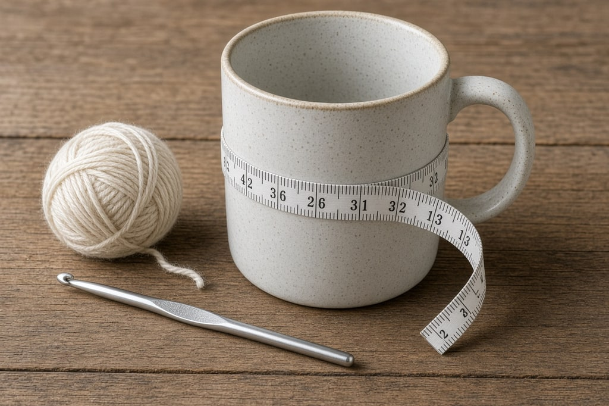
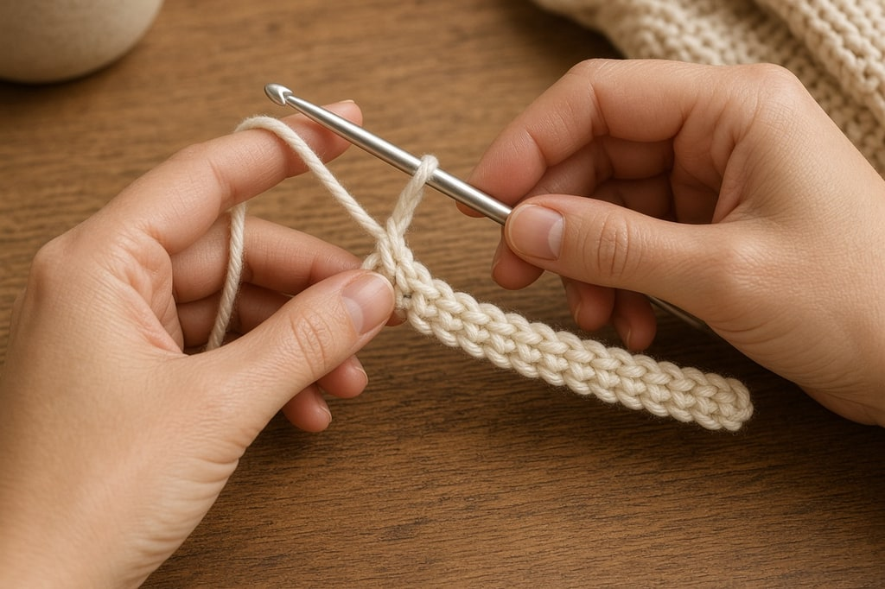
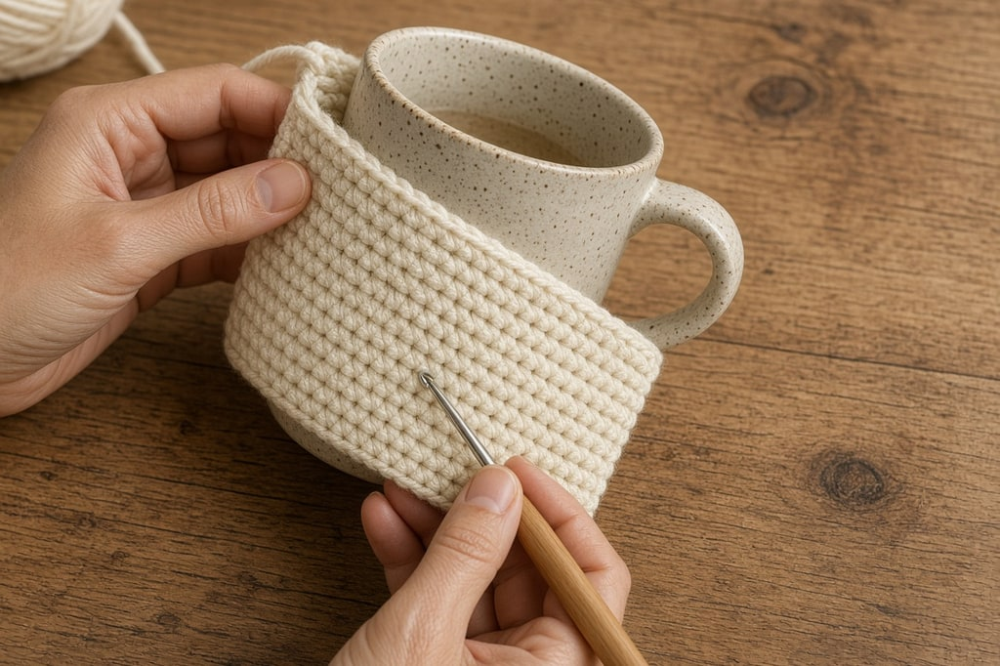
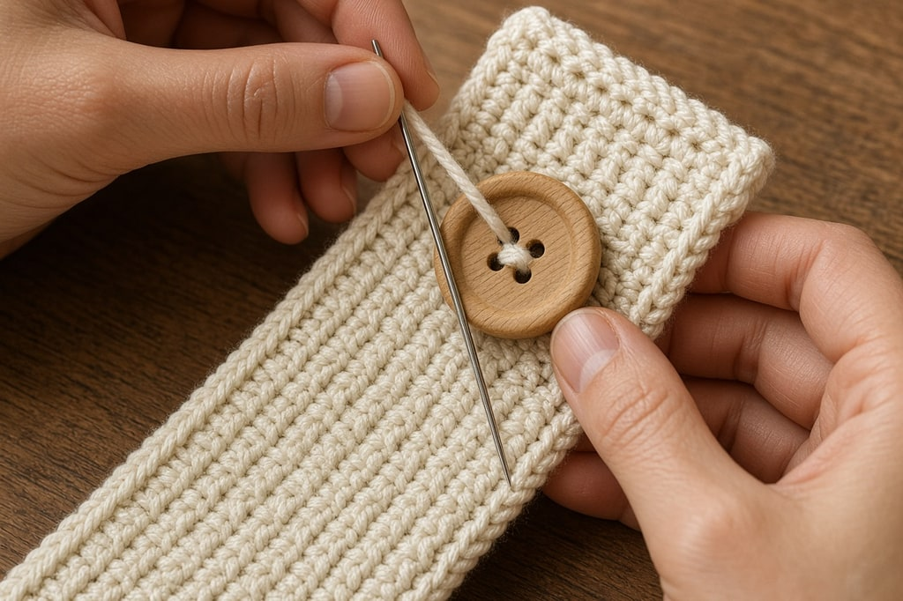
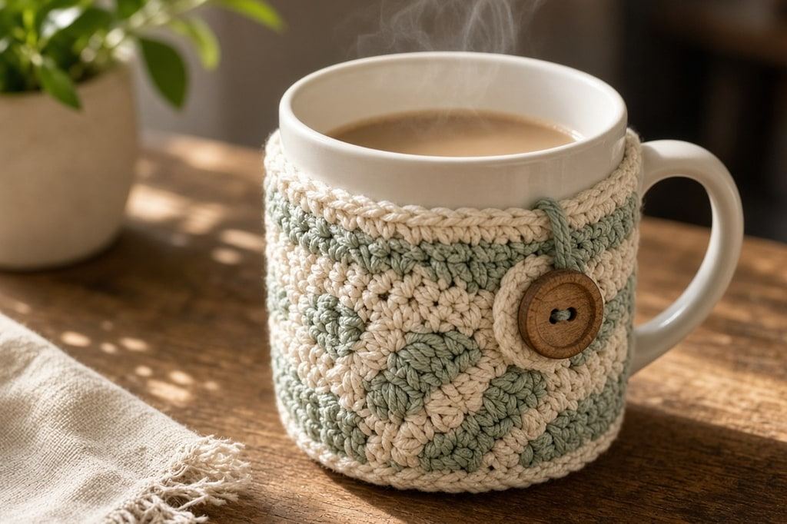

A mug cozy is a gift people use the next morning. That is why it travels well on Pinterest in November and December: the photo is a warm cup, not another ornament in a drawer.

You crochet a rectangle that wraps the mug, seam or button it closed, and stop. No amigurumi math. If your [single crochet](/basic-crochet-stitches/) is even, you are ready.

Work the strip **sideways** — foundation chain is the height, rows travel around the mug — so you can wrap and check fit without ripping out a tall piece that came out wrong. That one habit saves more frogging than any stitch tip on this page.

## What you need

- Worsted-weight yarn, about **60–80 yd** (cotton holds heat better than acrylic for drinkware) — [yarn weight chart](/yarn-weight-chart/)
- Hook matched to the yarn, often US G/6 (4.0 mm) or H/8 (5.0 mm) — [hook size chart](/crochet-hook-size-conversion-chart/)
- **One button**, about **⅝–¾ in** across
- Yarn needle
- **The mug** you are wrapping — measure it, do not guess

US abbreviations. See the [abbreviations chart](/crochet-abbreviations-chart/) if needed.

## Finished size (design target)

| Measure on your mug | How to use it |
| --- | --- |
| Circumference under the handle | Cozy length before button overlap |
| Height from table to below the rim | Cozy height (leave the lip free) |

Most diner-style mugs want a cozy about **3–3.5 in tall** and a wrap length about **1 in less than the full circumference**, plus a short flap for the button.

## Step 1: measure, then chain the height

Hold the mug. Decide how tall the cozy should sit (usually stops **½ in below the rim** so lips never touch yarn).

Chain that height as your foundation (often **ch 12–16**). Turn. Sc in the second chain from the hook and across. That stitch count is every row’s height.

**Work sideways.** Rows run around the mug; the foundation chain is the height. That way you can try the strip against the mug as you go and stop at the right length.

## Step 2: work the wrap

Work rows of **single crochet**, ch 1 and turn. Keep going until the strip wraps the mug and the short ends sit under the handle with about **½–¾ in overlap** for the button area — or meet cleanly if you plan to seam and leave the handle gap open.

Leave a vertical gap for the handle: when you wrap, the cozy should open under the handle, not climb over it. Mark the handle gap with stitch markers on the mug if that helps you visualize.

For a Christmas reel, switch to a second color for the last 2–3 rows using a clean [color change](/changing-yarn-color-crochet/).

## Step 3: button flap and seam choice

**Button version (best for gifts):** On one short end, sew the button centered. On the opposite end, join yarn at the center, chain enough to slip over the button (**ch 6–10** — test it), slip stitch back into the join, fasten off.

**Seamed version:** Whipstitch the short ends together only below and above the handle gap, leaving the handle free. No button needed.

Weave ends on the inside. Steam-block cotton lightly if the edges curl — see [blocking](/weaving-in-ends-and-blocking/).

## Step 4: fit check

1. Slide the cozy on.
2. Close the button (or check the seam gap).
3. Hold a warm (not boiling-hot) mug — fabric should feel secure, not sliding.

**Too loose:** fewer ease stitches next time, or a tighter button loop.  
**Too tight:** add 2–4 rows before seaming.  
**Handle trapped:** open the gap taller; you seamed too far.

**Do not microwave a mug while the cozy is on.** Remove the cozy first. Yarn and buttons do not belong in a microwave.

## Yarn choice for kitchen use

Cotton is the honest answer for anything that lives next to coffee. It washes, it does not melt against a warm ceramic the way some novelty yarns feel like they might, and it photographs with clear stitch definition. Acrylic works for a photo prop or a mug that never sees a dishwasher. If you gift acrylic, tell the recipient to hand-wash the cozy and keep it off boiling-hot mugs straight from the kettle.

A small wood or coconut button reads warmer in Christmas flat lays than a plastic one. Sew it on firmly — gift recipients will yank the loop.

## Mistakes that ruin a mug cozy

**Guessing the mug size.** Blog inches will not match your cup. Measure.

**Covering the rim.** People drink there. Stop short.

**Acrylic that pills into coffee.** Cotton or a tight worsted acrylic is safer for kitchen use.

**Button sewn through both layers of a thick seam.** Sew through the outer fabric only so the loop can close flat.

**Ignoring the handle gap.** A cozy that has to stretch over the handle will climb and twist. Leave the gap on purpose.

## Frequently asked

### How long does this take?

One evening. Good reel beats: measure, mid-wrap try-on, button close, finished mug shot.

### Can I make a set for Christmas?

Yes. Same stitch count, three colors. Pin them as a set with gift tags. Pair with [yarn for Christmas crochet](/yarn-for-christmas-crochet/) if you are buying one skein for a batch.

### Does it work on tumblers?

Yes if the walls are straight. Tapered travel mugs need try-ons every few rows.

### Can I add a pocket for a tea bag?

Yes — crochet a second smaller rectangle and sew three sides onto the outside before you add the button. Keep it flat so the mug still sits stable.

### What should I make next?

A [scrunchie](/how-to-crochet-a-scrunchie/) for a stocking stuffer, a [snowflake](/how-to-crochet-a-snowflake/) for the tree, or a [simple flower](/how-to-crochet-a-simple-flower/) sewn onto the cozy flap.
