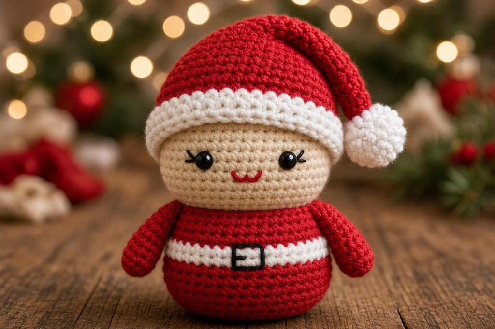
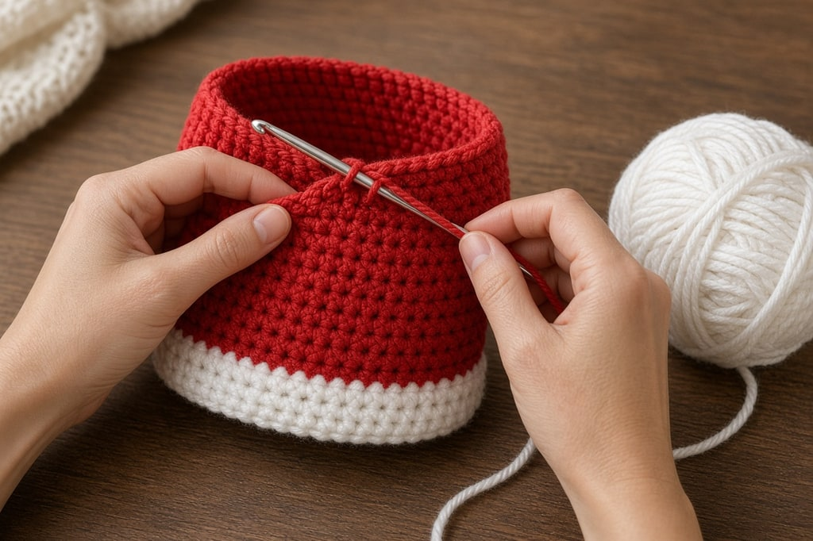
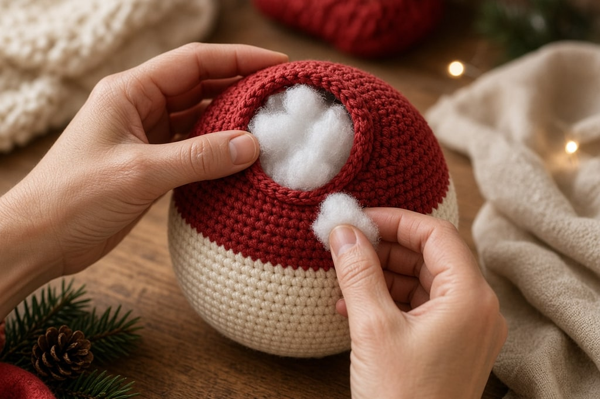
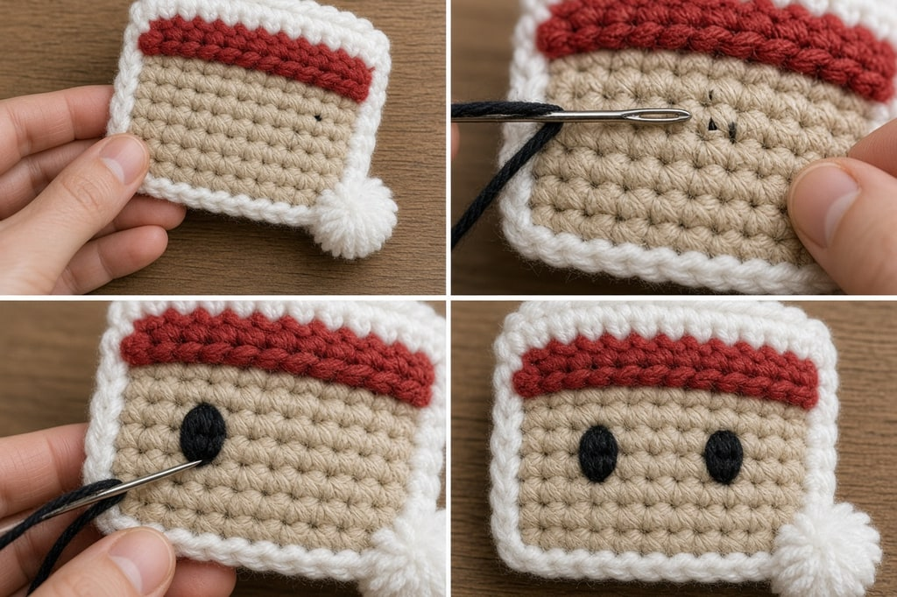

A Santa is the first amigurumi where the face shows. A [gnome](/how-to-crochet-a-gnome/) hides under a hat, and a pumpkin has no face, so both forgive a lot. If Santa's eyes are a stitch off, everyone can see it. The body is one piece, no neck and no seam. The work is placement.

## What you need

- Worsted-weight yarn ([yarn weight chart](/yarn-weight-chart/)) in red, a skin tone, white, and a scrap of black
- A hook a size or two below the label, often a US G/6 (4.0 mm)
- Stuffing, a yarn needle, a stitch marker
- Black yarn for embroidered eyes, or 6 mm safety eyes if this is not for a small child

US abbreviations. The counts are a shape, not a finished height.

**Safety eyes are not safe for children under three.** The name describes the backing washer, not the age range. A plastic eye that works loose is a choking hazard. For a baby or toddler, embroider the eyes in black yarn.

## Body and head in one piece

Work in a continuous spiral and mark the first stitch of each round.

**Rnd 1.** Magic ring, 6 sc. (6)

**Rnd 2.** 2 sc in each st around. (12)

**Rnd 3.** *Sc in next st, 2 sc in next st; repeat from * around. (18)

**Rnd 4.** *Sc in next 2 sts, 2 sc in next st; repeat from * around. (24)

**Rnd 5.** *Sc in next 3 sts, 2 sc in next st; repeat from * around. (30)

That is the flat base. Work even in red until the body is roughly as tall as it is wide. Santa is round, not tall.

**Narrow for the shoulders.** *Sc in next 3 sts, sc2tog; repeat from * around. (24)

**Change to the skin tone** and work even until the head is roughly two thirds the height of the body. A color change in the middle of a round is cleaner than at the start of one. The technique is in [changing yarn color](/changing-yarn-color-crochet/).

**Close the head.** Decrease by six stitches a round: *sc in next 2, sc2tog*, then *sc in next, sc2tog*, then *sc2tog* around. Stuff firmly as the opening shrinks. Fasten off, weave the tail through the front loops of the last stitches, and pull tight.

Stuff the body harder than the head. A soft base slumps under the head, and no face fix rescues a Santa that leans.

## The face

Pin eyes, nose, and beard before you sew any of them.

**Eyes.** On the lower half of the head, about two thirds of the way down, with roughly four to five stitches between them on a 24-stitch round. Too high reads as a stranger. Too far apart looks startled. Count out from the center. A spiral is not as symmetrical as it looks.

**Nose.** Magic ring, 6 sc, 2 sc in each st around (12), two rounds even, then sc2tog around, stuffed lightly. Center it between the eyes and just below them.

**Beard.** A white half-circle sewn under the nose, or white fringe knotted in and trimmed. Fringe is faster. The crocheted beard is tidier up close. Either covers the bottom of the face. The eyes have nowhere to hide.

## Hat

**Rnd 1.** Magic ring, 4 sc in red. (4)

Work several rounds even for the tip, then an increase round and one or two rounds even, until the opening fits the head.

Finish with two or three rounds of white for the brim, and a small white ball at the tip made like the nose. Do not stuff the hat. If you use safety eyes, fit them before the last decreases close the head. The washer goes on from the inside.

## Belt

A long black chain with a row of sc worked back along it is enough. Sew it around the body about a third of the way up. A small yellow or gold square on the front reads as a buckle. The belt is the waist the shaping skipped.

## Mistakes worth avoiding

**Eyes too high or too wide.** Lower than instinct says, and four to five stitches apart on that 24-stitch round.

**Sewing before the whole face is pinned.** Stand back, adjust, then sew.

**A head stuffed harder than the body, or a base that is not flat.** Either one makes him lean. Press the first five rounds flat on a table before you stuff, and keep the lower third firm.

**The hook size on the label.** Loose fabric shows stuffing. Go down at least one size.

## Frequently asked

### Why does he lean backward?

The base is usually domed. If the first five rounds ruffled, he rocks. Press it flat, check that it sits, then stuff the lower third firmly.

### Can the head be a separate piece?

It can, and a first Santa is harder that way. Joining two stuffed spheres so the head stays straight is its own skill. One piece avoids the join.

### How do I hide the color-change step?

A spiral has no true round end, so the change leaves a small jog. Work the new color into the last stitch of the old round. The belt or the beard often covers that spot.
