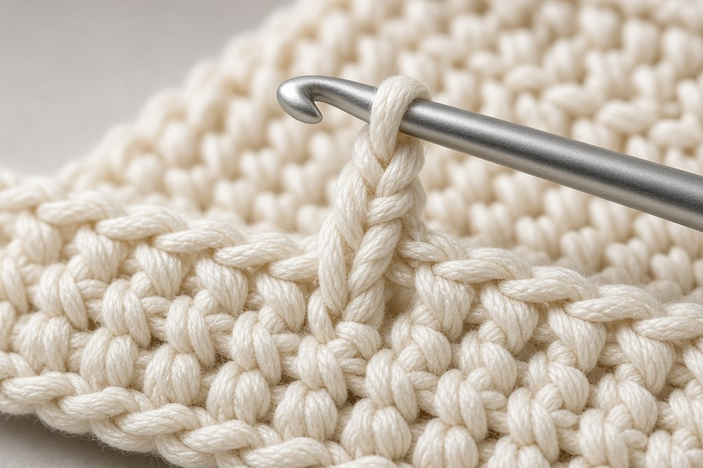
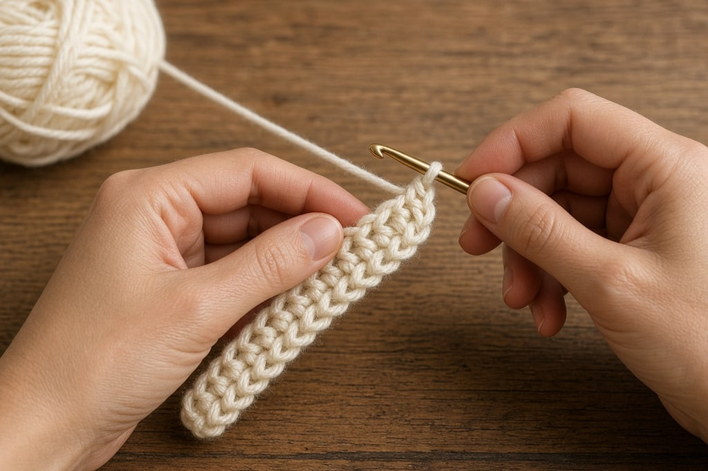
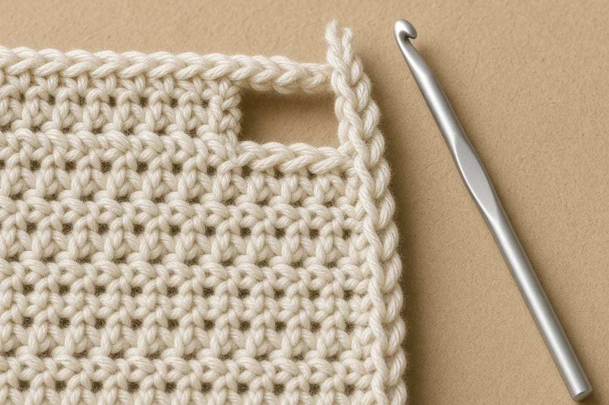

If your rectangle is coming out as a trapezoid, or you started with 20 stitches and now have 17, the turning chain is the usual reason.

It is a small thing patterns explain badly, and it accounts for more ripped-out rows than any other single mistake.

## What it is

When you finish a row and turn, the hook sits at the bottom of the new row, and the next stitches are taller than that. A chain lifts the hook to the height of the stitch you are about to work. That chain is the turning chain. Without it, the first stitch of every row squashes and the edge pulls in.

## How many chains

| Stitch | Turning chain | Counts as a stitch? |
| --- | --- | --- |
| single crochet (`sc`) | 1 | No — height only |
| half double crochet (`hdc`) | 2 | Usually yes |
| double crochet (`dc`) | 3 | Usually yes |
| treble (`tr`) | 4 | Usually yes |
| double treble (`dtr`) | 5 | Usually yes |

For single crochet, the answer is consistent: **the chain-1 does not count as a stitch.** It is there for height. After chaining 1 and turning, work the first single crochet into the very first stitch of the row.

For everything taller, it depends on the designer.

**If the turning chain counts,** skip the first stitch of the previous row. The chain stands in for it. Work the last stitch of the row into the top of the previous row's turning chain.

**If it does not count,** work into the first stitch as usual, and ignore the previous turning chain at the end of the row.

Both are correct. Mixing them in one project is what slants the edge.

**How to tell which your pattern means.** `Ch 3 (counts as dc)` or `Ch 3 (counts as first dc)` means it counts. `Ch 3 (does not count as a stitch)` means it does not. If the pattern says nothing, check the stitch count at the end of the row and see which reading gives you that number. When it is genuinely ambiguous, pick one and keep it for the whole project.

In joined rounds you do not turn. A starting chain replaces the turning chain, with the same heights and the same counting question. The right side faces you the whole time.

Spiral rounds, common in amigurumi, have no chain. Keep going, and mark the first stitch of each round. There is nothing else to show where the round begins.

## Common mistakes

### The work gets narrower

You are losing a stitch each row.

**The last stitch is missing.** In double crochet, the previous turning chain looks like part of the edge. If your pattern counts it, that chain is the last stitch. Work into the top of it.

**The first stitch is skipped when it should not be.** If the turning chain does not count, the first real stitch goes into the first stitch of the row.

### The work gets wider

You gained a stitch. Either you worked into the first stitch and also counted the turning chain, or you worked into a turning chain the pattern does not count.

### The edge slants, but the width is right

You are counting the turning chain on some rows and not on others. Count at the end of every row for the next ten rows and the pattern of the mistake will show. You cannot repair a slanted edge afterward. Undo to the last row where the count was right.

Flip the work the same way every row, toward you or away from you. Alternating adds a twist that shows on long pieces such as scarves.

### A gap at the start of double crochet rows

A `ch 3` standing in for a double crochet leaves a small hole, because a chain is thinner than a real double crochet. This is normal.

**Chain 2 instead of 3.** Slightly shorter, and the gap closes. Very common in modern patterns.

**Stacked double crochet.** Work a single crochet in the first stitch, then a double crochet into the top of that single crochet. You get full height and a denser edge.

Neither changes your stitch count. Both stand in for the `ch 3` and count as the first double crochet.

## Frequently asked

**Can I skip the turning chain?** For single crochet, many people skip the chain-1, turn, and work into the first stitch. The edge is tighter and it works. For double crochet and taller, no. Without the height, the edge pulls in.

**Why do my patterns disagree?** There is no enforced standard. Read the first row of each new pattern rather than assuming it matches the last one.

**Does the turning chain count in my stitch total?** Only if the pattern says it counts as a stitch. If it does, include it. This is why a count can look wrong when it is actually right.
