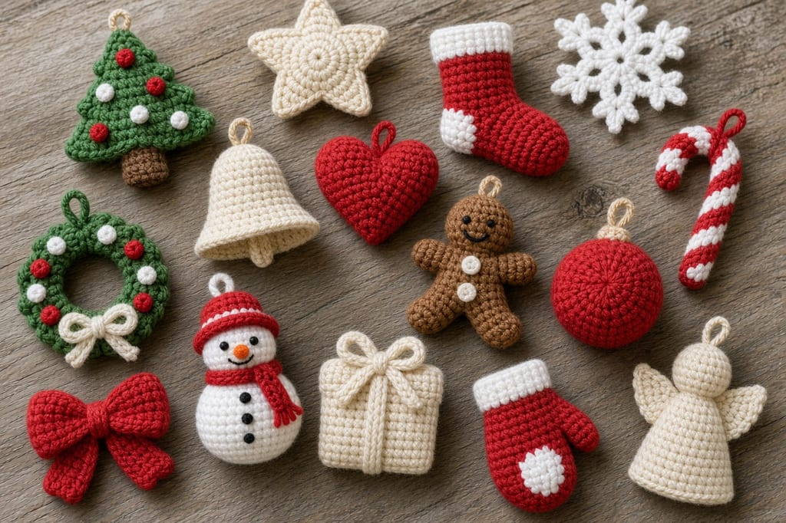
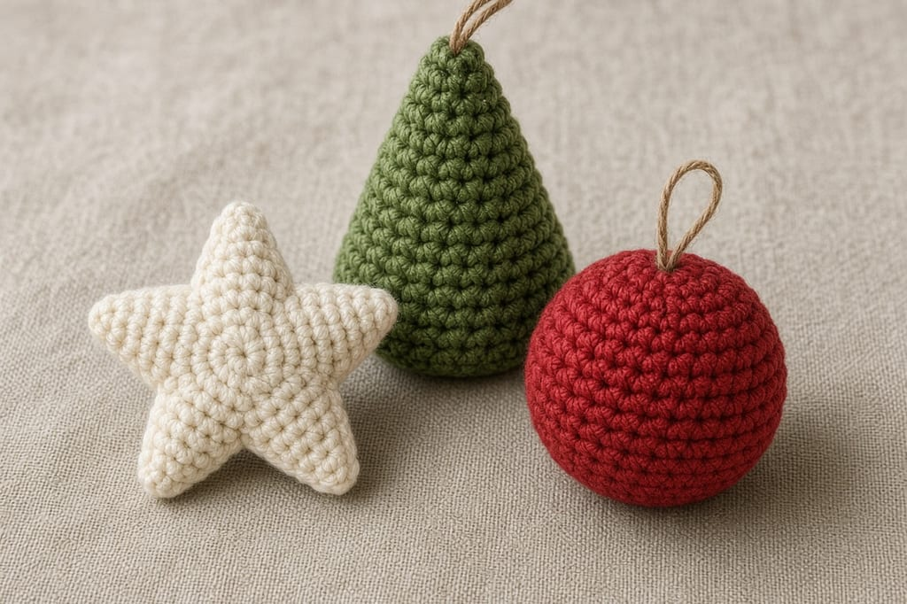
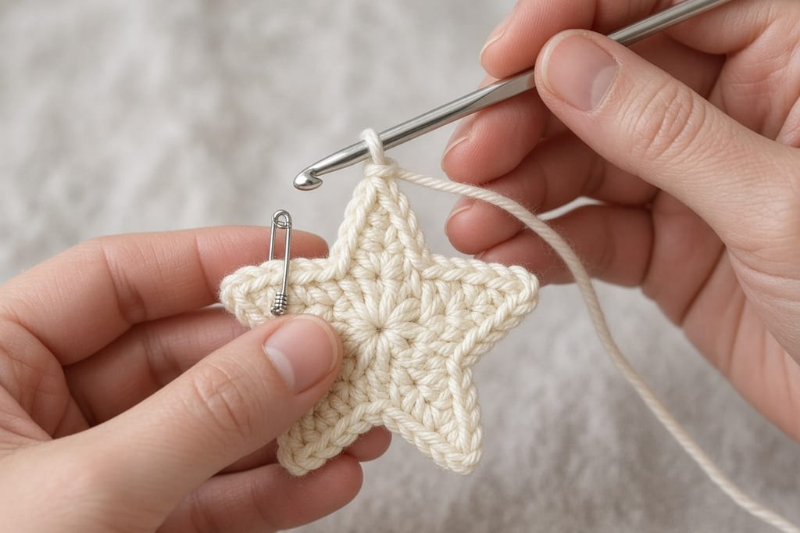
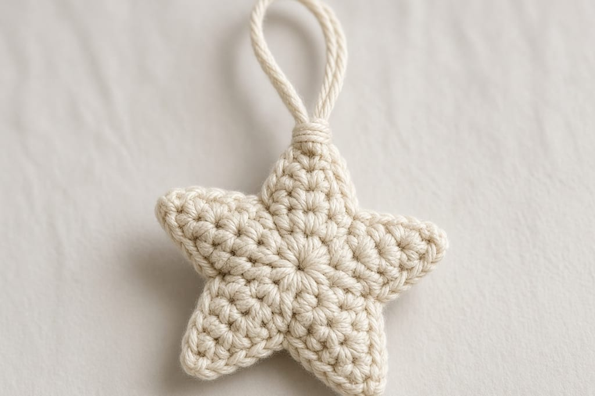
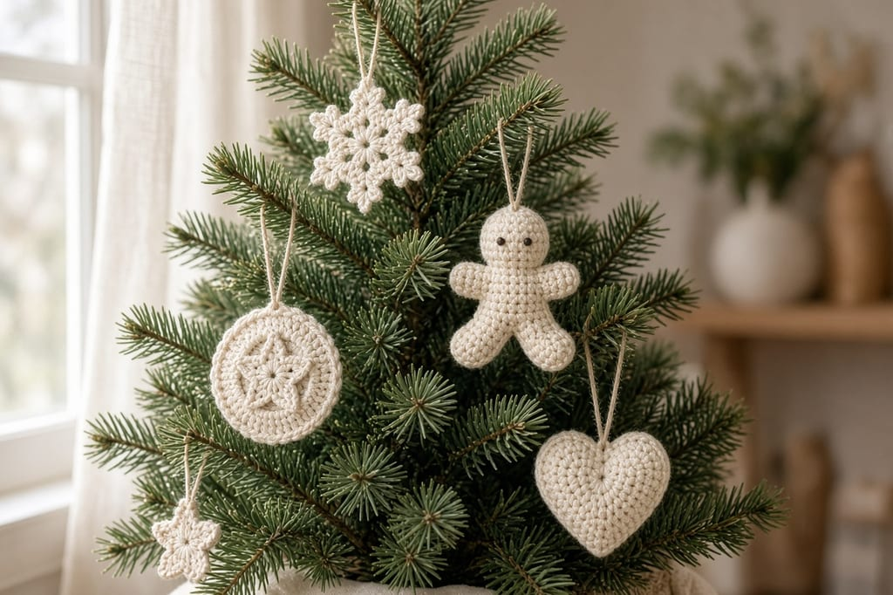

A crochet ornament has one job: hang flat enough that it does not curl into a tube by New Year. The hanging loop matters more than the color.

This page lists 15 shapes. The flat star is a full pattern. Two other shapes already have patterns on this site, and those links are the instructions. The rest are ideas for planning yarn and difficulty. They are not stitch-by-stitch tutorials, and the group photo is an illustration, not a set of tested samples.

US terms. US single crochet is UK double crochet. [Abbreviations](/crochet-abbreviations-chart).

## What every ornament needs

- Worsted cotton, about **10 to 25 yards** for a flat piece, more if you stuff a ball. [Yarn for Christmas](/yarn-for-christmas-crochet) covers sparkle yarn and why it behaves badly in small stitches.
- US G/6 (4.0 mm) hook. [Hook chart](/crochet-hook-size-conversion-chart).
- A hanging loop: chain 12, sew both ends to the top, weave the tail through the chain. A single unsewn strand will pull out.

Stuffing is optional and usually a mistake on a flat ornament. It makes the piece heavy for a thin branch.

## The fifteen

**Mini Christmas tree.** Full patterns already exist: [how to crochet a Christmas tree](/how-to-crochet-a-christmas-tree) and the [mini Christmas trees set](/free-pattern-mini-christmas-trees). Do not invent a third tree from the photo.

**Star.** Full pattern below. Beginner. Flat, five points, joined rounds.

**Snowflake.** Use [how to crochet a snowflake](/how-to-crochet-a-snowflake) or the [snowflake set](/free-pattern-snowflake-set). Those pages deal with keeping points flat. This page does not repeat them.

**Mini stocking.** Beginner idea. A short rectangle folded and seamed, with a cuff row in a second color. The heel is the part people fake with a lump of stitches. If you want a real heel, that is a sock technique, not a one-round charm.

**Candy cane.** Beginner idea. A tight chain in red, then a second pass of white on one side, then a pipe cleaner or a length of wire inside if you need it to keep the hook shape. Yarn alone often uncurls. Say so if you sell them.

**Bell.** Beginner idea. A small cone worked in the round. The clapper is a bead on a strand, and the bead must be too wide to pull back through the stitches.

**Heart.** The row-by-row heart in [bag charm ideas](/crochet-bag-charm-ideas) can hang as an ornament if you add the same chain loop. That pattern is a charm, not a stuffed pillow.

**Gingerbread-inspired ornament.** Idea only. A brown flat shape with a white embroidered edge. Do not copy a specific designer's gingerbread set. Embroidery should stay shallow so the back is not a knot.

**Mini wreath.** Beginner idea. A short tube joined into a ring, with a chain bow. The ring collapses if the tube is only 4 stitches around. Plan on a firmer hook.

**Snowman.** Intermediate idea. Three balls stacked and sewn. The existing [gnome](/how-to-crochet-a-gnome) is a different toy. A snowman needs its own counts, which are not on this page.

**Gift box.** Beginner idea. Six squares seamed into a cube is a lot of ends for an ornament. A flat pocket that holds a card is the [Christmas gift card holder](/how-to-crochet-a-christmas-gift-card-holder), and that one is not meant to hang.

**Mini mitten.** Beginner idea. Same construction warning as the stocking. A thumb added as an afterthought looks like a bump. Plan the thumb as a few stitches split off the round, or skip the thumb and call it a flat mitten shape.

**Bauble.** Beginner idea if you can make a ball: increase to a circle, work even, then decrease in mirror. Leave a loop before you close it. Do not hang a heavy stuffed ball on a weak branch.

**Angel-inspired ornament.** Idea only. A circle head and a triangle body read as an angel at a distance. Wings are where copied patterns usually live. Keep wings as two simple triangles you design yourself, or skip them.

**Festive bow.** Beginner idea. Two loops, a center wrap, a hanging chain. Pin the loops before you wrap or the bow becomes a knot. This is not a full bow pattern.

## Flat star pattern

Joined rounds. The slip stitch that joins does not count as a stitch. Ch 1 at the start of a round does not count.

**Round 1:** 5 sc in a magic ring. Join with a sl st to the first sc. (5)

**Round 2:** Ch 1, (sc in the next stitch, ch 5) 5 times. Join with a sl st to the first sc. (5 sc and 5 chain-5 spaces)

Each repeat uses one of the 5 stitches from Round 1.

**Round 3:** In each chain-5 space, work sc, hdc, dc, hdc, sc. Join to the first sc. Fasten off.

That is 5 stitches in each of 5 spaces, 25 stitches total. They sit in the chains, not in the single crochets of Round 2. If you also stitch into those single crochets, you get extra fabric between the points and the star looks like a flower.

Weave the ring tail. Chain 12, sew both ends behind one point.

## Hanging

Use a branch that can take the weight. A stuffed bauble needs a sturdier loop than this flat star. Space ornaments so the loops do not share one twig.

## Mistakes

**Skipping the join count.** If Round 1 has 6 stitches, you will get 6 points. The pattern asks for 5.

**A wire you cannot see.** If you use a pipe cleaner in a candy cane, the ends must be bent in and covered. A raw wire tip is a bad ornament.

**Blocking with a hot iron on acrylic.** It melts. Pin a damp cotton star and let it dry, which is the method in [weaving ends and blocking](/weaving-in-ends-and-blocking).

## Care

Dust them. Wash only if you must, by hand, with the hanger still secure. Dry flat. Store them where the loops cannot tangle into a knot you have to cut.

## Frequently asked

**Are all 15 patterns here?**

No. The star is complete. The tree and the snowflake are on their own pages. The other shapes are planning notes.

**Can I sell the stars?**

Finished stars, yes. Do not republish the three rounds.

**Will the star stay flat?**

At this size, cotton and a normal tension usually lie flat because there is no stuffed center. If it cups, the ring was pulled too tight. Redo Round 1 rather than blocking a curled center into submission.

## Next

If you are making gifts that are not ornaments, the [gift card holder](/how-to-crochet-a-christmas-gift-card-holder) is a flatter project with a real measurement to hit.
