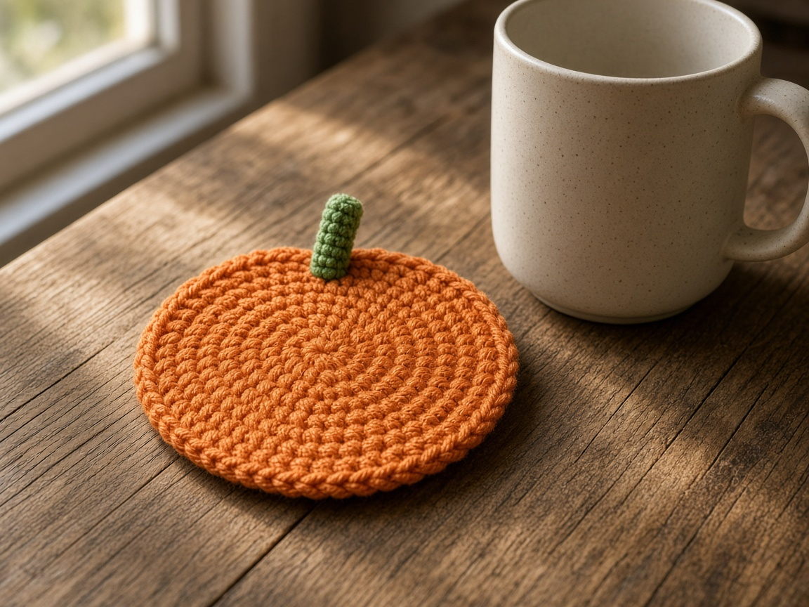

**Not a measured sample.** Stitch counts below were checked on paper. They have not been worked in yarn, and the photo is an illustration. Set a mug on your disc before you fasten off.

A pumpkin coaster only has to sit flat under a mug. The round version below is a single-crochet disc with a short stem. The granny squares further down are a different shape for the same job. Color changes: [Halloween Granny Square Variations](/halloween-granny-square-variations/) and [Changing Yarn Color](/changing-yarn-color-crochet/).

## Finished size (design target, not a measured sample)

- Pumpkin coaster: about 4 in (10 cm) across if your gauge is 4 sc to 1 in
- Granny coaster: about 4.5 in (11.5 cm) square after blocking
- Dishcloth: about 8.5 in (21.5 cm) square after blocking

## Gauge

These sizes assume worsted cotton and the hook below. If your disc is smaller than the mug, add increase rounds. If it cups, your increases are too tight or you are missing them. [Gauge](/crochet-gauge/).

## Materials

- Worsted cotton: orange for the pumpkin discs, a short length of green for the stems, plus black and purple if you also make the granny set
  - Pumpkin set of 4: orange is the main yarn. Green is only four short stems. This yardage was not weighed.
  - Granny set of 4: about 30 yd (27 m) each of orange, black, and purple, as a shopping estimate
  - Dishcloth: about 60 yd (55 m) total mixed colors, same kind of estimate
- US G/6 (4.0 mm) for the pumpkin disc, US H/8 (5.0 mm) for the granny squares, or the size that lies flat ([hook size chart](/crochet-hook-size-conversion-chart/))
- Yarn needle

Also: [yarn weight chart](/yarn-weight-chart/), [abbreviations chart](/crochet-abbreviations-chart/).

## Abbreviations (US)

sc, dc, ch, sl st, rnd, sp, st(s). On the granny squares, the beginning ch-3 counts as a dc. On the pumpkin disc, do not count a chain as a stitch.

## Pumpkin coaster (make 4)

Cotton, not acrylic, if the coaster will see a hot mug. Orange for the disc, a short length of green for the stem. US G/6 (4.0 mm), or the size that gives you a flat circle. [Hook chart](/crochet-hook-size-conversion-chart/). Work in a spiral and mark the first stitch. [In the round](/crochet-in-the-round/).

**Rnd 1.** Magic ring, 6 sc, pull the ring closed. (6)

**Rnd 2.** 2 sc in each st. (12)

**Rnd 3.** *Sc in next, 2 sc in next; rep from * around. (18)

**Rnd 4.** *Sc in next 2, 2 sc in next; rep from * around. (24)

**Rnd 5.** *Sc in next 3, 2 sc in next; rep from * around. (30)

**Rnd 6.** *Sc in next 4, 2 sc in next; rep from * around. (36)

**Rnd 7.** *Sc in next 5, 2 sc in next; rep from * around. (42)

**Rnd 8.** *Sc in next 6, 2 sc in next; rep from * around. (48)

**Rnd 9.** Sc in each st. Sl st to the first sc and fasten off. (48)

At a planning gauge of 4 sc to 1 in, 48 stitches is about 12 in around, which is roughly a 4 in circle. That is arithmetic, not a measured swatch. Set a mug on the disc before you fasten off and add or skip a round.

**Stem.** With green, ch 7. Sl st in the 2nd ch from the hook and in each ch back. Fasten off, leaving a tail. Sew the tail end to the edge of the disc so the chain sticks out like a stem. One stem is enough for the coaster to read as a pumpkin.

## Mistakes on the pumpkin disc

**It bowls.** You skipped an increase, or the ring was pulled so tight the first rounds could not lie flat. Count every round.

**It ruffles.** Extra increases, or the hook is too large for the yarn. Stop increasing and work one even round, then decide.

**The stem pulls out.** Sew through the disc and back through the chain, then weave the tail. A knot on the back is not a finish.

## Notes

- Change color on the last yarn-over of the join (see color-change tutorial).
- Weave ends as you go — black ends show through orange if left loose.
- Block all pieces to the same measurement before calling the set done.

## Coaster (make 4)

**Color order suggestion.** Rnd 1 A (orange), Rnd 2 B (black), Rnd 3 C (purple), Rnd 4 B (black). Or follow Variation 1 on the granny tutorial.

**Rnd 1.** With first color, ch 4, join to form a ring. Ch 3, 2 dc in ring, ch 2, *3 dc in ring, ch 2; rep from * twice more, join to top of ch-3. Fasten off if changing. (4 clusters)

**Rnd 2.** Join next color in any ch-2 corner. Ch 3, (2 dc, ch 2, 3 dc) in same corner, ch 1, *(3 dc, ch 2, 3 dc) in next corner, ch 1; rep from * around, join. Fasten off if changing. (24 dc, 4 ch-2 corners, 4 ch-1)

**Rnd 3.** Join next color in any corner. Ch 3, (2 dc, ch 2, 3 dc) in corner, ch 1, 3 dc in next ch-1 sp, ch 1, *(3 dc, ch 2, 3 dc) in corner, ch 1, 3 dc in next ch-1 sp, ch 1; rep from * around, join. (36 dc, 4 ch-2 corners, 4 side clusters)

**Rnd 4.** Join in any corner. Ch 3, (2 dc, ch 2, 3 dc) in the corner, ch 1, 3 dc in the next space, ch 1, 3 dc in the next space, ch 1, *(3 dc, ch 2, 3 dc) in the next corner, ch 1, 3 dc in the next space, ch 1, 3 dc in the next space, ch 1; rep from * around, join. (48 dc, 4 corners, 2 side clusters on each side)

## Dishcloth

Work as coaster through Rnd 4, continuing in established granny pattern through **Rnd 7** (or until about 8–8.5 in / 20–21.5 cm). Suggested colors: alternate B and A each round with a C round in the middle.

**Optional border.** One rnd sc in B evenly around, working 3 sc in each corner.

## Finishing

Block coasters as a set. Steam or wet-block cotton per [blocking notes](/weaving-in-ends-and-blocking/).

## Tips

- For a denser square, work a double crochet in every stitch and chain-space, and still put `(3 dc, ch 2, 3 dc)` in each corner. The open granny above is the written set.
- Label the back of one coaster with fiber content if gifting.

## Frequently asked

### Can this go in the microwave?

No. It is a coaster. Cotton is the safer fiber next to a warm mug, and even cotton is not a hot pad unless you have tested thickness.

### Do I need the granny squares too?

No. The round pumpkin stands on its own. The squares are a second set if you want a matching cloth.

## What to make next

A stuffed [pumpkin](/how-to-crochet-a-pumpkin-step-by-step/), a [pumpkin treat bag](/how-to-crochet-a-pumpkin-treat-bag/), or the [mug cozy](/crochet-mug-cozy-for-beginners/) if you would rather wrap the cup than sit under it.
