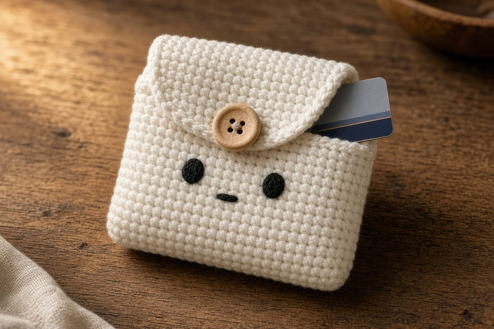
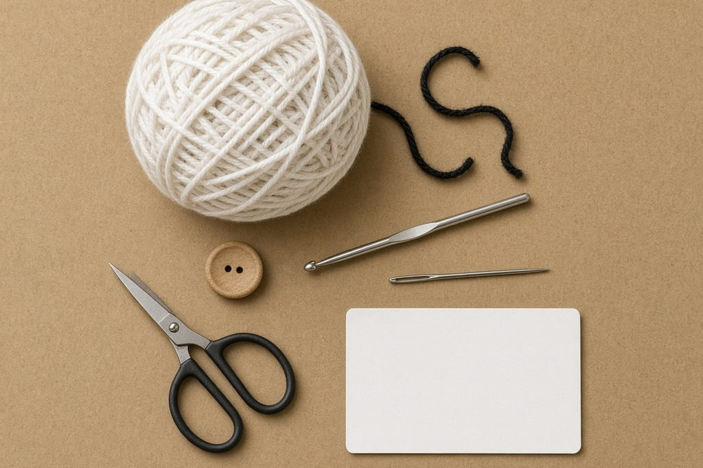
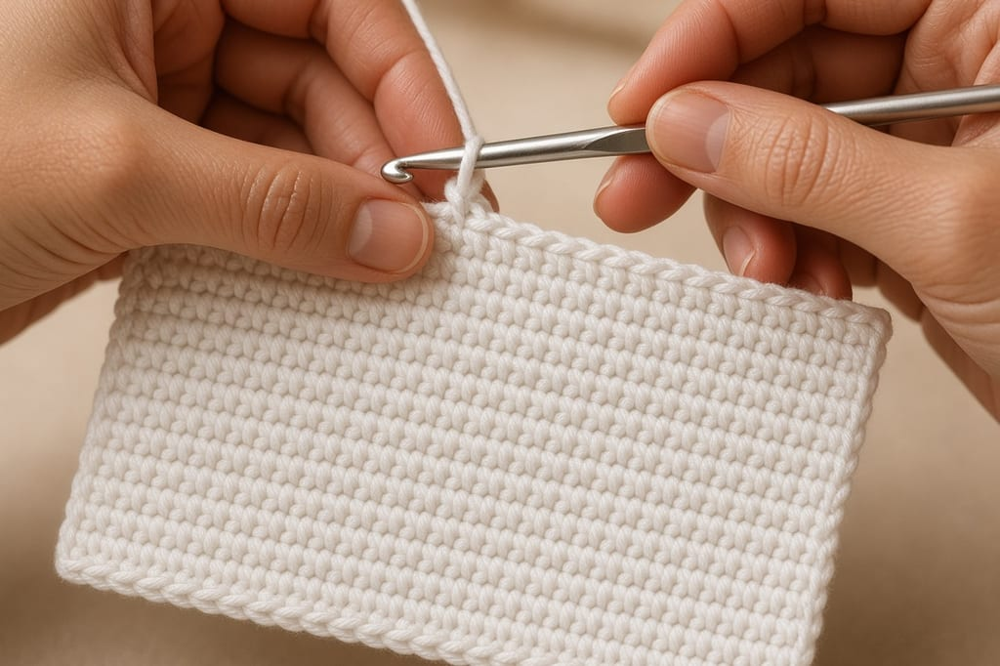
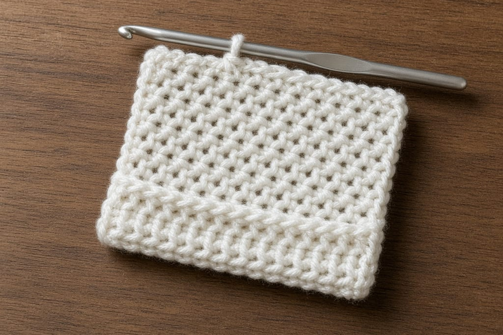
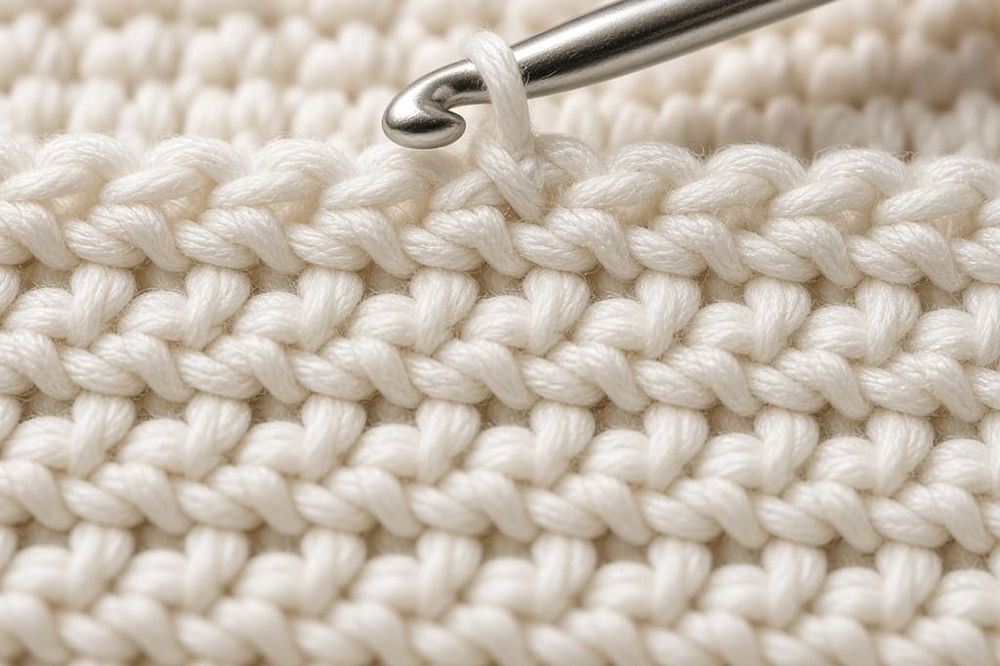
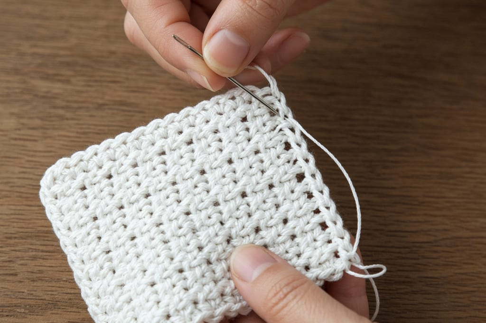
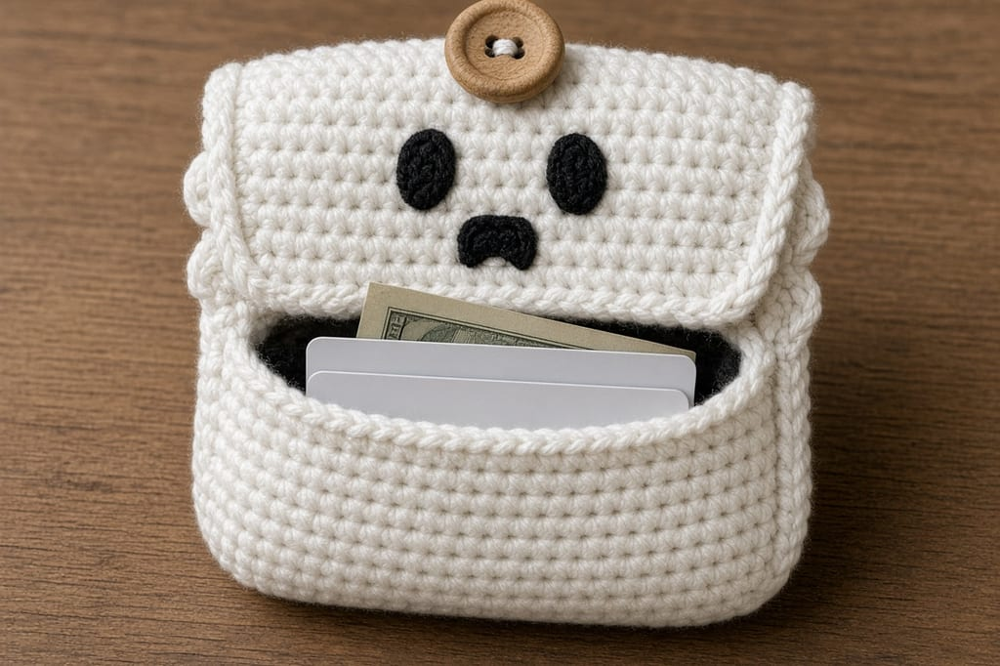
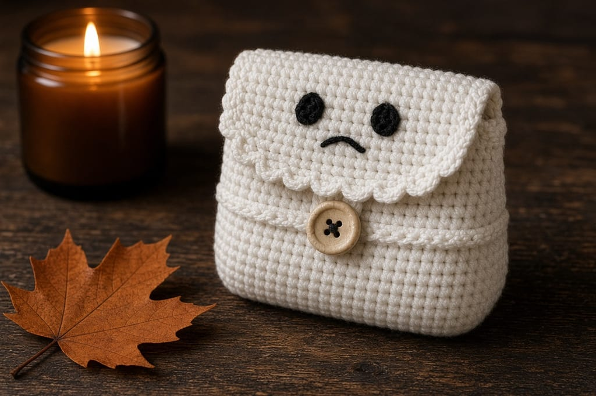

A ghost wallet is only cute if a real card goes in and stays there. The pocket in this pattern is built around a standard bank card, then the flap and the face go on.

A standard ID-1 card, the size used for most US bank cards, is 85.60 mm wide and 53.98 mm tall (3.37 by 2.125 inches). That is the ISO/IEC 7810 ID-1 size. The crochet inches below are estimates from the gauge, not a finished wallet that has been measured. Photos are illustrations. Lay a card on the fabric before you seam.

US terms. US single crochet is UK double crochet. Abbreviations are on the [chart](/crochet-abbreviations-chart).

## Skill and time

Beginner. Single crochet, decreases, and a whipstitched side. About 2 to 3 hours.

## Materials

- Worsted cotton, white, about **55 yards**. A short scrap of black for the face. Cotton holds a pocket better than fuzzy acrylic. [Yarn weight chart](/yarn-weight-chart).
- US G/6 (4.0 mm) hook, or whatever hits the gauge. [Hook chart](/crochet-hook-size-conversion-chart).
- One button about **1/2 inch** across.
- Yarn needle and scissors.
- One real card to test the fit. Do not seam until it slides in.

## Abbreviations (US)

ch, sc, dec (single crochet 2 together). Turn at the end of every row.

## Gauge and size (estimates)

**Aim for** 4 sc = 1 inch and 5 rows = 1 inch.

At that gauge the fabric is **4 inches wide** (16 sc) and the pocket, after folding, is about **2.8 inches deep** (14 rows). The card is 3.37 inches wide and 2.125 inches tall, so there is room for the side seams and for one folded bill behind the card. A thick stack of cards will not fit. This is a mini holder, not a bifold.

If your 16 sc measure under 3.6 inches, the card will jam after seaming. Start again with a larger hook, or add 2 chains at the foundation (18 sc across) and add 1 stitch to each side of the later rows.

## The rectangle

**Row 1:** ch 17, sc in the 2nd ch from the hook and in each ch across. Turn. (16)

**Rows 2–30:** ch 1, sc in each st across. Turn. (16)

That is 29 more rows, 30 rows total so far.

**Row 31:** ch 1, dec, sc in the next 12 sts, dec. Turn. (14)

**Row 32:** ch 1, dec, sc in the next 10 sts, dec. Turn. (12)

**Row 33:** ch 1, dec, sc in the next 8 sts, dec. Turn. (10)

**Row 34:** ch 1, sc in the next 3 sts, ch 5, skip 4 sts, sc in the last 3 sts. (6 sc and a 5-chain loop)

Fasten off.

Row 31 uses 2 + 12 + 2 = 16 and leaves 14. Row 32 uses 2 + 10 + 2 = 14 and leaves 12. Row 33 uses 2 + 8 + 2 = 12 and leaves 10. Row 34 uses 3 + 4 skipped + 3 = 10. If the loop misses your button, redo Row 34 with ch 6 or ch 7.

## Pocket

Lay the rectangle with the chain edge at the bottom. Fold that edge up so the fold sits at the top of Row 14. You have used 14 rows for the pocket. Rows 15–34 are the back and the ghost flap.

Slide the card in before you stitch. It should go in without a fight and sit fully below the fold. If the fold covers the card with almost no room, unfold and use Row 16 as the fold line instead. Move the seam to match.

Whipstitch each side through both layers, from the fold up to the pocket opening. Sew through the edge stitches only, so you do not steal width from the 16-stitch interior. Weave the seam tails inside the pocket.

Sew the button on the outside of the pocket, centered, low enough that the chain loop reaches it when the flap is closed and high enough that the loop is not hanging off the bottom.

## Face

Close the flap. Mark two eye spots on the outside of the flap, above the button, with pins. Embroider a short horizontal stitch for each eye in black, then a small wide V or oval for the mouth under them. Keep the stitches shallow so they do not show as lumps inside the pocket.

## Making the pocket hold

Cotton single crochet is sturdy when the gauge is firm and the seams are doubled. After the first whipstitch, go back along each side with a second pass through the same edge stitches. That second line is what stops a card corner from working the seam open.

Do not add a plastic canvas liner. It makes the fold crack and it steals the half inch the card needs. If the pocket feels soft, you are a hook size too big. Redo it. A 3.75 mm hook with the same 16-stitch width comes out narrower, so check the card again before the second seam pass.

Fold a bill in half, then in half again, and slide it behind the card. One bill lies flat. Two bills start to lift the flap off the button. That is the capacity, not a suggestion to sew it tighter.

The face sits on the flap, centered between the decrease rows and the button loop. Two eyes, each one stitch wide, about 4 stitches apart. The mouth is one stitch below them, about 3 stitches wide. Shallow stitches. Deep ones make a bump the card catches on.

## Three changes

**Taller pocket.** Fold at Row 16 instead of Row 14 if your cards are in a thin plastic sleeve. Do not also add rows or the flap becomes too long.

**A second color on the flap.** Work Rows 31–34 in a second color. Change on the last yarn-over of Row 30. The method is in [changing yarn color](/changing-yarn-color-crochet).

**No face.** Leave it plain. The shape of the decreased flap still reads as a ghost if the yarn is white.

## Mistakes

**Seaming through the middle of the stitches.** The opening gets narrower than 3.37 inches and the card bows. Catch the outer loop of the edge only.

**Face on the wrong side.** Embroider after you know which face of the flap is out. A face on the inside is invisible and rubs the card.

**A loose gauge.** The pocket looks wide enough on the table and then sags. Drop to an F/5 (3.75 mm) hook and redo the rectangle. Do not add a fabric stiffener. It cracks at the fold.

**Skipping the card test.** The row counts assume the gauge. Your card is the check.

## Care

Hand wash cool, dry flat, do not iron the face. Cotton can shrink. If it does, the card will tell you on the next try, and you will need the wider foundation, not a stretch.

## Frequently asked

**Will a US driver's license fit?**

Most are the same ID-1 size as a bank card. Test yours. A card already in a thick holder needs the taller fold.

**Can it hold cash?**

One bill, folded in half, behind the card. A wad of cash will pop the seams.

**Do I need a lining?**

No. Cotton single crochet at this gauge is the structure. A lining makes the 4-inch width too tight for the card.

**Can I sell finished wallets?**

Yes, wallets you make. Do not repost this pattern.

**Left-handed?**

Same rows. The fold and the face do not change. Hook hold is in [left-handed crochet](/left-handed-crochet).

## Related

A larger Halloween holder with more pieces is the [crochet card wallet](/halloween-crochet-card-wallet). The spiral used for a round pouch is the [bat earbuds pouch](/gothic-bat-earbuds-pouch) once that page is live, and the stitch itself is [basic single crochet](/basic-crochet-stitches).
