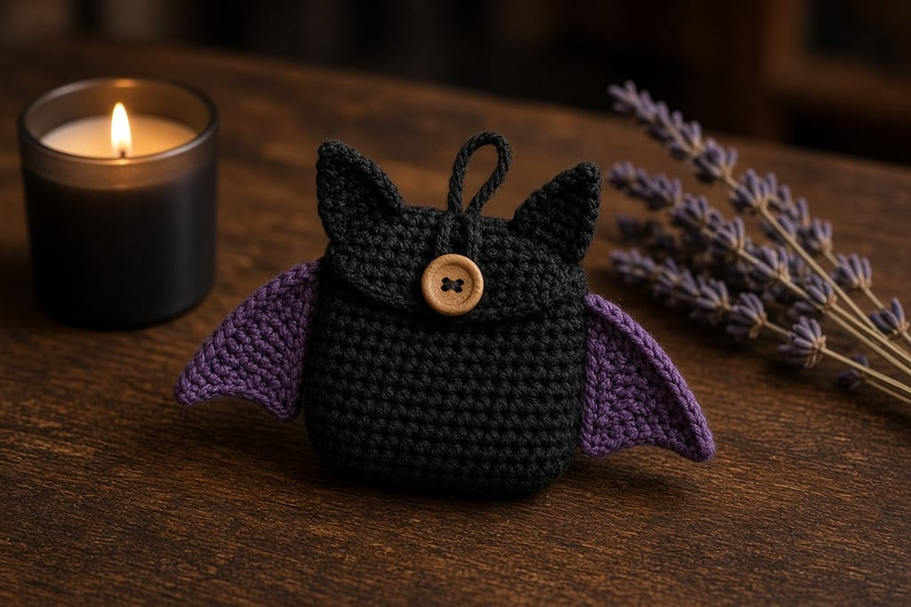
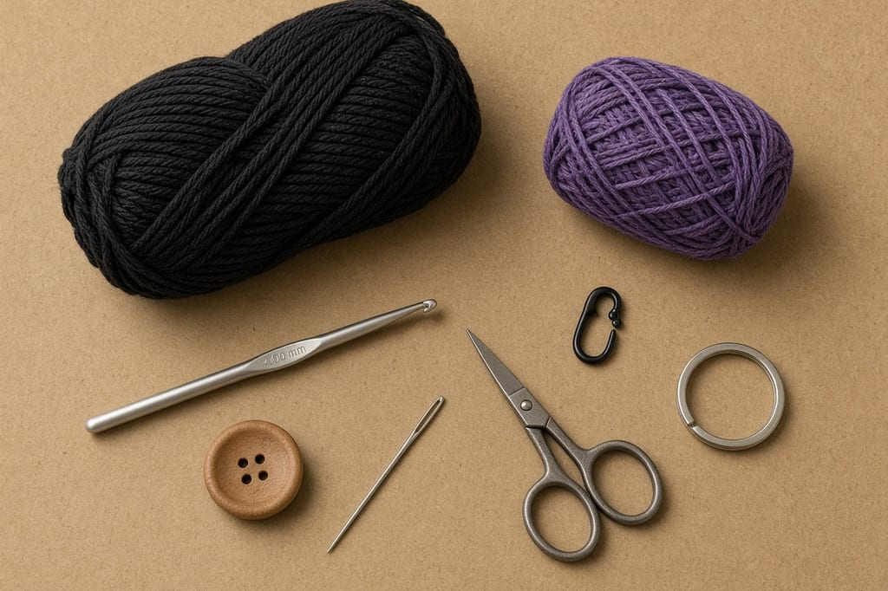
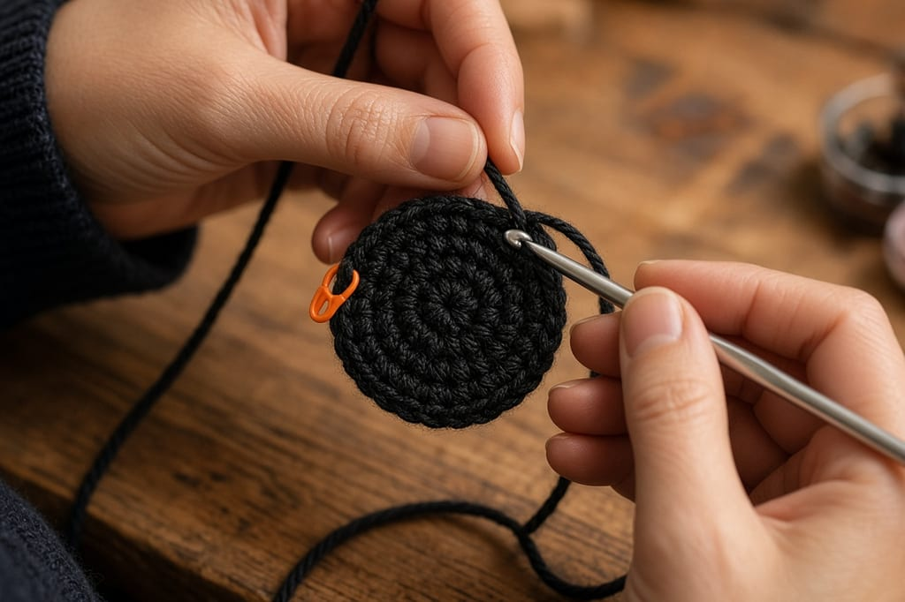
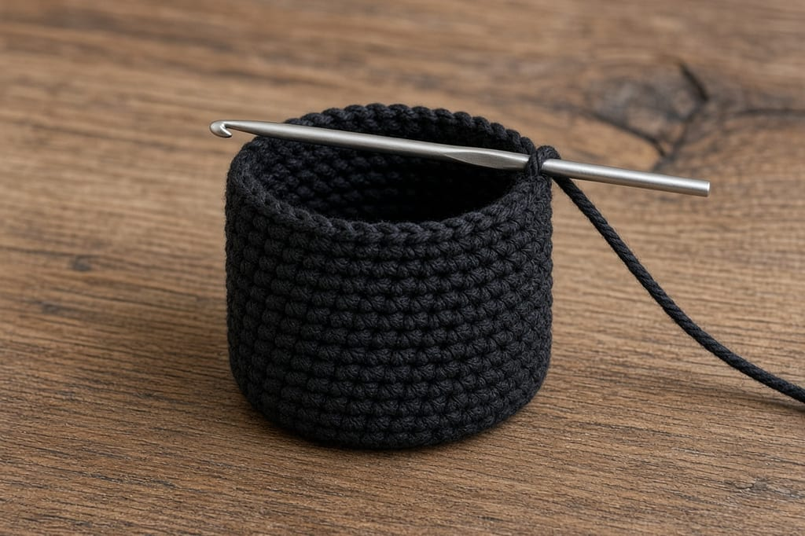
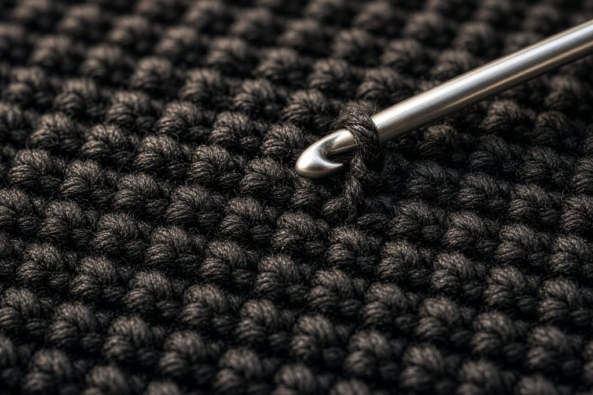
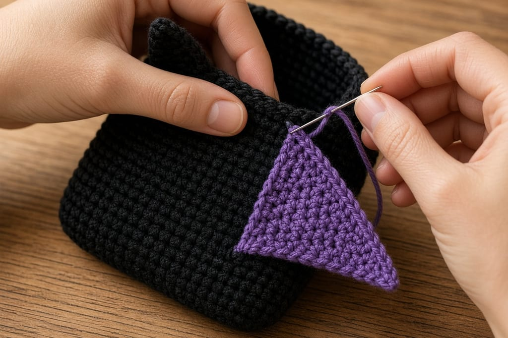
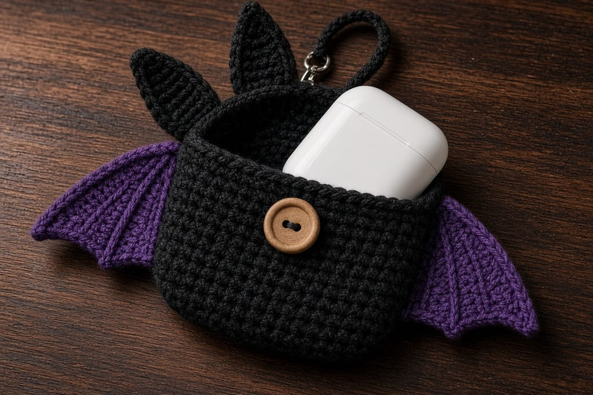
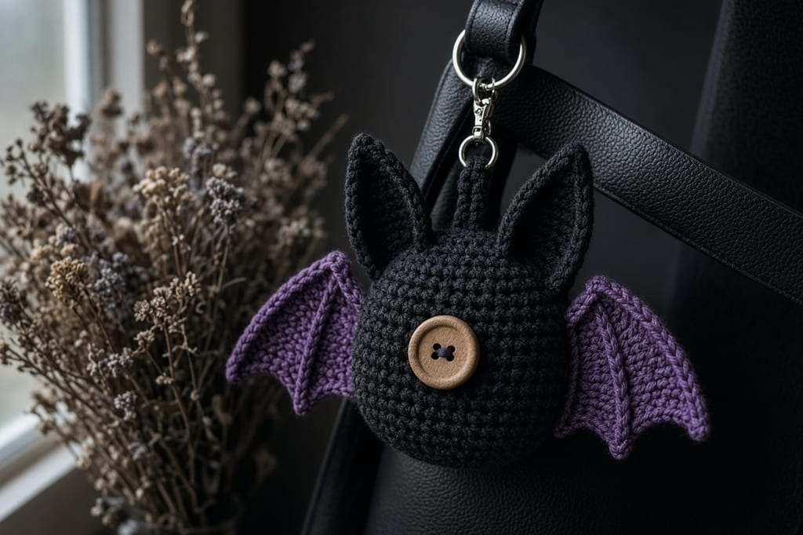

A bare earbud case disappears in a bag. A small bat pouch does not, and it still has to close over the case or the whole point is lost.

This is a black single-crochet pouch with purple wings, two ears, a button flap, and a yarn loop for a split ring. It is written in US terms. US single crochet is UK double crochet. If your pattern book is British, translate before you start. The [abbreviations chart](/crochet-abbreviations-chart/) uses the US names.

These photos are illustrations of the intended look. This page has not been stitched and measured on a finished pouch, so yarn amounts and finished inches are estimates from the gauge below. Lay your own earbud case on the fabric before you sew anything on.

## Skill and time

Beginner, if you can single crochet, increase, and decrease. Plan on one sitting, about 2 to 3 hours, plus sewing the wings on.

## Materials

- Worsted-weight cotton or a smooth cotton blend. Black, about **40 yards**. Purple, about **15 yards**. Fuzzy acrylic hides the wing edge and grabs the earbud case. See the [yarn weight chart](/yarn-weight-chart/).
- US G/6 (4.0 mm) hook, or the size that gives you the gauge. [Hook size chart](/crochet-hook-size-conversion-chart/).
- One button about **1/2 inch** across.
- Yarn needle, scissors, stitch marker.
- Optional: a metal split ring for keys.
- Substitute: DK yarn and a smaller hook makes a tighter pouch. Stop increasing when the base covers your case, and ignore the inch estimates.

## Abbreviations (US)

| Abbreviation | Meaning |
| --- | --- |
| ch | chain |
| sc | single crochet |
| sl st | slip stitch |
| inc | 2 sc in the same stitch |
| dec | sc 2 together |
| sc3tog | sc 3 together |
| st(s) | stitch(es) |

## Gauge and finished size (estimates)

**Gauge to aim for:** 4 sc = 1 inch, and 5 rounds = 1 inch, in single crochet with worsted cotton and a G/6 hook.

At that gauge the pouch body is about **2.4 inches across** the flat base (30 stitches around, roughly 7.5 inches in circumference) and about **2 inches tall** before the ears and wings. That covers a typical small wireless-earbud case. It will not fit a large over-ear headphone case.

If 4 sc is wider than 1 inch, your pouch will come out big and floppy. Drop a hook size. If the flat base does not cover your case after Round 5, work one more increase round (the larger size below) before you stop increasing.

## Body

Work in a spiral. Do not join rounds. Mark the first stitch of every round. If spirals are new, read [crochet in the round](/crochet-in-the-round/) first.

Use black.

**Round 1:** 6 sc in a magic ring. (6)

**Round 2:** inc in each st. (12)

**Round 3:** (sc, inc) 6 times. (18)

**Round 4:** (2 sc, inc) 6 times. (24)

**Round 5:** (3 sc, inc) 6 times. (30)

The base should lie flat. If it bowls, your increases are too tight. If it ruffles, you increased too fast. Do not start the sides until this circle covers the bottom of the earbud case.

**Rounds 6–15:** sc in each st. (30)

That is 10 even rounds. At the gauge above, the wall is about 2 inches. Stop earlier if the case already sits inside with the top of the case just below the rim. Add rounds if the case still sticks out.

## Flap and button loop

The flap is worked in rows on 10 of the 30 stitches. The other 20 stitches stay as the open rim.

**Row 1:** sc in the next 10 sts. Turn. Leave the remaining 20 unworked. (10)

**Rows 2–5:** ch 1, sc in each st across. Turn. (10)

**Row 6:** ch 1, sc in the next 4 sts, ch 4, skip 2 sts, sc in the last 4 sts. (8 sc and a 4-chain loop)

The loop uses 4 chains over the 2 skipped stitches, so it stands up enough to reach a 1/2-inch button. Fasten off. If the loop will not go over your button, undo Row 6 and chain 5 or 6 instead of 4.

Sew the button on the front, centered under the loop, about 4 rounds down from the rim. Close it over the earbud case once before you weave that tail in. The case should sit inside without forcing the flap.

## Ears (make 2)

Use black.

**Row 1:** ch 6, sc in the 2nd ch from the hook and in each ch across. Turn. (5)

**Row 2:** ch 1, dec, sc, dec. Turn. (3)

**Row 3:** ch 1, sc3tog. (1)

Fasten off, leaving a tail for sewing. The chain edge is the base. The sc3tog is the tip.

## Wings (make 2)

Use purple. This is a triangle with a few chain picots along the edge so the wing is not a plain slab.

**Row 1:** ch 10, sc in the 2nd ch from the hook and in each ch across. Turn. (9)

**Row 2:** ch 1, dec, sc in the next 5 sts, dec. Turn. (7)

**Row 3:** ch 1, dec, sc in the next 3 sts, dec. Turn. (5)

**Row 4:** ch 1, dec, sc, dec. Turn. (3)

**Row 5:** ch 1, sc3tog. Do not fasten off. (1)

Picot edge: sl st down one long side, placing the hook in the row ends. Work (sl st, ch 3, sl st in the same place) at three points along that side, then along the foundation chain at every other stitch, then up the other long side the same way. Fasten off, leaving a sewing tail.

Stitch check on the triangle: Row 2 uses 2+5+2 = 9 and leaves 7. Row 3 uses 2+3+2 = 7 and leaves 5. Row 4 uses 2+1+2 = 5 and leaves 3. Row 5 uses all 3.

## Assembly

1. Sew one ear on each side of the top, just behind the flap, tips pointing up. The bases should sit about 1/2 inch apart so the keychain loop has room between them.
2. Sew a wing on each side, wide edge (Row 1) against the pouch, tip pointing out and slightly down. Place them over the middle of the tube, not on the flat base, or the pouch will not sit.
3. Keychain loop: join black yarn at the top center between the ears, ch 16, sl st back into the same stitch. Fasten off. Slide a split ring onto that loop if you want it on keys.
4. Weave ends on the inside. The [weaving-in guide](/weaving-in-ends-and-blocking/) covers the path. Do not block this over a form larger than the case.

## Three ways to change it

**Larger case.** After Round 5, work Round 6 as (4 sc, inc) 6 times. (36) Then work even rounds on 36 until the case fits. Make the flap 12 stitches wide instead of 10: on the loop row, sc 5, ch 4, skip 2, sc 5.

**All black.** Skip the purple. The wings still read as wings from the shape.

**A face.** The written pouch has no eyes. If you want them, sew two small black beads on the front above the button, and keep them above where the case rubs. Beads are a poor choice for anything a child will chew. This pouch is a bag accessory, not a toy.

## Mistakes

**The base curls into a bowl.** The ring was too tight, or you skipped increases. Redo through Round 5 before you build the wall. A curled base makes a pouch that tips over.

**The flap will not reach the button.** The even section is too tall, or the loop is too short. Move the button up, or redo the loop with more chains. Do not sew the button so high that the case lid is outside the pouch.

**Wings stick out stiff and twist the pouch.** You sewed them on too tight. Ease the sewing yarn. The wing should rest, not cinch the side seam that is not actually a seam.

**You joined every round with a slip stitch.** That leaves a visible jog and changes the stitch count if you also chain up. This pattern is a spiral. One marker, no join.

## Care

Hand wash in cool water. Press the water out in a towel. Dry flat. Do not machine dry. Cotton can shrink enough to trap the case. If you use acrylic, skip the washer anyway. The button and the ring will beat the yarn up.

## Frequently asked

**Will it fit every earbud case?**

No. The default is a small charging case, about the width of the 2.4-inch base. Measure yours. Use the larger stitch count if the case hangs off the Round 5 circle.

**Can I line it?**

Yes. Cut a scrap of thin fabric to the inside and whipstitch it to the rim only. A thick lining eats the space the case needs.

**Is the loop strong enough for keys?**

A 16-chain loop in worsted yarn holds a light key ring. It is not a climbing strap. If the join looks thin, work a second round of slip stitches around the chain before you load it.

**Can I sell pouches from this pattern?**

You can sell finished pouches you make yourself. Do not copy this page onto another site, and do not add someone else's charted motif and call that part yours.

**What if I only have DK yarn?**

Use a smaller hook and treat the earbud case as the pattern. Stop increasing when the circle covers the case. The row numbers still work. The inch estimates will not.

## Where to go next

The same spiral is the start of the [crochet in the round](/crochet-in-the-round/) lesson. A bigger sleeve, measured to a specific phone, is the [iPhone 18 Pro Max phone case](/how-to-crochet-a-phone-case/). For more Halloween sewing-on, the [card wallet](/halloween-crochet-card-wallet/) uses the same idea: a flat piece, a closure, then the decoration.
