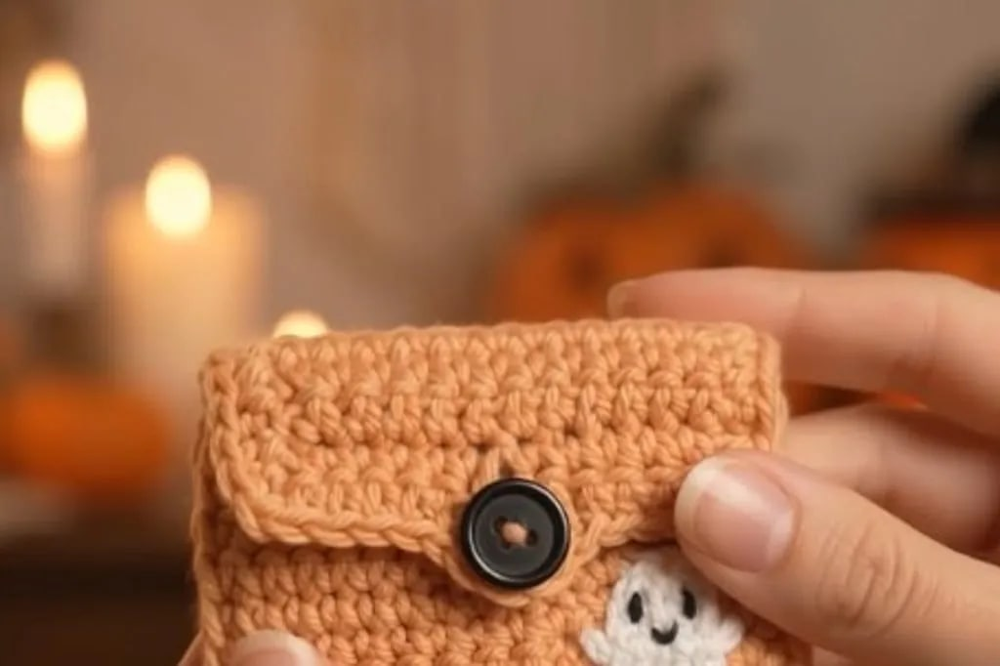
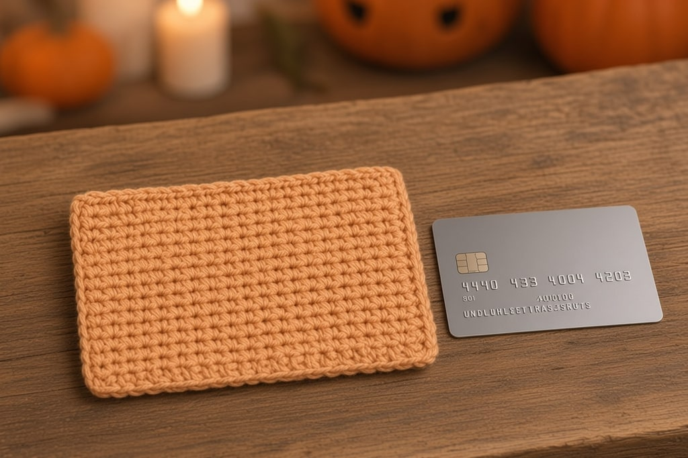
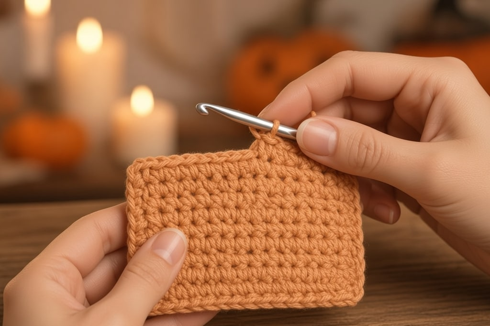
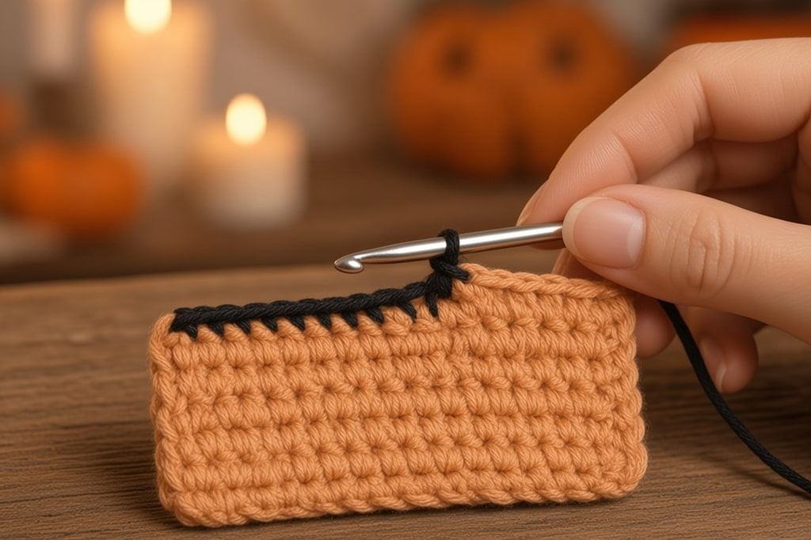
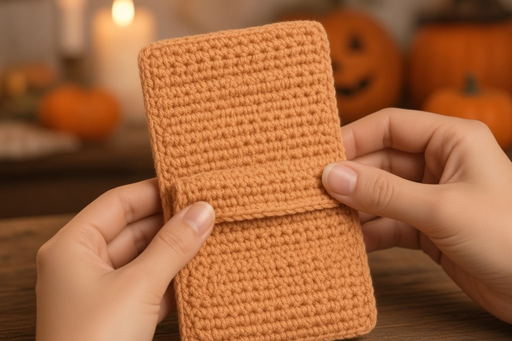
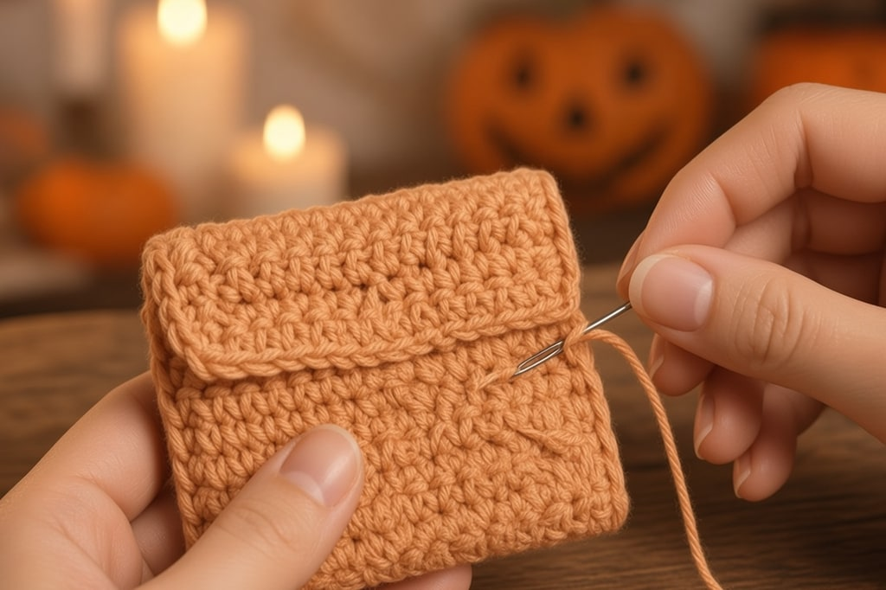
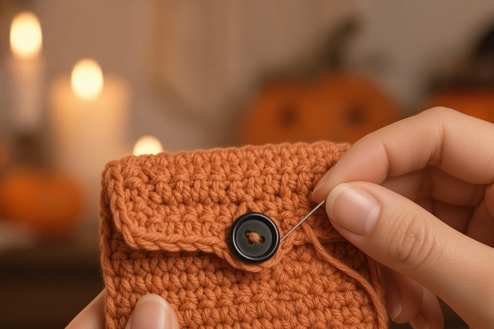
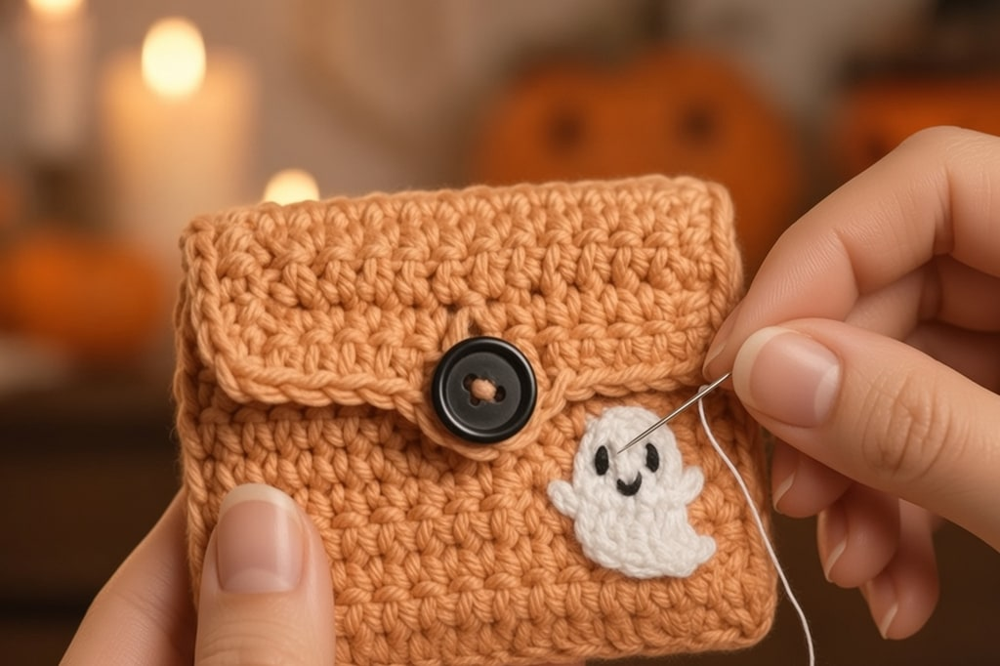
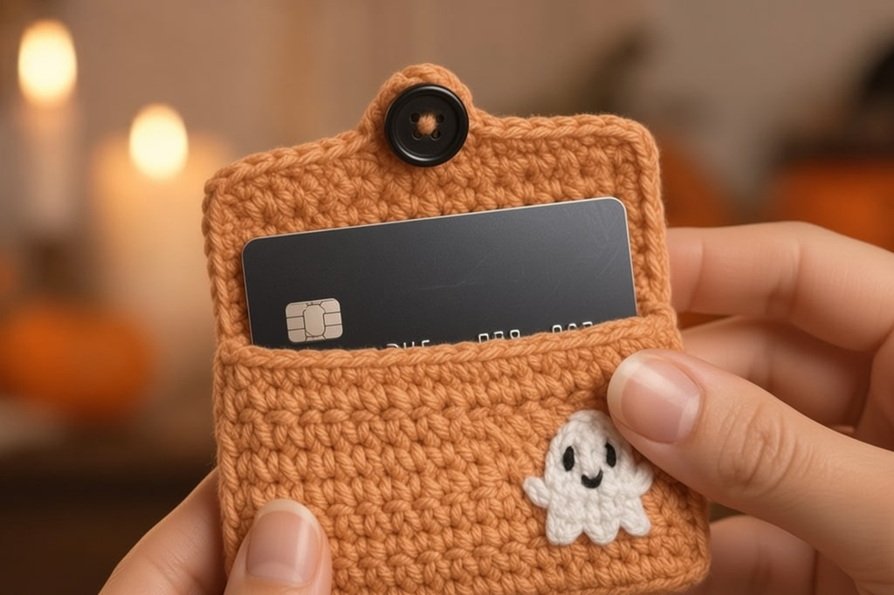
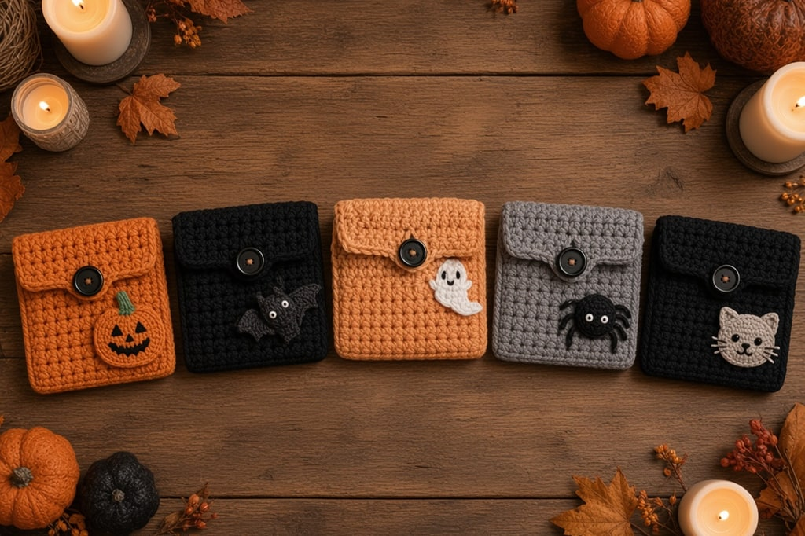

One tall single-crochet rectangle becomes a pumpkin-orange card wallet: fold a pocket, leave a flap, sew on a black button, and add a tiny ghost. The same pocket later takes a spider, bat, pumpkin, or cat appliqué.

## What you need

- Worsted yarn in **pumpkin orange**, plus scrap **white** and scrap **black**
- A hook matched to the yarn, often US G/6 (4.0 mm) or H/8 (5.0 mm)
- **One black button**, about **⅝–¾ in (15–20 mm)** across
- A yarn needle, and stitch markers or clips
- **The card the wallet must hold.** Do not guess the size

US terms. The body is almost only single crochet. If rows are new, skim [basic crochet stitches](/basic-crochet-stitches/) first.

## Finished size

A standard US credit or debit card is about **3.375 in × 2.125 in** (roughly 86 mm × 54 mm).

| Piece | Target size |
| --- | --- |
| Pocket (inside, after seaming) | about **3.75 in wide × 2.5 in tall** |
| Flap (extra fabric above the pocket) | about **1.25–1.5 in** deep when folded down |
| Full rectangle before folding | about **3.75 in wide × 6.5–7 in tall** (back + front + flap) |

Tension moves the inches. The card is the measure.

## Step 1: measure, then chain

Chain in orange until it sits about **¼ in wider** than the card's long edge, relaxed. Often that is **ch 16–20**. Write it down. Single crochet in the second chain from the hook and across. That count is every later row.

**If the first row cups,** the chain was too tight. Redo it looser, or use one larger hook for the chain only.

## Step 2: the tall rectangle

**Rows of single crochet.** Chain 1 and turn. The turning chain does not count. Keep the same stitch count.

Stop at about **two card heights**, back plus front, **plus 1.25–1.5 in** of flap. Lay the card on the fabric twice from the bottom and leave the flap above that. If it drapes like a dishcloth, go down a hook size. Soft pockets drop cards.

## Step 3: a black edge stripe

Optional: work the **last 2 rows** in black so the flap edge has a thin stripe.

Change color on the last yarn-over of the final orange stitch, so the black loop is already on the hook. The same join is in [changing yarn color](/changing-yarn-color-crochet/). Weave the tails on the wrong side later.

## Step 4: fold the pocket

Fold the bottom up to about the card's height, plus a little ease. The rows left on top are the flap, and they stay free. Clip the long sides of the **pocket only**. Where the card sits is pocket. Everything above it is flap.

## Step 5: seam the sides

Whipstitch or mattress-stitch both long sides in orange, from the fold to the opening. **Stop there.** Sewing the flap shut makes a pouch. Add a stitch at each top corner. Weave ends on the inside so they do not catch the card.

## Step 6: button and loop

Sew the **black button** on the pocket front, centered, where the flap covers it. Sew through the **front wall only**, or the card hits the shank.

Chain a loop at the center of the flap, often **ch 6–10**, tested on the real button. Slip stitch back into the join. Too tight yanks the flap. Too loose falls open. Or skip 2–3 stitches under a short chain on the last flap row, and single crochet into that chain next row.

## Step 7: the ghost

Keep the ghost about **1–1.25 in tall** so the flap still closes flat.

1. With white, magic ring, 6 sc. (6)
2. Increase around. (12)
3. Single crochet around for 2 rounds.
4. Soft hem: *sc, hdc, dc, hdc, sc in next 5 sts* (or similar), so the bottom ripples. Same idea as a [beginner ghost](/crochet-ghost-amigurumi-for-beginners/), much smaller.
5. Flatten. Fasten off with a tail for sewing.

French-knot eyes and a small curved mouth in black. Sew it to the **lower front corner**, knots inside. Wider than a third of the pocket, it wrinkles under the flap.

## Step 8: fit check

Slide the card in, close the flap, and tip the wallet.

**Too tight:** add 1–2 stitches of width next time, or seam more loosely. **Too loose:** one round of single crochet around the opening. **Flap too short:** add rows before you seam. **The loop fights:** lengthen or shorten the chain. Do not force the fabric.

One or two cards fit comfortably. Three is the maximum in worsted single crochet. Test your thickest card.

## Same pocket, different face

Change the appliqué and the base color. The pocket stays the same.

| Look | Base color | Appliqué idea |
| --- | --- | --- |
| Ghost (this tutorial) | Orange or black | Small white ghost and an embroidered face |
| Pumpkin | Orange or gray | Flat orange circle, black face stitches, green scrap stem |
| Bat | Gray or black | Flat black wings and a tiny head |
| Spider | Gray or cream | Small black body and eight chain legs |
| Cat | Black | Ear triangles on the flap, plus whisker stitches |

## Mistakes

Guessing the size instead of using your card. Seaming the flap into the sides. A soft gauge that lets cards slide out. Go down a hook size. A ghost bigger than the front. A button sewn through both layers.

## Frequently asked

**Will a license and a card fit together?** Usually, if the width has ease and you do not overstuff it. Stack them and test before you gift it.

**Can I skip the ghost?** Yes. Orange yarn and a black button are enough. The ghost is decoration.

**Do I need amigurumi?** No. The body is flat rows. The ghost is a small magic ring, or a white felt shape if you want no rounds.
