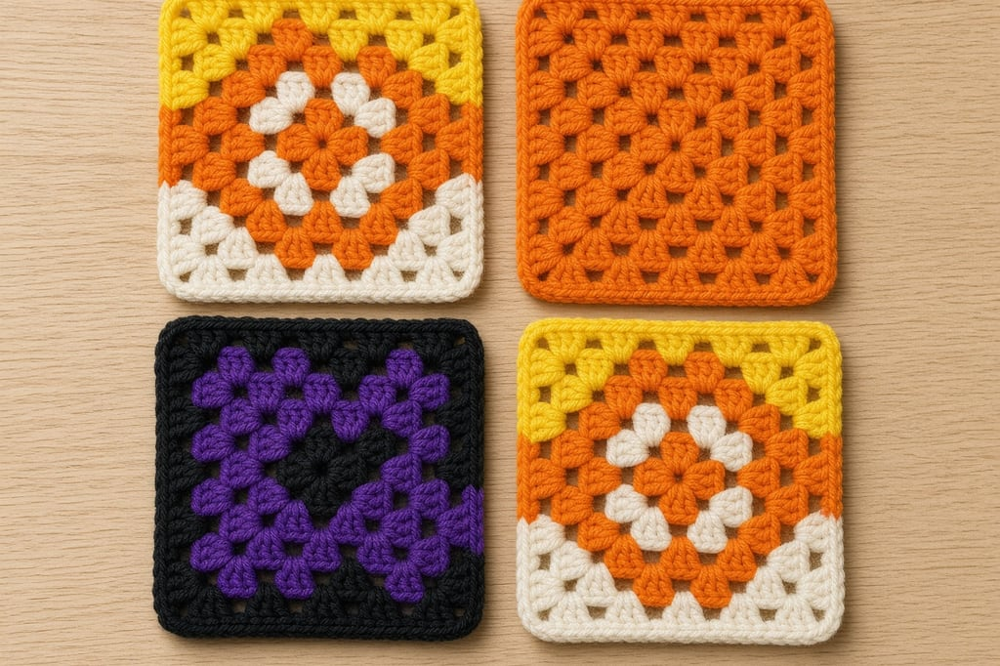
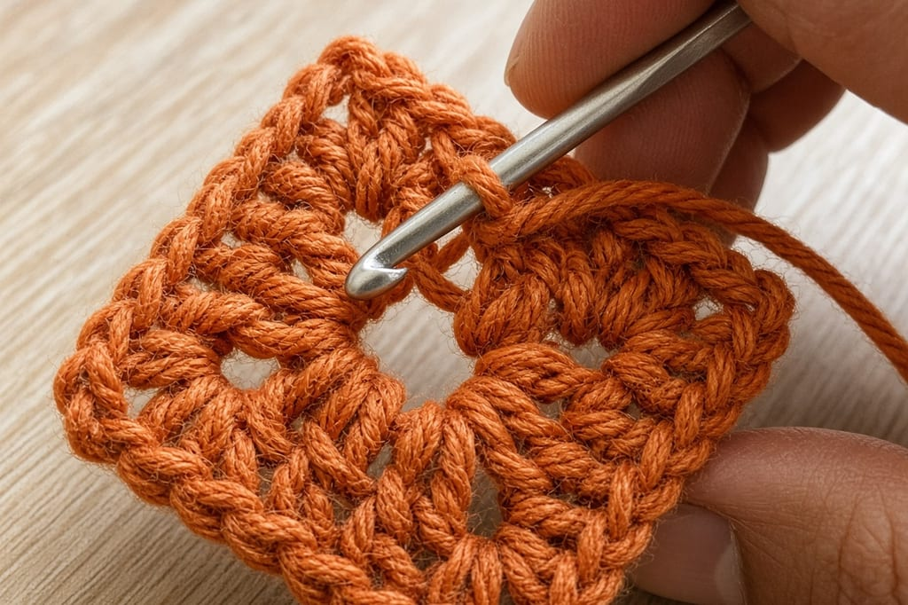
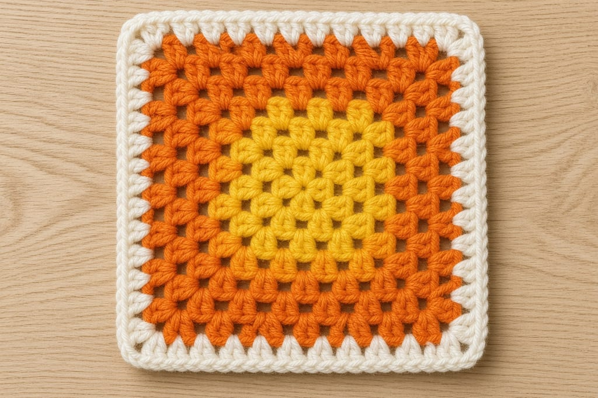
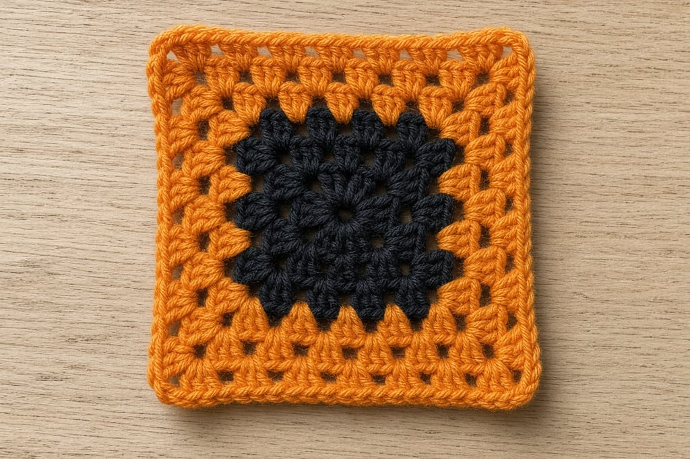
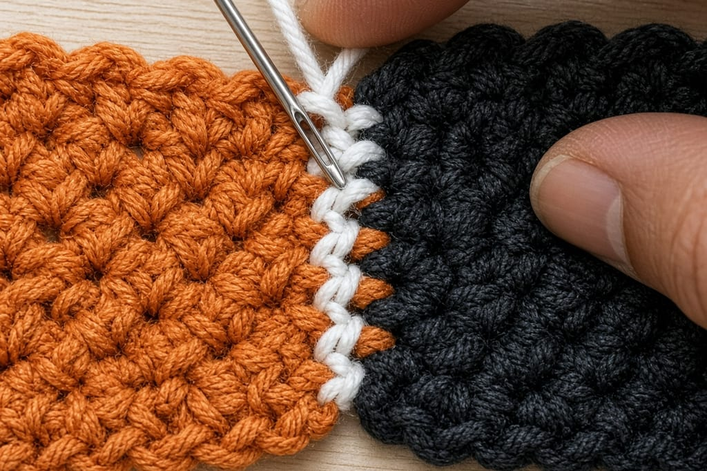

Halloween granny squares are ordinary granny squares with a deliberate palette: pumpkin orange, black, purple, yellow, and white. The stitch is the same cluster-of-double-crochet motif. What changes is **when** you switch colors and **how** you keep the joins from looking muddy.

If you have not changed colors cleanly before, read [How to Change Yarn Color in Crochet](/changing-yarn-color-crochet/) first.

## What you need

- Worsted yarn in orange, black, purple, plus yellow and white for candy corn (scraps are fine)
- Hook matched to the yarn ([hook size chart](/crochet-hook-size-conversion-chart/), [yarn weights](/yarn-weight-chart/))
- Yarn needle

Abbreviations: [chart](/crochet-abbreviations-chart/). Classic granny uses dc clusters and ch spaces.

## Step 1: classic granny move (one color)

**Rnd 1.** Ch 4, join to form a ring (or magic ring). Ch 3 (counts as dc), 2 dc in ring, ch 2, *3 dc in ring, ch 2; repeat from * twice more, join to top of beginning ch-3. (4 clusters, 4 corner spaces)

**Rnd 2.** Slip to next corner space (or start with a standing dc). *(3 dc, ch 2, 3 dc) in corner, ch 1; repeat from * around, join. (24 dc, 4 ch-2 corners, 4 ch-1)

**Later rounds.** Corners always get `(3 dc, ch 2, 3 dc)`. Side spaces get `3 dc`. Pick one chain style between side groups and stay consistent so squares match when you join them.

## Step 2: candy-corn rings

Work each round in a different color: golden yellow in the center, then pumpkin orange, then soft white (or cream) on the outer rounds.

Change color on the join: finish the last yarn-over of the joining slip stitch (or the last dc) with the new color. Cut the old color if you will not need it soon; carry only when the next round needs it immediately and the carry can hide along a seam edge.

**Plan the stack before you hook.** Sticky note: R1 yellow, R2–3 orange, R4–5 white. Guessing mid-square is how you reverse the candy-corn order.

## Step 3: spooky center, quiet border

Keep rounds 1–2 in black, then switch to orange or purple for outer rounds. The dark center reads as a void; the bright outer rounds keep a blanket from looking like a hole punched in fabric.

This variation is forgiving with scrap yarn because the outer rounds use the most yardage.

**Optional harder variation (no extra photo):** change color at a corner so two adjacent sides of a round are orange and the other two are black. Change in the corner space, twist yarns at the switch, and do not carry unused yarn across an open ch space on the front.

**Optional denser coaster:** work dc in every stitch and chain-space around, still placing `(2 dc, ch 2, 2 dc)` or `(3 dc, ch 2, 3 dc)` in corners.

## Step 4: join squares into a set

Block each square to the same measurement before joining — see [weaving in ends and blocking](/weaving-in-ends-and-blocking/). Join with slip stitch or whip stitch in black so the seams disappear into the darkest color.

For a small wall hanging, join three squares in a column with purple joins and add a black border round around the whole piece.

## Mistakes that muddy Halloween colorwork

**Changing color at the start of a round after the chain-up.** Change on the last yarn-over of the previous stitch or join.

**Too many colors in one small square.** Three is plenty.

**Tight chain spaces in black yarn.** Check drape in daylight.

**Skipping end-weaving.** Black ends that poke through orange show forever.

## Frequently asked

### Do I need glow-in-the-dark yarn?

No. Fun as a one-round accent; scratchy as the main fabric.

### Can I mix acrylic and cotton in one square?

For practice, yes. For a set you care about, keep fiber content consistent.

### What size should a coaster be?

Large enough for the mug base plus a little margin. Make one square, set the mug on it, then decide.

### What to make next

A [pumpkin](/how-to-crochet-a-pumpkin-step-by-step/), a [ghost](/crochet-ghost-amigurumi-for-beginners/), or the reel-friendly [Halloween card wallet](/halloween-crochet-card-wallet/).
