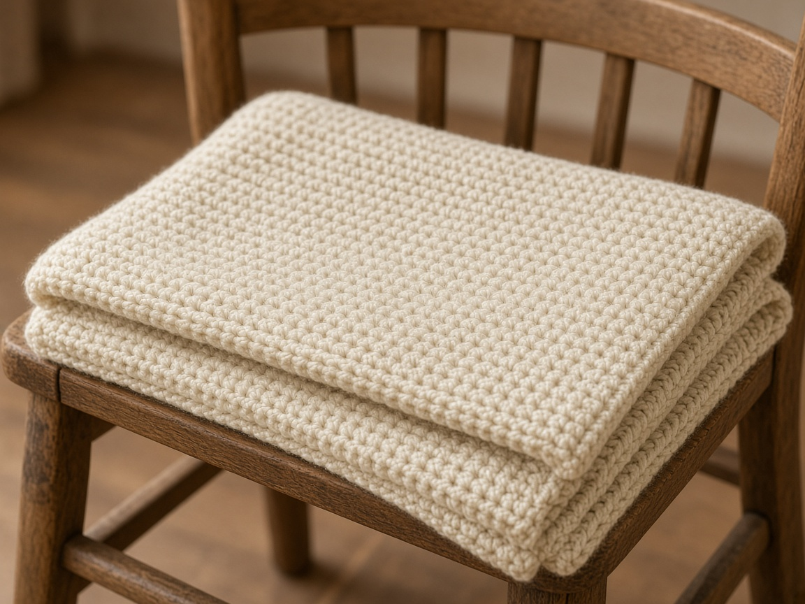

A baby blanket is a rectangle with rules. The yarn has to survive washing, the fabric should not be a net of holes, and nothing should be sewn on that a baby can pull into their mouth. The stitch is the same [half double crochet](/basic-crochet-stitches/) as the [beginner scarf](/how-to-crochet-a-beginner-scarf/). The size is the part people get wrong.

The numbers below are a planning example from an assumed gauge. They are not measurements from a finished blanket, and the photo is an illustration. Swatch, wash the swatch, and recount before you buy all the yarn.

## What you need

- Washable worsted-weight yarn in a light, solid color so stains and dropped stitches show while you work. [Yarn weights](/yarn-weight-chart/). Read the band for machine-wash instructions.
- US H/8 (5.0 mm) hook, or the hook that matches your swatch to the gauge below. [Hook chart](/crochet-hook-size-conversion-chart/).
- Yarn needle and a tape measure.

Do not promise a yardage. A blanket uses more yarn than a hat, and the only honest method is a washed swatch: weigh 4 in of rows, then scale to the width and length you chose. Buy an extra skein of the same dye lot before you need it.

## Finished size

A common receiving size is about 30 in wide and 36 in long. That is a target, not a required measurement. A lap blanket for a toddler can be larger. Write your target down before you chain.

## Gauge (planning numbers, not a measured swatch)

About 3 hdc and 2.5 rows to 1 in. At that gauge, 30 in is 90 stitches and 36 in is 90 rows. If your washed swatch is 2.5 hdc to the inch, 30 in is 75 stitches, not 90. [Gauge](/crochet-gauge/).

## Abbreviations (US)

ch, hdc. The turning ch-2 does **not** count as a stitch. [Turning chain](/crochet-turning-chain/). US hdc is the stitch between single and double. It is not UK half treble.

## Blanket

Use your own stitch count. The 90 below matches only the planning gauge.

**Row 1.** Ch 92. Hdc in the 3rd ch from the hook and in each ch across. (90 hdc)

**Row 2.** Ch 2, turn. Hdc in the first stitch and in each stitch across. (90)

Repeat row 2 until the blanket is 36 in, or the length you wrote down. At the planning gauge that is about 90 rows. Count your own rows per inch after the swatch is dry.

Fasten off. Weave ends for several inches inside the fabric, not in a knot on the corner. [Weaving ends](/weaving-in-ends-and-blocking/).

## What to leave off

No buttons, no beads, no sewn flowers, no long ties. A [flower appliqué](/how-to-crochet-a-simple-flower/) is fine on a bag. It is a bad idea on a blanket for a baby who mouths fabric.

Openwork and filet look light and photograph well. They also catch fingers. Half double crochet in every stitch stays denser. If you want a softer drape, go up one hook size and remeasure, instead of switching to a mesh stitch.

## Washing

Wash and dry the swatch the way the blanket will be washed before you trust the size. Cotton grows. Some acrylic relaxes. A blanket that was 30 in on the blocking mat can be a different blanket after a dryer.

## Mistakes

**The edges walk sideways.** The stitch count is changing. Count every few rows. The turning chain is not a stitch in this pattern.

**One skein looks like enough.** It is not, unless the band's yardage and your swatch math say so. Running out mid-blanket in a new dye lot shows as a stripe.

**The chain edge is tighter than the rows.** Chain loosely, or use a hook one size larger for the foundation chain only.

## Frequently asked

### Is this safe for a newborn?

The stitch is a plain fabric, which is the right kind of structure. Safety still depends on the yarn, the wash, and keeping extras off the surface. Follow the yarn band, and skip anything that can come loose.

### Can I make it in single crochet?

Yes. It will be thicker, slower, and use more yarn. Recalculate the chain from a single-crochet swatch. Do not reuse the 90-stitch number.
