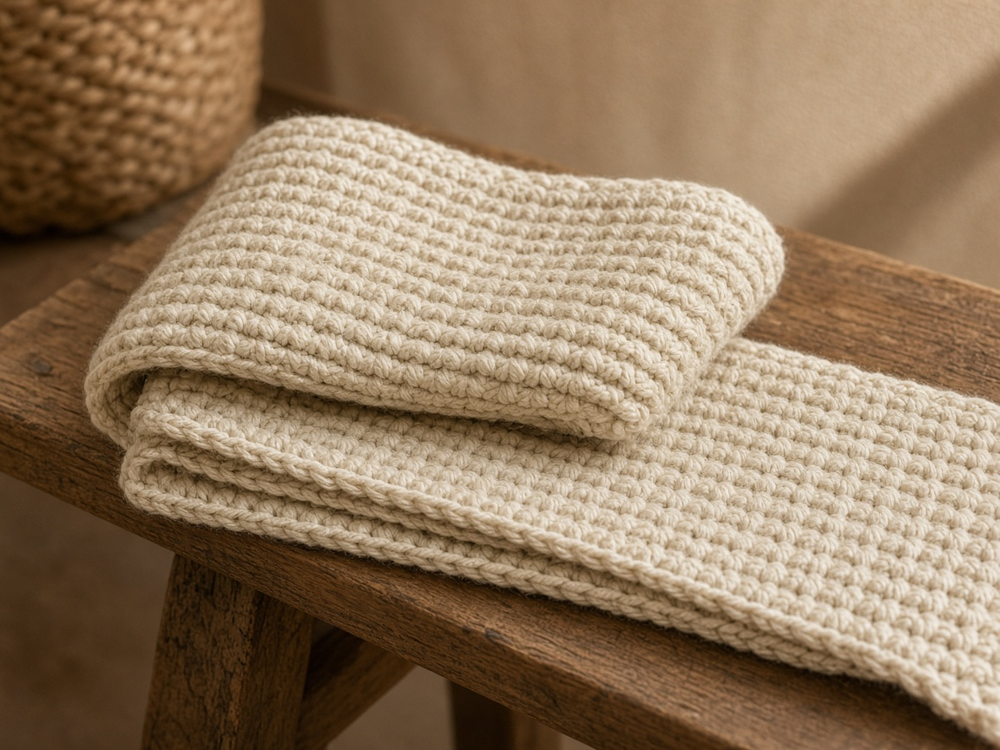

A first scarf should be a rectangle. One stitch, the same count every row, and a width you can check with a tape measure. A [hooded scarf](/how-to-crochet-a-hooded-scarf/) is a later project. This one is the plain version.

Row counts below come from a planning gauge, not from a finished scarf. The photo is an illustration. Work a short swatch, measure it, and then decide how many rows you need.

## What you need

- Worsted-weight yarn, acrylic or a washable wool blend. [Yarn weights](/yarn-weight-chart/).
- US H/8 (5.0 mm) hook, or the hook on the yarn band. [Hook chart](/crochet-hook-size-conversion-chart/).
- Yarn needle and a tape measure.

Yardage depends on how long you make it. Do not buy a single small skein and assume it is enough. Weigh the yarn before you start, work until the scarf is the length you want, and weigh what is left.

US terms. US half double crochet is not the UK half treble under the same name. If a UK pattern says hdc, stop and translate. [Abbreviations](/crochet-abbreviations-chart/). The stitch itself is in [basic stitches](/basic-crochet-stitches/).

## Finished size

A useful beginner scarf is about 7 to 8 in wide and 60 to 70 in long. The pattern below aims at the narrow end of that, so a first project finishes before you hate it.

## Gauge (planning numbers, not a measured swatch)

About 3 hdc and 2.5 rows to 1 in in worsted with a US H hook. If your swatch is tighter, the scarf will be narrower and you will need more rows for the same length. [How to measure gauge](/crochet-gauge/).

## Abbreviations

ch, hdc, st. The turning chain does **not** count as a stitch. That choice keeps the edge from gaining a stitch every row. [Turning chain](/crochet-turning-chain/).

## Scarf

**Row 1.** Ch 26. Hdc in the 3rd ch from the hook and in each ch across. (24 hdc)

**Row 2.** Ch 2, turn. Hdc in the first stitch (the one at the base of the chain) and in each hdc across. (24)

Repeat row 2 until the scarf is as long as you want. At the planning gauge, 60 in is about 150 rows. Count a 4 in sample of your own rows and multiply. Do not treat 150 as a required number.

Fasten off. Weave the ends along the edge for an inch so a tug does not pop them out. [Weaving ends](/weaving-in-ends-and-blocking/).

## Check the width

After row 2, count 24 stitches. If you have 25, you worked into the turning chain. If you have 23, you skipped the first stitch. Fix it now. A scarf that gains one stitch a row becomes a triangle by the end.

## Customizing

**Wider.** Add stitches in multiples of 1. Chain 32 for 30 hdc if you want closer to 10 in at the planning gauge.

**Stripes.** Change color at the end of a row, on the last yarn-over of the last hdc. [Changing color](/changing-yarn-color-crochet/).

**Warmer and shorter.** Stop near 50 in and wear it doubled. The [ear warmer](/how-to-crochet-an-ear-warmer/) and [fingerless gloves](/how-to-crochet-fingerless-gloves/) use the same yarn if you have some left.

## Mistakes

**The edges slant.** You are counting the turning chain as a stitch on some rows and not others. Pick one rule. This pattern says the chain does not count, and the first hdc goes into the first real stitch.

**The fabric is stiff.** The hook is too small, or the yarn is cotton. A scarf wants drape. Go up a hook size.

**The ends look chewed.** Weave in along the side, not straight out the short end.

## Frequently asked

### Is half double crochet harder than single crochet?

It is one extra yarn-over. The fabric grows faster, which is why it is a better scarf stitch than single crochet for a first long project.

### Do I need to block a scarf?

Only if the edges curl. Wet-block or steam according to the yarn band. Acrylic can be killed by a hot iron.
