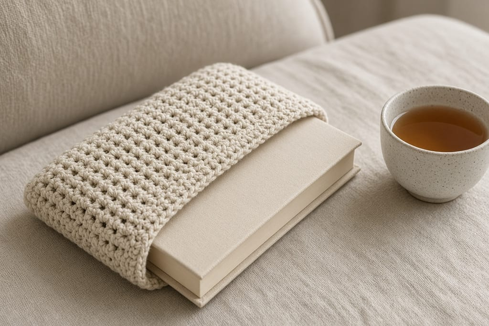
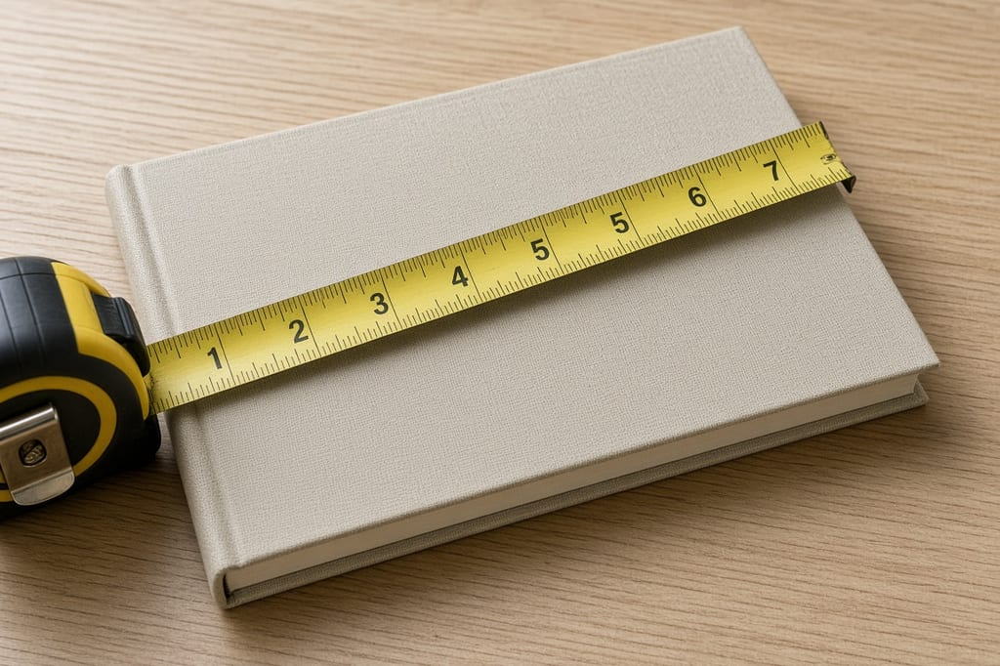
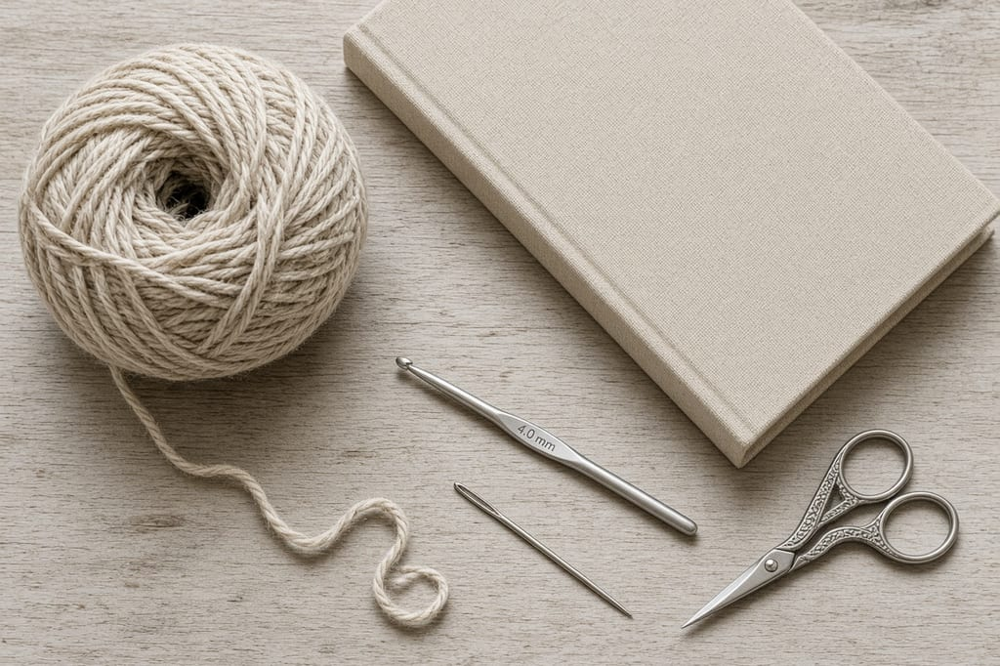
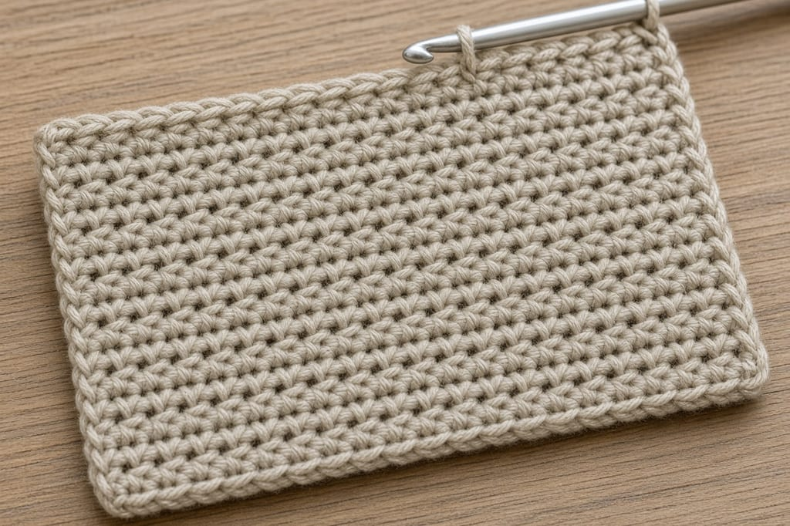
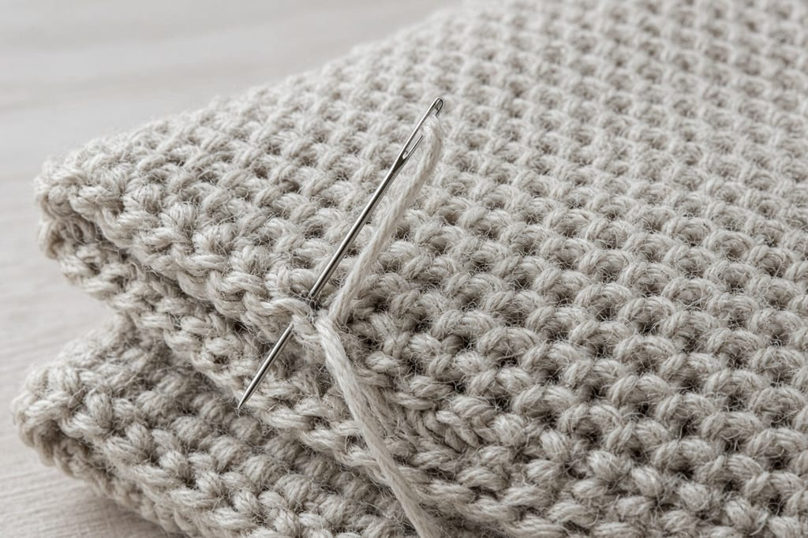
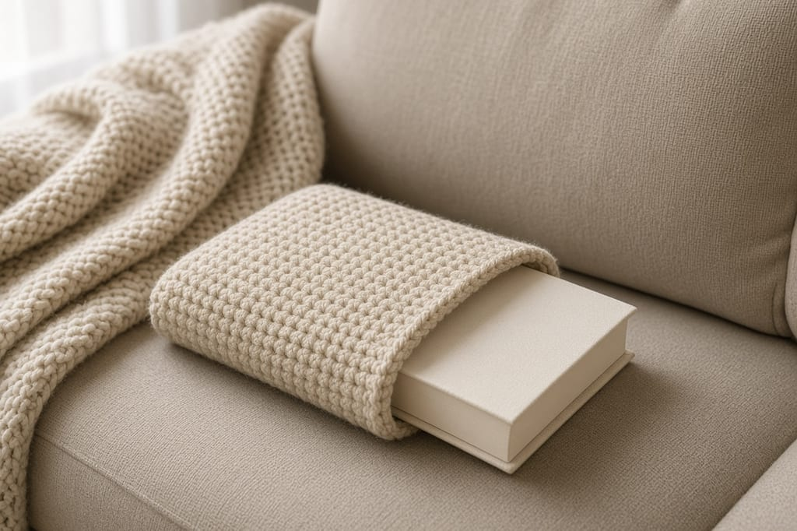

A book in a tote picks up crumbs and bent corners. A crochet sleeve keeps the cover cleaner. It will not stop a water bottle leak, and it will not save a paperback from being sat on. Single crochet has gaps. Treat it as a soft cover, not armor.

Measure the book you actually own. The numbers in the pattern are one worked example: a book about **5 inches wide and 8 inches tall**. If yours is different, change the stitch count before you seam it. US terms. US single crochet is UK double crochet. [Abbreviations](/crochet-abbreviations-chart/).

Photos are illustrations of that example size. This sleeve has not been fitted on a finished book in yarn. [Gauge](/crochet-gauge/) is the part that decides the fit.

## Measure

Closed book, cover to cover.

- Width, in inches.
- Height, in inches.
- Thickness, if it is a chunky hardcover. A sleeve with no ease will not take the spine.

Add about **1/2 inch** to the width for ease. Plan the sleeve height at about **3/4 of the book height**, so you can still pull the book out. For the example book, width to cover is 5.5 inches and sleeve height is about 6 inches. The rectangle you crochet is twice that height, because you fold it.

## Materials

- Worsted cotton, oatmeal. About **120 yards** for the 5 by 8 inch example. A larger book needs more. [Yarn weights](/yarn-weight-chart/).
- US G/6 (4.0 mm) hook, or whatever hits gauge. [Hook chart](/crochet-hook-size-conversion-chart/).
- Yarn needle, scissors.

Beginner, and longer than a coin pouch. A few hours for the example.

## Gauge (estimate)

**4 sc = 1 inch. 5 rows = 1 inch.**

At that gauge, **22 stitches** are about **5.5 inches**. **60 rows** are about **12 inches**, which folds into a sleeve about **6 inches** tall.

If your gauge swatch is not 4 sc to the inch, do not follow the 22-stitch count and hope. Divide the width you need by your own stitches-per-inch, and round to a whole number.

## Rectangle

Ch 1 does not count as a stitch.

Chain 23.

**Row 1:** sc in the 2nd chain from the hook and across. Ch 1, turn. (22)

**Rows 2–60:** sc in each stitch. Ch 1, turn. (22)

Count every 10 rows. A sleeve that gains a stitch on one side will not fold straight.

## Seam

Fold so Row 1 meets Row 60. The fold is the bottom. Sew both side edges through both layers. Leave the top open.

Slide the book in. It should enter without folding the cover and stop with some of the book still visible. If it will not enter, the sleeve is narrow. Add stitches on the next one. Do not seam a too-small rectangle and then stretch it over the book. Cotton single crochet will not give you an extra inch.

## Closure

This example has no flap. A book you pull out often does not need one. If the book slides in a loose tote, sew a button on the back and crochet a short chain loop on the front edge. Place the button only after the book is inside, so the loop actually reaches. A tie of chain-30 on each side of the opening is the other option. Skip both if the fit is already snug.

## Paperbacks and hardcovers

A paperback near 5 by 8 inches is the example. A hardcover of the same cover size is thicker, so add the spine thickness to the width before you pick the stitch count. Height can stay at three quarters of the cover. The extra bulk is sideways.

Library books and borrowed copies should not live in a damp sleeve, and they should not be forced into a tight one. If the book is not yours, a snug fit that rubs the dust jacket is a bad trade for a tidy bag.

A stack of two thin books in one sleeve looks efficient and then the front book bows the seam. One book. If you carry two, make two sleeves or leave the second book in the bag.

Cotton single crochet is denser than an open mesh, which is why this page does not use the granny stitch from the [lace bandana](/how-to-crochet-a-lace-bandana/). Density still is not a rain shell. A pen in the same pocket can print a line through the stitches onto a pale cover. Put the sleeve in a pocket that does not also hold pens.

## A different book

Write your own counts:

1. Width in inches, plus 1/2 inch, times your stitches per inch. That is the stitch count.
2. Three-quarters of the height, times 2, times your rows per inch. That is the row count.
3. Chain one more than the stitch count, then work that many rows.

A very thick hardcover needs extra width for the spine, not extra height. Add the thickness into the width number before you multiply.

## Mistakes

**Seaming the top.** The book cannot go in.

**A lacy stitch for a white cover.** Gaps let every pen in the bag leave a mark. Single crochet is the dense option, and it is still not waterproof.

**Ignoring gauge.** This is one of the projects where gauge is the pattern. The [gauge article](/crochet-gauge/) is the setup, not optional reading.

## Care

Remove the book. Hand wash cool. Dry flat. Put the book back only when the sleeve is dry. Damp cotton against a paper cover cockles the paper.

## Frequently asked

**Will it fit every paperback?**

No. The 22 by 60 rectangle is for a book near 5 by 8 inches at the gauge above. Measure yours.

**Can I sell sleeves?**

Finished sleeves, yes. Do not republish the rows as your pattern.

**Is it safe in a rainy commute?**

No. If rain is the risk, use a bag that is actually water resistant and keep this sleeve for dry days.

## Next

A smaller flat pocket, sized to a card instead of a book, is the [Christmas gift card holder](/how-to-crochet-a-christmas-gift-card-holder/). A phone needs its own measurements: [phone case](/how-to-crochet-a-phone-case/).
