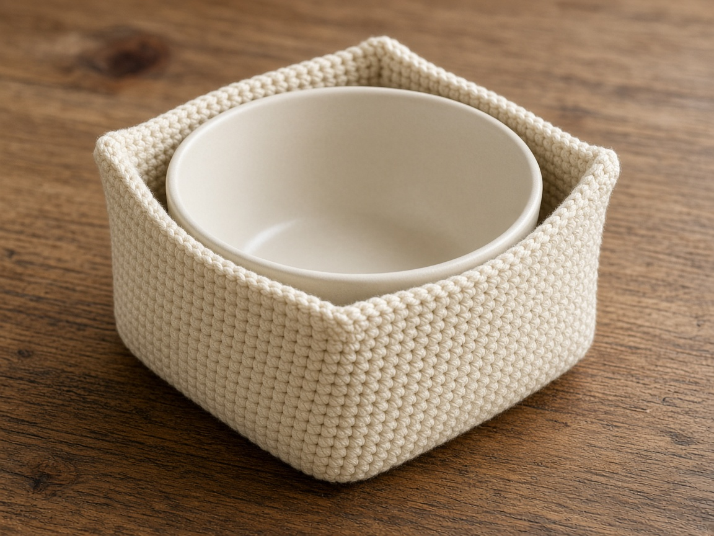
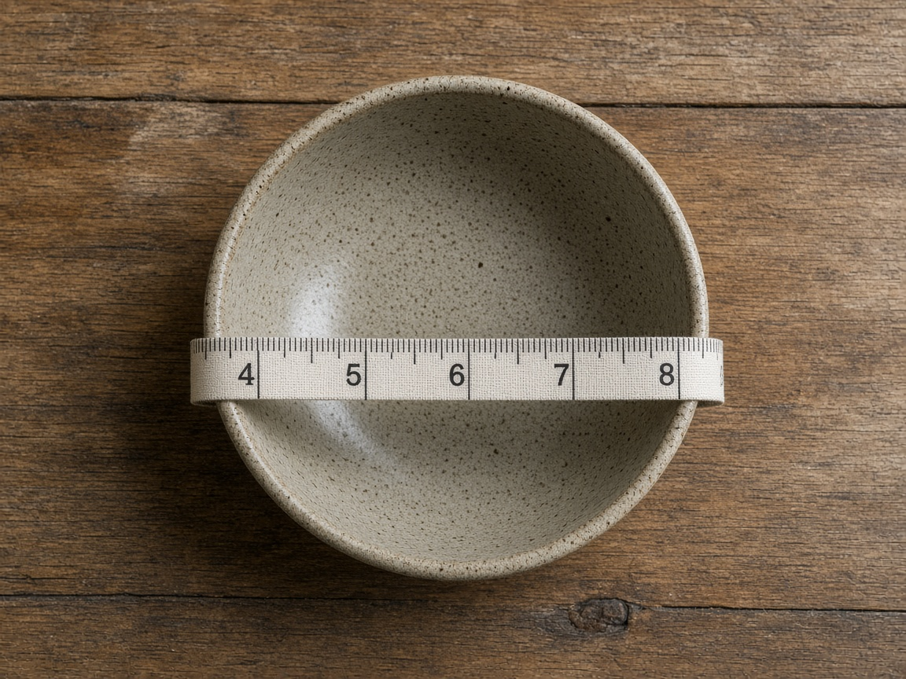
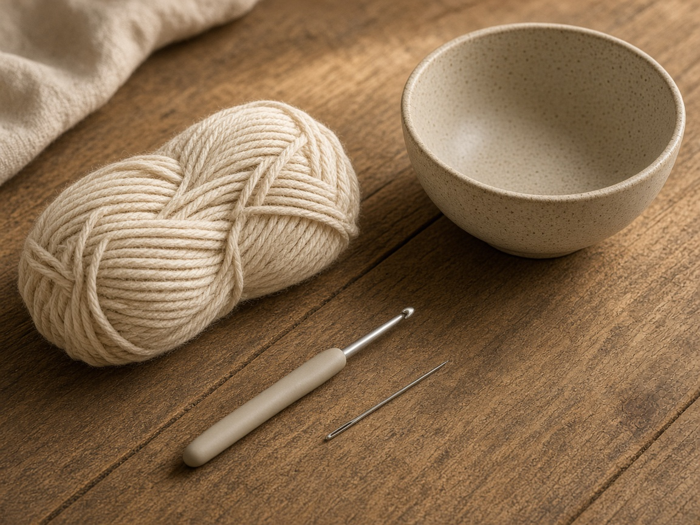
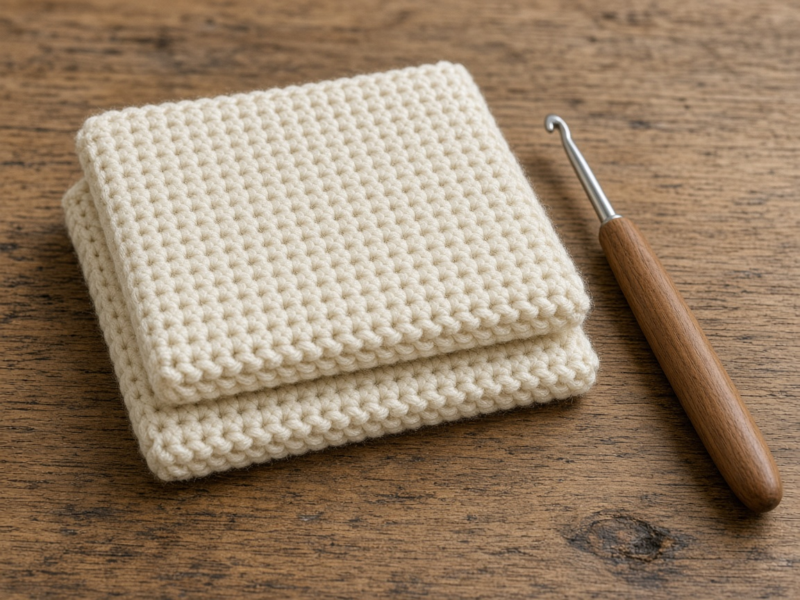
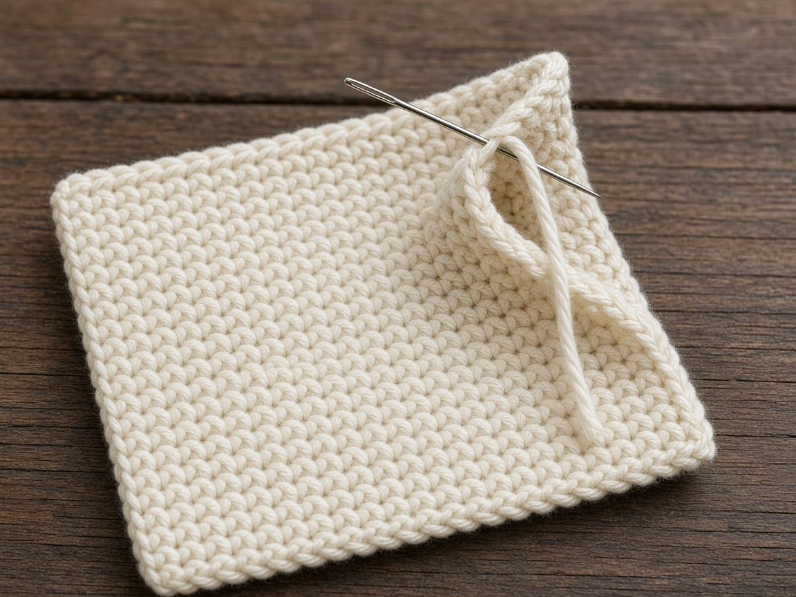
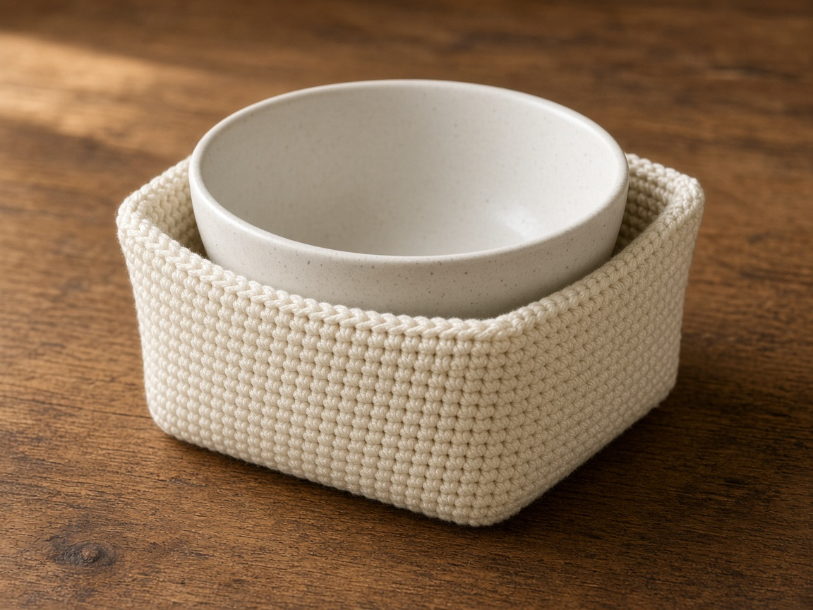

A hot bowl on a bare table walks, and picking it up with a dish towel means the towel is also in the sink a minute later. A bowl cozy is a cotton square, made in two layers, with the corners pinched so the square can sit up around the bowl. The size comes from the bowl you measured. The heat behavior of this object is unknown.

US terms. US single crochet is UK double crochet. [Abbreviations](/crochet-abbreviations-chart/). The photos are illustrations. This cozy has not been yarn-tested, and it has not been heat-tested. The inches and the yardage are estimates from the gauge below. Measure your bowl. Do not treat the example as a fit for every soup bowl in the cupboard.

Cotton only. Acrylic can melt. Do not use metal thread, metallic yarn, wire, sequins, or metal buttons. This pattern does not promise microwave safety. It has not been heat-tested. Read the microwave manual. If you choose to reheat, use a short time, stay there, and stop if the cotton smells hot.

## Measure the bowl

Outside of the bowl, in inches:

- Diameter across the rim.
- Height from the table to the rim.

A starting square has a side about equal to the diameter plus twice the height. The middle of the square covers the bottom. Each side of that middle needs enough fabric to come up the wall. The corners will bunch, and you will pinch that extra into a short seam.

Example: a bowl **6 inches across and 3 inches tall**. The side of the square is 6 + 3 + 3 = **12 inches**. At the gauge below, that is **48 stitches and 60 rows**, and you make two of them. Twelve inches is arithmetic from that bowl and that gauge. It is not a fitted cozy, and it is not a heat test. If your bowl is wider or taller, use your own numbers.

## Materials

- Worsted **cotton** only. About **300 yards** for two example squares and the joining round. That is a shopping estimate from the stitch count, not a weighed cozy. A larger bowl needs more. [Yarn weights](/yarn-weight-chart/).
- US G/6 (4.0 mm) hook, or the hook that hits gauge. [Hook chart](/crochet-hook-size-conversion-chart/).
- Yarn needle, scissors. Stitch markers, if you use them, must come out before any reheating you choose to do. A metal marker left in the fabric is metal.

Read the yarn label. If it is acrylic, a blend, metallic, or not clearly cotton, do not use it here. Acrylic can melt. Metallic thread can heat in a microwave. Wool can scorch. No buttons, beads, wire, sequins, or metal markers left in the fabric.

The fabric is solid single crochet. Some older drawings of this cozy showed open holes. Those holes are not in the instructions. Follow the rows.

## Gauge (estimate)

**4 sc = 1 inch. 5 rows = 1 inch.**

Swatch and measure. [Gauge](/crochet-gauge/) decides whether the square reaches around the bowl. These numbers were not taken from a finished cozy. If your gauge is off, redo the side length with your stitches per inch.

Ch 1 does not count as a stitch.

## Two squares

Make 2. They should match. If the second square comes out wider, you changed tension or you gained a stitch. Rip it back and match the first. A lopsided double layer gathers into a cozy that tips.

Chain 49.

**Row 1:** Sc in the 2nd chain from the hook and across. Ch 1, turn. (48)

**Rows 2–60:** Sc in each stitch. Ch 1, turn. (48)

Count every 10 rows. Measure the square. If your bowl math is different, stop at your own row count.

Hold the squares together. Join yarn at a corner. Single crochet through both layers all the way around, with 3 sc in each corner. One sc in each stitch along the tops and bottoms, and about one sc in each row end along the sides. If the side ripples, you used too many stitches in the row ends. If it pulls in, you used too few.

Do not skip the second square. One layer gathers and flops. Fasten off, weave the ends, and check that no metal needle or marker is still in the cotton.

## Pinch the corners

Put the bowl in the center of the flat square. You want four walls and a flat enough bottom that the bowl does not rock.

At each corner, pinch the two edges together so they lie on top of each other, starting at the corner and running toward the middle of each side. For the example bowl, sew that pinch for about **2 inches**. Two inches is a starting estimate from a 3 inch wall, not a measured cozy. A taller bowl needs a longer pinch. A wide, shallow bowl needs a shorter one.

Sew through both layers of both edges. Four pinches. Sew two opposite corners, set the bowl in, and adjust the last two so the rim sits inside the walls. If the bowl will not sit down, the pinches are too long. Take one out. If the pinches steal the flat bottom, shorten them.

The bottom should stay wide enough for the bowl's base.

## Heat

This cozy has not been heat-tested. Nothing here promises that it is microwave-safe. Cotton can scorch. A short reheating that smells fine once is not a test of the next one.

Follow the microwave manual. If the manual does not allow a textile around a bowl, stop. The bowl itself has to be one the manual already allows. A cotton cover does not make a random bowl safe to microwave.

If you choose to reheat, use a short time and stay there. Stop if the cotton smells hot, looks browned, or feels dry and stiff. Do not run a long cycle and leave the room. Do not put an empty cozy in an empty microwave.

Take every metal thing out first: metal thread, a stitch marker, a needle left in an end, and any bowl the manual does not allow. This is also not an oven mitt. Do not pull a pan from the oven with it. A bowl that is too hot to hold belongs on a trivet you already trust. Setting the cozy under a warm bowl on the table is still not a heat test.

## A different bowl

1. Diameter plus twice the height, in inches. That is the side of the square.
2. Multiply by your stitches per inch for the stitch count, and by your rows per inch for the row count.
3. Make two squares. Join them. Then pinch, with the bowl sitting in the square, until the walls clear the rim and the base still sits flat.

The 12 inch example is step 1 for a bowl 6 inches across and 3 inches tall. Your bowl replaces those numbers.

## Mistakes

**Acrylic, or a blend, or metallic thread.** Acrylic can melt. Metal does not belong in this project. If the skein is not cotton, choose a different project.

**One layer.** It gathers, and it flops. Make two squares and join them.

**Pinching before you measure.** You can sew a cozy that fits the example and not your bowl. The bowl goes on the square first.

**A metal marker left in the corner.** Find it before any reheating you choose to do.

**Treating thickness as a test.** This cozy has not been heat-tested. If you choose to reheat, follow the manual, keep it short, stay there, and stop if the cotton smells hot.

## Care

Wash off food. Hand wash cool. Dry flat, fully, before it is used again. Do not iron it. Do not store it wet. The heat warning still stands after washing.

## Frequently asked

**Can I microwave it?**

This page cannot tell you yes. It has not been heat-tested, and it does not promise microwave safety. Read the manual. Cotton only, no metal. If you choose to reheat, keep the time short, stay there, and stop if the cotton smells hot.

**Why not acrylic if that is the yarn I have?**

Acrylic can melt. Use it for a different project. This one is cotton.

**Will the 12 inch square fit my bowl?**

Only if your bowl is about 6 inches across and 3 inches tall and your gauge matches. Measure the bowl and redo the side length.

## Next

A cotton wrap for a cup you have measured is the [tumbler sleeve](/how-to-crochet-a-tumbler-sleeve/). Fiber names are in the [yarn weight chart](/yarn-weight-chart/).
