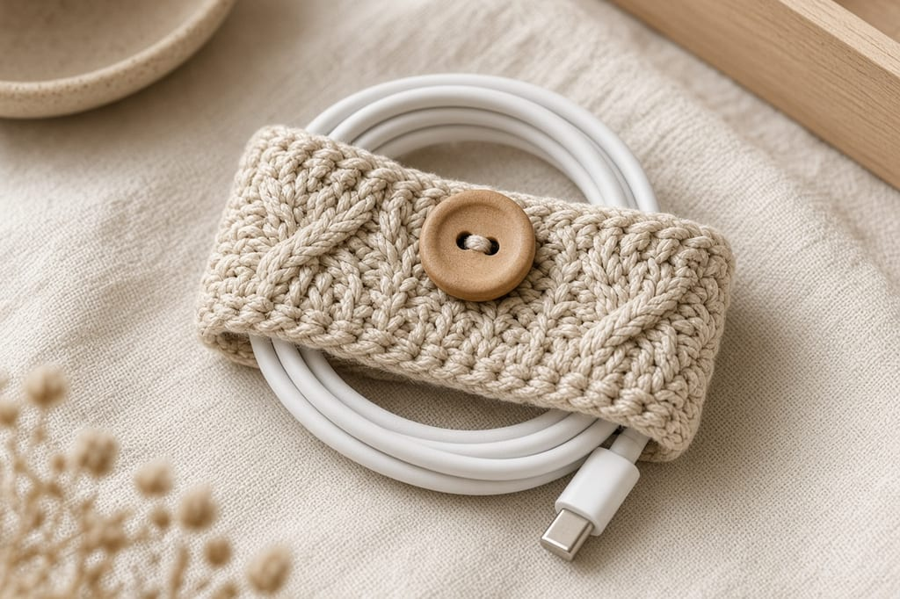
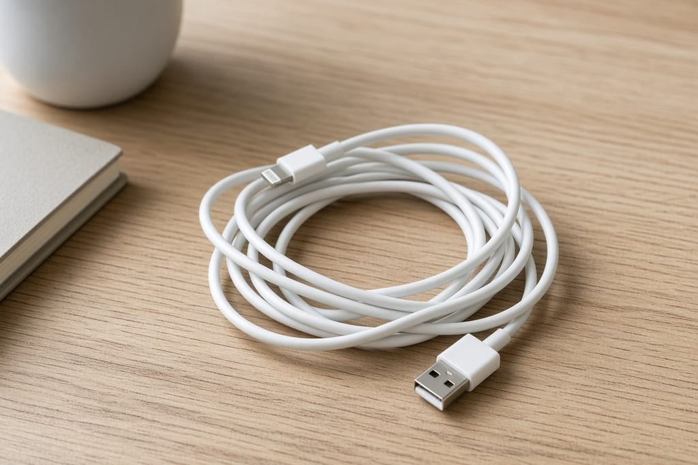
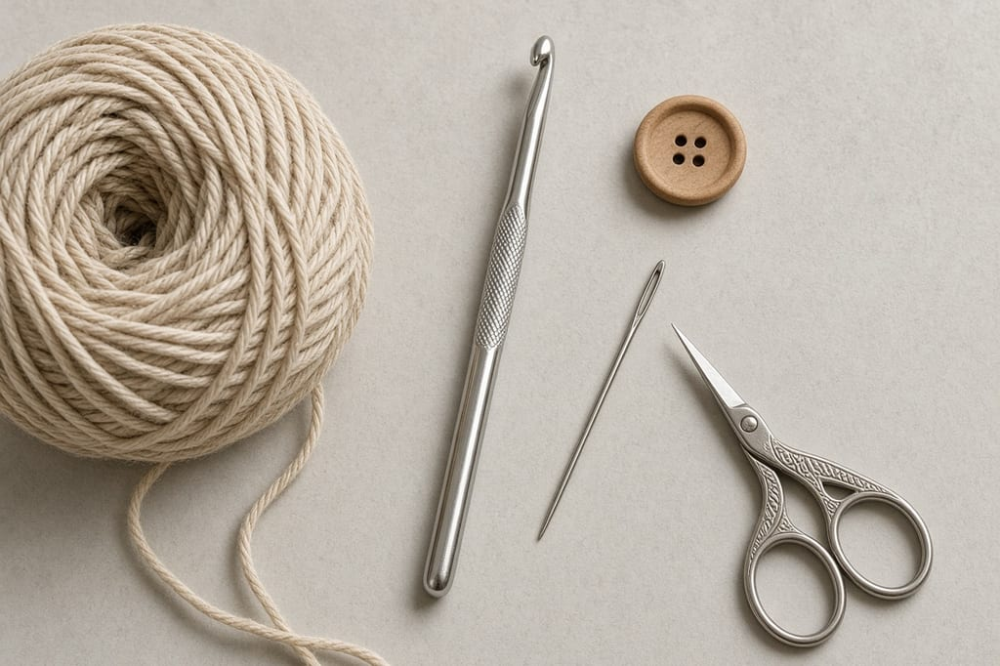
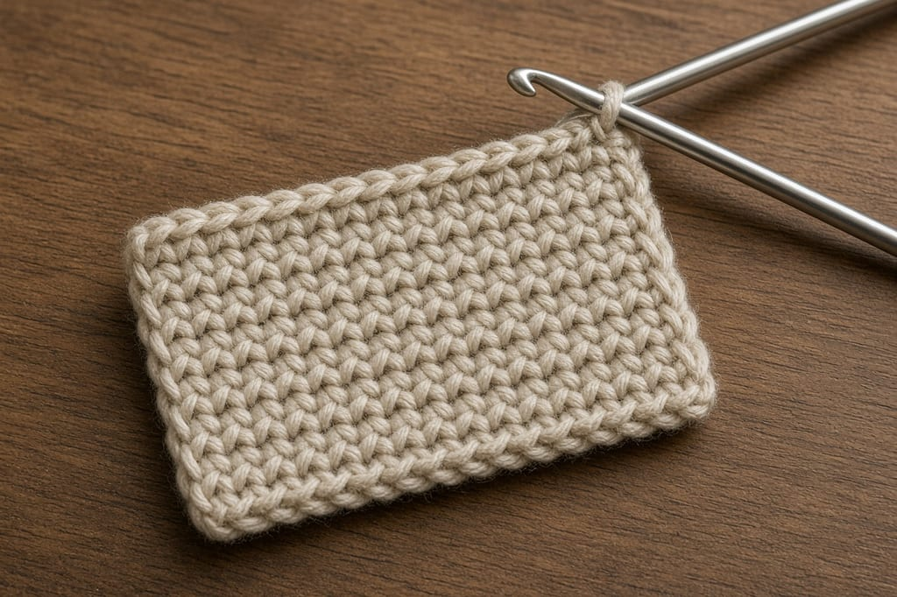
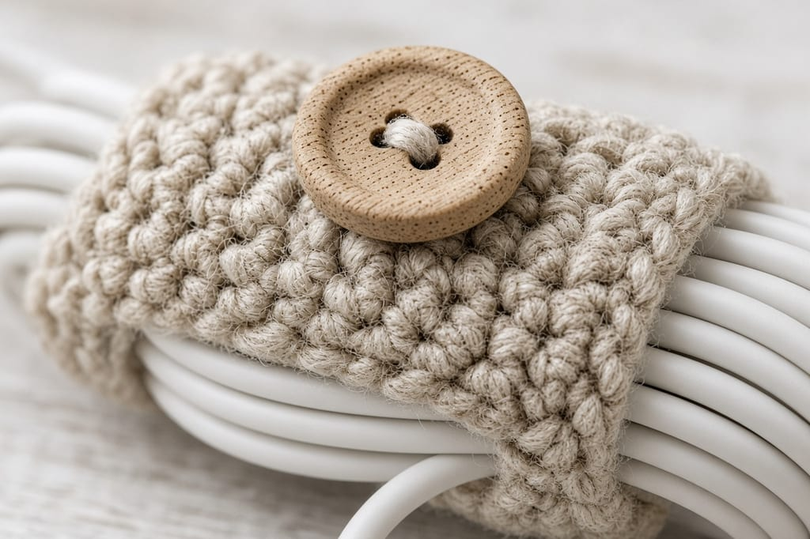
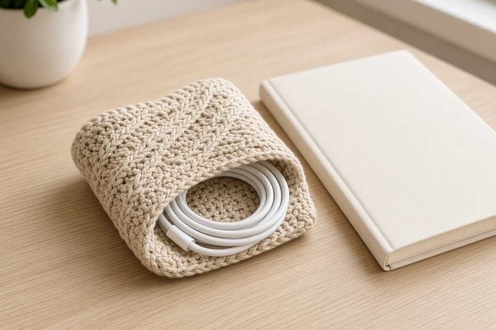

A charging cable in a bag becomes a knot because nothing holds the coil. A short crochet strap fixes that. It does not protect the cable from a crush, and it does not replace a case for the brick.

Coil the cable first. The strap only keeps a coil you already made.

US terms. US single crochet is UK double crochet. [Abbreviations](/crochet-abbreviations-chart/). Photos are illustrations. The strap has not been wrapped around a measured cable in yarn. Inches assume the gauge.

## Before you start

Lay the cable in a loop about the width of your palm. Note how fat the coil is. A thin phone cable needs a shorter strap than a thick laptop brick cable. The pattern below is for a palm-sized coil of a thin cable. Add rows if your coil is fatter. Do not guess from the photo.

## Materials

- Worsted cotton, oatmeal, about **20 yards**. [Yarn weights](/yarn-weight-chart/).
- US G/6 (4.0 mm) hook. [Hook chart](/crochet-hook-size-conversion-chart/).
- A button about 1/2 inch wide.
- Yarn needle, scissors.

Beginner. Under an hour. If you want a pouch for the earbud case instead of a wrap for the cord, use the [earbud pouch](/how-to-crochet-an-earbud-pouch/).

## Gauge (estimate)

**4 sc = 1 inch. 5 rows = 1 inch.**

8 stitches are about **2 inches** wide. 36 rows are about **7 inches** long. That is enough to go around a small coil and overlap for the button. It is short on purpose. A long strap is just more yarn to undo every time you need the cable.

## Strap

Ch 1 does not count as a stitch.

Chain 9.

**Row 1:** sc in the 2nd chain from the hook and across. Ch 1, turn. (8)

**Rows 2–35:** sc in each stitch. Ch 1, turn. (8)

**Row 36:** sc in the next 3 stitches, ch 3, skip 2, sc in the last 3. (6 sc and a 3-chain loop)

3 + 2 skipped + 3 = 8, so the end stays the same width. The loop is the buttonhole. If your button is wider than about 1/2 inch, chain 4 and skip 2, or chain 4 and skip 3 and place the last sc in the final stitch only after you check that you still have a flat end.

Fasten off.

Sew the button about 4 rows up from Row 1, centered. Wrap the strap around the coil. The button should meet the loop without a gap and without bending the cable. If it does not meet, add rows before Row 36. If the overlap is huge, stop a few rows earlier and then work the buttonhole row.

## Use

Keep one cable per strap. Two cables in one wrap trade a tangle in the bag for a tangle inside the strap. Leave the connectors outside the wrap so you can see which cable it is.

## Which cable

Label the strap if you own more than one. A short tail of colored yarn through the button-end is enough. Do not write on the cotton with a pen. It bleeds.

A cable that stays plugged into a brick can still be coiled. Wrap the strap around the cable only, and leave the brick outside. Covering the brick makes a lump that will not button, and the pattern is not a brick cozy.

Earbud cords that are not in a case can use the same strap if you coil them first. The [earbud pouch](/how-to-crochet-an-earbud-pouch/) is for the case. This page is for the cord. Using one for the other leaves either the case loose or the cord in a tube it cannot charge from.

Coil in the same direction every time, the way the cable already wants to sit. Forcing a reverse coil and then buttoning it trains a kink. The strap will hold a bad coil just as well as a good one. If the button gapes, add rows. If the fabric buckles, you have too much overlap. Do not sew the strap to the cable to fix either problem.

Coil in the same direction every time, the way the cable already wants to sit. Forcing a reverse coil and then buttoning it trains a kink. The strap will hold a bad coil just as well as a good one.

## Other closures

A second button is useful only if the cable is so thick that one overlap is not enough. A tie of chain-40 works if you hate sewing. Weave nothing through the cable itself.

## Mistakes

**A strap narrower than 8 stitches in this yarn.** It rolls into a cord and will not lie on the coil. If you want narrower, use a smaller yarn and more stitches, and ignore the 2-inch estimate.

**Buttonhole in the middle of the strap.** The overlap fails. The hole belongs on the last row.

**Stretching the strap to fit.** Single crochet cotton does not stretch much. Add rows.

## Care

Take the cable out. Hand wash cool. Dry flat. Button it only when dry. A damp strap against a cable jacket is a bad habit, not a feature.

## Frequently asked

**Will this fit a laptop charger?**

Often no. Those coils are thicker. Add rows until the button meets, and keep the width at 8 unless the cable is so wide that 2 inches looks silly. Then work 12 stitches and a larger buttonhole: sc 5, ch 3, skip 2, sc 5.

**Can I sell them?**

Finished straps, yes. Do not republish the rows.

**Does it stop the cable twisting inside the coil?**

No. You still coil it by hand. The strap holds that coil.

## Next

A sleeve for a phone, which is a different measurement problem, is [how to crochet a phone case](/how-to-crochet-a-phone-case/).
