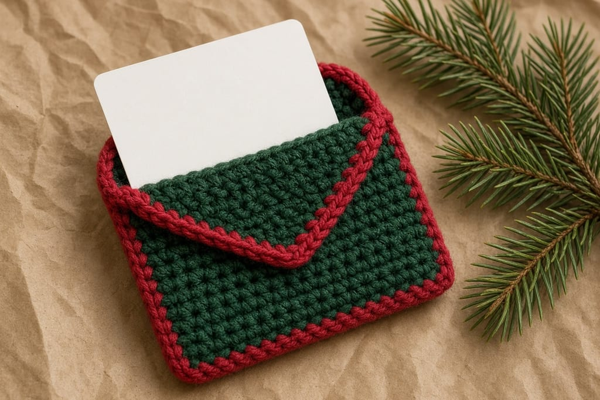
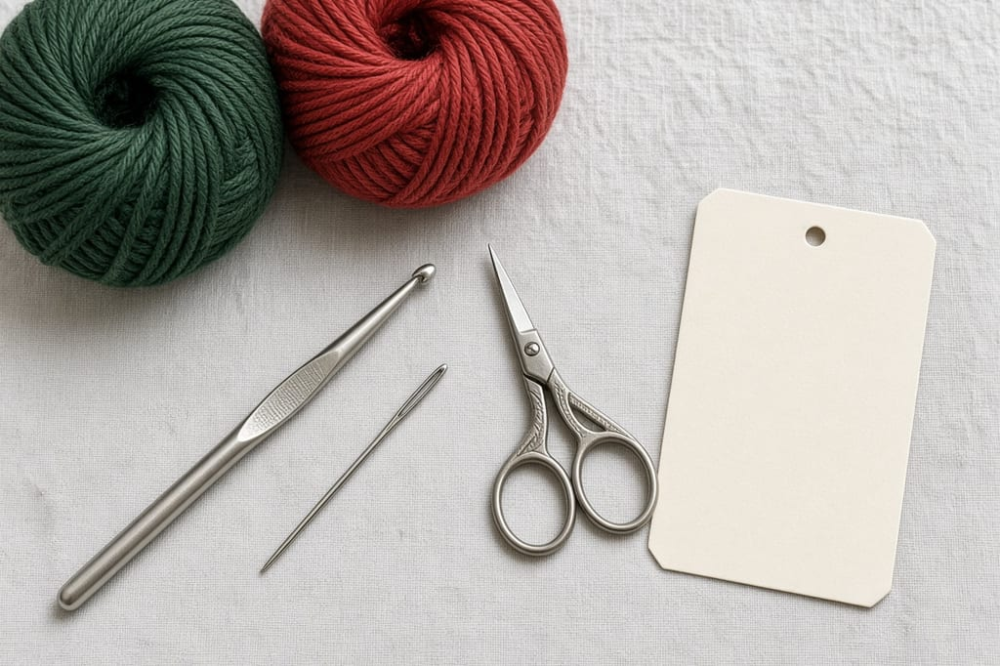
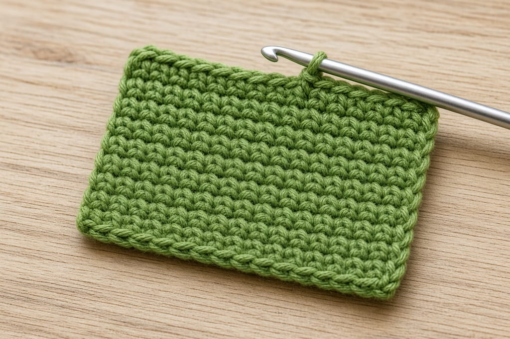
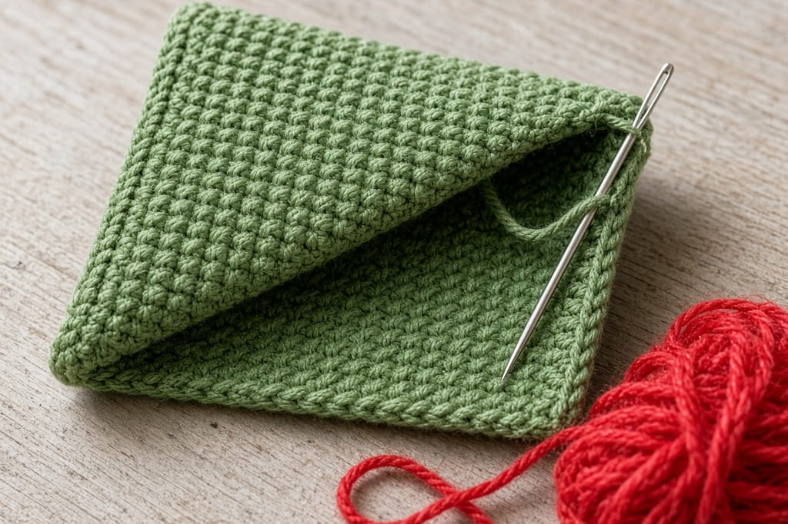
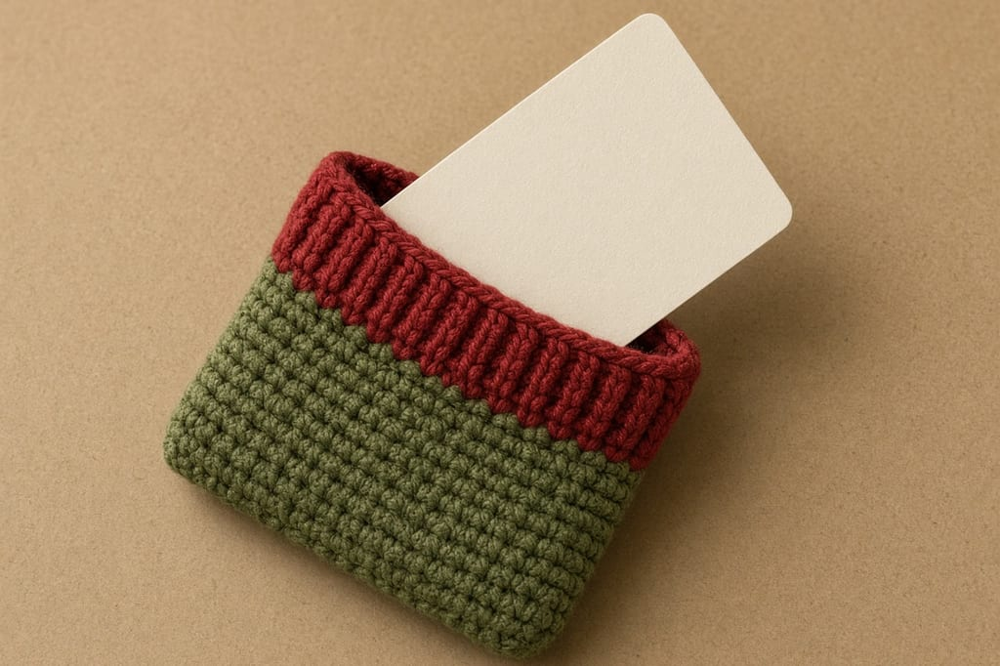
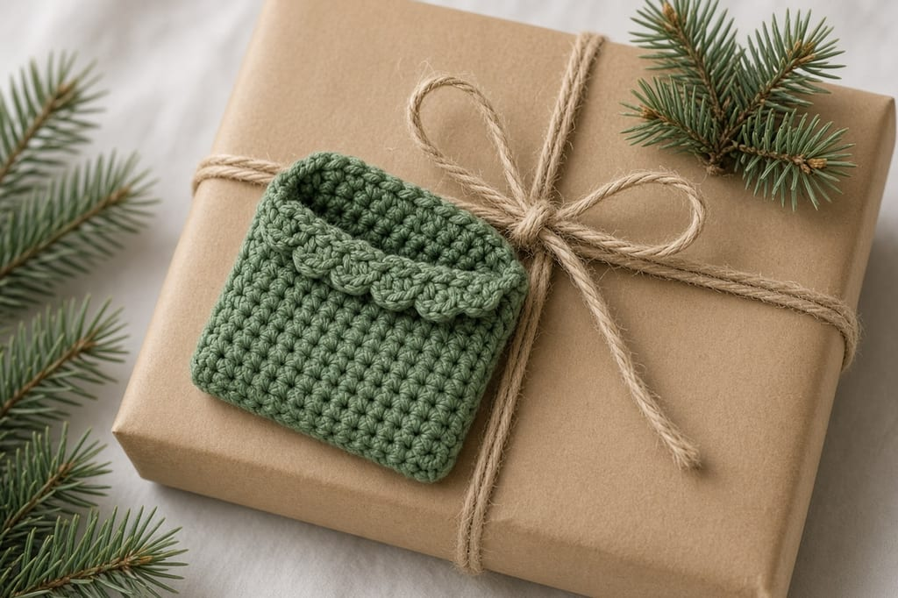

A gift card in a plain envelope looks like an afterthought. A small crochet pocket gives it a front, and it still has to fit the card you can actually buy.

A standard US gift card follows the ID-1 size used for bank cards: **85.60 × 53.98 mm**, which is **3.37 × 2.13 inches**. This pocket is planned a little larger than that so the card slides. It is not a wallet, and it will not hold a stack of cards.

US terms. US single crochet is UK double crochet. [Abbreviations](/crochet-abbreviations-chart).

Photos are illustrations. The pocket has not been measured against a real card in yarn. The inches below assume the gauge. If your gauge is off, the card tells you, not the photo.

## Materials

- Worsted cotton, green, about **30 yards**. Red, about **8 yards**. [Yarn weights](/yarn-weight-chart).
- US G/6 (4.0 mm) hook. [Hook chart](/crochet-hook-size-conversion-chart).
- Yarn needle, scissors.
- One gift card, or a piece of card cut to 3.37 × 2.13 inches.

Beginner. About an hour. A Halloween version with a different construction is the [card wallet](/halloween-crochet-card-wallet). Use this page if you want a Christmas pocket.

## Gauge (estimate)

**4 sc = 1 inch. 5 rows = 1 inch.**

16 stitches are about **4 inches** wide. A 3.37-inch card has a little side room. 12 rows are about **2.4 inches** tall, just over the 2.13-inch card height. That room is on purpose. A pocket the same size as the card will not take the card.

## Rectangle

Ch 1 at the end of a row does not count as a stitch.

Chain 17.

**Row 1:** sc in the 2nd chain from the hook and in each chain across. Ch 1, turn. (16)

**Rows 2–24:** sc in each stitch. Ch 1, turn. (16)

The width never changes. If a row comes out to 15 or 17, pull it out. A drifting edge makes a pocket that bows.

## Fold and seam

Fold the rectangle in half so Row 1 meets Row 24. The fold is the bottom. Each side is 12 rows.

Sew the two side edges through both layers. Leave the top open. Do not sew across the fold. The fold is already closed.

With red, work one row of single crochet along the front lip only, the edge that was Row 1. Fasten off. This stripe is decoration. It is not a flap.

Slide the card in. It should go in without folding and stop before it disappears. If the card will not enter, your stitch is tighter than 4 sc to the inch. Redo the rectangle on a larger hook, still at 16 stitches, rather than skipping seams.

## Giving it

Tuck the pocket under the ribbon of a wrapped gift, or hand it over as the gift. Yarn will not protect the magnetic stripe or a chip from a hard bend. Do not fold the holder in half with the card inside.

## Giving a set

One pocket per card. Stacking two cards in a single-crochet pocket splits the side seams. If you are giving three cards, make three rectangles. A shared ribbon can hold them. The yarn should not.

Write the amount on a separate note if the card itself should stay blank until the shop activates it. Do not embroider a dollar amount into the pocket. You will want that pocket again next year, and the amount will be wrong.

The red lip is enough decoration. A bow sewn over the opening looks festive and then blocks the card. If you want a bow, sew it on the back, below the opening, or skip it. A full bow pattern is not on this page.

A gift card that is thinner than a bank card still uses the same outline. Do not shrink the pocket for a paper card. Paper bends, and a tight 16-stitch width is what creases it. The ease in the 4-inch estimate is there so the card stays flat.

If your cotton is closer to 5 sc per inch, 16 stitches are only about 3.2 inches and the card will not enter. That is a gauge problem, not a seam problem. Move to a larger hook and keep the same 16 stitches. The [gauge article](/crochet-gauge) shows how to measure a swatch before you seam a pocket you cannot use.

## Changes

**A taller back.** Work 30 rows. Fold after 12 rows so the pocket is still 12 rows and the back continues. Seam only the pocket sides. The extra back is where you can embroider a small star. Keep the embroidery shallow.

**No red.** The green pocket still fits.

## Mistakes

**Seaming the top.** That is a closed square. Leave the edge opposite the fold open.

**Counting the turning chain.** The count is 16, not 17.

**A fuzzy yarn over the stripe.** Gift cards have a smooth face. Mohair grabs them.

## Care

Remove the card. Hand wash cool. Dry flat. Put the card back only when the pocket is dry. A damp pocket can warp a paper gift card.

## Frequently asked

**Will a credit card fit?**

The outline is the same ID-1 size. This is still a gift sleeve, not a daily wallet. One card. No coins.

**Can I sell finished holders?**

Yes. Do not republish the rows.

**What if I crochet tighter than the gauge?**

The 4-inch estimate shrinks. The card is the test. Move up a hook size and keep 16 stitches.

## Next

Yarn choices for other December projects are in [yarn for Christmas crochet](/yarn-for-christmas-crochet). A small tree you can hang is [how to crochet a Christmas tree](/how-to-crochet-a-christmas-tree).
