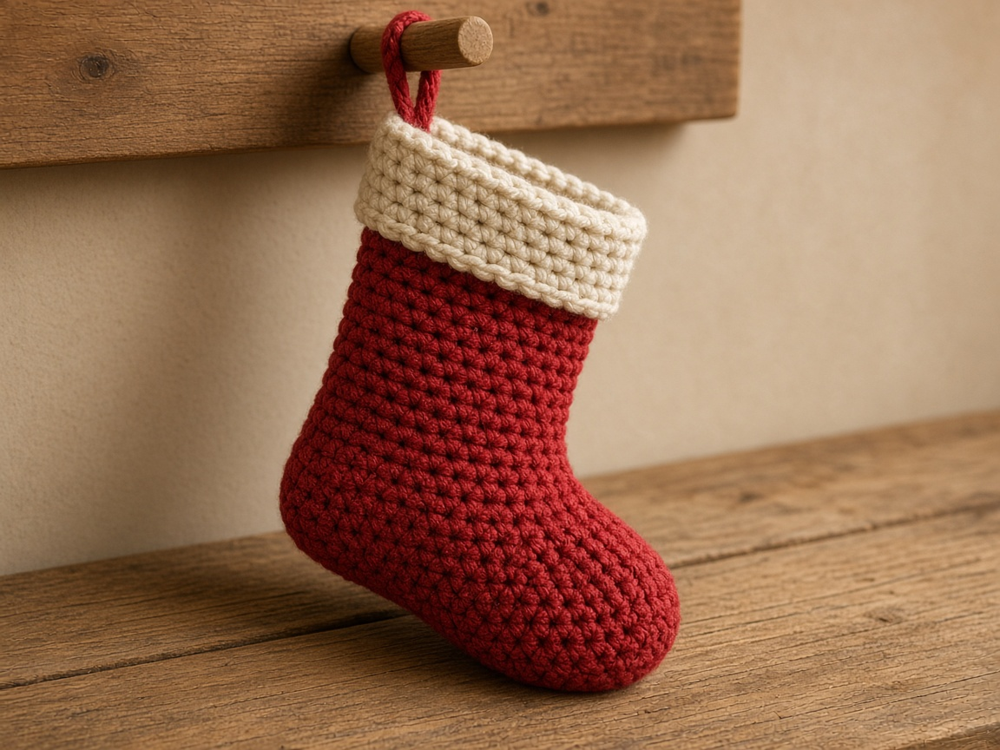
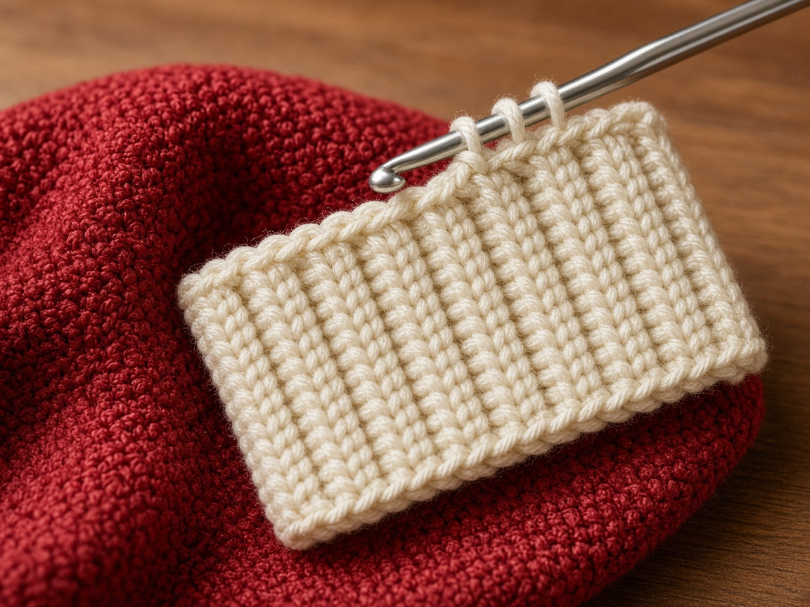
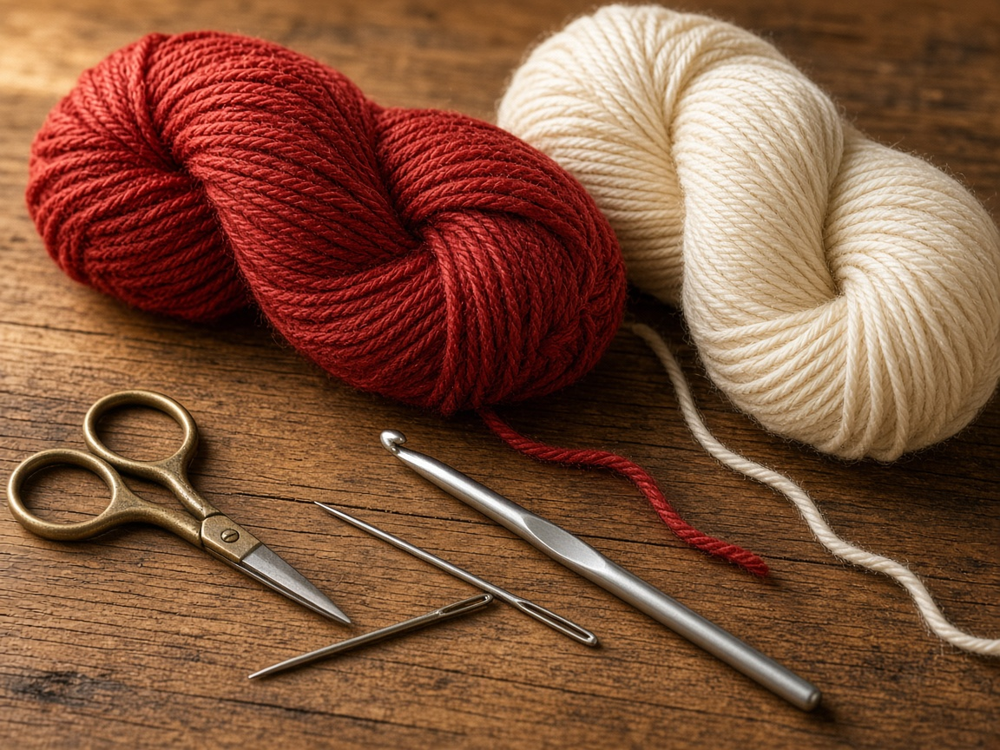
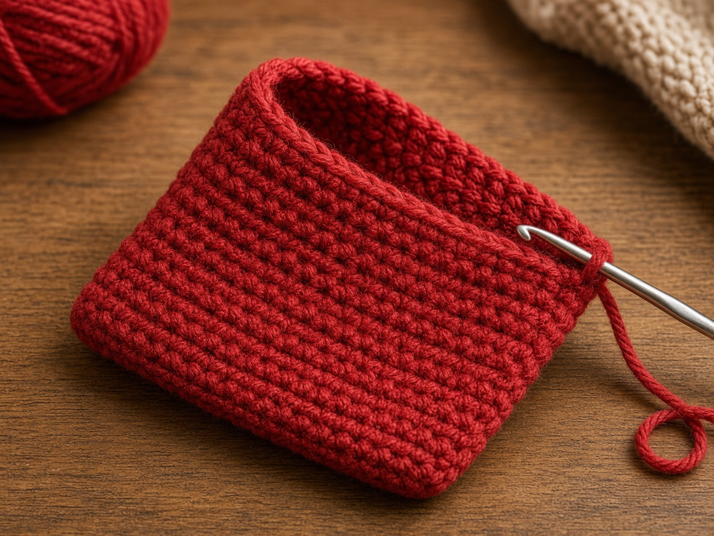
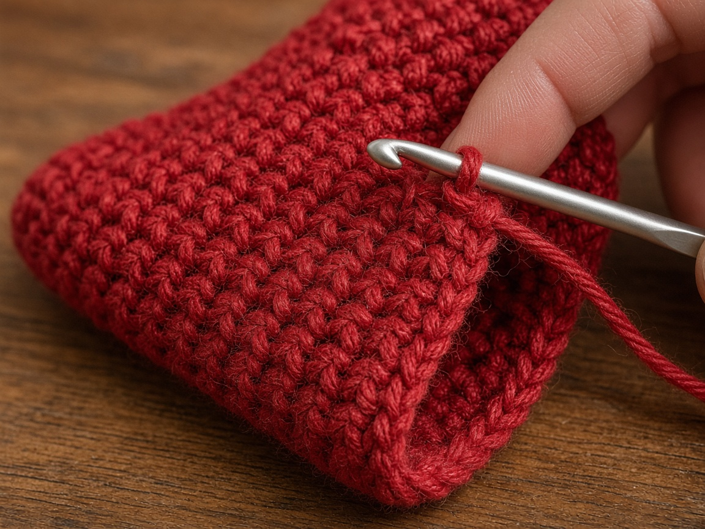
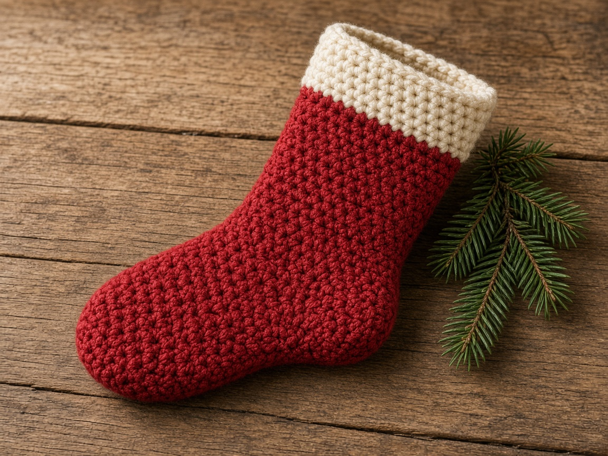

A gift bag does not hang on a mantel. A stocking does, and the heel is what makes it a stocking instead of a tube with a cuff sewn on. This page is a cuff, a leg, a short heel flap, a turned heel, a foot, and a toe, all in single crochet.

The inches are an example, estimated from a gauge that has not been swatched for this page. The stocking has not been hung or filled in yarn. The photos are illustrations. Measure the longest gift you actually plan to put inside, and add rounds if the example is short. US terms. US single crochet is UK double crochet. [Abbreviations](/crochet-abbreviations-chart/).

## Measure

At the gauge below, the example is about:

- **10 inches** around the cuff and the leg
- **3 inches** of cuff
- **about 5.6 inches** of leg under the cuff (28 rounds)
- **about 7.5 inches** of foot rounds from the gusset through the toe, before you count how the heel cup sits

Those numbers are stitch math, not a tape on a finished stocking. Measure the gift. Add leg rounds for a longer drop, and add plain foot rounds if the gift is long. This hangs. It is not a sock. For a foot, use the [slippers](/how-to-crochet-slippers/).

## Materials

- Worsted yarn. About **220 yards** of the main color and **50 yards** of a cuff color, estimated for this example. It was not weighed off a finished stocking. One color is fine: do not cut the yarn at the cuff. [Yarn weights](/yarn-weight-chart/).
- US H/8 (5.0 mm) hook, or the hook that hits gauge. [Hook chart](/crochet-hook-size-conversion-chart/).
- Yarn needle, scissors, one stitch marker.

Intermediate. The heel has to consume the unworked stitches in order. The cuff and the leg are plain single crochet.

## Gauge (estimate)

**4 sc = 1 inch. 5 rows = 1 inch.**

This is a planning number, not a swatch from this page. If you do not have 4 stitches and 5 rows to the inch, do not follow the 40-stitch leg. [Gauge](/crochet-gauge/) decides whether the gift fits. Measure the cuff. Rib is often tighter than plain single crochet. The 40 stitches match a band that is actually about 10 inches.

## Cuff

The cuff is a flat ribbed band. The rows run around the leg. The stitches are the height of the cuff.

Ch 1 does not count as a stitch.

Chain 13.

**Row 1:** Sc in the 2nd chain from the hook and across. Ch 1, turn. (12)

**Row 2:** Sc in the back loop only of each stitch. Ch 1, turn. (12)

Repeat row 2 until you have **50 rows**. At 5 rows to the inch, 50 rows is about **10 inches**. At 4 sc to the inch, 12 stitches is about **3 inches** of cuff height. Measure the band. If it is not about 10 inches along the long edge, stop and add or remove rows until it is. The rest of this pattern assumes that 10 inch band.

Fold so row 1 meets row 50. Sew the short ends. The seam is the back. The ribs should run up and down once the band is a loop.

## Leg

Join the main color on the long edge that will sit under the cuff, at the back seam. You are picking up **40 sc**, not 50. Row gauge and stitch gauge are different, so one stitch in every row end would make the leg wider than the cuff.

Space them as **4 sc across every 5 row ends**, ten times around. 4 times 10 is 40. 5 times 10 is 50.

**Round 1:** Sc 40 evenly around. Join with a slip stitch to the first sc. Ch 1. (40)

**Rounds 2–28:** Sc in each stitch. Join, ch 1. (40)

Twenty-eight rounds is about **5.6 inches**. Add rounds before the heel if you want a longer leg. Join each round as in [crochet in the round](/crochet-in-the-round/).

## Heel flap

The heel uses half the stitches. Leave the other half waiting. Those waiting stitches are the instep. Put a marker in the first one so you can find it later.

**Row 1:** Sc in the next 20 stitches. Leave the remaining 20 unworked. Ch 1, turn. (20)

**Rows 2–12:** Sc in each stitch. Ch 1, turn. (20)

Twelve rows at 5 rows to the inch is about **2.4 inches** of flap. Do not fasten off.

## Heel turn

Each decrease grabs the next unworked stitch, so the heel cups. If you decrease inside the same few stitches, the sides stay unworked and the heel ruffles.

**Row 1:** Sc in the next 12 stitches, sc2tog, turn. Leave the last 6 stitches unworked. (13)

**Row 2:** Ch 1, sc in the next 5 stitches, sc2tog, turn. Leave the last 6 stitches unworked. (6)

**Rows 3–14:** Ch 1, sc in the next 5 stitches. Work the 6th stitch together with the first unworked stitch beside it (sc2tog). Turn. (6)

After row 14 you have **6 stitches** and no skipped stitches left on the flap. If a fan of stitches is still sitting there, the decreases stayed inside the center. Pull back to row 3.

## Foot

Pick up around the opening so the foot can start.

**Setup round:** Sc in the next 6 heel stitches, pick up 12 sc along the flap edge (one in each flap row), sc in the 20 instep stitches, pick up 12 sc along the other flap edge. Join, ch 1. (50)

These five rounds assume 50 stitches. Extra flap rows add pickup stitches, so the numbers below will miss. Get to 40 stitches, then go on.

**Round 1:** Sc 17, sc2tog, sc 18, sc2tog, sc 11. Join, ch 1. (48)

**Round 2:** Sc 17, sc2tog, sc 16, sc2tog, sc 11. Join, ch 1. (46)

**Round 3:** Sc 17, sc2tog, sc 14, sc2tog, sc 11. Join, ch 1. (44)

**Round 4:** Sc 17, sc2tog, sc 12, sc2tog, sc 11. Join, ch 1. (42)

**Round 5:** Sc 17, sc2tog, sc 10, sc2tog, sc 11. Join, ch 1. (40)

**Rounds 6–25:** Sc in each stitch. Join, ch 1. (40)

Twenty plain rounds is about **4 inches**. Add or remove those rounds to match the gift. After the toe, the foot will not get longer.

## Toe

Fold the foot so 20 stitches lie on top and 20 lie on the sole. Slip stitch over so the round begins at one side. Each decrease round takes 2 stitches off each side.

**Decrease round:** On the top 20, sc2tog, sc the number below, sc2tog. On the bottom 20, sc2tog, sc that same number, sc2tog. Join, ch 1. Each side loses 2 stitches.

Use **16, then 14, then 12, then 10, then 8, then 6, then 4**. After the round that uses 16, each side has 18 stitches (36 around). Then 16 per side (32), 14 (28), 12 (24), 10 (20), 8 (16), and 6 per side (12 around). Work a plain round after each decrease except the last. The round that uses 4 ends at **12 stitches**. Stop.

Flatten the toe and sew 6 stitches to 6 stitches. Weave the end.

## Hanging loop

Join yarn at the back of the cuff. Chain 18 and slip stitch into the cuff a few stitches away. If the knob does not fit, add chains. Sew the ends in so the loop cannot pull out of the rib.

## Mistakes

**Picking up one stitch in every cuff row.** That is 50 stitches on a 10 inch band, so the leg flares wider than the cuff. Pick up 4 stitches for every inch the band actually measures.

**Leaving the instep behind.** The 20 unworked stitches are the top of the foot. If you fasten them off, the heel has nothing to join to.

**A tube with no heel.** It hangs like a sack. The flap and the turn make the angle.

**Closing the toe at 40 stitches.** You get a flat wall. Decrease to 12, then sew.

## Care

Empty it. Hand wash cool. Dry flat. Do not hang it by the loop while it is wet, or the rib stretches and the loop can pull out.

## Frequently asked

**Will this fit a foot?**

No. This example is a hanging stocking, estimated from the gauge, not a shoe size. For a foot, use the [slippers](/how-to-crochet-slippers/).

**Can I make a smaller stocking?**

Only if you rebuild from your gauge: fewer cuff rows, 4 stitches per inch of that band, and a heel on half the leg stitches. Do not shrink every number on this page by the same percent.

**Can I sell stockings?**

Finished stockings, yes. Do not republish the rounds as your pattern.

## Next

The same winter yarn, on a person instead of a mantel, is the [chunky beanie](/how-to-crochet-a-chunky-beanie/), the [ear warmer](/how-to-crochet-an-ear-warmer/), the [fingerless gloves](/how-to-crochet-fingerless-gloves/), or the [hooded scarf](/how-to-crochet-a-hooded-scarf/). For a foot in the house, with the hard-floor warning, make the [slippers](/how-to-crochet-slippers/).
