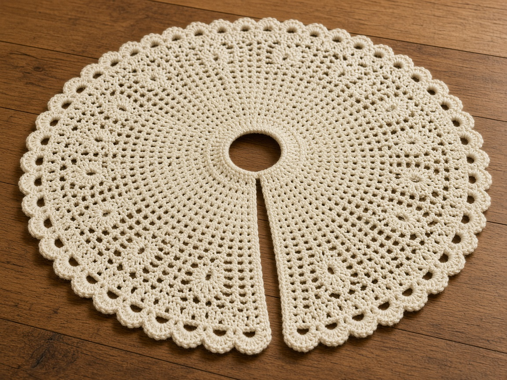
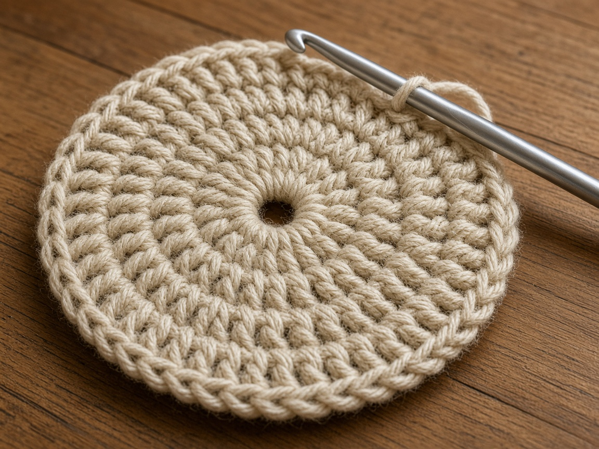
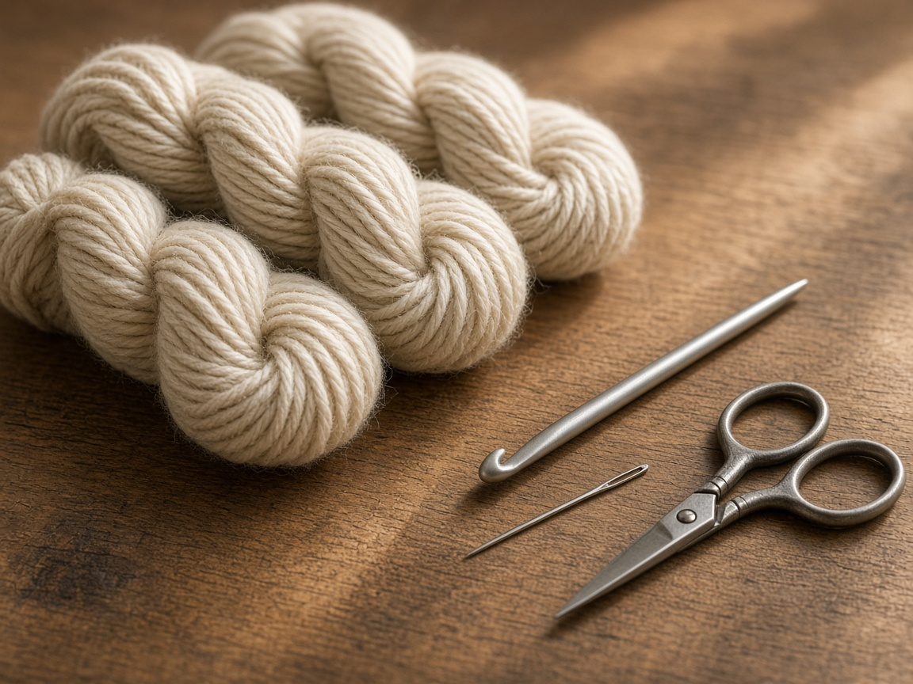
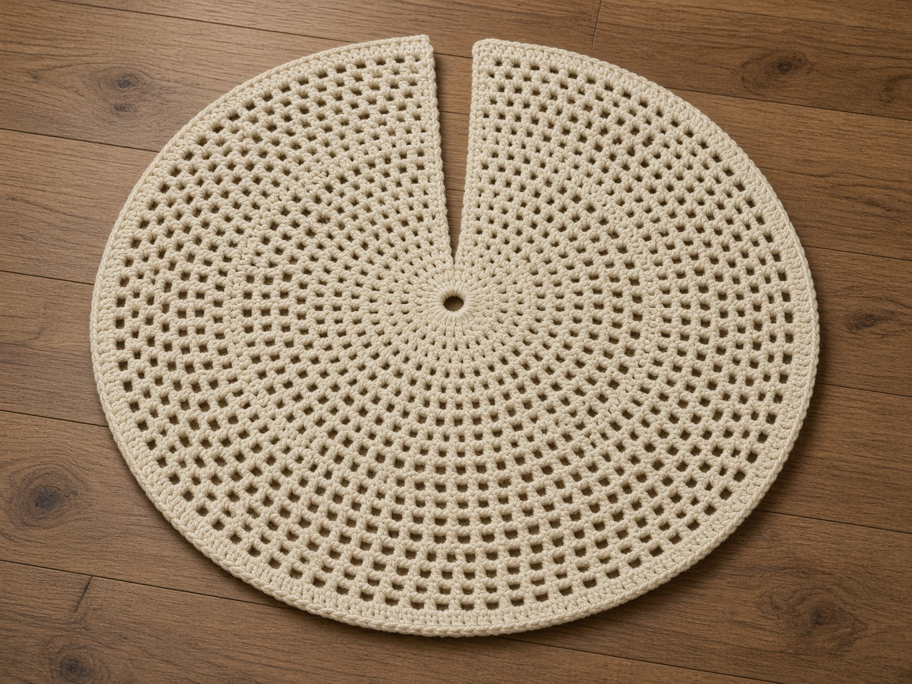
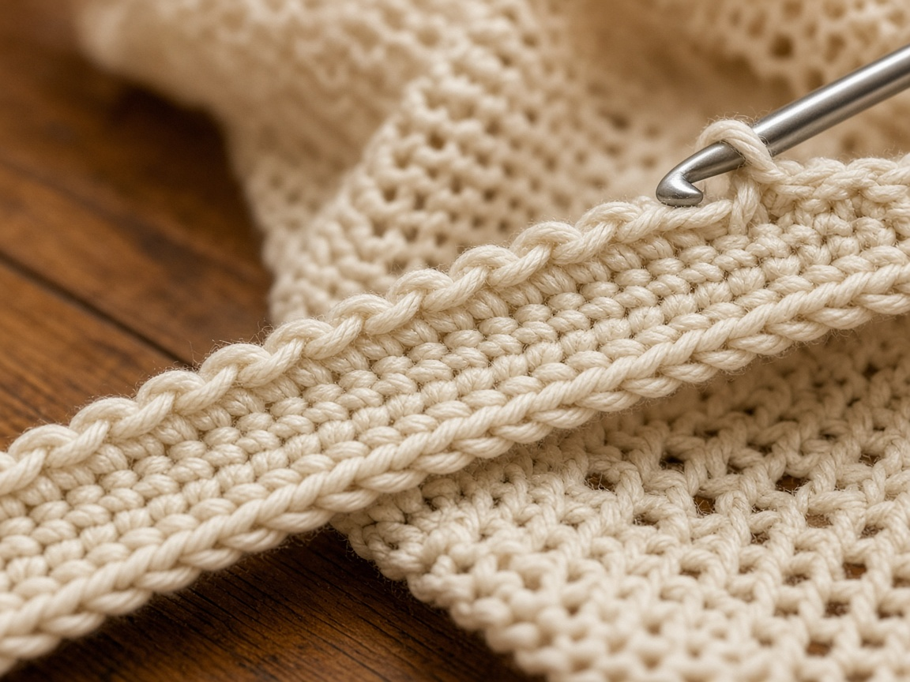
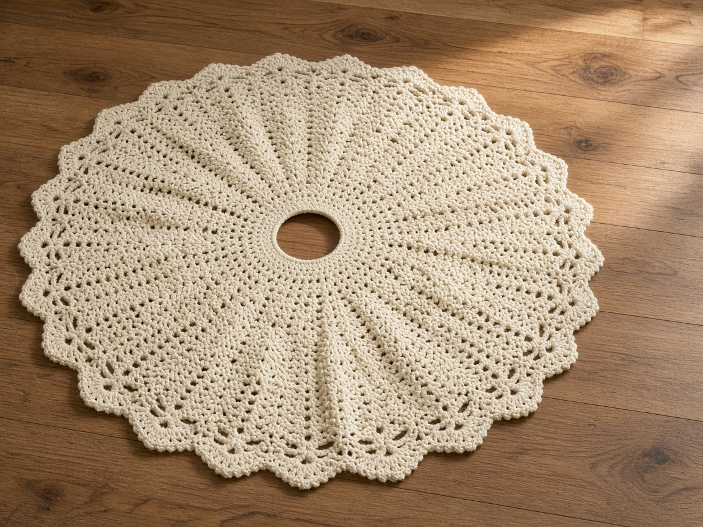

The tree stand sits on the floor, and the gifts end up on the carpet around it. A tree skirt is a flat circle with two practical holes in the plan: a center opening for the trunk or the stand, and a slit from that opening to the hem so you can lay the circle around a tree that is already up.

US terms. US double crochet is UK treble. [Abbreviations](/crochet-abbreviations-chart/). The photos are illustrations of the example size. This skirt has not been yarn-tested, and it has not been put under a tree. Every inch and every yard below is an estimate from the stated gauge. Measure the stand you own, and measure the floor space around it, before you decide the last row.

The example diameter is arithmetic from the gauge, not a tape measure on a finished skirt. Lay your piece on the floor and measure it. Stop when it fits the corner you actually have.

## What you are making

A circle worked back and forth in rows of double crochet. The row ends are the slit. They are never joined. The starting chain is the center opening. Increases make the outer edge longer than the inner edge so the fabric can lie flat. The repeat changes every row, which is the intermediate part. If double crochet is new, read [basic stitches](/basic-crochet-stitches/) first.

## Measure the tree, not the photo

Three measurements, in inches:

- The trunk, and the stand at the height where the skirt will rest. The hole has to clear the wider one.
- How far the stand feet stick out. The hem should land past those feet if you want them covered.
- The clear floor around the tree. A skirt that hits the sofa on one side will not lie down.

Example start: a center opening **about 4 inches** across, and an outer diameter **about 36 inches**. Both numbers are the gauge applied to the stitch counts below. They are not a skirt that was fitted to a tree. Measure the wider of the trunk and the stand, and measure the clear floor. Write those numbers down before you chain.

## Materials

- Worsted yarn in a solid color. About **800 yards** for the 36 inch example. That is a shopping estimate from the stitch count at the gauge below, not a weighed skirt. A larger diameter needs more. [Yarn weights](/yarn-weight-chart/).
- US H/8 (5.0 mm) hook, or the hook that hits gauge. [Hook chart](/crochet-hook-size-conversion-chart/).
- Yarn needle, scissors, locking stitch markers.

Join new yarn at a slit edge. Read the yarn label before you wash a skirt that sits on the floor.

## Gauge (estimate)

**3 dc = 1 inch. 3 rows = 2 inches.**

Swatch at least 4 inches. [Gauge](/crochet-gauge/) was not taken from a finished skirt. At this gauge a double crochet is about twice as tall as it is wide, so a flat circle usually wants **12 increases on every row**. If your swatch is taller or shorter, those 12 increases will ruffle or cup. Fix that in the first few rows.

## Center opening

Chain 39.

**Row 1:** Dc in the 4th chain from the hook and in each chain across. The three skipped chains do not count as a stitch. Ch 2, turn. The ch 2 does not count as a stitch here. (36 dc)

Count 36. At 3 dc to the inch, that is 12 inches around, a little under 4 inches across (12 divided by about 3.14). Put a tape on row 1. If the stand does not pass through, start again with a longer chain, in multiples of 12. Each extra 12 stitches adds about 4 inches around the hole, a bit more than an inch on the diameter.

The ch 2 does not count. The first and last real stitches are the slit. Skipping either one makes that edge short, and the hem rides up.

## Build the circle

Do not join the slit.

**Increase rule.** Take the stitch count, which divides by 12. Divide by 12. That is one group. In each group, work 2 dc in the first stitch and 1 dc in each remaining stitch of the group. Twelve groups give you 12 new stitches.

**Row 2:** 36 ÷ 12 = 3. *2 dc in the next stitch, dc in the next 2.* Repeat across. Ch 2, turn. (48)

**Row 3:** 48 ÷ 12 = 4. *2 dc in the next stitch, dc in the next 3.* Repeat across. Ch 2, turn. (60)

**Row 4:** *2 dc in the next stitch, dc in the next 4.* Repeat across. Ch 2, turn. (72)

**Later rows:** The number of plain dc after each increase goes up by one every row. Checkpoints if you would rather count:

| Row | Stitches |
| --- | --- |
| 8 | 120 |
| 12 | 168 |
| 16 | 216 |
| 20 | 264 |
| 24 | 312 |

Each row should be 12 stitches more than the row before it. If a checkpoint is off, fix it before the next row. A missed edge stitch makes the hem ride up.

**Example stop:** around row 24, when the piece is about **36 inches** across. The hole is about 4 inches, so the fabric from hole to hem needs about 16 inches. At 3 rows to 2 inches, that is about 24 rows. Spread the skirt on the floor and measure. Stop at the diameter that fits your corner, even if that is not row 24.

Join new yarn at a slit edge, not in the middle of a row.

## Edging and ties

Work single crochet up one slit, around the outer hem, down the other slit, and around the center opening. Work 3 sc in each outer corner. Keep the edging relaxed. A tight edging shrinks the hole and waves the hem.

**Ties.** At the inner end of each slit, and at two more spots along each slit, chain 36, slip stitch back down that chain, and continue the edging. Three pairs close the slit. Chain 36 is about a foot of tie if your chain is firm, and that length is an estimate. Tie them on the floor around the stand. Add chains if a pair does not meet.

Weave the ends after the skirt has lain flat. If it cups, fix the increases before you bury the tails.

## A different diameter

1. Hole diameter times about 3.14, times your double crochets per inch. Round to a multiple of 12. That is row 1.
2. Half the outer diameter you measured on the floor, minus half the hole. That is the length of fabric from hole to hem.
3. That length times your rows per inch is the row count. Check it with a tape as you go.

## Mistakes

**Joining the slit.** You then have a closed ring. A tree that is already in a stand cannot pass through this opening. Leave the row ends unjoined.

**Twelve increases on a swatch that does not match.** If the circle ruffles, work a row with no increases. If it cups, work a row with more than 12 increases.

**Measuring the trunk only.** The skirt rests on the stand. Use the wider measurement.

**A tight edging.** The center opening gets smaller, and the hem waves. Use the same hook, and do not pull the single crochet tight.

**Stretching the hole.** Pinning can relax a curly edge. It will not turn a small opening into a large one. A small hole means a longer first row.

## Care

Shake it out. Follow the yarn label for washing. Dry it flat, at the finished diameter, so one slit edge does not stretch. Put it away dry.

## Frequently asked

**Will a 36 inch skirt fit my tree?**

Only if your floor and your stand agree with that number. Thirty-six inches is the example from the gauge. Measure yours.

**Has this been under a tree?**

No. The photos are illustrations. Lay the circle around your stand and check the hole, the slit, and the hem before you weave the ends.

## Next

Closed rounds, without a slit, are covered in [crochet in the round](/crochet-in-the-round/). If the increase repeat is the part that feels shaky, go back to [basic crochet stitches](/basic-crochet-stitches/) and swatch the double crochet until the count stays even.
