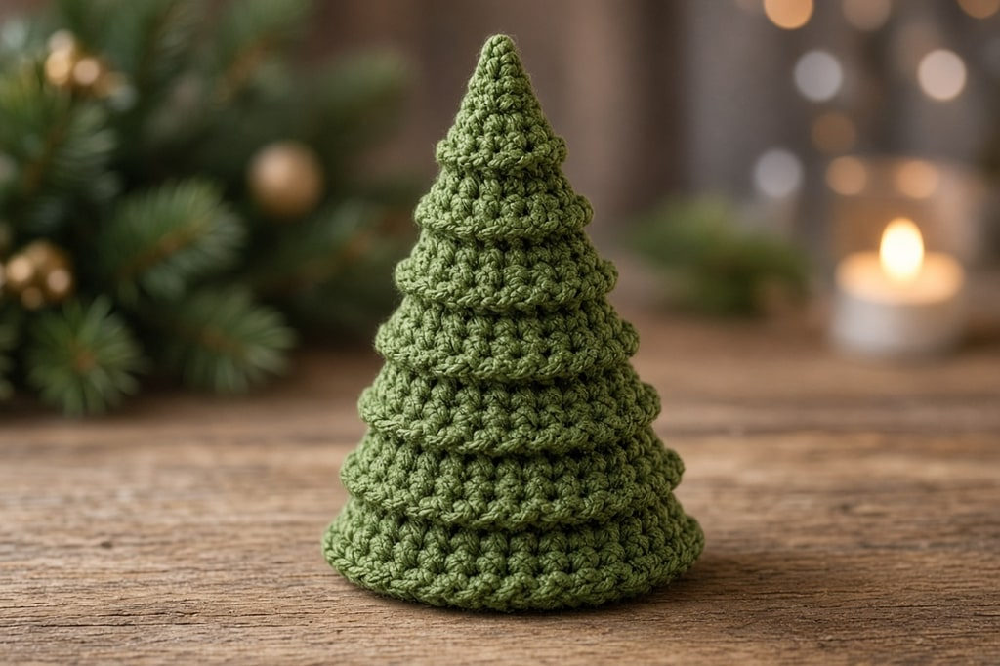
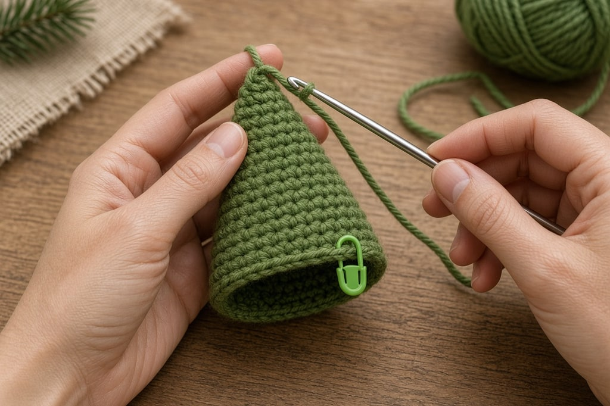
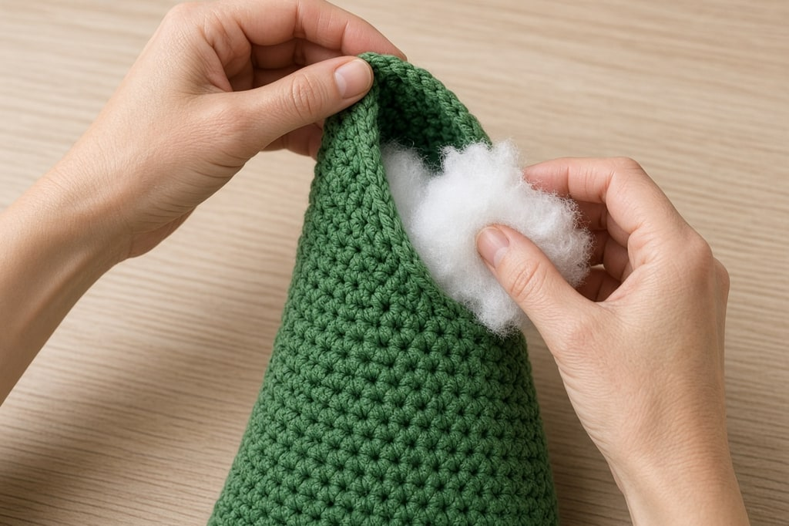
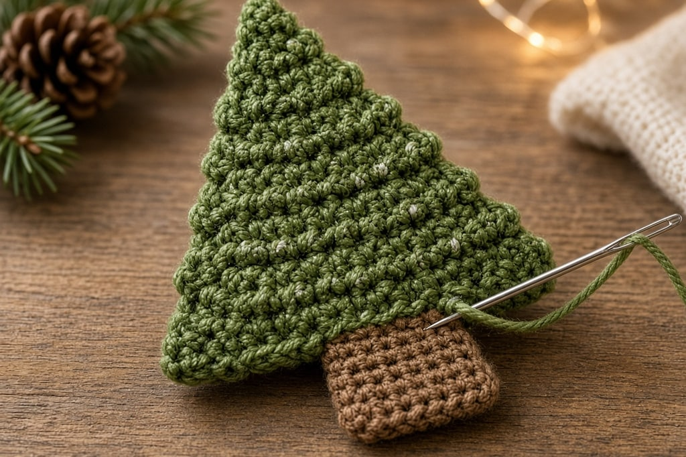

A tree for a mantel has to stand. A tree for a garland has to lie flat. Three builds below, then how to keep a standing tree from toppling.

## Which one do you want

| You want | Build it as |
| --- | --- |
| A tree that stands on a shelf | Tiered cone |
| A tree for a garland, card or applique | Flat triangle |
| A chunky tree with visible layers | Stacked rounds |

## What you need

- Worsted-weight yarn ([yarn weight chart](/yarn-weight-chart/)) in green, or any color
- A hook a size or two under the label for the stuffed versions, often a US G/6 (4.0 mm)
- Stuffing, and weight for the base: dry rice or pie weights in a small fabric bag
- Scraps for decoration, a yarn needle, a stitch marker

US abbreviations. The counts are a shape, not a finished size.

## Method 1: the tiered cone

A plain cone reads as a party hat. One back-loop round makes the horizontal ridge that reads as a branch.

Work in a continuous spiral and mark the first stitch of each round.

**Rnd 1.** Magic ring, 6 sc. (6)

**Rnd 2.** 2 sc in each st around. (12)

**Rnd 3.** *Sc in next st, 2 sc in next st; repeat from * around. (18)

**Rnd 4.** *Sc in next 2 sts, 2 sc in next st; repeat from * around. (24)

**Rnd 5.** *Sc in next 3 sts, 2 sc in next st; repeat from * around. (30)

That is the base. Then **two rounds even, one increase round**, and repeat. Every third round, not every round, makes a taper instead of a bowl. The six-increases-per-round logic is in [increases and decreases](/crochet-increase-decrease/).

**The tier trick.** Every fourth or fifth round, work into the **back loop only**. The unused front loops stand out as a ridge. Three or four ridges is enough.

Stuff as you go. When the opening is about six stitches, *sc2tog* to close and fasten off.

Stuff in small amounts as the cone narrows. The tip of a finished cone is nearly impossible to stuff, and an empty tip flops over.

## Method 2: the flat triangle

For garlands, cards, and appliques. Work bottom to top in rows, decreasing at both ends.

**Row 1.** Ch as many stitches as you want the base wide — 15 is a good size — then sc in the second ch from the hook and in each ch across. (14 sc if you chained 15)

**Row 2 and every row after.** Ch 1, turn, sc2tog, sc across to the last two stitches, sc2tog.

Repeat until three stitches remain, then sc3tog and fasten off. Wavy sides are usually the turning chain. [The turning chain](/crochet-turning-chain/) explains it.

A two-stitch-wide brown rectangle is a trunk on a card. Skip it on a garland. The hanging thread does that job.

## Method 3: stacked rounds

Make three flat circles, decreasing in size. The five rounds above are the largest. Stop at round 4 and round 3 for the other two. Overlap the edges of each circle slightly, stitch them into a shallow cone, and stack the cones on a dowel, a chopstick, or a tight tube of brown crochet, largest at the bottom. The gaps between layers are the point. It is faster than the tiered cone, and it looks more deliberate at a larger size.

## Making it stand up

A cone is top-heavy past a few inches tall.

**Weight the base.** Dry rice or pie weights in a small fabric bag, flat on the bottom before any stuffing. Loose grains work out through the stitches.

**Keep the base flat.** If the first five rounds ruffled or domed, the tree rocks. Check it on a table before you stuff.

**Stuff the bottom harder than the top.** A hard upper half only raises the center of gravity.

## Decorating

**French knots** in a contrasting yarn are the tidiest ornaments. **Beads or buttons** are a choking hazard on a child's gift, so embroider dots instead. **A star** sewn flat against the tip stays put. An upright star needs stiffening.

Six ornaments look decorated. Thirty looks like a textured green blob.

## Mistakes that spoil the tree

**Increasing every round.** That makes a bowl. Space the increases across rounds worked even.

**A back-loop round every round.** Three or four ridges total, not a ribbed cone.

**No weight, or stuffing the tip last.** It stands while you are looking at it, and the tip never fills properly.

**Increases stacked in a vertical line.** Offset them by a stitch or two, or the cone pulls crooked.

## Frequently asked

### Why is my cone leaning?

The weight is off-center, or the increases lined up into a seam. If it always settles the same way when you roll it, move the weight before you close the bottom.

### Can I skip the stuffing?

Yes, over a cone-shaped craft foam form. It stands evenly and costs more than the yarn. Worth it for a matched set.

### How do I get a set the same size?

Same hook, same yarn, same round counts. Identical counts match. The same inch measurement usually does not, because stuffing density varies.
