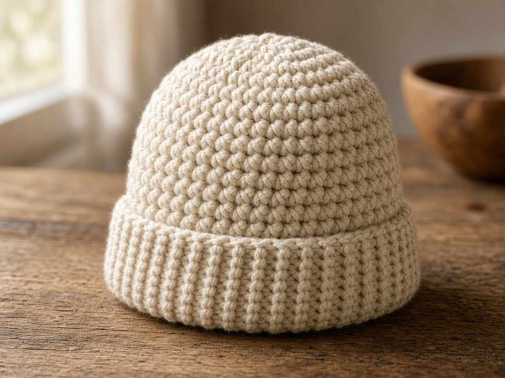
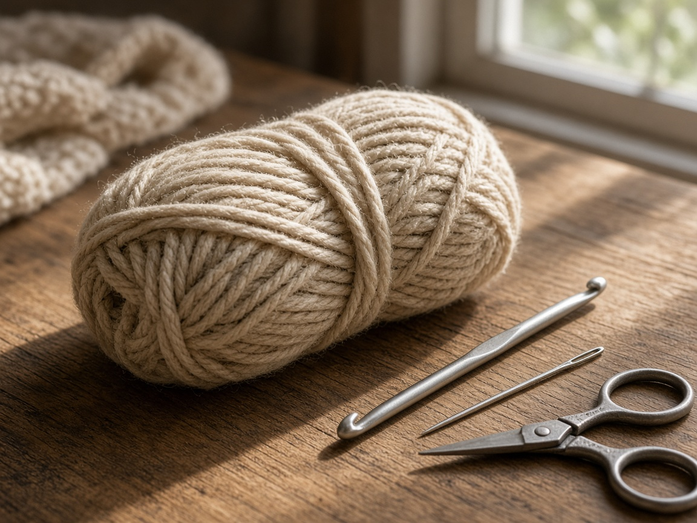
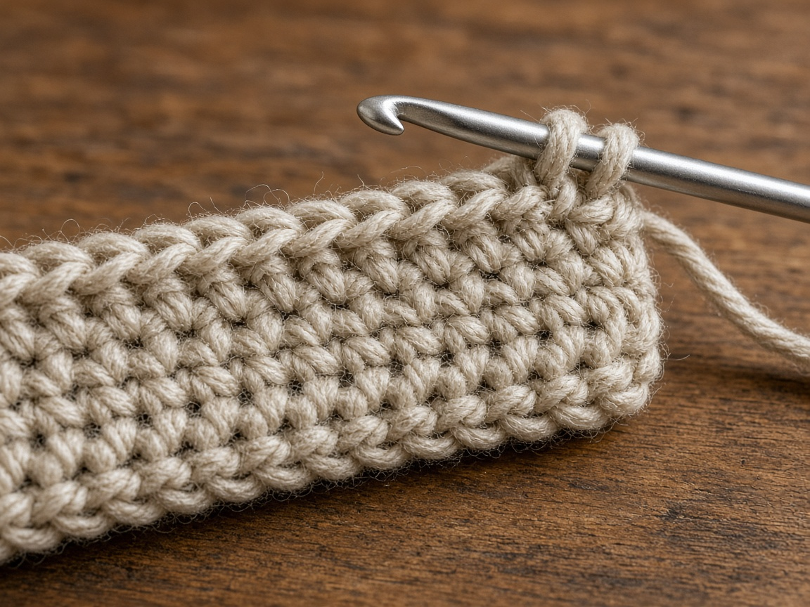
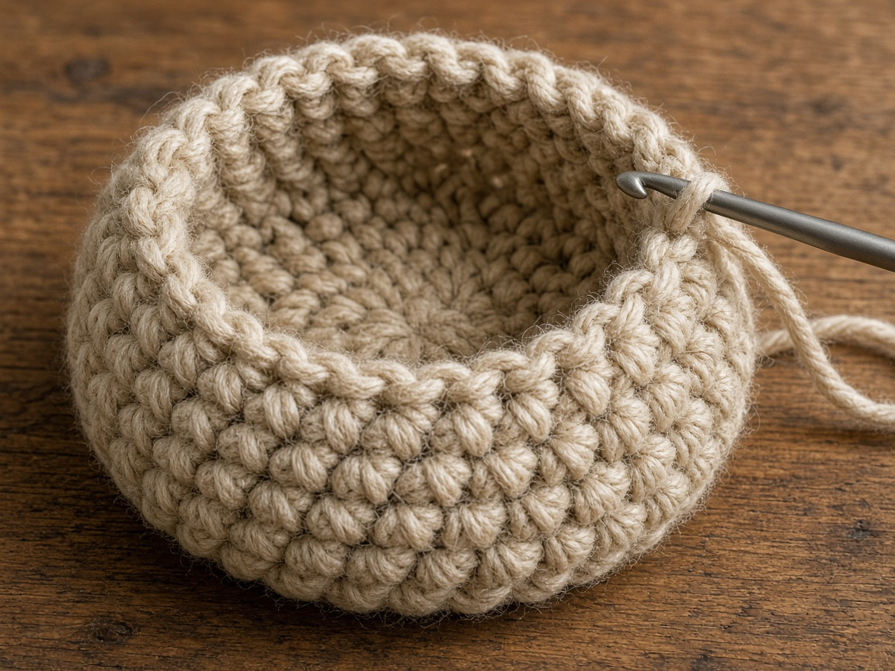
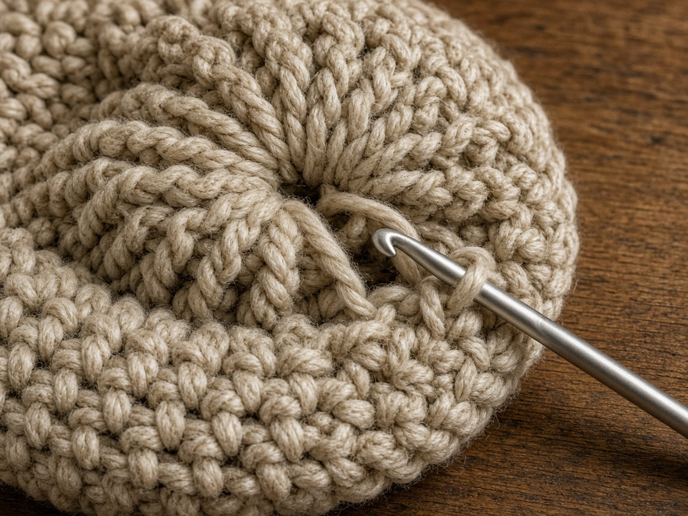
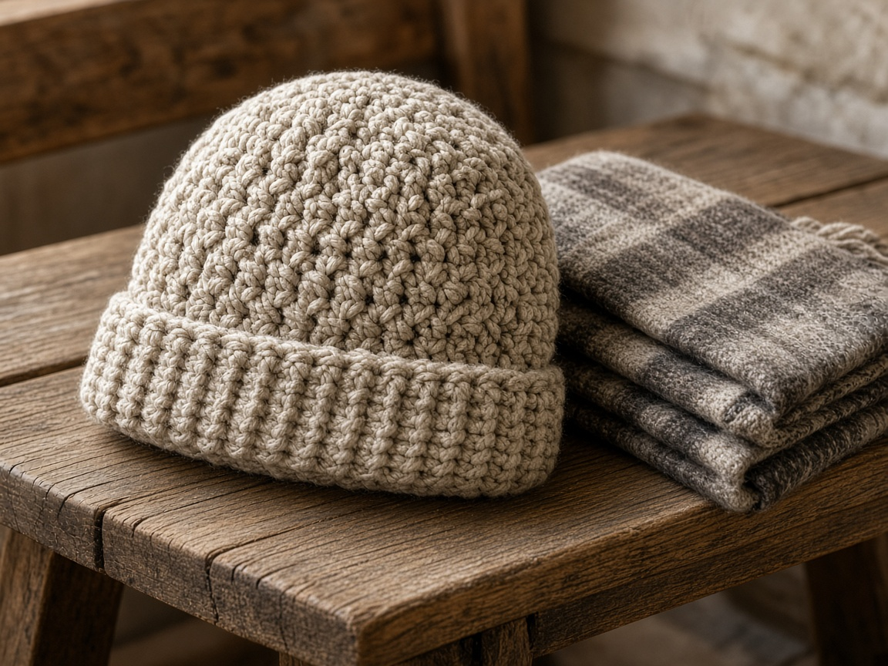

A winter hat fails in one of two ways. It slides off because the brim is too loose, or it leaves a red line because the brim is a tourniquet. Chunky yarn hides uneven stitches and finishes faster than worsted, which is why it is the yarn people grab in October. It does not hide a brim that was never measured.

US terms. US single crochet is UK double crochet. [Abbreviations](/crochet-abbreviations-chart/). The photos are illustrations. This hat has not been worn and measured in yarn. Wrap the brim around the head it is for, and stop when it fits, even if that is not the example row count.

## Measure first

A hat needs negative ease. The fabric stretches, so the relaxed brim should be smaller than the head. A useful starting point is **2 inches smaller** than the head measurement, taken just above the ears where the hat will sit.

Example, not a promise: a **22 inch** head, brim relaxed at about **20 inches**. If your bulky yarn is very stretchy, 2 inches may be too much and the hat creeps up. If it has almost no stretch, 1 inch of ease is enough. The head tells you. The photo does not.

Children's heads are not small adult heads. Measure the child. Do not scale the adult example by guessing.

## Materials

- Bulky yarn (weight 5 on the [yarn weight chart](/yarn-weight-chart/)), oatmeal in the example. About **120 yards** for an adult hat at the gauge below. A larger head or a longer body needs more. This yardage was not weighed off a finished hat.
- The hook printed on the yarn label, often in the US L to N range (8.0 mm to 10.0 mm). [Hook chart](/crochet-hook-size-conversion-chart/). If that hook misses gauge, change the hook, not the head.
- Yarn needle, scissors, a tape measure.

Beginner. An afternoon, unless you are frogging the brim twice, which is normal.

## Gauge (estimate)

The example math uses **2.5 sc = 1 inch** in bulky yarn. That is a planning number, not a swatch from this page. Work 12 sc for a few rows. If those 12 stitches are not about **4.8 inches**, do not follow the 50-row brim below.

[Gauge](/crochet-gauge/) on a hat is the difference between a gift and a hat the person never wears.

## Brim

The brim is a flat ribbed band. You will join it into a loop, then pick up stitches along one long edge for the rest of the hat.

Ch 1 does not count as a stitch.

Chain 9.

**Row 1:** sc in the 2nd chain from the hook and across. Ch 1, turn. (8)

**Row 2:** sc in the back loop only of each stitch. Ch 1, turn. (8)

Repeat row 2 until the band, gently stretched, reaches your target. At 2.5 sc to the inch, a 20 inch band is about **50 rows**. Count if you want. The tape around the head matters more. Do not stretch the band until the stitches gape just to hit 50.

Fold so the first row meets the last. Sew the short ends. The seam is the back. The rib should run vertically once the band is a loop, which means the rows run around the head.

## Body

Turn the loop so the seam is inside. Join yarn on the edge that will become the fold line of the brim. You are picking up one stitch for each row.

**Round 1:** sc in the end of each row. Join. If you made 50 rows, you have 50 stitches. If you made 46 because that fit, you have 46. Keep whatever number the band gave you. Call it N.

**Rounds 2–12:** sc in each stitch. (N)

Twelve rounds at a chunky gauge is a short body above the brim. Put it on. The crown should not be finished yet. If the hat is already at the eyebrows and you still have no decreases, stop the even rounds. If it is sitting on the ears and looks like a headband, add rounds. A folded brim eats some of this height, so check it with the brim folded the way you will wear it.

## Crown

Decrease evenly. The numbers below use N = 50 as the example. If your N is different, decrease by about one fifth of the stitches each round until 6 to 8 stitches remain. A crown that decreases all in one round puckers.

Example for 50 stitches:

**Round A:** (sc in the next 8, sc2tog) around. (45)

**Round B:** (sc in the next 7, sc2tog) around. (40)

**Round C:** (sc in the next 6, sc2tog) around. (35)

**Round D:** (sc in the next 5, sc2tog) around. (30)

**Round E:** (sc in the next 4, sc2tog) around. (25)

**Round F:** (sc in the next 3, sc2tog) around. (20)

**Round G:** (sc in the next 2, sc2tog) around. (15)

**Round H:** (sc, sc2tog) around. (10)

**Round I:** sc2tog around. (5)

If a round does not divide evenly, sc the extra stitches and decrease on the next round. Close the 5 stitches with the yarn needle. Weave the end down the inside. Do not leave a knot on the crown. It shows through bulky yarn more than people expect.

## Mistakes

**Joining the brim twisted.** The rib spirals. You will not fix it by blocking. Open the seam and sew it flat.

**No decreases.** The top stays a tube and flops. The crown rounds are not optional.

**Brim stretched to the right row count.** It looked like 20 inches on the table because you pulled it. On a head it is loose. Measure it relaxed, then check it on the head.

**Worsted yarn with these numbers.** This page is bulky. Worsted at 2.5 stitches to the inch would be a very loose fabric. Use a worsted gauge, or stay with bulky.

## Care

Bulky hats hold water. Squeeze, do not wring. Dry flat, brim unfolded, so the rib does not dry creased in the wrong direction. Check the yarn label before you wash. Some bulky acrylics pill if they see the inside of a dryer.

## Frequently asked

**Will one count fit every adult?**

No. The 50-row brim is only for a 20 inch target at 2.5 sc to the inch. Measure, swatch, then pick the row count.

**Can I add a pom-pom?**

Yes, after the crown is closed. Sew it on. A glue gun lets go the first time the hat is pulled off by the pom-pom.

**Is the folded brim required?**

No. Leave it down and you have a slouchier hat with a short rib at the edge. The body rounds were planned with one fold in mind. If you will not fold it, stop the even rounds sooner so it does not cover the eyes.

## Next

A shorter band with no crown is the [ear warmer](/how-to-crochet-an-ear-warmer/). Hands that need the fingers free are the [fingerless gloves](/how-to-crochet-fingerless-gloves/).
