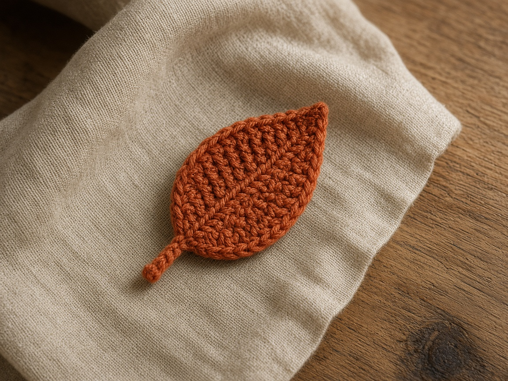

A fall leaf is a flat appliqué. Sew it to a [pumpkin](/how-to-crochet-a-pumpkin-step-by-step/), a [treat bag](/how-to-crochet-a-pumpkin-treat-bag/), or the edge of a [mug cozy](/crochet-mug-cozy-for-beginners/). It is the same idea as the [simple flower](/how-to-crochet-a-simple-flower/): one small piece, not a garment.

The stitch counts below were checked as written. This leaf has not been made in yarn, and the photo is an illustration. Measure your own piece.

## What you need

- Worsted-weight yarn in rust, gold, or olive, about 8 yards for one leaf. That yardage is a planning guess, not a weighed sample. [Yarn weights](/yarn-weight-chart/).
- US G/6 (4.0 mm) hook. [Hook chart](/crochet-hook-size-conversion-chart/).
- Yarn needle.

US terms. US single crochet is UK double crochet. [Abbreviations](/crochet-abbreviations-chart/).

## Finished size

About 3 in (7.5 cm) long in worsted, if the chain is not pulled tight. A smaller hook makes a neater leaf for a bag strap.

## Gauge

Gauge does not change the shape. It changes the size. If you want a leaf that matches a set, make the first one and copy its chain tension.

## The leaf

Work into the chain, then back along the other side so the piece is a pointed oval. Do not turn.

**Foundation.** Ch 9.

**First side.** Starting in the 2nd chain from the hook: sc, hdc, dc in each of the next 4 chains, hdc, sc. That is 8 chains used and 8 stitches. The last of those stitches is the tip. (8)

**Tip.** Work 2 more sc into that same tip chain, so the tip chain holds 3 sc. (10 stitches so far)

**Return side.** Along the free loops of the remaining 7 chains: hdc, dc in each of the next 4 chains, hdc, sc. Sl st to the first sc. (7 more stitches. 17 around, including the 3 sc at the tip.)

Fasten off, leaving a tail for sewing.

**Stem.** Join green or the same yarn at the base (the end opposite the 3-sc tip). Ch 6. Sl st in the 2nd ch from the hook and in each ch back to the leaf. Fasten off and weave that short tail into the stem. Use the longer sewing tail from the leaf body to attach the whole piece.

Count check: the first side uses all 8 chains. The tip chain then holds 2 extra sc. The return uses the other 7 chains. If the return runs out of chain early, a stitch on the way out landed in the wrong chain.

## Mistakes

**It twists.** The return side was worked into the front of the stitches you already made, instead of the free loops of the chain. Undo to the tip and use the unused loop.

**The tip is blunt.** The 3 sc landed in different chains. All three belong in the end chain.

**The stem curls into a corkscrew.** The slip stitches are tighter than the chain. Chain a little looser, or use a hook one size larger for the stem only.

## Customizing

One rust leaf and one olive leaf on the same pumpkin reads as fall without extra stitches. For a garland, make leaves until the yarn runs out and sew them to a chain long enough for the window. The [flower](/how-to-crochet-a-simple-flower/) uses the same sewing method.

## Frequently asked

### Should I block it?

Yes, if it cups. Pin it flat and steam lightly, or wet-block cotton. [Blocking](/weaving-in-ends-and-blocking/).

### Can I use this on a baby item?

Sew it on firmly and check that the stem cannot pull free. A loose appliqué is a bad idea on anything a baby can mouth.
