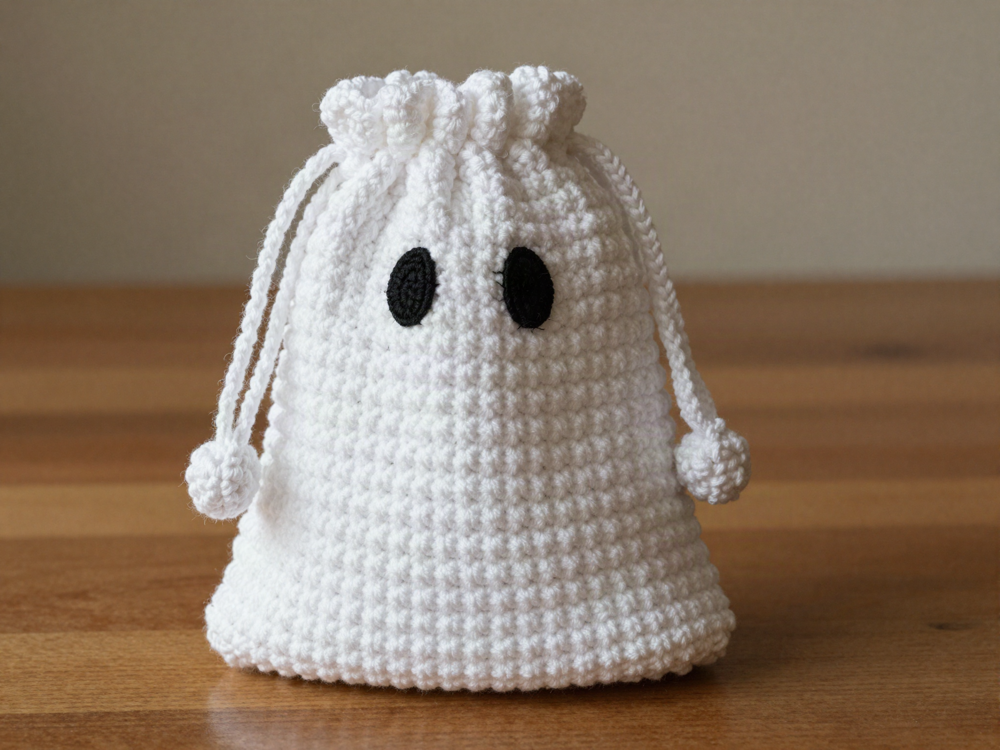
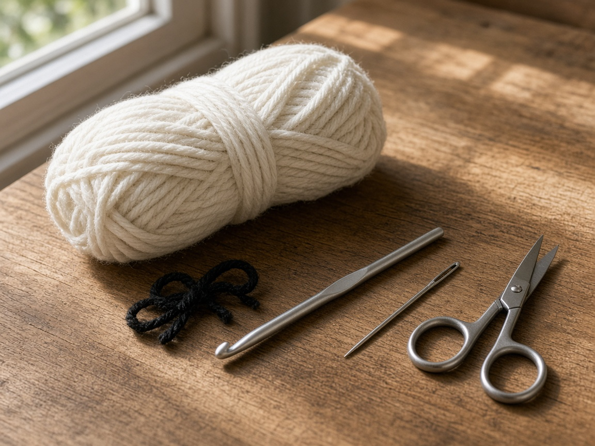
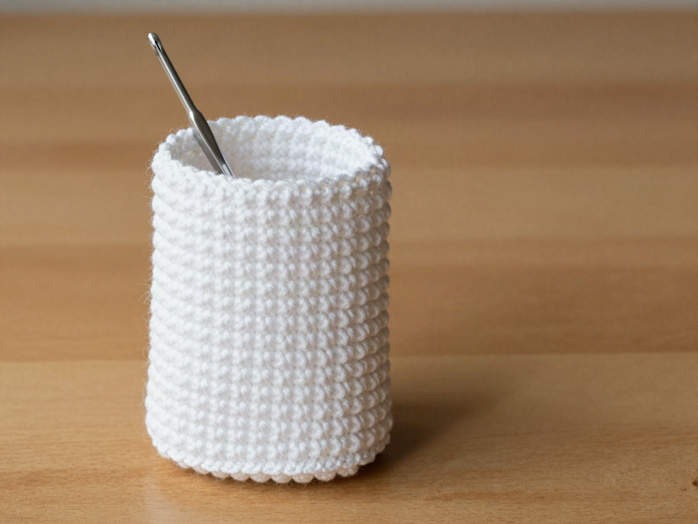
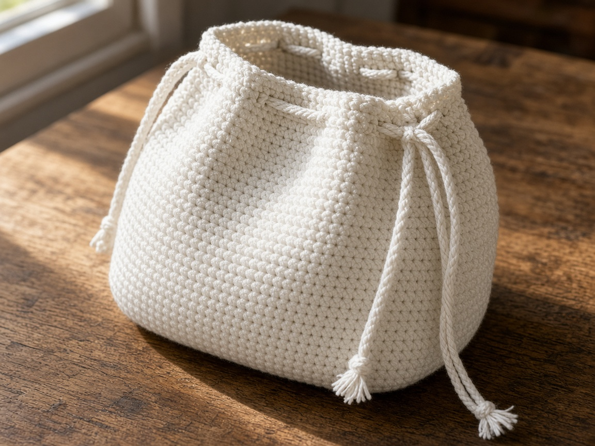
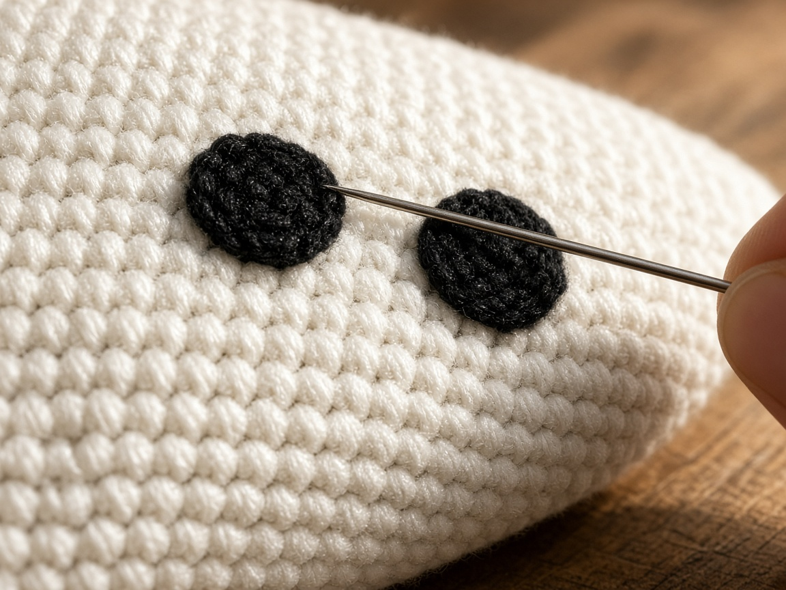
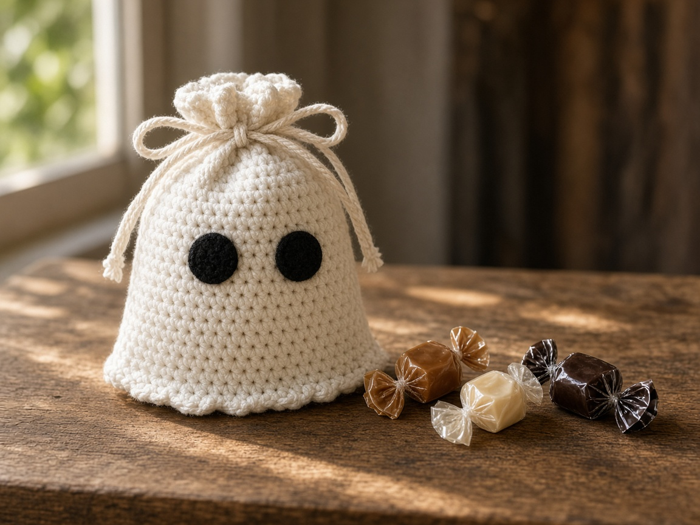

A handful of wrapped candy in a coat pocket comes out stuck to a receipt. A ghost bag is a soft cup with a cord, tall enough for candy and short enough to finish in an evening. It is a Halloween gift that does not need a zipper.

US terms. US single crochet is UK double crochet. [Abbreviations](/crochet-abbreviations-chart/). The photos are illustrations. This bag has not been filled and measured in yarn. The inches below assume the gauge. Drop your own candy in before you weave the ends, and add rounds if the bag is too short.

## What you are making

A flat base, straight sides, two black eyes, and a drawstring near the top. The gathered top reads as a ghost if the yarn is white or cream. Any other color is just a candy bag, which is still the useful object.

It is taller than the [ghost coin pouch](/how-to-crochet-a-ghost-coin-pouch/) and it is not a stuffed ghost. A stuffed one is the [ghost amigurumi](/crochet-ghost-amigurumi-for-beginners/). An orange drawstring bag, if you would rather skip the eyes, is the [pumpkin treat bag](/how-to-crochet-a-pumpkin-treat-bag/).

The example is about **4 inches across and 5 inches tall** before you pull the cord. That is a handful of wrapped candy, not a pillowcase of it.

## Materials

- Worsted cotton, white or cream. About **90 yards** for the example. [Yarn weights](/yarn-weight-chart/).
- A few yards of black worsted, for the eyes. Embroidery floss works if you already have it.
- US G/6 (4.0 mm) hook, or whatever hits gauge. [Hook chart](/crochet-hook-size-conversion-chart/).
- Yarn needle, scissors.

Cotton keeps a rounder bag. A fuzzy acrylic looks more ghost-like and also grabs the candy wrappers. Pick one and accept the trade.

Beginner, if you can single crochet in the round. One evening.

## Gauge (estimate)

**4 sc = 1 inch. 5 rounds = 1 inch.**

These numbers were not taken from a finished bag. If your swatch differs, change the stitch count. [Gauge](/crochet-gauge/) decides whether the candy fits. A bag that is a bit wide is fine. A bag with a hole big enough for a mini candy to fall through is not. Single crochet is the dense stitch. Do not swap in double crochet and keep these counts.

## Base

Ch 1 does not count as a stitch. Counts are for joined rounds. Mark the start if you prefer a spiral, and skip the join.

**Round 1:** 6 sc in a [magic ring](/crochet-in-the-round/). Join. (6)

**Round 2:** 2 sc in each. (12)

**Round 3:** (sc, 2 sc in the next) around. (18)

**Round 4:** (2 sc, 2 sc in the next) around. (24)

**Round 5:** (3 sc, 2 sc in the next) around. (30)

**Round 6:** (4 sc, 2 sc in the next) around. (36)

**Round 7:** (5 sc, 2 sc in the next) around. (42)

**Round 8:** (6 sc, 2 sc in the next) around. (48)

**Round 9:** (7 sc, 2 sc in the next) around. (54)

At 4 sc to the inch, 54 stitches are about **13.5 inches** around, a circle near **4.3 inches** across. The circle should lie flat. A wavy circle means too many increases for your yarn. Stop at round 8 if it is already ruffling.

## Sides

**Rounds 10–32:** sc in each stitch. (54)

That is 23 even rounds, about **4.5 inches** of wall at 5 rounds to the inch, plus the base. Put a few candies in. If they sit too high to close, add rounds before you make the drawstring holes. Do not close a short bag and then wish it were taller.

## Drawstring round

**Round 33:** (sc in the next 4 stitches, ch 2, skip 2) around. Fifty-four divides by 6, so this repeat lands 9 times. (36 sc, 9 ch-2 spaces)

**Round 34:** sc in each sc and 2 sc in each ch-2 space. Join. (54)

**Rounds 35–36:** sc in each stitch. Fasten off.

The extra rounds above the holes keep the cord from pulling off the rim.

## Cord and eyes

Chain 80 in the same white yarn, or chain until the cord wraps the bag and still leaves two tails you can tie. Fasten off. Weave the cord through the ch-2 spaces with a yarn needle. Start and end at the front so the knot sits under the eyes, not at the back where you cannot see it.

Eyes sit on the front, below the drawstring, about 8 rounds down from round 33. With black, embroider two short vertical ovals, or sew two small circles of 6 sc worked in a ring and fastened off. Keep them above the candy line so they still show when the bag is full.

## Mistakes

**Holes big enough for candy.** Double crochet walls, or a skipped stitch in the body, will drop a mini chocolate. The body is solid single crochet. Only round 33 has gaps, and those sit above the candy.

**Cord too short.** Chain 80 is an estimate at this gauge. If the tails will not tie, chain another 20 and sew it on. Do not stretch a short cord until the top stays open.

**Eyes on the back.** Mark the front before you embroider. The knot of the cord is the front.

**A stiff base that will not sit.** You increased too slowly and the bottom is a dome. Add one more increase round on the next bag before you start the sides.

## Care

Empty it. Shake out the wrappers. Hand wash cool if a chocolate smeared the cotton. Dry flat. Do not put a damp bag back in a coat pocket with paper candy.

## Frequently asked

**Can a child carry it?**

The cord is a tie, not a toy strap. Do not hang it around a neck. A hand, or tied onto a treat bucket handle, is the use.

**Will it fit a full-size chocolate bar?**

A standard bar is longer than this diameter. This bag is for wrapped bite-size candy. For a bar, add increase rounds until the flat circle is wider than the bar, then work the sides.

**Do the eyes have to be black?**

No. Black reads as a face from across a room. Brown or gray still reads if the yarn is a strong contrast. Matching white eyes on white yarn disappear.

## Next

A zipper, if you are tired of cords, is the [pumpkin zipper pouch](/how-to-crochet-a-pumpkin-zipper-pouch/). A flat pocket for a card, with no candy at all, is the [card wallet](/halloween-crochet-card-wallet/).
