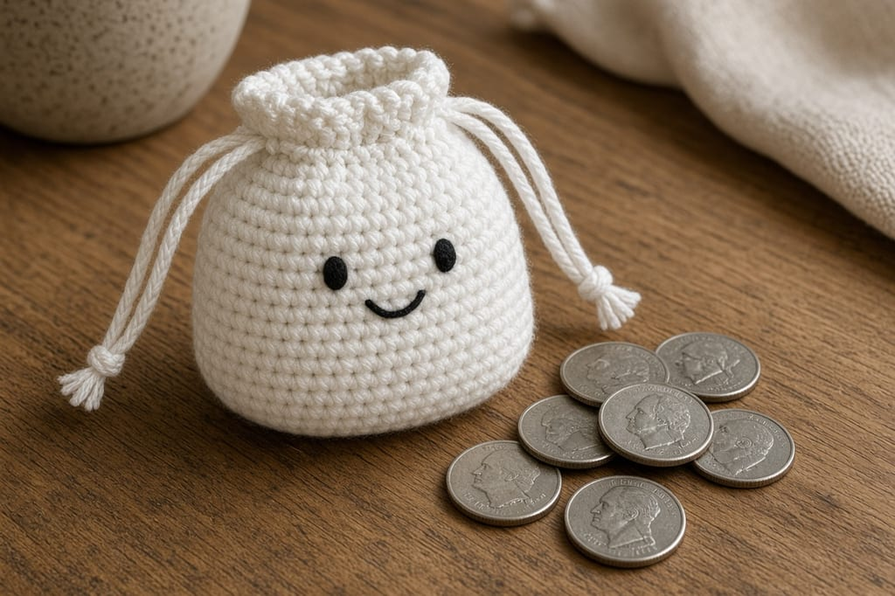
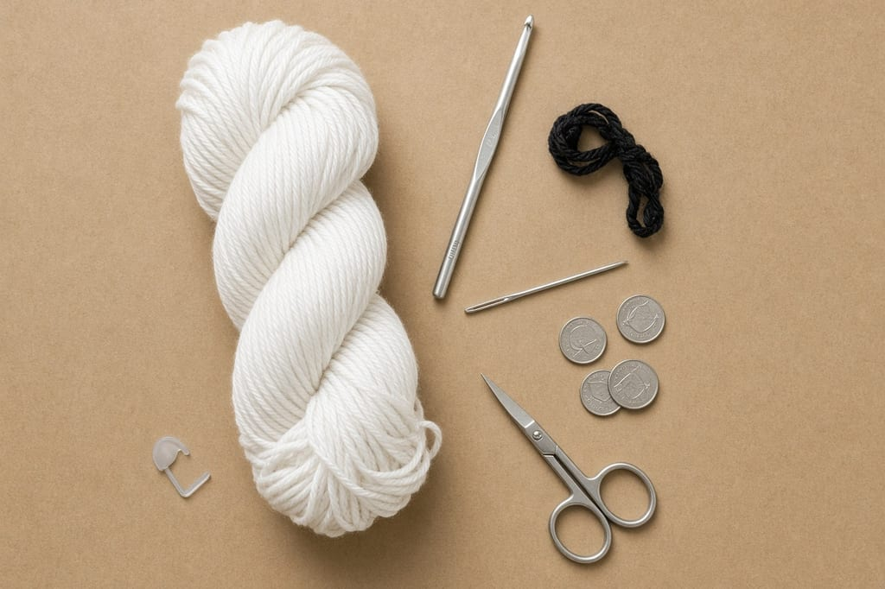
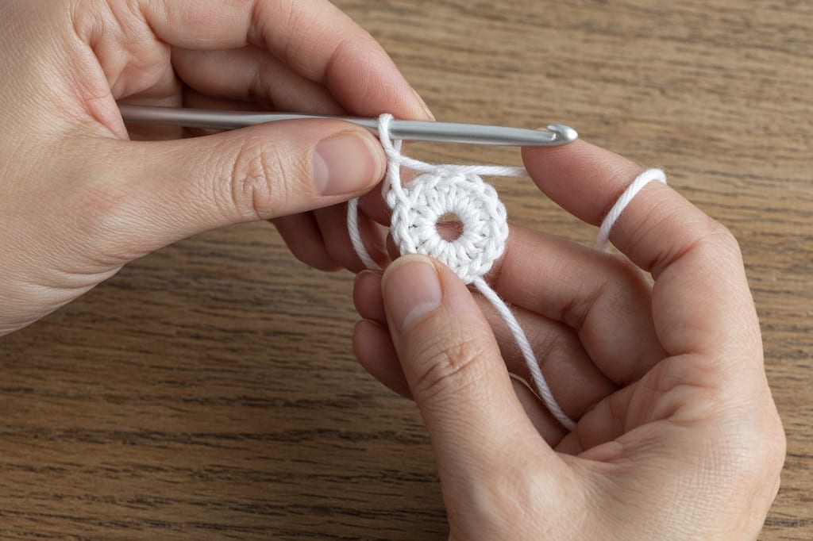
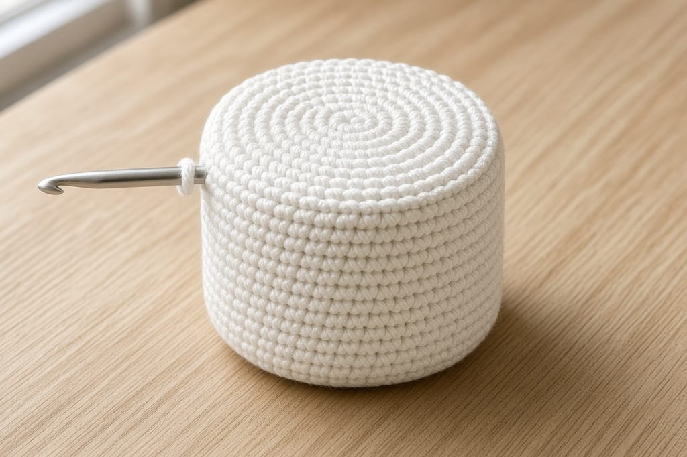
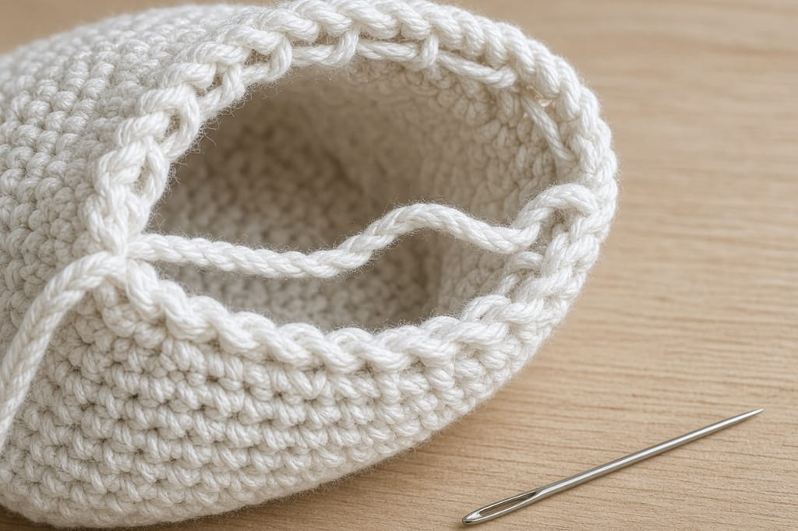
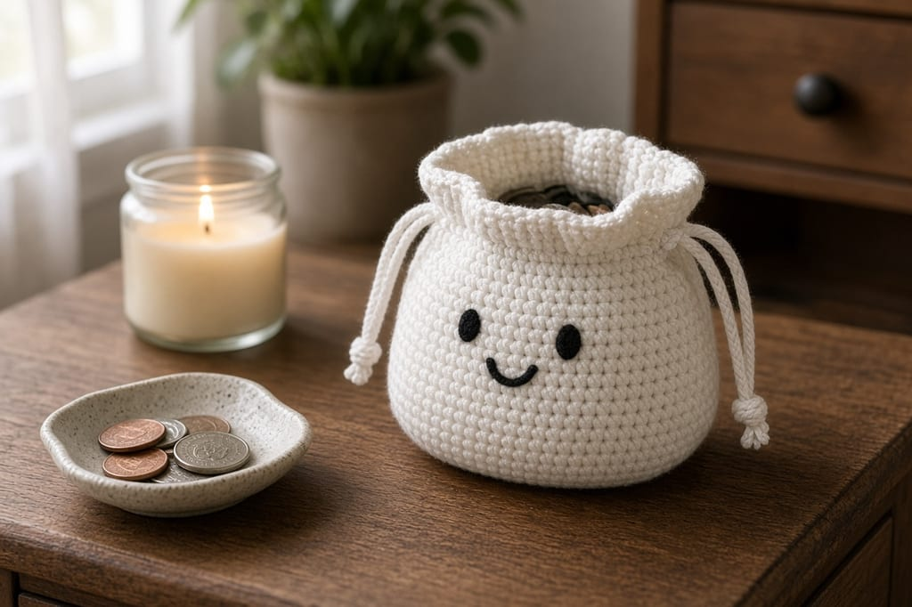

Loose change in a coat pocket ends up in the wash. A small ghost pouch keeps the coins in one place and still fits in that pocket.

This is a white single-crochet tube with a flat base, a drawstring near the top, and a simple embroidered face. It is a coin purse, not a wallet. US terms throughout. US single crochet is UK double crochet. Names are on the [abbreviations chart](/crochet-abbreviations-chart/).

The photos are illustrations of the intended pouch. This pattern has not been stitched and measured in yarn, so the inch sizes are estimates from the gauge below. Drop a few coins in before you weave the ends, and add rounds if the pouch is too short.

## What you need

- Worsted-weight cotton, white, about **40 yards**. A scrap of black for the face. Cotton holds a small pouch better than a fuzzy yarn. [Yarn weight chart](/yarn-weight-chart/).
- US G/6 (4.0 mm) hook, or the size that matches the gauge. [Hook size chart](/crochet-hook-size-conversion-chart/).
- Yarn needle, scissors, stitch marker.
- A few coins to test the opening.

Beginner, if you can single crochet and increase. About 1 to 2 hours.

## Gauge and size (estimates)

Aim for **4 sc = 1 inch** and **5 rounds = 1 inch**.

At that gauge, 30 stitches around is about **7.5 inches** in circumference, so the flat base is about **2.4 inches** across. Ten even rounds are about **2 inches** of wall. That holds a small handful of coins. It will not hold a roll of quarters.

If your base cups into a bowl, the increases are too tight. Redo them before you build the wall. A curled base tips over and the coins sit in a lump.

## Body

Work in a spiral. Do not join rounds. Mark the first stitch. The method is the same one in [crochet in the round](/crochet-in-the-round/).

**Round 1:** 6 sc in a magic ring. (6)

**Round 2:** inc in each stitch. (12)

**Round 3:** (sc, inc) 6 times. (18)

**Round 4:** (2 sc, inc) 6 times. (24)

**Round 5:** (3 sc, inc) 6 times. (30)

The circle should lie flat. Lay it on the table. If it ruffles, you increased too often. If it bowls, the ring or the increases are tight.

**Rounds 6–15:** sc in each stitch. (30)

That is 10 rounds with no increases. The stitch count stays 30 because you are building a tube, not a ball.

## Drawstring round

The next round makes the holes. It only works if the stitch count is even. 30 is even.

**Round 16:** (sc, ch 1, skip 1) 15 times. (15 sc and 15 chain spaces)

Each repeat uses 2 stitches of Round 15: one sc, one skipped. Fifteen repeats use all 30.

**Rounds 17–18:** sc in each sc and in each chain space. (30)

Fasten off.

## Cord

Chain 70 in the same white yarn. That is a cord long enough to go around a 7.5-inch opening and still leave two tails to tie. If your pouch came out wider, chain more until the cord goes around with about 4 inches left over.

Weave the cord through the chain spaces of Round 16 with the yarn needle. Start and end at the front, so the tie sits under the face, not at the back of your hand.

Pull both ends. The top should gather. If a stitch seals shut, you worked Round 17 into the chain instead of into the space, and the cord has nowhere to go. Redo Rounds 17–18.

## Face

Close the drawstring once so you can see the front. Embroider two short black eyes about 4 stitches apart, and a small wide V under them. Keep the stitches shallow. Deep stitches make a bump the coins catch on.

Do not put the face on the drawstring round. Put it on the tube, a few rounds below the holes, so the gather does not fold the eyes in half.

## Fit

Drop in the coins you actually carry. The gathered top should close over them without a gap big enough for a quarter to slip through. A US quarter is just under 1 inch across. If the opening stays wider than that when pulled tight, the cord is too short to cinch, or Round 16 has fewer holes than 15 because a repeat was skipped.

## Three changes

**Taller pouch.** Add even rounds before Round 16. Keep the count at 30. Do not increase.

**A second color on the last two rounds.** Change color on the last yarn-over of Round 16, using the method in [changing yarn color](/changing-yarn-color-crochet/).

**No face.** A plain white pouch still works. The drawstring is the part that holds the coins.

## Mistakes

**Joining every round.** This is a spiral. A slip-stitch join adds a jog and can change the count if you also chain. One marker is enough.

**An odd stitch count at the eyelets.** (sc, ch 1, skip 1) needs an even number. If you added a stitch by accident, the last skip lands wrong and the cord holes do not line up. Count Round 15 before you start Round 16.

**A fuzzy yarn.** It looks soft and then pills inside the pouch. Coins need a smooth cotton.

## Care

Hand wash cool. Dry flat. Do not machine dry. Cotton can shrink enough to make the opening stubborn. Empty the coins first.

## Frequently asked

**Will it hold bills?**

A bill folded very small may fit. The pouch is planned for coins. A stack of bills needs a wider piece, like the [Halloween card wallet](/halloween-crochet-card-wallet/).

**Can I sell finished pouches?**

Yes, pouches you make. Do not copy this page onto another site.

**What if I only have DK yarn?**

Use a smaller hook and stop the even rounds when the tube is about 2 inches tall. The round numbers still describe the shape. The inch estimates will not match.

## Next

The same spiral starts the [bat earbuds pouch](/gothic-bat-earbuds-pouch/), which is a flap instead of a drawstring. If the circle still feels new, stay with [crochet in the round](/crochet-in-the-round/) before you add the cord.
