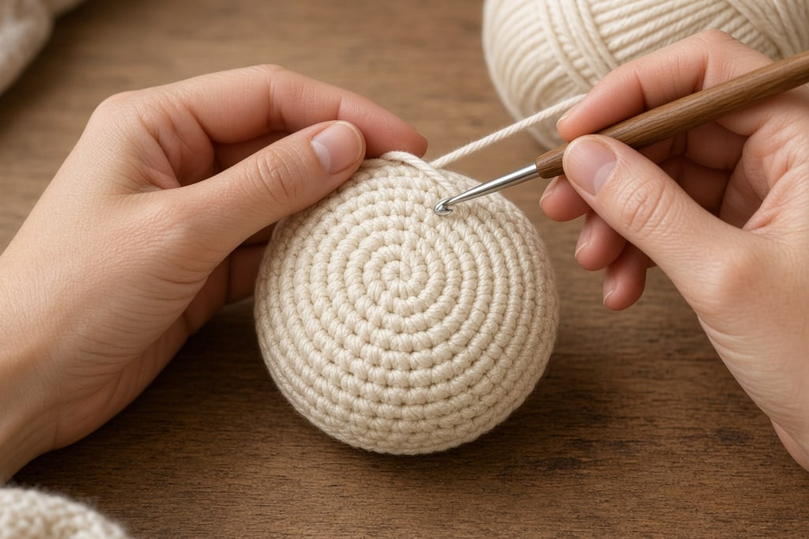
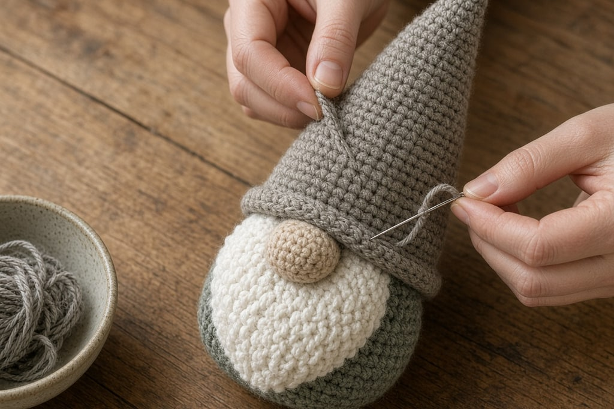

A crochet gnome is a cone, a hat, a nose, and a beard. None of those pieces is hard. Proportion is what makes it read as a gnome: **the hat comes down far enough to cover where the eyes would be, and the nose sits just under the brim.**

## What you need

- Worsted-weight yarn ([yarn weight chart](/yarn-weight-chart)) in a body color, a hat color, and a skin tone for the nose
- Something pale and fluffy for the beard: boucle, fuzzy yarn, or cut strands of worsted
- A hook a size or two under the label, often a US G/6 (4.0 mm), so stuffing does not show
- Stuffing, and dry rice, lentils, or pie weights in a small fabric bag
- A yarn needle and a stitch marker

US abbreviations. The counts are a shape, not a finished height.

## Body: a weighted cone

Work in a continuous spiral and mark the first stitch of every round.

**Rnd 1.** Magic ring, 6 sc. (6)

**Rnd 2.** 2 sc in each st around. (12)

**Rnd 3.** *Sc in next st, 2 sc in next st; repeat from * around. (18)

**Rnd 4.** *Sc in next 2 sts, 2 sc in next st; repeat from * around. (24)

**Rnd 5.** *Sc in next 3 sts, 2 sc in next st; repeat from * around. (30)

That circle is the base. Work two rounds even, then one increase round, and repeat. Every third round, not every round, turns a bowl into a taper. Why six increases a round behaves this way is in [increases and decreases](/crochet-increase-decrease).

Continue until the body is roughly twice as tall as the base is wide. Work even to the top and fasten off, leaving the last round open.

**Weight it before you stuff.** Drop the bag in first so it sits flat, then stuff above it. A big hat on a narrow cone tips on any surface that is not level.

Use a bag, not loose rice. Loose grains work out through the stitches and end up in the bottom of the decorations box.

## Hat

The hat starts at the tip and grows downward, the reverse of the body.

**Rnd 1.** Magic ring, 4 sc. (4)

Work several rounds even. That skinny tube is the floppy tip. Two inches is conservative. Four is where it starts to look deliberate.

Then increase: an increase round, then one or two rounds even, and repeat, until the opening is **slightly wider than the body** where the hat will sit. The same width as the body perches on top like a party hat. Do not stuff the hat. A stuffed hat stands stiff and loses the flop.

## Nose

**Rnd 1.** Magic ring, 6 sc. (6)

**Rnd 2.** 2 sc in each st around. (12)

Work two rounds even, then *sc2tog* around, stuffing lightly as it closes. Leave a long tail for sewing.

Make it bigger than feels tidy. A small nose looks like a mistake. An oversized one looks like a gnome. If you are torn, use the larger.

## Beard

The fast method is fringe. Cut strands about twice the finished length, fold each in half, pull the folded loop through a stitch, then pull the ends through that loop. Work an arc across the front and trim the bottom straight or to a point.

A half circle in rows, decreased at each end and sewn on, is tidier. On fuzzy yarn the two look the same. Seasonal yarn choices are in [yarn for Christmas crochet](/yarn-for-christmas-crochet).

Attach the beard **before the nose**, so the nose hides the join.

## Assembly

1. Close the stuffed body at the top.
2. Attach the beard in an arc across the upper front.
3. Sew the nose on, centered, just above the beard.
4. Set the brim so it touches the top of the nose. Pin it, look from a few feet away, then sew around the brim.

Where the brim lands decides whether it looks like a gnome.

## Mistakes that spoil the gnome

**A brim above the nose.** Body fabric between brim and nose looks like a cone in a hat. The brim should touch the nose.

**A small nose or a thin beard.** The nose is the only feature, so make it larger than feels tidy. Fringe looks full in your hand and sparse on the gnome. Use more strands, then trim.

**No weight.** It is face down by morning. **The hook on the label.** Stuffing shows through. Go down a hook size.

**An increase every round.** That is a bowl. Space the increase rounds out.

## Frequently asked

### Why does mine lean?

The weight bag is off-center, or the increases stacked in a line. Increases worked directly above each other pull the cone crooked. Offset them by a stitch or two.

### Does it need a face?

No. The hat covers where the eyes would be. Eyes under the brim turn it into a different character.

### Can I skip the nose?

You can, and it will read as a decorated cone. The nose is doing more work than any other piece.
