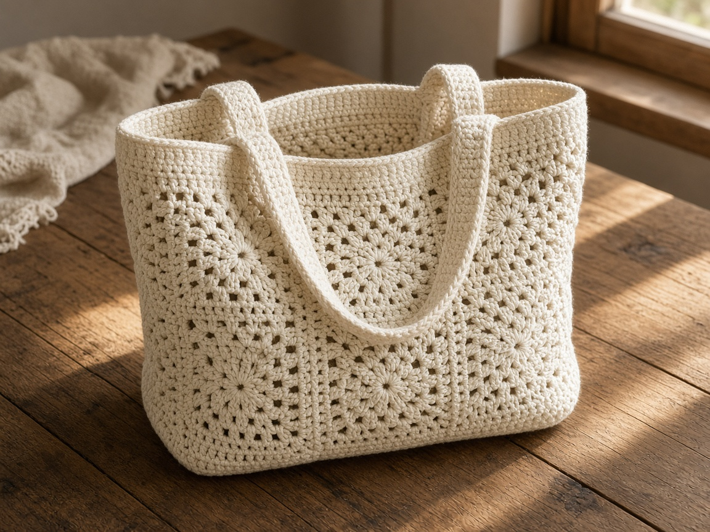
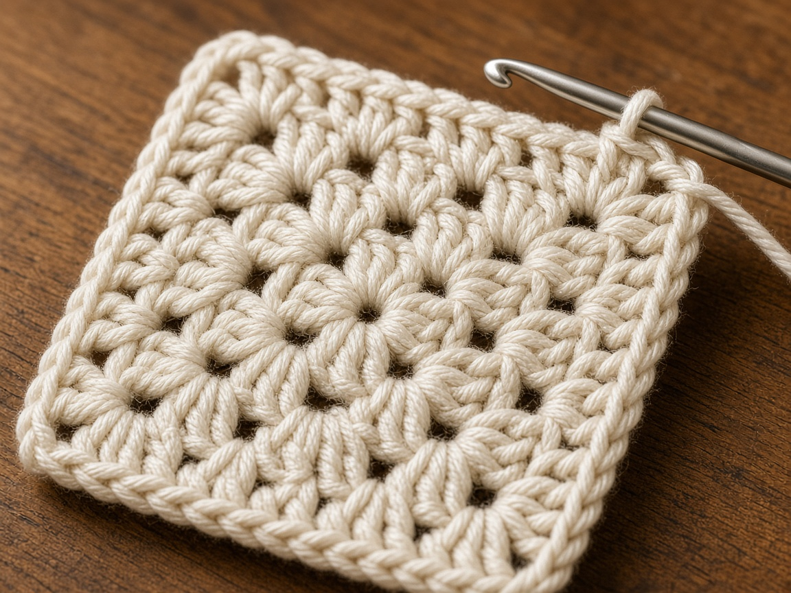
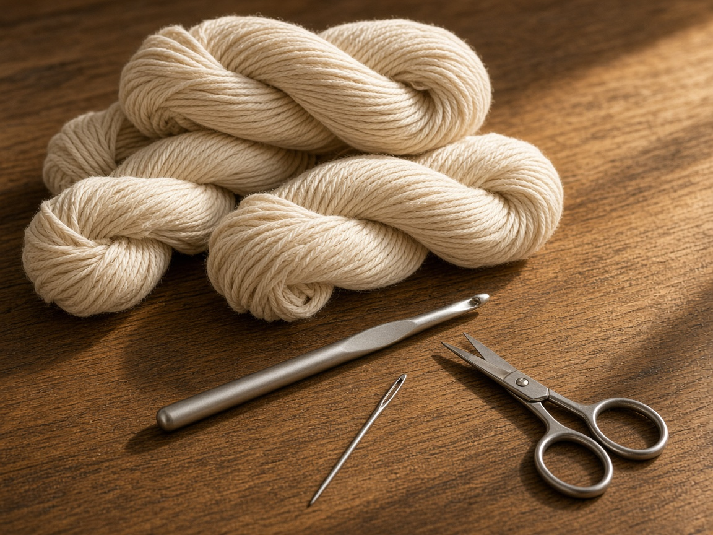
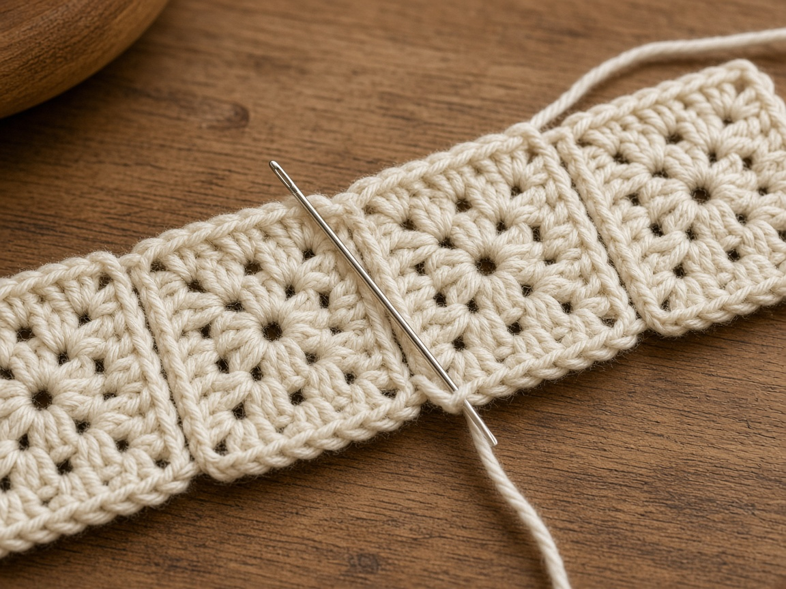
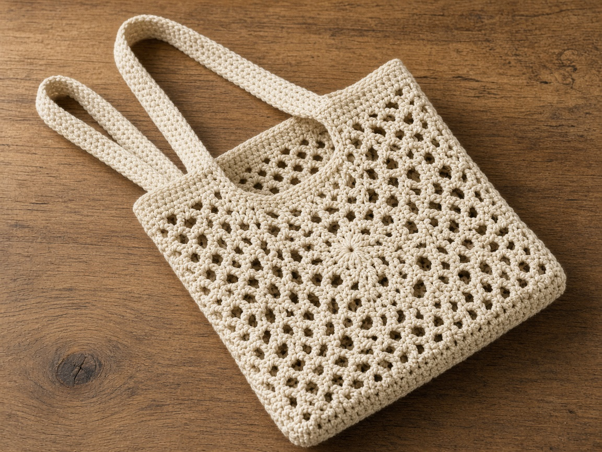
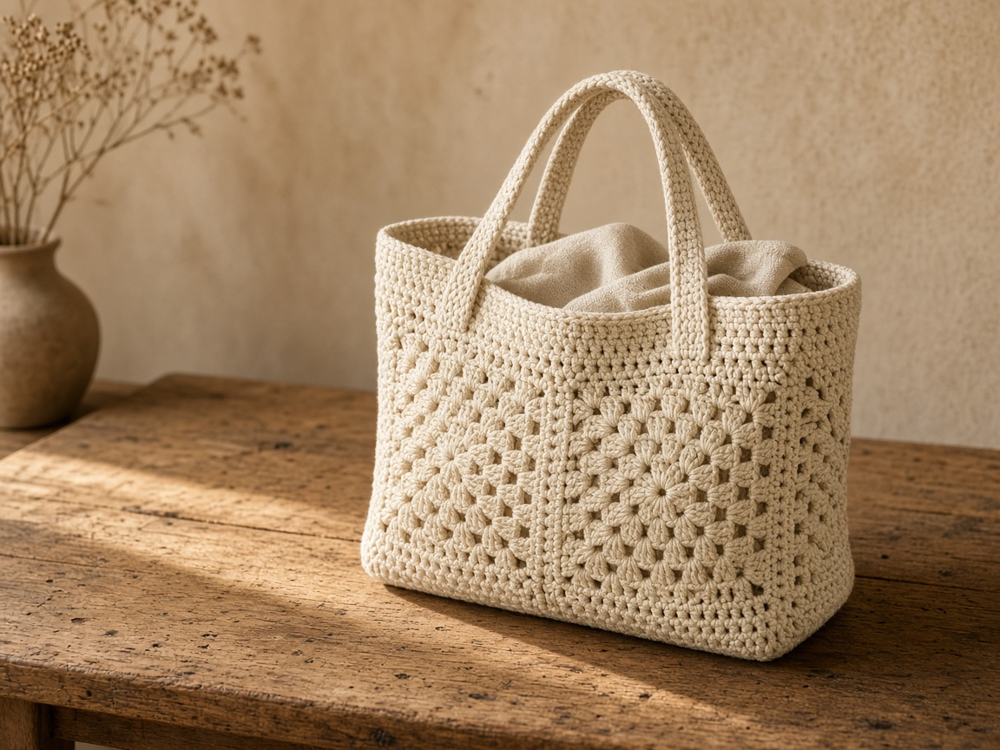

A solid tote is heavy before you put anything in it. Granny squares stay lighter, and the holes are the cost. A pen will drop through. Rain will not stay out.

The cluster of three double crochets is a standard stitch. This page joins those squares into a tote and adds single-crochet straps.

US terms. US double crochet is UK treble. US single crochet is UK double crochet. [Abbreviations](/crochet-abbreviations-chart/) and the [basic stitches](/basic-crochet-stitches/). The photos are illustrations. This tote has not been carried or measured in yarn. Inches and yardage below are estimates from the gauge, which you still have to swatch.

## Measure

The example bag uses **8 squares**, each worked for **4 rounds**, joined as two panels of **2 squares by 2 squares**. At the gauge below, one square is about **5 inches** on a side, so a panel is about **10 inches** wide and **10 inches** tall before the seams eat a little. The straps in the example are about **22 inches** long.

Measure the square you made. A 4 inch square makes a panel nearer 8 inches. A 6 inch square makes a panel nearer 12. Do not use the 10 inch figure once your square disagrees with it. Hold what you want to carry against the panel before you seam the bag shut.

Two squares, one for the front and one for the back, are enough for a small tote. Keep working rounds until the square measures the width you want, then seam those two squares on three sides.

## Materials

- Worsted cotton. About **350 yards** for 8 squares, the joins, the top edge, and two straps at the example size. This was not weighed off a finished bag. A larger square uses more. [Yarn weights](/yarn-weight-chart/).
- US H/8 (5.0 mm) hook, or the hook that hits the square gauge. [Hook chart](/crochet-hook-size-conversion-chart/).
- Yarn needle, scissors.

Cotton. Acrylic grows once the bag holds weight, and the straps get longer every time you carry it. Cotton stretches less. It is still not a framed bag.

Intermediate. The squares have to match, and the seams have to be counted. Weave the ends as you finish each square.

## Gauge (estimate)

**One 4-round square measures about 5 inches on each side.**

**Strap and edging: 4 sc = 1 inch. 5 rows = 1 inch.**

Neither number was swatched for this page. Measure the square flat, without pulling the corners. [Gauge](/crochet-gauge/) is the size of this bag. If the square is not about 5 inches, use the size you got, or change hooks and start again. Do not stretch a small square up to 5 inches.

## Squares

Ch 3 at the start of a square round counts as a double crochet. Clusters go in the chain-spaces, not in the tops of the stitches. The center is a chain ring. See [working in the round](/crochet-in-the-round/).

**Round 1:** Ch 4, slip stitch in the first chain to form a ring. Ch 3, 2 dc in the ring, ch 2. [3 dc in the ring, ch 2] 3 times. Slip stitch in the top of the beginning ch-3. (4 clusters, 4 corner spaces)

**Round 2:** Slip stitch in the next 2 dc and into the ch-2 space. Ch 3, 2 dc in the same space, ch 2, 3 dc in the same space. *Ch 1, (3 dc, ch 2, 3 dc) in the next ch-2 space.* Repeat from * twice more. Ch 1. Slip stitch in the top of the beginning ch-3.

**Round 3:** Slip stitch into the next ch-2 corner space. Ch 3, 2 dc in the same space, ch 2, 3 dc in the same space. *Ch 1, 3 dc in the next ch-1 space, ch 1, (3 dc, ch 2, 3 dc) in the next corner space.* Repeat from * twice more. Ch 1, 3 dc in the next ch-1 space, ch 1. Slip stitch in the top of the beginning ch-3.

**Round 4:** Slip stitch into the next corner space. Ch 3, 2 dc, ch 2, 3 dc in that corner. *Ch 1, 3 dc in the next space, ch 1, 3 dc in the next space, ch 1, (3 dc, ch 2, 3 dc) in the next corner.* Repeat from * twice more. Ch 1, 3 dc in the next space, ch 1, 3 dc in the next space, ch 1. Join and fasten off. Each side has four clusters if you count both corners.

Make **8 squares**. Redo any square that is smaller than the others. For a two-square tote, repeat that corner rule until the square is as wide as you want the bag. Make two, seam three sides, and use the same straps.

## Join

Hold two squares with right sides together. Single crochet through both layers along one edge.

On a 4-round square, that edge is **19 sc**: 2 sc in each corner space, 1 sc in each of the 12 dc, and 1 sc in each of the 3 chain-1 spaces. If the first seam is not 19, fix it before you copy it.

Join the 8 squares into 4 pairs. Then join two pairs along the long side for the front, and two pairs for the back. Where four corners meet, work those stitches once. A skipped center leaves a hole a finger can pass through. Work them twice and the center bunches.

Hold the front and the back with right sides together. Single crochet them together along the two sides and the bottom. Leave the top open. Turn the bag right side out. The seams sit inside.

Join yarn at a side seam on the top edge. Single crochet around the opening, about 1 sc in each double crochet and 1 sc in each space, for **2 rounds**. Count the first round and repeat it. The straps sew into this edge. A strap sewn only through a granny space will tear out.

## Straps

Ch 1 on the straps does not count as a stitch.

Make 2.

Chain 6.

**Row 1:** Sc in the 2nd chain from the hook and across. Ch 1, turn. (5)

**Row 2:** Sc in each stitch. Ch 1, turn. (5)

Repeat row 2 until the strap measures about **22 inches** without stretching. At 5 rows to the inch, that is about **110 rows**. Stop at the length you want. A 22 inch strap is for the hand. For a shoulder, measure from the bag at your side, up over the shoulder, and back, and match that tape. Make the second strap the same number of rows.

Sew one strap to the front and one to the back. Place each end about **8 stitches** in from the side seam, about 2 inches only if the edging is 4 sc to the inch. Sew through the single-crochet edge for about an inch of the strap end. Pick the two straps up together when you carry the bag.

A pen, a key, or a lipstick will fall through the holes. Use the [makeup pouch](/how-to-crochet-a-makeup-pouch/) for those. Rain comes through too. A [book sleeve](/how-to-crochet-a-book-sleeve/) helps only on a dry day.

## Mistakes

**Working into the stitch tops.** The square closes up and will not match the others. Pull it out.

**Different sizes in one panel.** One tight square puckers the seam. Redo it. Do not ease a 4 inch edge into a 5 inch edge.

**A chain for a strap.** A chain stretches until the bag hangs at your knees. Single crochet the strap.

**One strap, sewn at the corners only.** The corner chain-space is the weak point. Use two straps, set in from the sides, sewn through the single-crochet round.

## Care

Empty the bag. Hand wash cool. Dry flat, including the straps. Wet cotton stretches at the seams, so do not load the bag until it is dry.

## Frequently asked

**Can I use two colors?**

Yes. Change color at the start of a round, and keep every yarn the same weight. A thinner cotton makes a smaller square, and it will not join cleanly.

**Will it hold books?**

A couple, if they are larger than the holes. Rain and a water bottle in the same bag will still reach the covers.

**Can I sell totes?**

Finished bags, yes. Do not republish these rounds as your pattern.

## Next

A closed cotton pocket for the items this tote would lose is the [makeup pouch](/how-to-crochet-a-makeup-pouch/). A phone wants its own measured sleeve and a long strap: [phone crossbody](/how-to-crochet-a-phone-crossbody/). The same measuring habit, on a cup, is the [tumbler sleeve](/how-to-crochet-a-tumbler-sleeve/).
