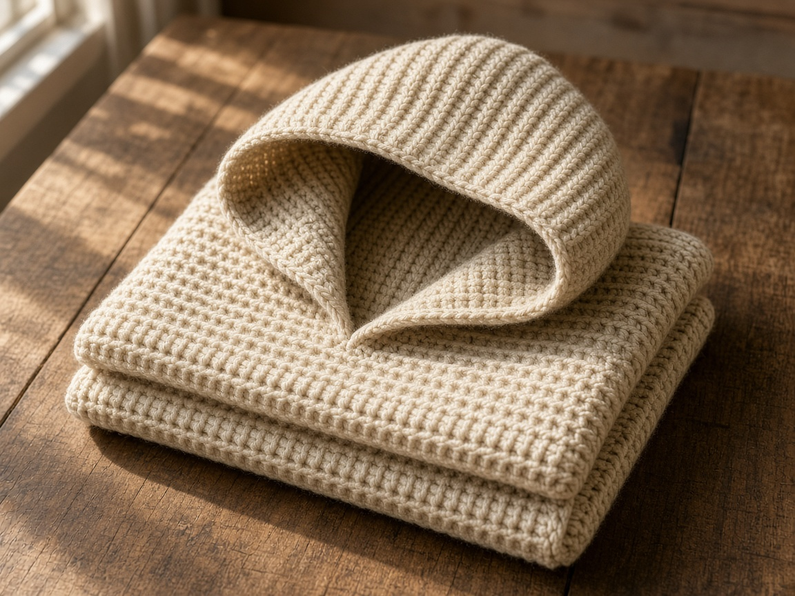
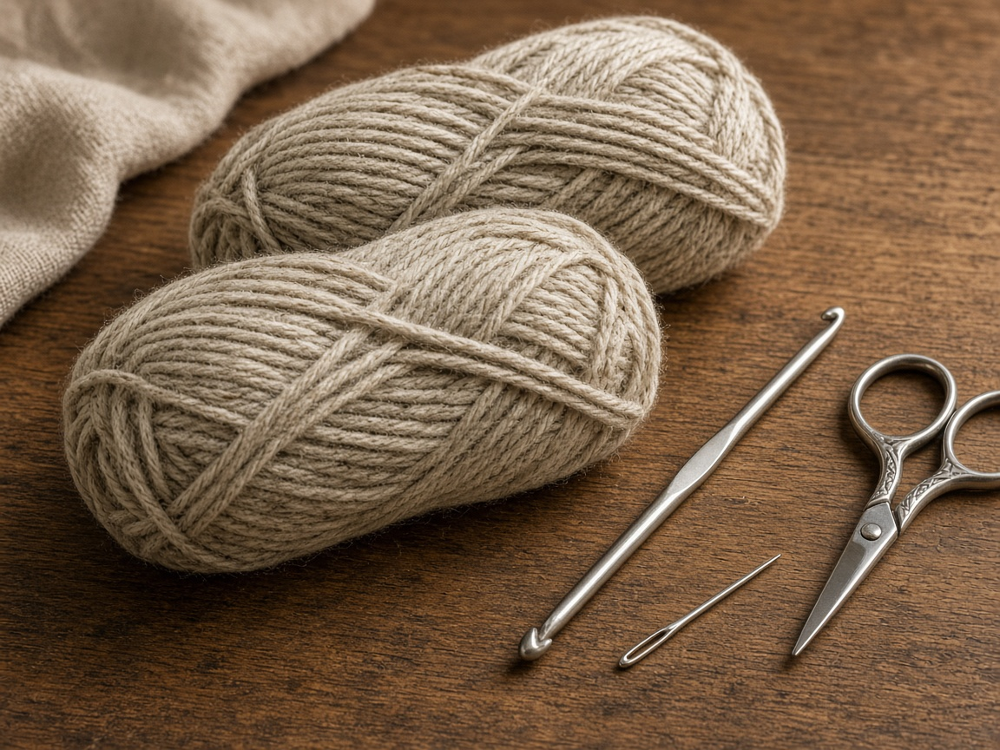
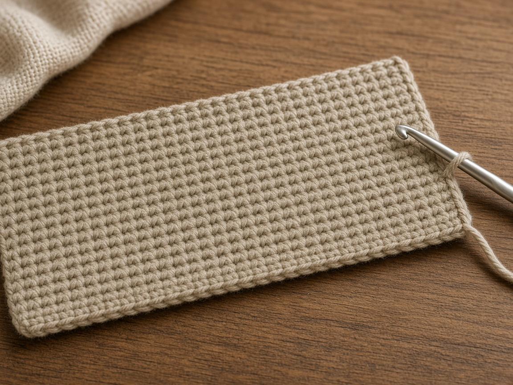
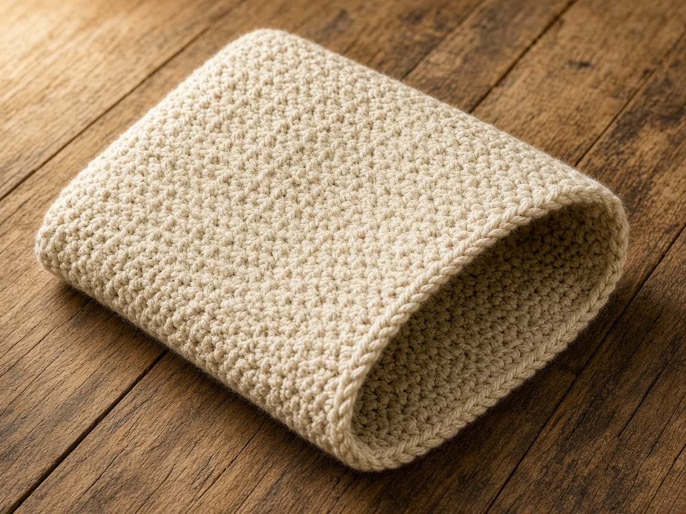
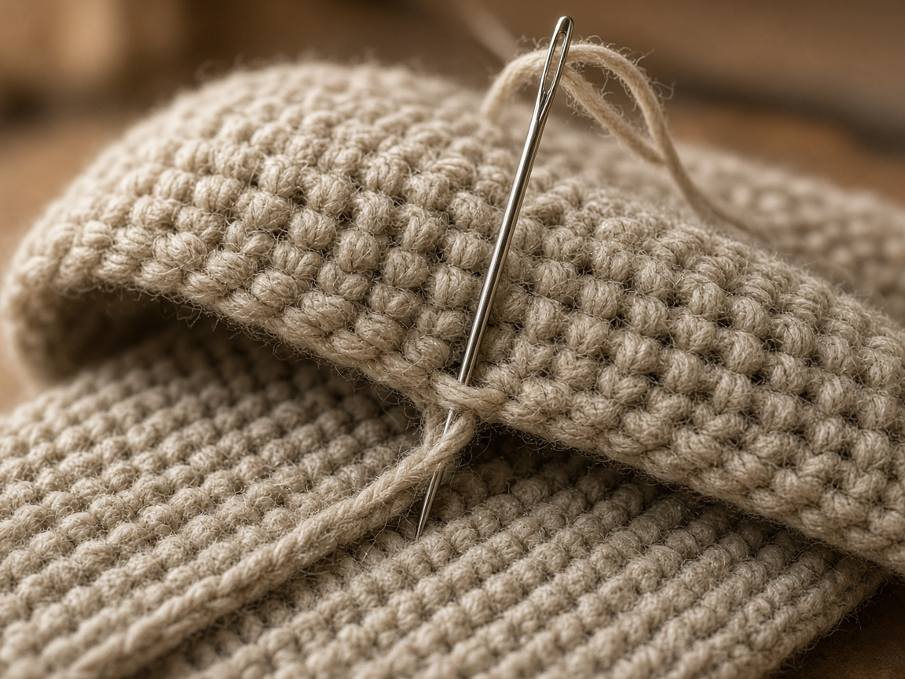
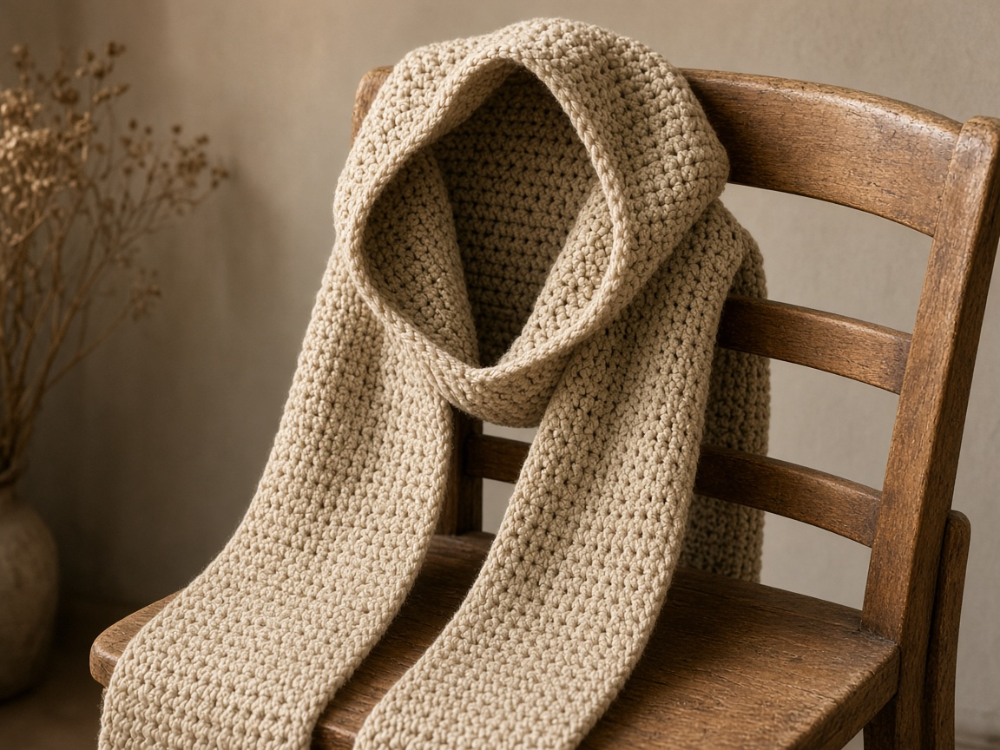

A scarf slides off the shoulders when you look down. A hood stays. Sewn together they are one object you can pull on without hunting for a hat. The hood is a rectangle. The scarf is a longer rectangle. The only skilled part is sewing the hood to the middle so it does not sit over one ear.

US terms. US half double crochet is not the UK half treble. If you follow a UK pattern by accident, your fabric will be a different stitch. This page is US half double crochet: yarn over, insert, pull up a loop, yarn over, pull through all three. [Abbreviations](/crochet-abbreviations-chart/). The photos are illustrations. This scarf has not been worn and measured in yarn.

## Size

The example scarf is **60 inches** long and about **8 inches** wide, before the hood. That wraps an average adult neck with ends left over for the chest. A taller person, or someone who wants the ends tucked into a coat, should add rows. Measure from one hip, around the neck, to the other hip, if that is how you will wear it. Use that number instead of 60.

The hood example is **24 inches** wide and **12 inches** tall before folding. Folded, it is a hood about **12 inches** across the face opening and **12 inches** deep. Try a sweatshirt hood you already like and copy those two numbers. Do not copy a picture.

## Materials

- Worsted yarn. About **500 yards** for the example. A longer scarf needs more. This was not weighed off a finished piece. [Yarn weights](/yarn-weight-chart/).
- US H/8 (5.0 mm) hook, or the hook that hits gauge. [Hook chart](/crochet-hook-size-conversion-chart/).
- Yarn needle, scissors.

Intermediate only because it is long and the sewing has to be centered. The stitches are beginner stitches. Plan more than one sitting. A 60 inch rectangle is a lot of rows to do in one night and then hate.

## Gauge (estimate)

**3 hdc = 1 inch. 2.5 rows = 1 inch.**

Unverified. Swatch 15 hdc for several rows. If 15 stitches are not about 5 inches, change the hook. [Gauge](/crochet-gauge/) on a scarf is mostly about yarn use and drape. A scarf that is an inch wider still works. A hood that is 4 inches too shallow does not cover the back of the head. Swatch anyway.

## Scarf

Ch 2 does not count as a stitch.

Chain 26.

**Row 1:** hdc in the 3rd chain from the hook and across. Ch 2, turn. (24)

**Row 2:** hdc in each stitch. Ch 2, turn. (24)

Repeat row 2 until the scarf is your length. At 2.5 rows to the inch, 60 inches is about **150 rows**. Count every 20 rows. A scarf that gains a stitch on the edge turns into a triangle. If the edges wander, you are dropping the first or last stitch. Count 24 every few rows.

Fasten off. Do not seam the scarf to itself.

## Hood

Chain 38.

**Row 1:** hdc in the 3rd chain from the hook and across. Ch 2, turn. (36)

Repeat the hdc row until the piece is about 12 inches tall. At 2.5 rows to the inch that is about **30 rows**. This rectangle is wider than the scarf on purpose. It has to go over the head.

Fold it in half so the short ends meet. The fold is the top of the head. Sew the side opposite the fold, from the fold down about 8 inches, and leave the rest open for the face and neck. You are making a pocket, not a bag.

## Sew it on

Find the center of the scarf. Mark it with a scrap of yarn. The hood's open bottom edge is what you sew to the scarf, centered on that mark. The face opening points the same way as one long edge of the scarf, so the hood sits on the neck edge and the rest of the scarf hangs down the front.

Sew through both layers with the yarn needle. Do not pull the seam so tight that the scarf puckers. Put it on before you weave the sewing end in. The hood should cover the back of the head without dragging the scarf up to your mouth. If it does, you sewed it too far onto the width of the scarf. Take it off and sew closer to the edge.

## Mistakes

**Hood at one end.** It looks like a pocket on a runner. Measure the center.

**Scarf twisted when you sew.** One end flips. Lay the scarf flat on a table, both ends the same way up, then sew.

**Hood seam closed all the way.** There is no face opening. Leave the front unsewn.

**Using the beanie's chunky yarn and these counts.** This page is worsted. Chunky will make a hood you cannot see out of. Swatch, or stay with worsted.

## Care

This is a lot of wet wool or acrylic if you wash it. Squeeze. Dry flat, hood open, so the back seam does not dry folded into a crease down the head. Check the label before a machine wash. A felted hood does not stretch back to the head you measured.

## Frequently asked

**Can I skip the hood and keep the scarf?**

Yes. Stop after the long rectangle. You still have a scarf. The yardage will be lower. Do not quote the 500 yard figure for a scarf alone.

**Is 60 inches the right gift length?**

It is one adult example. A child needs a shorter scarf so the ends are not under their feet. Measure or ask. Do not shrink 150 rows by half and call it a child size without checking the width too. A child hood is also smaller. Measure a hood they already wear.

**Will it stay on in wind?**

Better than a scarf alone. It is not a coat hood with a button. If the wind is the problem, the [ear warmer](/how-to-crochet-an-ear-warmer/) under a coat hood is the smaller fix.

## Next

Hands that still get cold are the [fingerless gloves](/how-to-crochet-fingerless-gloves/). A hat with no scarf is the [chunky beanie](/how-to-crochet-a-chunky-beanie/).
