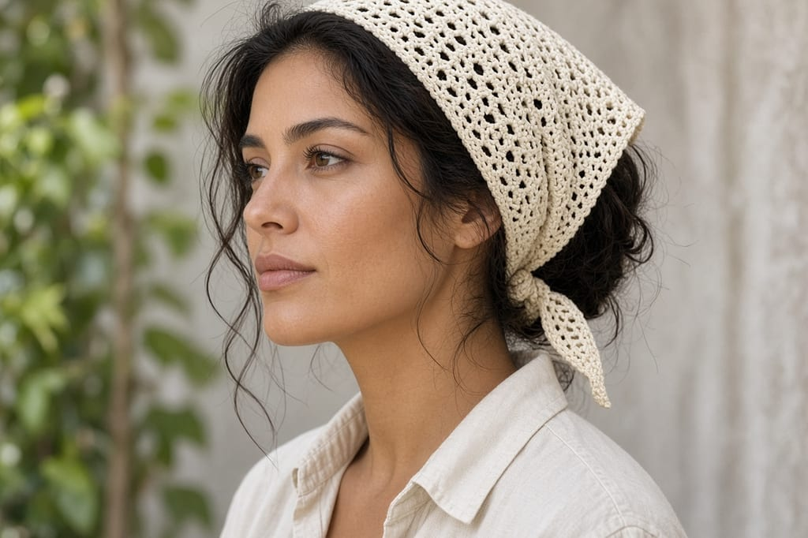
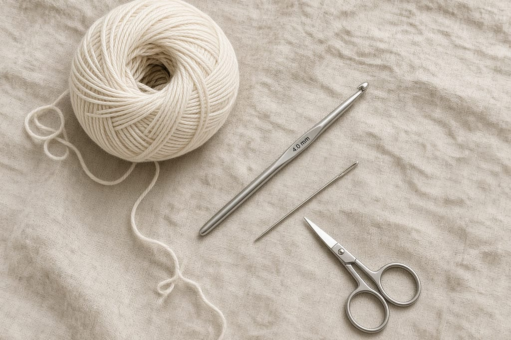
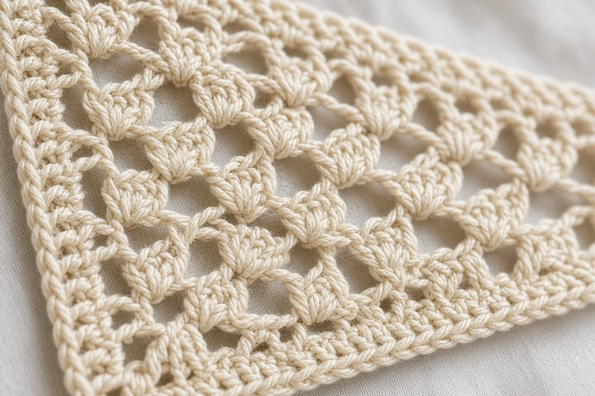
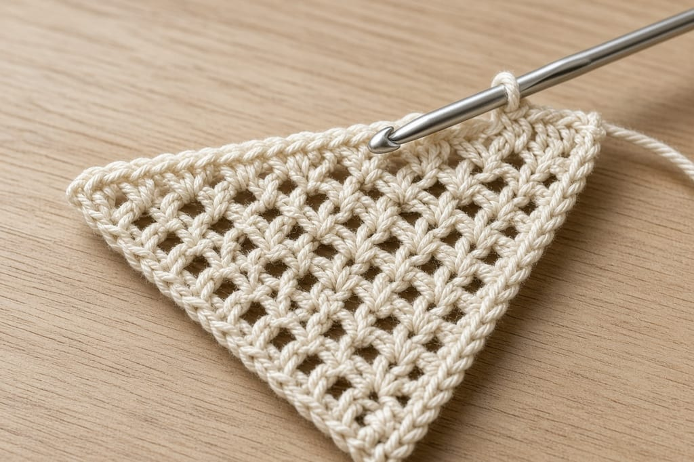
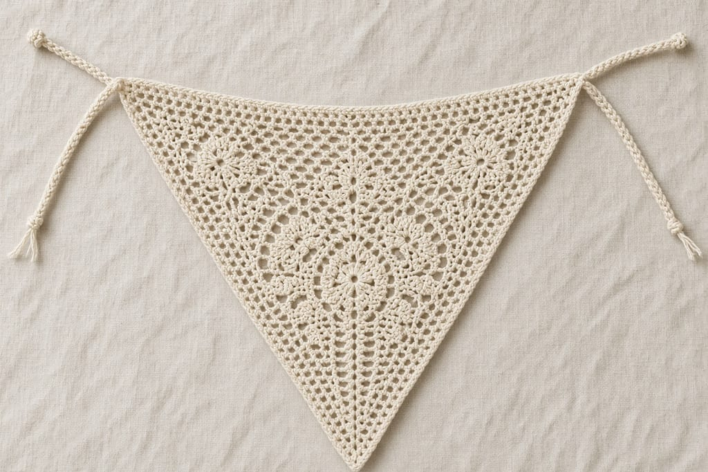
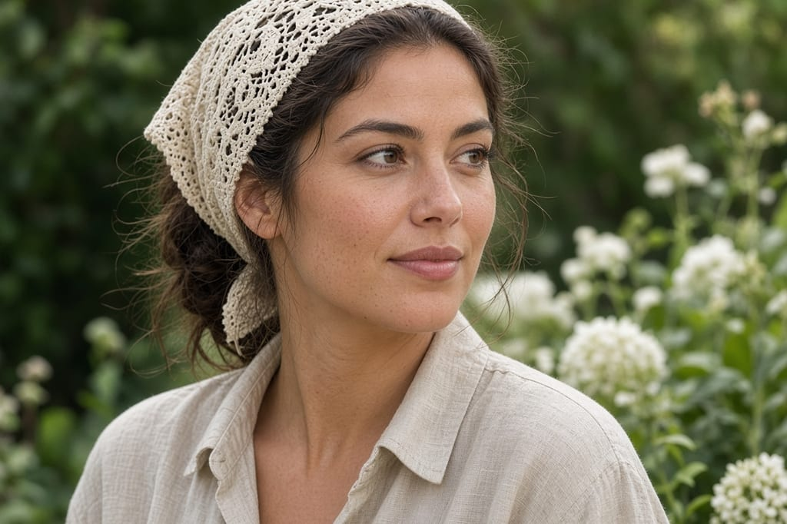

A bandana that slips off is just a triangle with no plan for the head it sits on. This one is an open granny triangle in cotton, with a tie at each end of the long edge. You stop when that edge measures the width you need, instead of trusting a row count from someone else's gauge.

US terms. US double crochet is UK treble. Names are on the [abbreviations chart](/crochet-abbreviations-chart). The turning chain of 3 counts as a double crochet in this pattern. That is one of the places crochet is not standardized. [The turning chain](/crochet-turning-chain) explains why edges go wrong when you count it and also skip it.

Photos are illustrations of a cream triangle with two ties. This bandana has not been worn and measured in yarn. Make the long edge to your tape, not to the picture.

## Yarn and hook

- DK-weight cotton, cream. About **80 yards** if you stop near a 16-inch long edge, more if you go wider. [Yarn weights](/yarn-weight-chart).
- US G/6 (4.0 mm) hook, or the size that keeps the clusters open without looking like netting. [Hook chart](/crochet-hook-size-conversion-chart).
- Yarn needle, scissors, a tape measure.

Intermediate, because you have to find the corner space every row. A few hours.

Worsted yarn makes a stiff triangle that sits like a napkin. Thread makes a bandana that takes forever and needs a smaller hook. DK cotton is the middle.

## Size

Tie a scrap of yarn around your head where you want the bandana to sit, from the hairline at one side to the other, across the forehead or over the crown. Measure that scrap. That length is your long edge.

A common stopping point is about **16 inches** on the long edge, with ties of about **12 inches** each. That is a target, not a promise. Hair volume changes it. If the triangle will not reach both sides, add rows. If it covers your eyes, you went too far.

## Stitches in this pattern

- **Shell:** 3 dc in the same stitch or the same space.
- **Corner:** (3 dc, ch 2, 3 dc) in the ch-2 space.
- Ch 3 at the start of a row counts as the first dc of a shell. You then work 2 dc in the same place to finish that shell.

## Triangle

**Row 1:** Ch 4. In the 4th chain from the hook, work 2 dc, ch 2, 3 dc. Turn.

The chain you worked into is the point. You should see two shells with a ch-2 corner between them. The first shell is the 2 dc plus the ch-3 that sits at the start of that chain-4. Count it as one shell, then the corner, then the second shell. If you see three shells, you worked extra stitches into the chain.

**Row 2:** Ch 3, 2 dc in the same stitch (the top of the edge). Ch 1. In the corner space, work (3 dc, ch 2, 3 dc). Ch 1. Work 3 dc in the top of the turning chain. Turn.

Each side of the corner now has one shell, then a ch-1, then the corner shells.

**Row 3:** Ch 3, 2 dc in the same stitch. Ch 1. Work 3 dc in the next ch-1 space, ch 1. Work the corner in the ch-2 space. Ch 1. Work 3 dc in the next ch-1 space, ch 1. Work 3 dc in the top of the turning chain. Turn.

One side, in order: edge shell, ch 1, shell in the space, ch 1, half of the corner. The other side mirrors it.

**Row 4 and after:** Ch 3, 2 dc in the same stitch, ch 1. Work (3 dc in the next ch-1 space, ch 1) in every ch-1 space until you reach the corner. Work the corner. Ch 1. Work (3 dc in the next ch-1 space, ch 1) in every remaining ch-1 space. End with 3 dc in the top of the turning chain. Turn.

Each new row adds one shell on each side of the corner. If one side has more shells than the other, you skipped a space or you worked into a stitch instead of a space. Count shells before you turn.

Stop when the long edge matches your measured length. Do not add a row "to be safe" without measuring. One granny row on DK cotton is a real amount of width.

## Ties

Join cream yarn at one end of the long edge. Chain until the tie measures about 12 inches, or chain 70 and then check the tape. Slip stitch into the same corner to anchor it if the chain twists away, then fasten off. Repeat on the other end.

Sew each tie down for half an inch so a tug hits the seam, not one loop of the corner. Weave the ends back along the chain.

## Wearing it

Put the long edge at the forehead or over the crown, point toward the nape, and tie the ends. If the point hangs in your collar, the triangle is too deep for that long edge, which means the row grew evenly and you simply wanted a shallower cloth. Stop earlier next time. Do not cut the point off.

The open stitches will catch earrings and small hair clips. Take those out before you tie it.

## Changes

**A second color on the last row.** Change color on the last yarn-over of the previous row, the way [changing yarn color](/changing-yarn-color-crochet) describes, and work one more row in the new color. Do not change in the middle of a shell.

**No ties.** Sew the corners to a short elastic only if you understand the elastic length has to be shorter than the gap you are closing. A guessed elastic will either fall off or crease the edge. Ties are the version this page actually specifies.

## Mistakes

**Working the corner into a ch-1 space.** The corner belongs in the ch-2 space only. A ch-1 corner makes the triangle lean.

**Forgetting that ch 3 counts.** You will add a shell and also skip the turning chain, and that side grows faster. Pick one method. This page counts it.

**Blocking with an iron.** Pin the damp triangle to the measurements you want and let it dry. The steps are in [weaving ends and blocking](/weaving-in-ends-and-blocking). Acrylic can melt. This pattern asks for cotton.

## Care

Hand wash cool. Dry flat, pinned if you need the edge straight again. Do not machine dry. Cotton can shrink, and a shrunken long edge is a bandana that no longer meets at the back.

## Frequently asked

**Is this a kerchief or a hair scarf?**

It is a triangle you tie on. The name depends on where you put the long edge. The pattern does not change.

**Can I sell finished bandanas?**

Yes. Do not republish the rows.

**What if my shells look crowded?**

Move up one hook size and start Row 1 again. Do not try to loosen a finished triangle by pulling the corner. You will distort the point.

## Next

A flat openwork piece with a different job is the [snowflake](/how-to-crochet-a-snowflake), which is about keeping points flat. If you would rather make something you do not wear, the [book sleeve](/how-to-crochet-a-book-sleeve) is solid single crochet sized from a tape in the same way.
