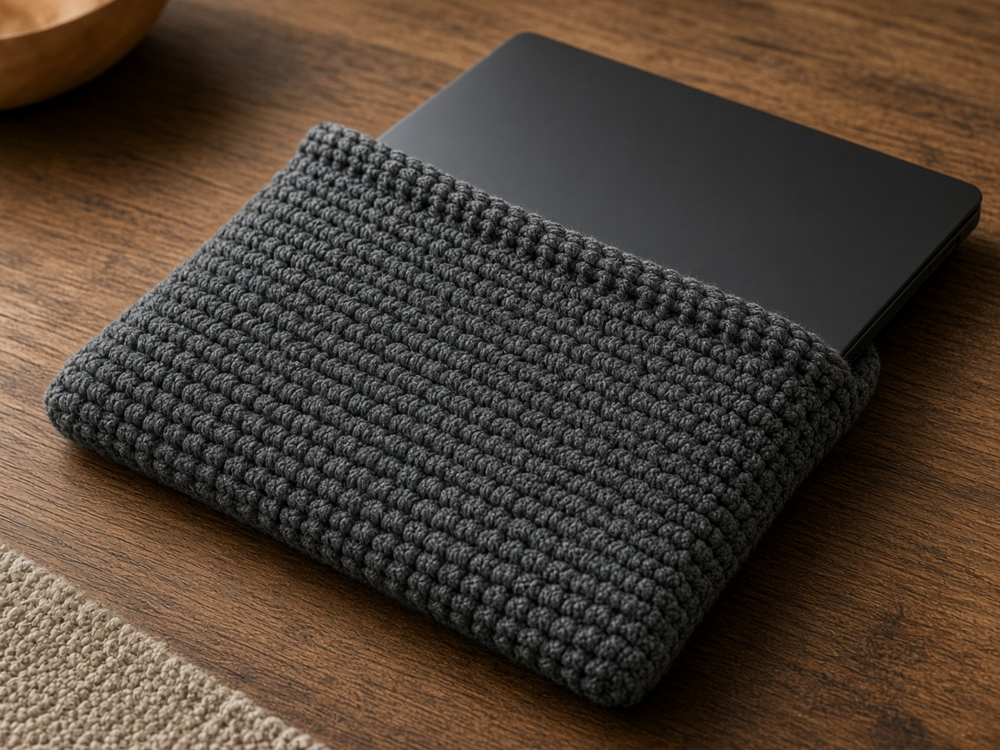
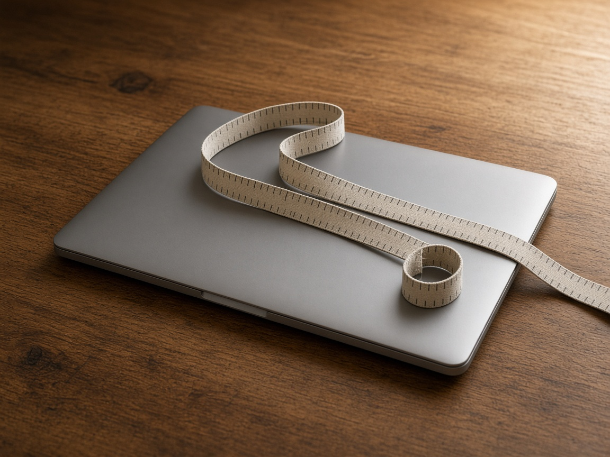
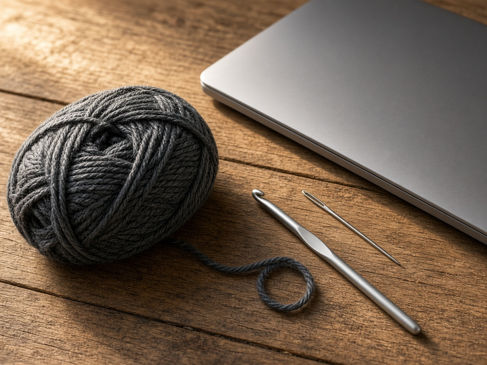
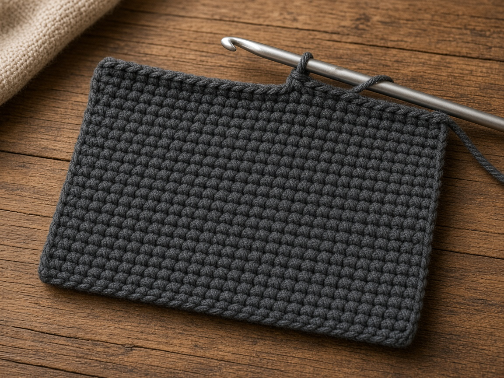
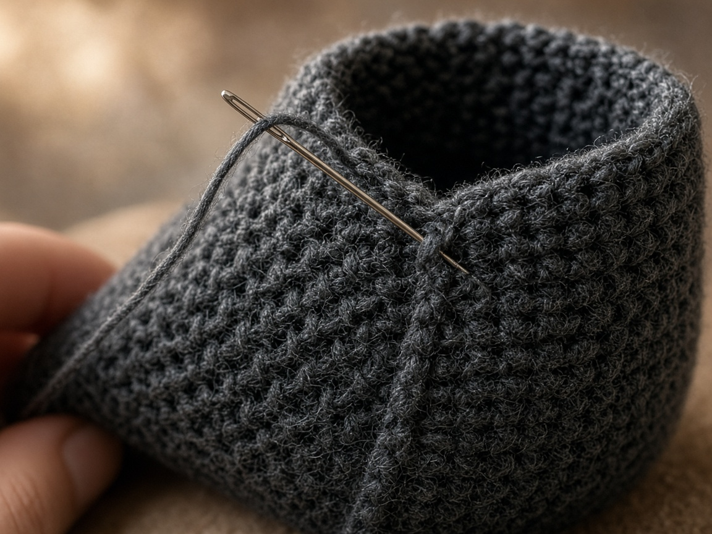
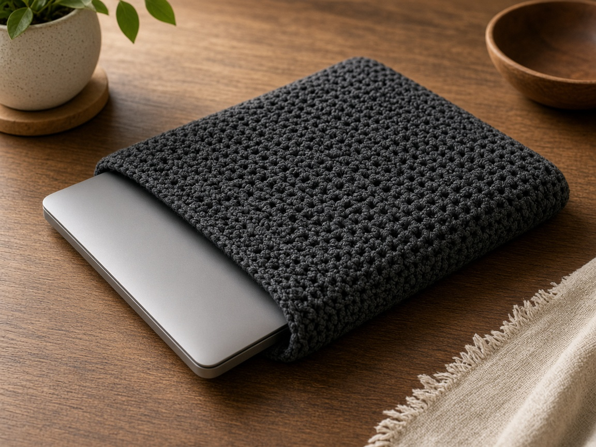

A laptop in a tote shares the pocket with a charger, a pen, and the corner of a notebook. The lid gets scratched, and the pen prints a line through any hole in the fabric. A crochet sleeve is a soft single-crochet cover, folded and seamed, sized from the closed laptop. It keeps that rubbing down. It is not waterproof. It is not drop protection. Single crochet has gaps, and yarn does not cushion a fall off a table.

The construction is the same idea as a [book sleeve](/how-to-crochet-a-book-sleeve/): measure the closed object, crochet a rectangle, fold it, seam the sides, leave the top open. A book in that pattern is often left partly visible so you can pull it out. A laptop on this page is covered for its full height, because a bare corner catches zippers.

US terms. US single crochet is UK double crochet. [Abbreviations](/crochet-abbreviations-chart/). The photos are illustrations. This sleeve has not been yarn-tested. The inches and the yardage are estimates from the gauge below. Measure the closed laptop with a tape. The diagonal printed on the box is the screen size, not the width of the lid.

The sleeve will not stop a spill, and it will not save a laptop from a drop. It is a soft layer between the lid and whatever else is in the bag.

## Measure the closed laptop

Closed, on a table, lid shut.

- Width, edge to edge, in inches.
- Depth, front edge to back edge, in inches.
- Thickness, if the laptop is chunky. A sleeve planned from width and depth alone can still be tight across the front.

Add about **1 inch** to the width and about **1/2 inch** to the depth so the laptop slides. The rectangle you crochet is as wide as that eased width, and twice as tall as that eased depth, because you fold it in half.

Example, so the pattern has counts: a closed laptop about **12 inches wide and 8.5 inches from front to back**, under an inch thick. Eased width about **13 inches**. Eased depth about **9 inches**. The rectangle is about **13 by 18 inches**. At the gauge below, that is **52 stitches and 90 rows**.

Many laptops are larger than that. A number like 13 on a box is often the screen diagonal, which is not 13 inches of lid. If your tape disagrees with 12 and 8.5, use the tape. Hold the unfinished rectangle around the closed laptop before you seam anything. The side edges should meet with a little overlap. If they do not meet, add stitches on the next try, or add rows if the shortfall is the depth. If they overlap by a lot, a slightly roomy sleeve is still a sleeve. A tight one will not take the laptop.

## Materials

- Worsted cotton, gray or another solid color. About **380 yards** for the 12 by 8.5 inch example. A larger laptop needs more. The figure is a planning estimate from the stitch count, not a weighed sleeve. [Yarn weights](/yarn-weight-chart/).
- US G/6 (4.0 mm) hook, or the hook that hits gauge. [Hook chart](/crochet-hook-size-conversion-chart/).
- Yarn needle, scissors.

Cotton holds its width better than a stretchy acrylic, which matters because a stretched sleeve lets the laptop slide out in the bag. Cotton is still not a rain shell. Beginner, and slow, because 90 rows of the same stitch is a long rectangle. Count as you go. A weekend project is a fair guess for the example. Your laptop may need more rows.

## Gauge (estimate)

**4 sc = 1 inch. 5 rows = 1 inch.**

At that gauge, 52 stitches are about 13 inches and 90 rows are about 18 inches. [Gauge](/crochet-gauge/) is the pattern. These numbers were not taken from a sleeve that had a laptop in it. If your swatch is not 4 sc to the inch, divide the inches you measured by your own stitches per inch and round to a whole number. Then chain one more than that stitch count.

Ch 1 does not count as a stitch.

## Rectangle

Chain 53.

**Row 1:** Sc in the 2nd chain from the hook and across. Ch 1, turn. (52)

**Rows 2–90:** Sc in each stitch. Ch 1, turn. (52)

Count every 10 rows. A row that gains a stitch will not fold straight. Rip back to the row where the count changed. Do not decrease later to "fix" it. The bottom fold will still be crooked.

Before you seam, wrap the rectangle around the closed laptop. The fold is the bottom. Row 1 and row 90 meet at the opening. Sew the side edges only. If the laptop sticks out, add rows. If it will not sit inside the width, add stitches. Seams do not add fabric.

## Seam

Fold so row 1 meets row 90. Sew both side edges through both layers, from the fold to the opening. Leave the top open. At each bottom corner, sew a second pass for about an inch. A laptop is heavier than a paperback, and that second pass only keeps the seam from gaping in ordinary carrying. It is not drop protection.

Slide the laptop in. It should enter without bending the lid and sit fully inside. If a corner still shows, add rows. If you have to force it, take the seams out and add fabric.

## What it will not do

Water goes through single crochet. Keep the sleeve out of the same pocket as a drink. A pen can still mark the lid through the stitches. A fall, a drop, or a bag thrown into a trunk is outside what this yarn can do. The example has no flap. If you want a closure, sew a button on the back and crochet a short chain loop on the front only after the laptop is inside.

## A different laptop

1. Closed width, plus about 1 inch, times your stitches per inch. That is the stitch count.
2. Closed depth, plus about 1/2 inch, times 2, times your rows per inch. That is the row count.
3. If the laptop is thick, hold the rectangle around it before seaming and add width until the sides meet without strain.
4. Chain one more than the stitch count, work the rows, fold, seam the sides.

The 52 by 90 rectangle is only those steps filled in for the example at 4 sc and 5 rows to the inch.

## Mistakes

**Using the screen diagonal as the width.** The number on the box is the screen, not the lid. Measure the closed laptop.

**Seaming the opening.** The laptop cannot go in. Sew the side edges only.

**A lacy stitch.** Gaps let pens and zipper teeth through. Single crochet is the dense option here, and it is still not waterproof.

**Ignoring thickness.** A sleeve that fits the width and the depth on paper can still refuse a chunky lid. The wrap test before seaming is the check.

**Washing it with the laptop inside.** Take the laptop out. Every time.

## Care

Remove the laptop. Hand wash cool. Dry flat. Put the laptop back only when the sleeve is dry. Damp cotton on a closed lid is moisture in the bag. Do not iron the sleeve on top of the laptop.

## Frequently asked

**Will it fit every laptop?**

No. The 52 by 90 rectangle matches the example at the gauge above, a closed machine near 12 by 8.5 inches with ease. Measure yours.

**Is it safe in the rain, or if I drop the bag?**

No. It is not waterproof, and it is not drop protection. On a wet day, use a bag that actually sheds water and keep this sleeve for dry carrying.

**How is this different from the book sleeve?**

Same fold and the same seam. The [book sleeve](/how-to-crochet-a-book-sleeve/) is often shorter than the book so the cover still shows. This one is planned to cover the full lid, and the example numbers come from a laptop measurement, not from a paperback.

## Next

The folded-rectangle method, written for a book, is the [book sleeve](/how-to-crochet-a-book-sleeve/). If the row count keeps drifting, the fix is the swatch in [crochet gauge](/crochet-gauge/), worked before the 90 rows and not after.
