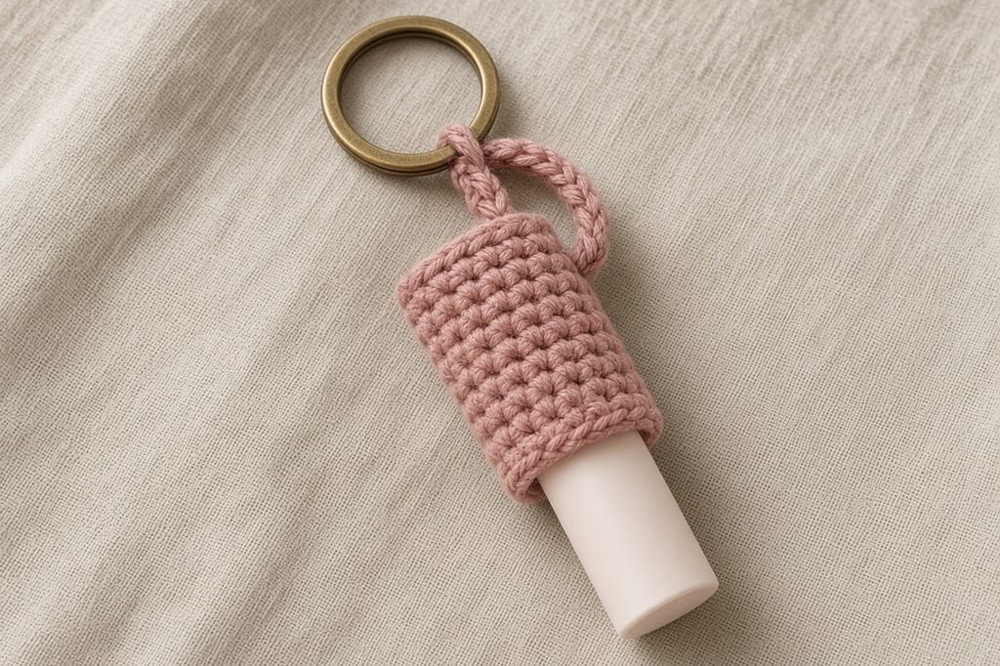
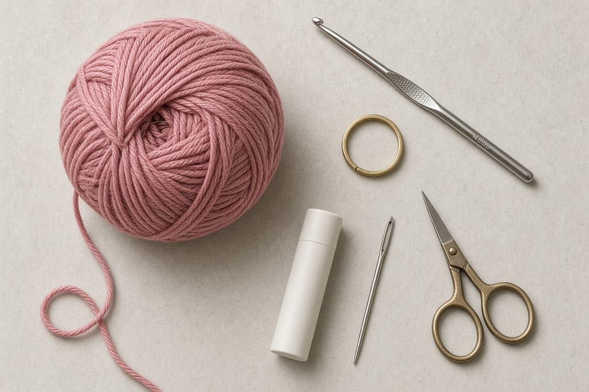
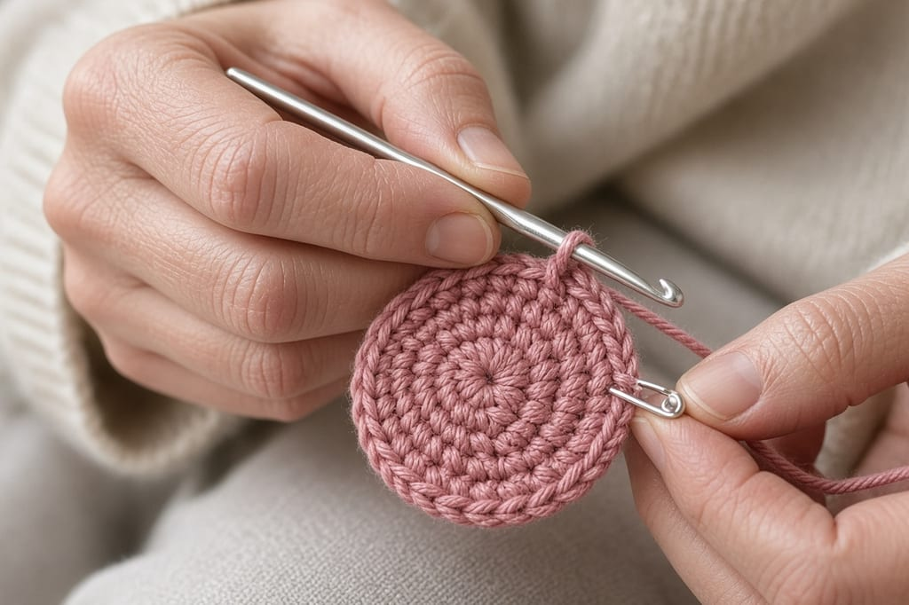
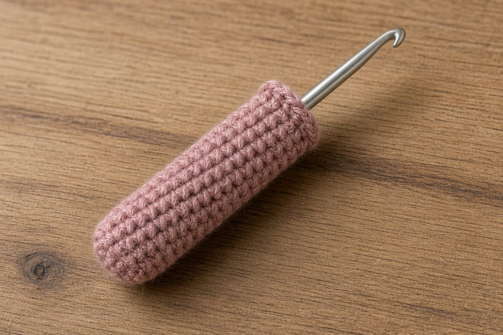
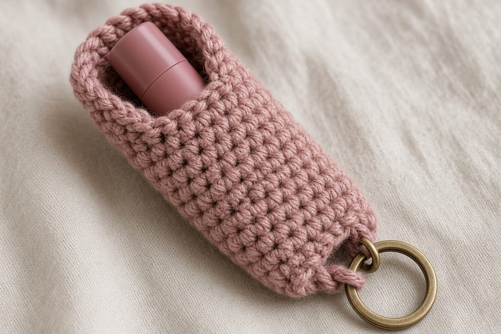
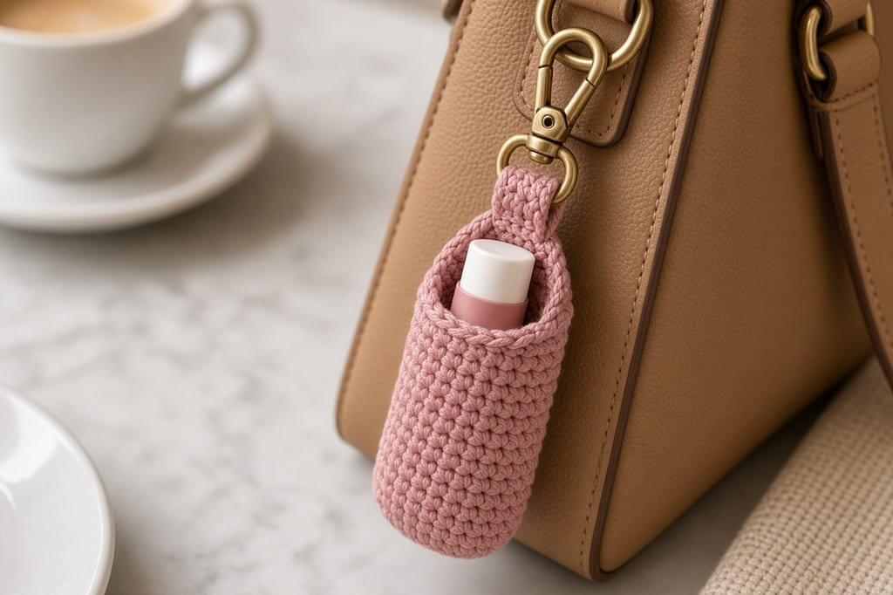

A lip balm tube at the bottom of a bag is the one you never find. A short sleeve with a key loop keeps it on the hardware you already reach for.

The sleeve is a narrow single-crochet tube. The cap stays out so you can open it without taking the tube out. US terms. US single crochet is UK double crochet. [Abbreviations](/crochet-abbreviations-chart).

Photos are illustrations. This holder has not been fitted to a named brand. Measure your tube. A typical stick is close to 2.5 inches tall and under 3/4 inch across, and plenty of them are not.

## Materials

- Worsted cotton, dusty rose, about **15 yards**. [Yarn weights](/yarn-weight-chart).
- US G/6 (4.0 mm) hook, or a size that keeps the fabric firm. [Hook chart](/crochet-hook-size-conversion-chart).
- A split ring or a short strap of bag hardware.
- Yarn needle, scissors, stitch marker.

Beginner. Under an hour.

## Gauge (estimate)

**4 sc = 1 inch. 5 rounds = 1 inch.**

Nine stitches around is about **2.25 inches** in circumference, so the inside is a little under **3/4 inch** across. Ten even rounds are about **2 inches** of sleeve. The cap should stick out past that.

## Sleeve

Spiral. Marker. No join. [In the round](/crochet-in-the-round).

**Round 1:** 6 sc in a magic ring. Pull the ring tight. (6)

**Round 2:** (sc, inc) 3 times. (9)

Check: three repeats of 2 stitches use all 6, and three increases bring you to 9.

**Rounds 3–12:** sc in each stitch. (9)

That is 10 rounds with no increases.

Slide the lip balm in, cap up. The base of the stick should touch the ring end. The cap should clear the rim by enough to twist. If the sleeve is short, add rounds at 9 stitches. If the tube rattles, the fabric is loose: start over on a smaller hook rather than decreasing a round you already worked.

## Loop

Chain 14. Fold the chain in half and sew both ends to the outside of Round 1, the closed base. The loop should be long enough for your split ring and short enough that the tube does not swing into the ground.

Put the ring through the loop. Do not crochet the metal into the stitches. You will want the ring off when you wash the sleeve.

## On a bag

Clip the ring to a D-ring or a zipper pull you already use. If the sleeve hangs upside down, the tube can walk out. Hang it so the closed base is down, or add one loose strand of yarn across the rim as a keeper you can slide aside. A keeper is optional. A tight sleeve often holds on its own.

## Color and yarn

Dusty rose is the color in the photos. Any smooth worsted cotton works. A dark color hides the tube, which is fine until you are digging for it. A very light color shows every bit of balm that smears on the rim. Wipe the rim of the tube before you put it back.

Do not use a yarn with sequins. The sequin cups catch the twist of the balm and you will fight the tube every time.

If you want a set, make the sleeves the same stitch count and change only the color. Different counts in one bunch means one tube fits and the next one falls out, and you will not remember which is which.

## On keys

Keys are harder on the loop than a bag ring. The chain rubs. Sew the loop through several stitches of the base, then weave the tail back through the chain. A loop caught by one stitch pulls out the first time the keys drop.

Keep the sleeve off the ignition key if that key lives in a pocket with coins. Coins chew cotton. A backpack zipper pull is a calmer place.

## Fit test

Use the tube you will actually carry, not a similar one from a different brand. Push it in, twist the cap, and pull it out ten times. The sleeve should stay on the ring, and the tube should stay in the sleeve. If the tube walks out on the fifth pull, the 9-stitch tube is loose for that stick. Start again at 9 stitches on a smaller hook, or accept that this stick needs the 12-stitch version and a keeper strand across the rim.

Check the loop length with the ring on. You should be able to open the split ring without sewing the cotton into the metal. If the chain is too short to feed the ring, add chains before you sew, not after.

## Wider tube

If Round 2 at 9 stitches will not take your stick, work Round 2 as inc in each stitch. (12) Then work the even rounds on 12. Do not jump to 12 if 9 already fits. Extra width is how the stick falls out.

## Mistakes

**A long sleeve that covers the cap.** You cannot open it. Stop when the cap clears the rim.

**Sewing the loop to the rim.** The tube then hangs cap-down and slides out. Sew the loop to the closed base.

**A fuzzy yarn.** It grabs the twist mechanism. Cotton stays smoother.

## Care

Remove the balm and the ring. Hand wash cool. Dry flat. Do not machine dry. Heat can shrink the sleeve so the tube no longer fits.

## Frequently asked

**Will any lip balm fit?**

No. Nine stitches is a starting size at the gauge above. Measure, then add rounds or move to 12 stitches.

**Can I sell them?**

Finished holders, yes. Do not copy this page.

**Can I use sock yarn?**

Yes, with a smaller hook. Ignore the inch estimates and fit the real tube.

## Next

The same small tube idea, with a flap instead of an open rim, is the [earbud pouch](/how-to-crochet-an-earbud-pouch). A flat card holder is the [Halloween card wallet](/halloween-crochet-card-wallet).
