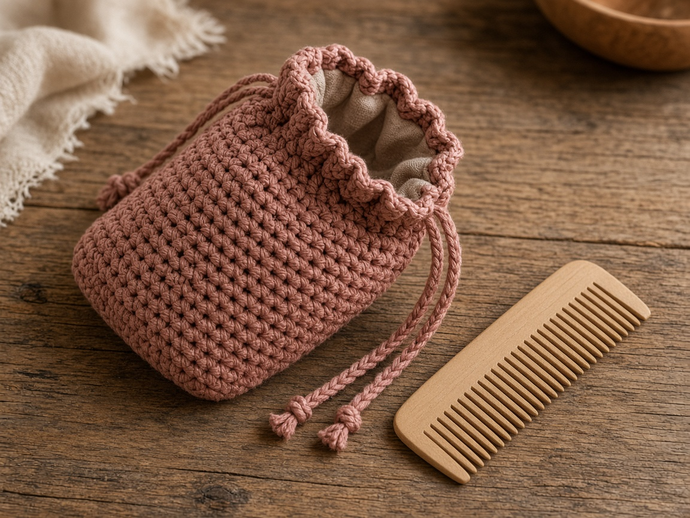
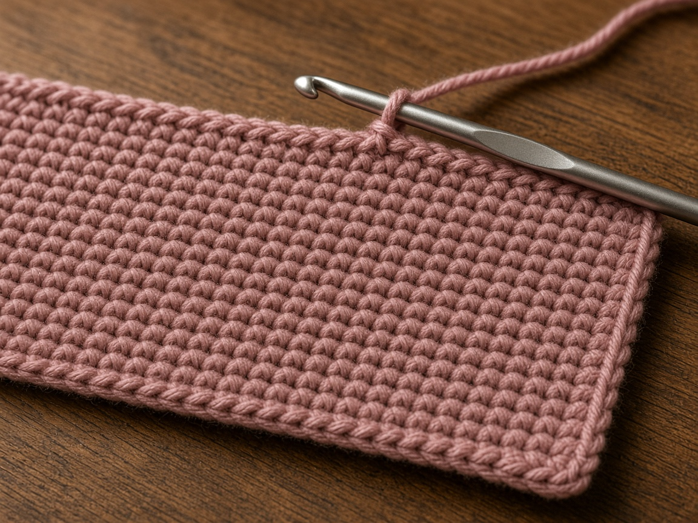
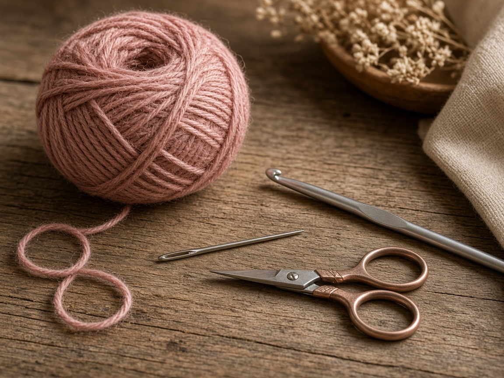
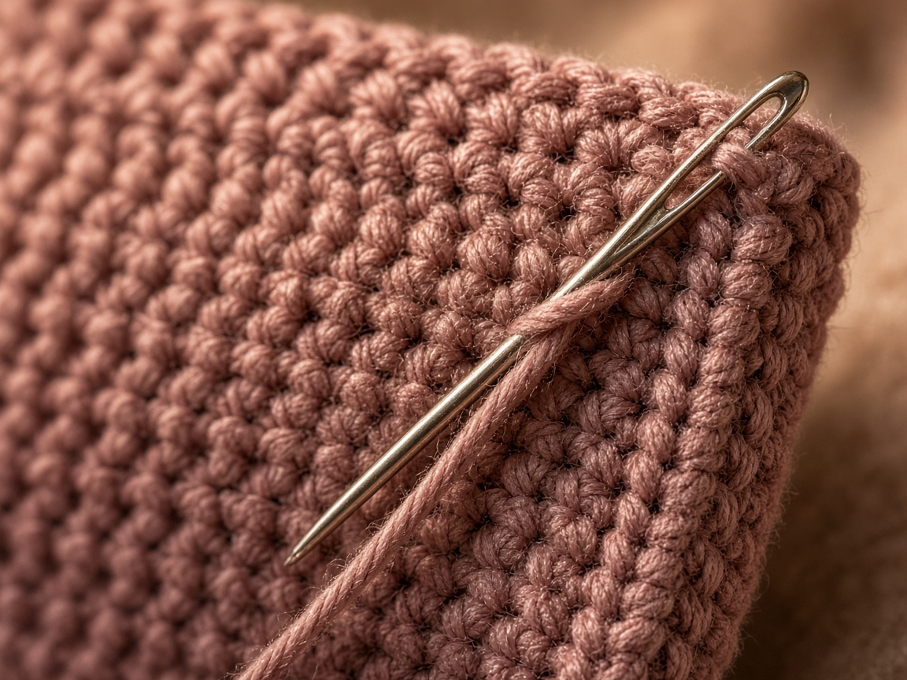
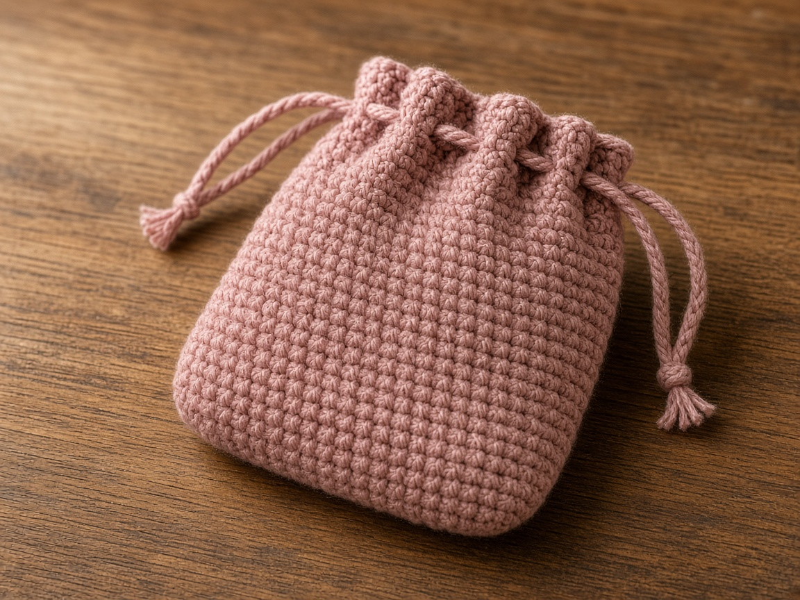
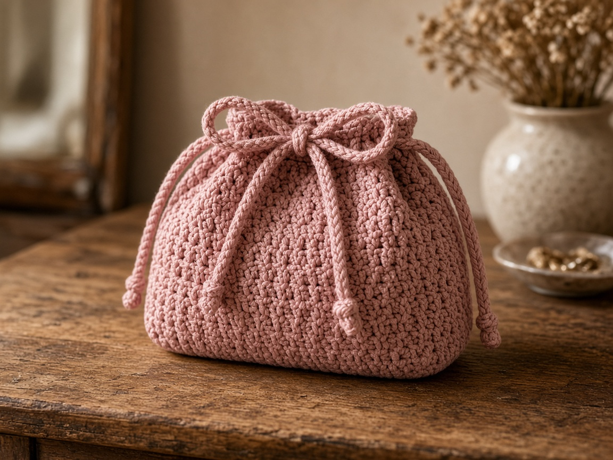

Makeup at the bottom of a bag picks up crumbs, and an open tube leaves a mark on a book. A small pouch keeps the tubes in one place and lets you pull the whole set out at once. Cotton will stain. It will not hold a spill. Treat it as a dry organizer, not a wash bag.

Measure what you carry. The numbers below are one example. US terms. US single crochet is UK double crochet. [Abbreviations](/crochet-abbreviations-chart/). The photos are illustrations. This pouch has not been packed or measured in yarn. Inches and yardage are estimates from the gauge.

## Measure

Lay out the items you want in the pouch. You need two numbers:

- The width of the widest item, plus a little room so it is not scraped in.
- The height of the tallest item, plus room to close the top above it.

Example, not a packing list: a pouch about **7 inches** wide and **5 inches** tall, for a few short tubes and a small compact. At the gauge below, that is a rectangle **28 stitches** wide and **50 rows** long. The 50 rows are the front and the back together. Folded, 50 rows is about **10 inches**, which makes a pouch about **5 inches** tall. If you stop at 5 inches of rows, the finished pouch is about 2.5 inches tall and your tubes will stick out of the top.

Write your own counts before you chain:

1. Width in inches, plus about 1/2 inch, times your stitches per inch. That is the stitch count.
2. Twice the height you want, times your rows per inch. That is the row count.

A stack of palettes needs more width. A long pencil needs more height. Measure the pencil. Do not guess from the photo.

## Materials

- Worsted cotton. About **100 yards** for the example, including the tie. A larger pouch needs more. This was not weighed off a finished pouch. [Yarn weights](/yarn-weight-chart/).
- US G/6 (4.0 mm) hook, or the hook that hits gauge. [Hook chart](/crochet-hook-size-conversion-chart/).
- Yarn needle, scissors.

Cotton washes. Makeup oils still stain it, and a dark lipstick will not come out of a pale yarn just because the yarn is cotton. If you care about stains, use a color that can show a mark without looking ruined. Fuzzy yarn grabs product and pills inside the pouch. Skip it.

Beginner. One sitting after you have the measurements. The only easy mistake that ruins the size is forgetting that the rectangle is both the front and the back.

## Gauge (estimate)

**4 sc = 1 inch. 5 rows = 1 inch.**

Unverified on a pouch. Swatch. [Gauge](/crochet-gauge/) is how you turn 7 inches into 28 stitches. If your swatch is 3.5 sc to the inch, 28 stitches is 8 inches, and the pouch is a different object. Divide again. Do not follow 28 and 50 unless you are close to this gauge and you want this example size.

The [basic single crochet](/basic-crochet-stitches/) is the whole fabric. A taller stitch makes holes, and a powdered compact will dust through them.

## Rectangle

Ch 1 does not count as a stitch.

For the example, chain 29.

**Row 1:** Sc in the 2nd chain from the hook and across. Ch 1, turn. (28)

**Rows 2–50:** Sc in each stitch. Ch 1, turn. (28)

Twenty-eight stitches at 4 sc to the inch is about **7 inches**. Fifty rows at 5 rows to the inch is about **10 inches**. Keep the starting chain looser than the rows so the bottom edge, which is the fold, does not cup.

Count the rows in tens. If you lose count, measure. Ten inches of fabric is the example. Your tape overrules the number 50.

## Seam

Fold so the fold is the bottom, at the middle of the length. Row 1 and row 50 meet at the top. They are the opening. Do not sew them together.

Hold the side edges with right sides together. Single crochet through both layers from the fold up to the top row. Fasten off. Repeat on the other side. Turn the pouch right side out.

The side seams should stop at the opening. If you seam across the top, nothing can go in. If you leave a gap at the bottom corner, powder will leave through it. Start the seam in the fold, not one row above it.

## Drawstring

Join yarn at one side seam, on the opening. You are working around both top edges. The example has 28 stitches on each edge, **56** around. If your seams used the end stitches, count what is left and add or skip a stitch so the total is even. The eyelet round needs an even number.

**Eyelet round:** Ch 1, *sc in the next stitch, ch 1, skip 1* around. Join with a slip stitch to the first sc. (28 sc and 28 chain-spaces on a 56-stitch opening)

**Next round:** Ch 1, sc in each sc and in each chain-space around. Join. Fasten off. (56)

The chain-spaces are the holes the tie runs through. The second round sits above them so the tie has a little tunnel and the top edge does not roll into a ruffle.

**Tie:** Chain **110**. Test it around the pouch before you weave. You want the chain to go all the way around and still leave two tails you can knot. If the tails are short, pull the chain out and add chains. Do not guess an inch length from 110 chains. Chain gauge is not the single-crochet gauge.

Weave the chain through the eyelets, in and out, starting and ending at the center front. Knot each tail so the chain cannot pull back through a hole. Pull the two tails to close the pouch.

Do not put nail polish, a leaking bottle, or a wet brush in this pouch. Cotton will hold the stain and pass the liquid to whatever it touches. Dry tubes and a compact are the use. If you need a wet bag, this is the wrong fabric.

## A different set of items

A lipstick does not need a 7 inch pouch. Use the two-line formula above, and keep the eyelet round on an even stitch count. If the top is much under 8 inches around, the chain is harder to weave. Still skip 1, not 2, or a tube can slip through a loose tie.

A wide palette needs more stitches, not a second rectangle sewn on. One rectangle folds. Two rectangles make a lump, and the drawstring will not close.

## Mistakes

**A rectangle that is only the front.** Fifty rows feels long on the hook. Folded, it is the example height. Stop at 25 rows and the pouch is half as tall as you planned.

**Sewing the top shut.** The drawstring then decorates a bag you cannot open. Seam the sides only.

**A short tie.** It goes around once and the tails disappear into the eyelets. Test 110 chains, or whatever you chained, before you weave.

**Uneven eyelets.** If you forget a skip, the tie bunches on one side and the pouch closes in a twist. The count is sc, chain 1, skip 1, all the way around, on an even number.

## Care

Empty it. Hand wash cool. A stained spot from makeup may not leave. Dry flat, with the tie pulled free so the eyelets do not dry crushed. Put products back only when the cotton is dry. Damp cotton in a purse smells, and it will mark a book sleeve sitting next to it.

## Frequently asked

**Will it fit a full makeup bag's worth?**

Not the example. Seven by five inches is a small pouch. Measure the pile you mean, and change the stitch count and the row count. Do not stuff the example and hope the seams give.

**Can I sell pouches?**

Finished pouches, yes. Do not republish the rows as your pattern.

**Can I line it?**

A cloth lining stops small crumbs and some stains. Cut it from the pouch you finished, not from these estimates, because your gauge may not be 7 by 5. This page does not include a lining pattern. Unlined cotton is the project as written.

## Next

The same rectangle, sized to a phone and given a long strap, is the [phone crossbody](/how-to-crochet-a-phone-crossbody/). A flat cover for a book is the [book sleeve](/how-to-crochet-a-book-sleeve/). If the pouch is only one thing inside a larger bag, the open carry is the [granny square tote](/how-to-crochet-a-granny-square-tote/), which will drop anything smaller than its holes.
