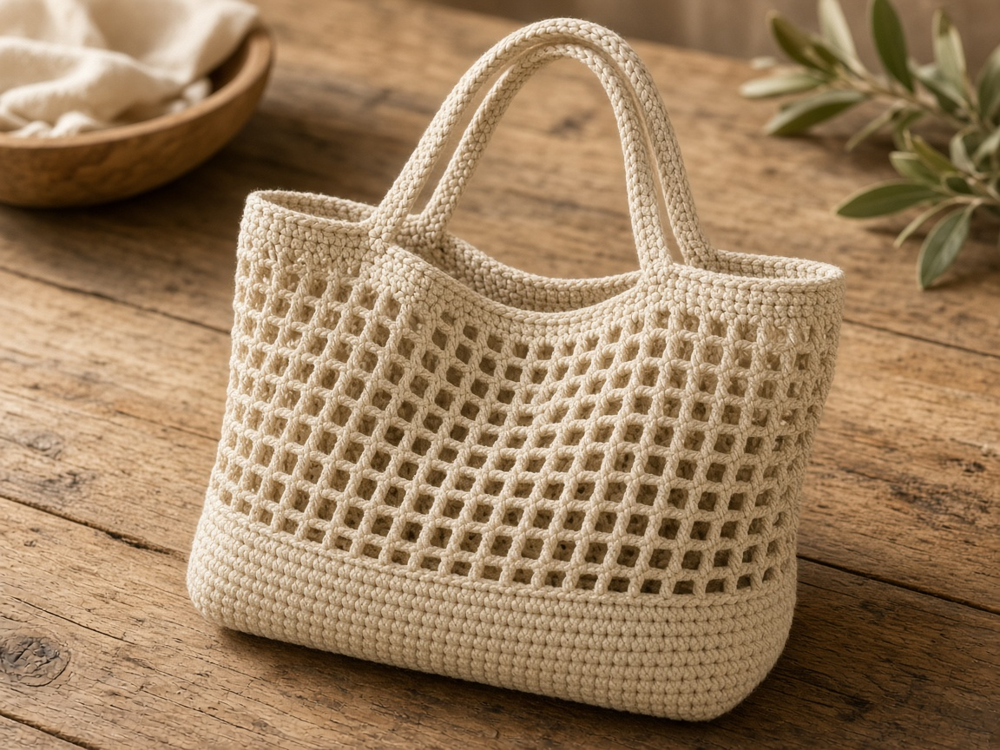
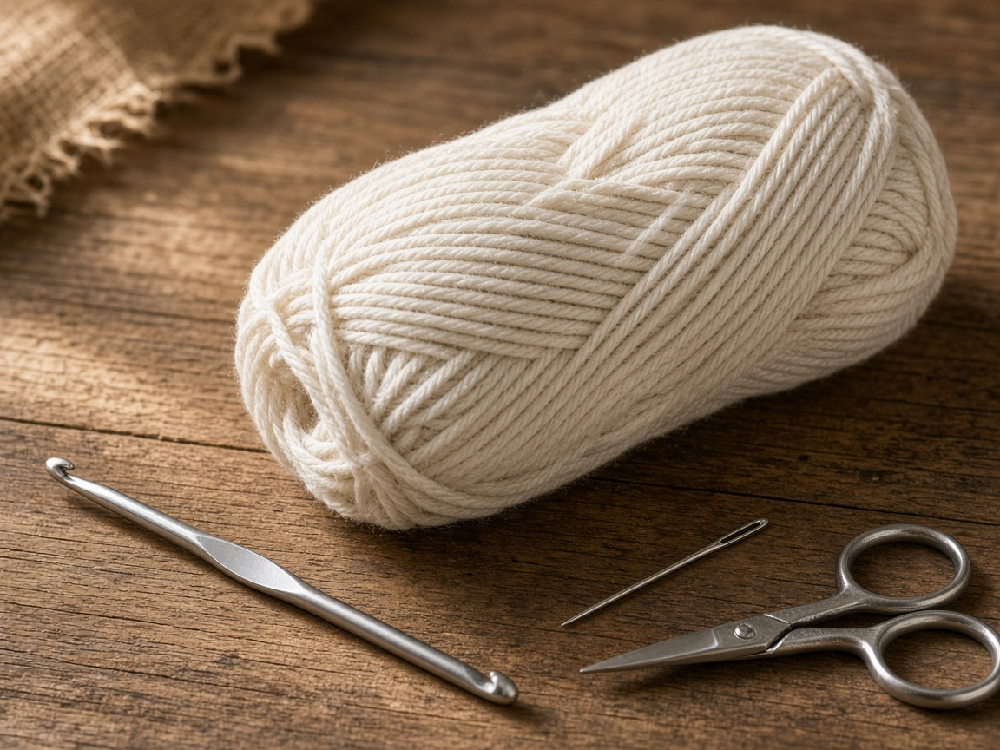
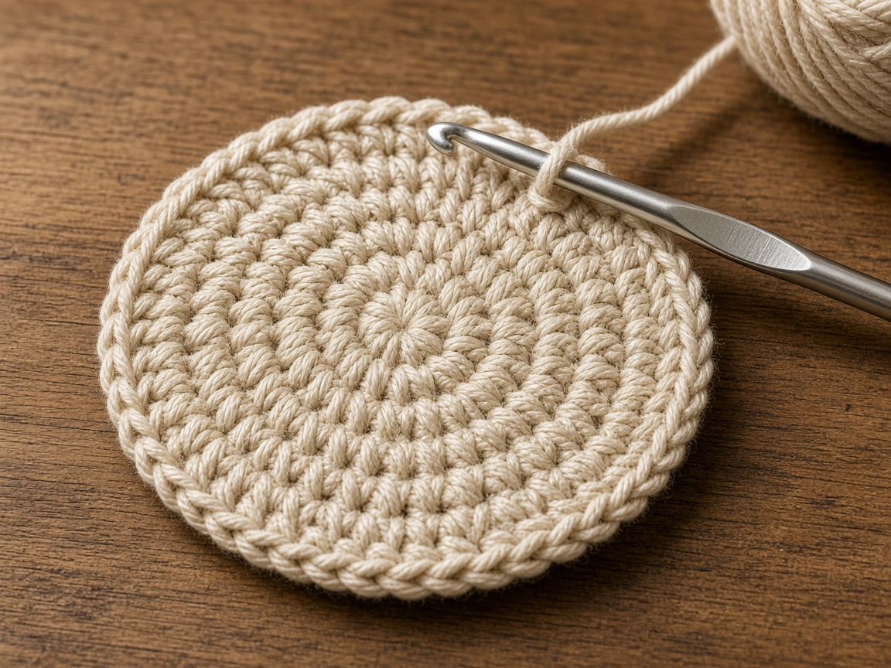
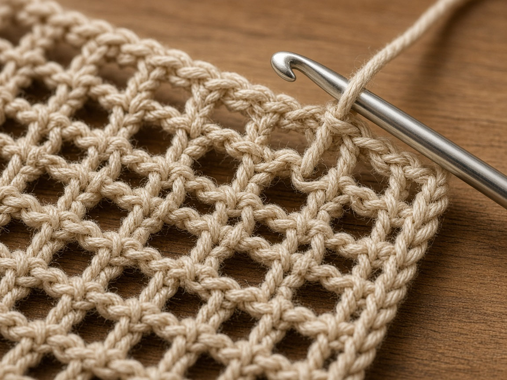
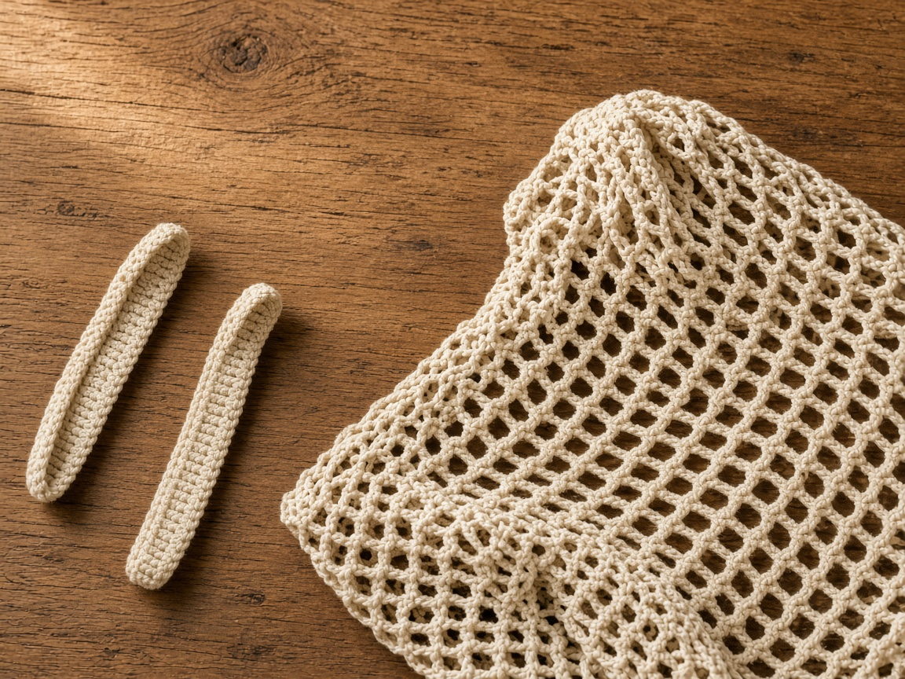
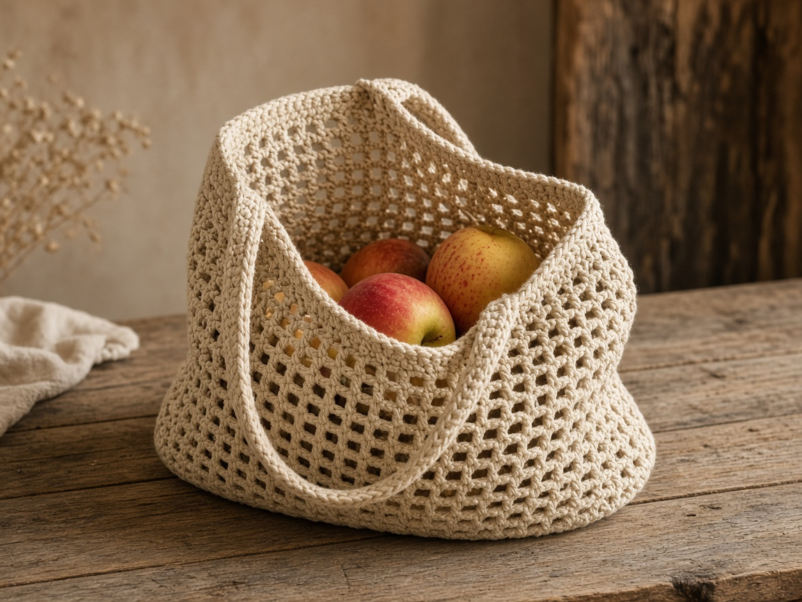

A plastic sack splits at the handle, and a cloth tote with no structure falls over in the cart. A crochet market bag on this page has a solid single-crochet base, a mesh body of double crochet and chain spaces, and two handles sewn to a firm top band. The mesh is the point. It is lighter than a solid bag, and it will not hold a small loose item the way a solid bag would.

US terms. US single crochet is UK double crochet. US double crochet is UK treble. [Abbreviations](/crochet-abbreviations-chart/). The photos are illustrations. This bag has not been yarn-tested. The inches and the yardage are estimates from the gauges below. Measure the base against something you actually carry, and measure the side against that same load, before you call the height done.

There is no load rating for this bag, and this page does not give a weight limit. Cotton mesh stretches. If the handles pull thin, if the holes grow, or if the base pulls into a cone, take items out.

## What you are making

A flat circle in single crochet, then rounds that stop increasing so the side can rise. The side is mesh: a double crochet, a chain, skip a stitch, repeated. A few rounds of solid single crochet at the top give the handles something to sew into. The handles are separate strips, sewn through many stitches.

Keep the mesh at the same count or the bag flares. If the base circle is new, [basic stitches](/basic-crochet-stitches/) and [crochet in the round](/crochet-in-the-round/) cover the joins. A bag built from squares is the [granny square tote](/how-to-crochet-a-granny-square-tote/).

## Materials

- Worsted cotton. About **350 yards** for the example. That is a shopping estimate from the stitch count at the gauges below, not a weighed bag. A taller side or a longer handle needs more. [Yarn weights](/yarn-weight-chart/).
- US G/6 (4.0 mm) hook, or the hook that hits the base gauge. [Hook chart](/crochet-hook-size-conversion-chart/).
- Yarn needle, scissors, stitch markers.

Cotton. Acrylic mesh stretches and stays stretched. The cotton stretches too, which is why the handles are sewn through many stitches and why this page has no weight number. Try the handles on before you weave the ends.

## Gauge (estimate)

**Base: 4 sc = 1 inch. 5 rounds = 1 inch.**

**Mesh, for planning only: about 2 mesh rounds = 1 inch of height.**

Swatch the single crochet and measure it. [Gauge](/crochet-gauge/) sets the base diameter. The mesh figure is only for planning yarn. Measure the real mesh as you work. These numbers were not taken from a finished bag. If the rim grows much wider than the base, use a hook one size smaller for the mesh only, and use that hook for every mesh round after the switch.

Ch 1 does not count as a stitch. On mesh rounds, the ch 3 counts as a double crochet. Pick that rule and keep it. If you also work a double crochet into the same spot as a ch 3 you meant as the stitch, you gain a mesh every round.

## Base

The example base is **96 single crochet** around, about **8 inches** across. Ninety-six divided by 4 is 24 inches around, and 24 divided by about 3.14 is near 8 inches. That is arithmetic from the gauge, not a base that was set in a cart. Measure yours on the table. A very small base under a tall mesh bag tips.

**Round 1:** 6 sc in a magic ring. Join. (6)

**Round 2:** 2 sc in each stitch. Join. (12)

**Round 3:** *2 sc in the next stitch, sc in the next.* Repeat. Join. (18)

**Round 4:** *2 sc in the next stitch, sc in the next 2.* Repeat. Join. (24)

Keep adding one more plain single crochet between increases every round. Each round gains 6 stitches.

Checkpoints: round 8 is 48. Round 12 is 72. Round 16 is 96.

**Round 17:** Sc in each stitch, no increases. Join. (96)

That even round locks the edge. If you keep increasing into the mesh, the bag becomes a cone. Put a marker in the last stitch of round 17 so you can find the base later when you measure height.

Set what you mean to carry on the circle. If the base is smaller than that footprint, add increase rounds until it is close. The mesh skips every other stitch, so the final count must be even. If you stop at 90, increase to 96 or decrease to 84 on the even round.

## Mesh body

**Mesh round 1:** Ch 3 (counts as dc), ch 1, skip the next sc, *dc in the next sc, ch 1, skip the next sc.* Repeat around. Join with a slip stitch to the top of the ch 3. (48 dc, 48 ch-1 spaces)

**Mesh round 2:** Slip stitch into the first ch-1 space. Ch 3 (counts as dc), ch 1, *dc in the next ch-1 space, ch 1.* Repeat around. Join to the top of the ch 3. (48 dc, 48 ch-1 spaces)

Repeat mesh round 2 until the side, measured from round 17, is the height you need. The example is about **12 inches** of mesh, about 24 rounds if 2 rounds make an inch. Use a tape. Twelve inches is an estimate, not a bag that was filled. Stop shorter for a small load. Add rounds if a tall item still sticks out. Do not increase on the mesh.

A key or a loose berry will find a mesh hole. The solid base is the part that keeps things from falling out the bottom. Pack small items inside a larger one.

## Top band

**Next round:** Ch 1, *sc in the next dc, sc in the next ch-1 space.* Repeat. Join. (96)

**Next 2 rounds:** Sc in each stitch. Join. (96)

The band is where the handles attach. Three rounds is the example. Add one more single-crochet round if the band feels floppy. The empty bag should still collapse.

## Handles

Make 2.

Chain 8.

**Row 1:** Sc in the 2nd chain from the hook and across. Ch 1, turn. (7)

**Next rows:** Sc in each stitch. Ch 1, turn. (7)

Work until the strip measures about **18 inches**. That length is about 90 rows at 5 rows to the inch, an estimate from the gauge, not a handle that was carried. Pin it on and try it in your hand and on your shoulder, with a stand-in for the groceries inside, before you sew the second end.

Sew each end to the inside of the top band. Place the two handles opposite each other. Each end should cover about **2 inches** of the band, about 8 single crochet at the base gauge. Sew through every one of those stitches, then sew back the other way. One stitch is a tear waiting for a jar. This sewing advice is construction. It is not a tested load, and it is not a weight limit.

Leave the mesh out of the sewing. The band is the solid part. A handle sewn into a chain space will pull that space into a long hole.

## Mistakes

**Increasing through the mesh.** The rim ends up much wider than the base and the bag slumps. Stop increases on the even single-crochet round before mesh round 1.

**Handles on the mesh.** The chain spaces rip longer. Sew to the solid band only.

**A one-stitch attachment.** It holds the empty bag. It fails when the bag is picked up full. Sew across about 2 inches, twice.

**An odd stitch count.** The mesh repeat needs pairs. Fix the count on the last solid round.

**Looking for a weight number.** This page does not have one. If the base cones, the handles thin, or the holes grow, take items out.

## Care

Empty the bag. Hand wash cool. Dry flat, handles straight, on a towel. Drying it by one handle stretches that handle. Use it again only when it is dry.

## Frequently asked

**How much weight will it hold?**

This page does not say. There is no tested load rating and no weight limit. Watch the fabric and remove items if it distorts.

**Can I use acrylic?**

This pattern is cotton. Acrylic mesh stretches and stays stretched.

## Next

A larger patched-together bag is the [granny square tote](/how-to-crochet-a-granny-square-tote/). The joins and increases under the base are practiced in [crochet in the round](/crochet-in-the-round/).
