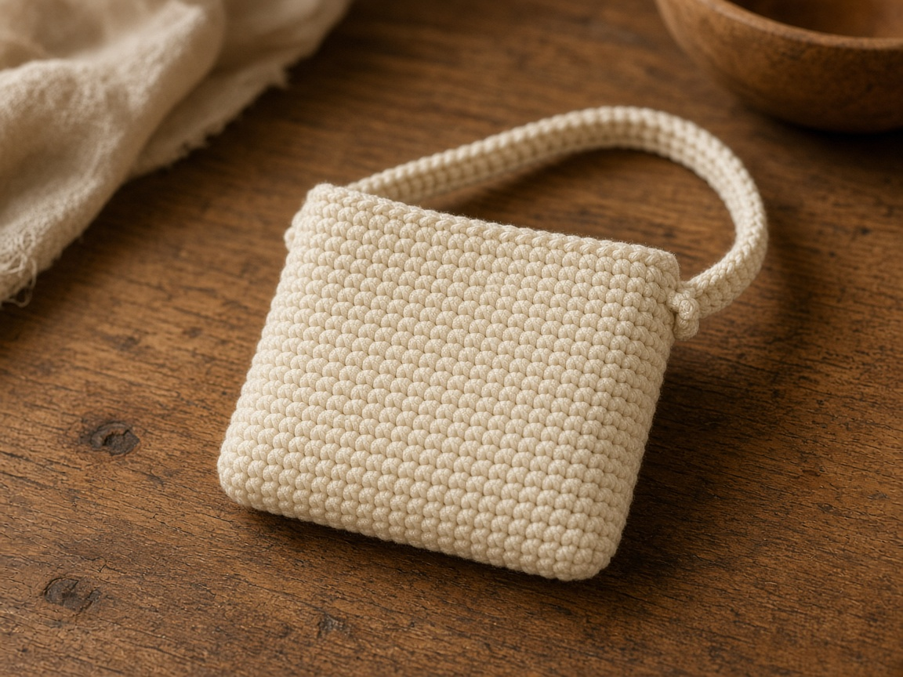
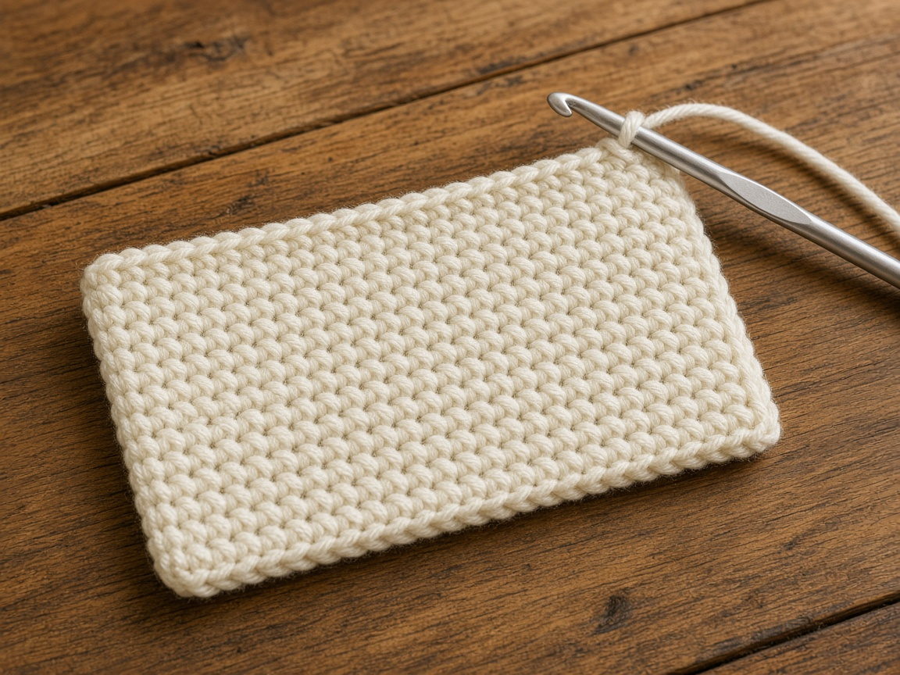
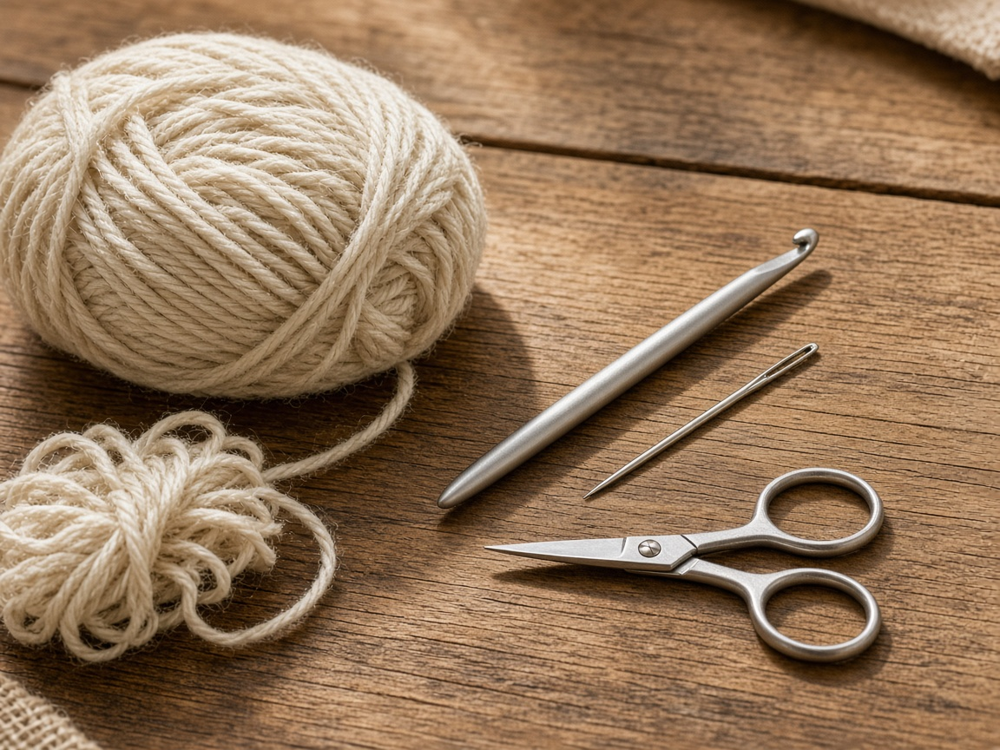
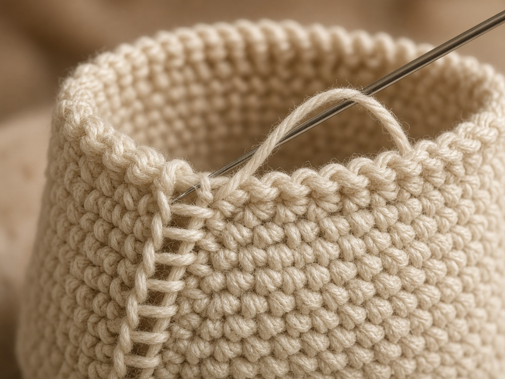
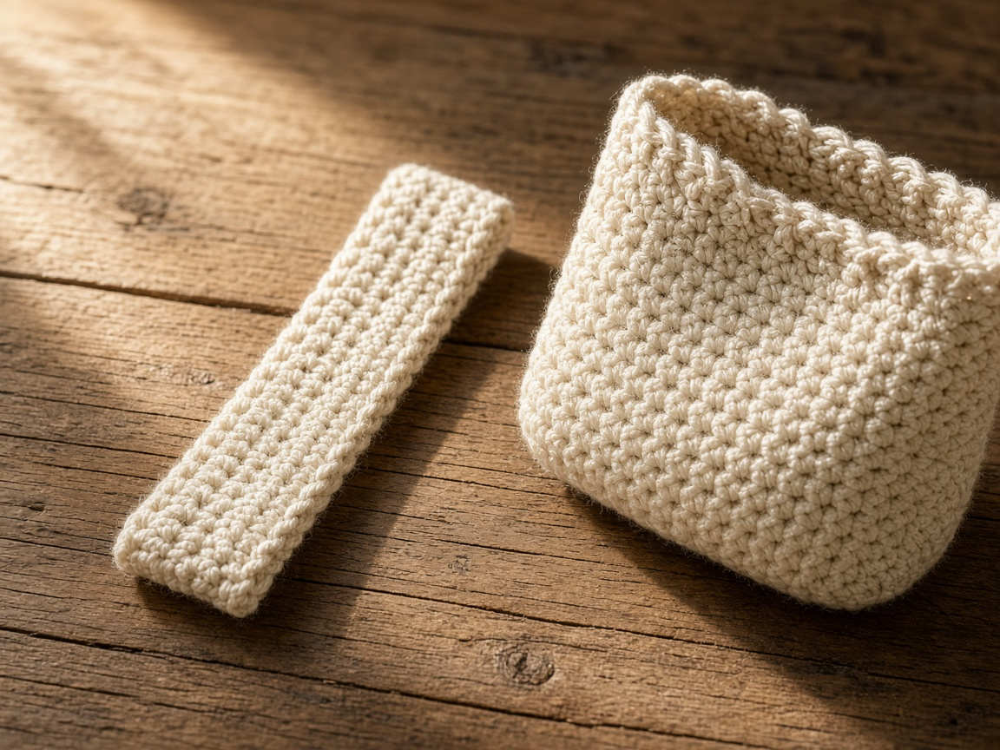
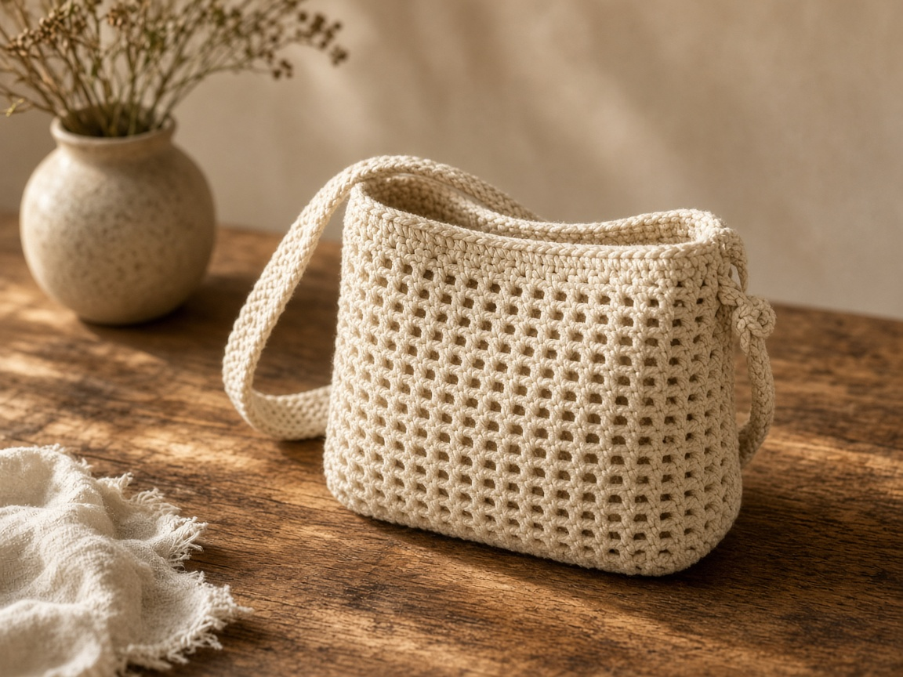

A phone, a slim wallet, and keys disappear into a tote and turn up under the groceries. A mini shoulder bag is a small single-crochet rectangle, folded and seamed, with a short strap so the bag sits at your side. It is a pocket you wear. It is not a backpack, and the strap on this page is not long enough to cross the body.

US terms. US single crochet is UK double crochet. [Abbreviations](/crochet-abbreviations-chart/). The photos are illustrations. This bag has not been yarn-tested. The inches and the yardage are estimates from the gauge below. Measure the objects you will actually carry, and try the strap on your own shoulder, before you sew the second end.

## What goes inside

Lay the phone, the wallet, and the keys on a table. Measure the tallest one and the widest one, in inches. Add about **1 inch** to each number so they slide in without bending a phone.

The worked example is a bag about **7 inches wide and 6 inches tall**, from a rectangle about **7 inches wide and 12 inches long** before folding. At the gauge below, that is 28 stitches and 60 rows. If your phone is taller than about 6 inches, or wider than about 6 inches, those counts are the wrong counts. Use the resize steps near the end.

A longer strap that crosses the body is a different plan. The idea of a small bag worn across the torso is the [phone crossbody](/how-to-crochet-a-phone-crossbody/). This page keeps the strap short on purpose.

## Materials

- Worsted cotton, oatmeal or any solid color. About **200 yards** for the example bag and the example strap. That figure is a planning estimate from the stitch count, not a weighed bag. A longer strap needs more. [Yarn weights](/yarn-weight-chart/).
- US G/6 (4.0 mm) hook, or the hook that hits gauge. [Hook chart](/crochet-hook-size-conversion-chart/).
- Yarn needle, scissors, a stitch marker.

Cotton holds a rectangle better than a fuzzy yarn. Beginner, if you can keep a single-crochet row the same width. One evening for the example.

## Gauge (estimate)

**4 sc = 1 inch. 5 rows = 1 inch.**

Swatch and measure. [Gauge](/crochet-gauge/) is the whole fit. These numbers were not taken from a finished bag. If your swatch is 3.5 sc to the inch, 28 stitches will be wider than 7 inches. Use your stitches per inch, not the example count, when the swatch disagrees.

Ch 1 at the end of a row does not count as a stitch.

## Rectangle

Chain 29.

**Row 1:** Sc in the 2nd chain from the hook and across. Ch 1, turn. (28)

**Rows 2–60:** Sc in each stitch. Ch 1, turn. (28)

Count every 10 rows. Mark the edge so you do not lose your place. A row that gains a stitch makes a wedge, and a wedge will not fold into a straight bottom.

At the gauge above, 28 stitches are about 7 inches and 60 rows are about 12 inches. Hold the rectangle up before you seam it. The width should clear your widest object with room to spare. The length, folded, should clear your tallest object. If it does not, add rows or start a wider chain. Seaming will not add an inch.

## Seam

Fold so row 1 meets row 60. The fold is the bottom. The opening is those two rows, left unseamed. Sew each side edge through both layers, from the fold up to the opening. Keep the stitches even. A side seam that pulls tight makes the bag bow.

Do not sew across the opening.

Turn the bag right side out if you seamed on the inside. The bottom fold should sit flat on a table. If the bottom pulls up into a curve, the side seams are too tight. Redo them looser before you add the strap.

## Strap

The example strap is **4 stitches wide** and about **26 inches** long. Twenty-six inches is 130 rows at 5 rows to the inch. That length is an estimate from the gauge, not a strap that was worn. A short shoulder strap should let the bag hang at your side, around the hip or a little higher, without crossing to the opposite hip.

Chain 5.

**Row 1:** Sc in the 2nd chain from the hook and across. Ch 1, turn. (4)

**Next rows:** Sc in each stitch. Ch 1, turn. (4)

Stop when the strap, held from your shoulder down to where you want the bag, looks right. Put the phone in, pin both ends, and check the length on your body. A tall person often needs more than 26 inches. The bag itself adds height, so a strap that feels short in your hand can feel long once it is filled.

Sew each end to the inside of the bag at a side seam, at the top. Catch about an inch of the strap and about an inch of the seam, and sew through those stitches twice. One lonely stitch will rip the first week. The strap should not twist between the two ends. Check that before the second end is sewn.

## Opening

Join yarn at one side seam on the opening. Sc around the mouth, one single crochet in each stitch of row 1 and row 60. Join. (56)

That round keeps the opening from stretching. It does not close the bag. If you want a closure, chain 12 at the center front, slip stitch back to the same spot to make a loop, and sew a button on the back only after the bag is full, so the loop reaches. Skip the button if the fit is already snug.

## A different size

1. Width you need, in inches, times your stitches per inch. That is the stitch count. Chain one more than that.
2. Height you need, times 2, times your rows per inch. That is the row count, because the rectangle folds in half.
3. Strap: work the 4-stitch strip until it fits your shoulder with the bag filled. The 26 inch example is only a starting point.

Write the three numbers down. A count you keep in your head drifts.

## Mistakes

**Seaming the top.** The phone cannot go in. The opening is row 1 and row 60. The seams are only the side edges.

**No ease.** A 6 inch phone in a 6 inch bag, with thick cotton seams, does not slide. The extra inch in the plan is there for the seams and your hands.

**A strap sewn through one stitch.** It holds on the table and fails on the sidewalk. Sew through an inch of fabric, twice.

**A twisted strap.** You will not notice until it is sewn. Lay the strip flat, ends pointing the same way, and pin it before the needle comes out.

**Fuzzy yarn for a pale phone.** The fibers migrate. Cotton single crochet still has small gaps. A pen in the same bag can mark a light case. This bag is a cover for dry days in a larger tote, or for wearing on its own. It is not a rain shell.

## Care

Empty the bag. Hand wash cool. Dry flat, with the strap stretched in a straight line so it does not dry in a curl. Put the phone back only when the cotton is dry. Damp cotton against a phone is a bad trade for a clean bag.

## Frequently asked

**Is 7 by 6 inches the right mini bag?**

It is the example at this gauge. Your phone decides the rectangle. Measure it.

**Can I make the strap a crossbody?**

Not by guessing a longer number from this page. A strap that crosses the body needs its own length, tried on, and the bag sits in a different place. Start from the [phone crossbody](/how-to-crochet-a-phone-crossbody/) if that is the bag you wanted.

**Can I sell finished bags?**

Finished bags, yes. Do not republish these rows as your pattern.

## Next

A bag built to be worn across the body is the [phone crossbody](/how-to-crochet-a-phone-crossbody/). A larger carry bag, with a different stitch plan, is the [granny square tote](/how-to-crochet-a-granny-square-tote/).
