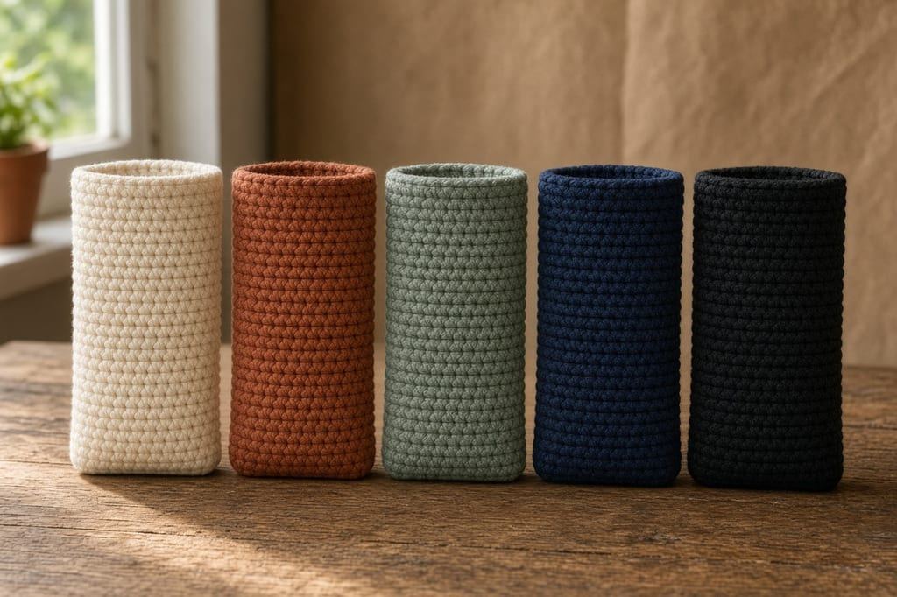
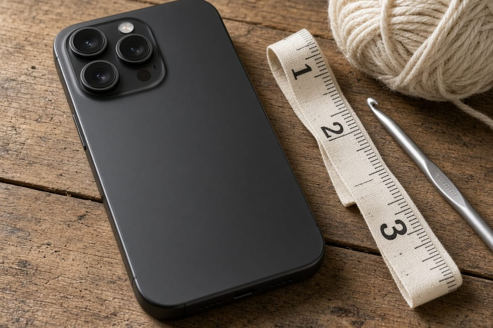
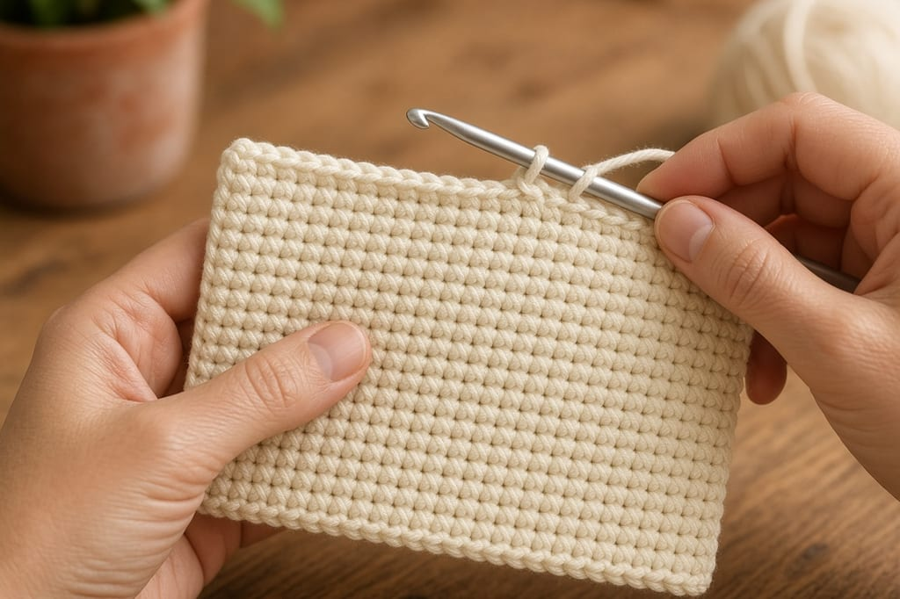
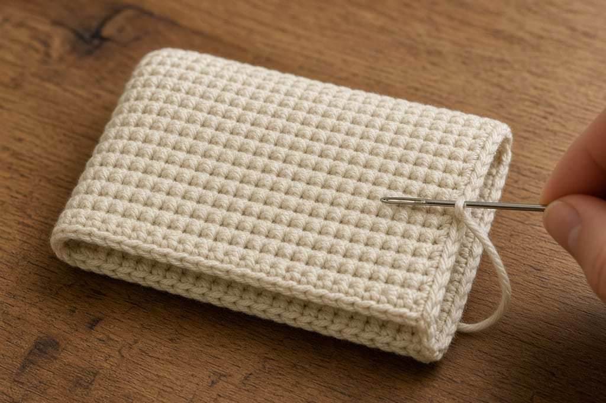
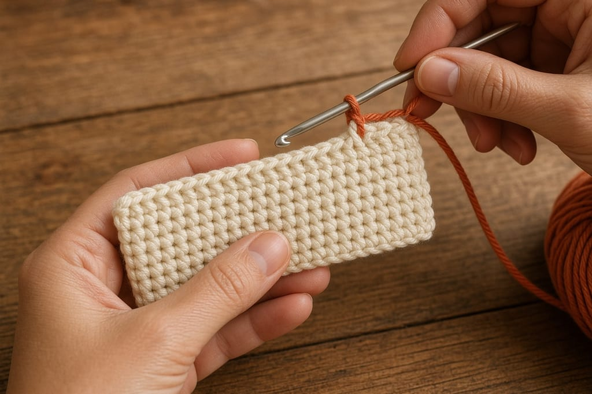
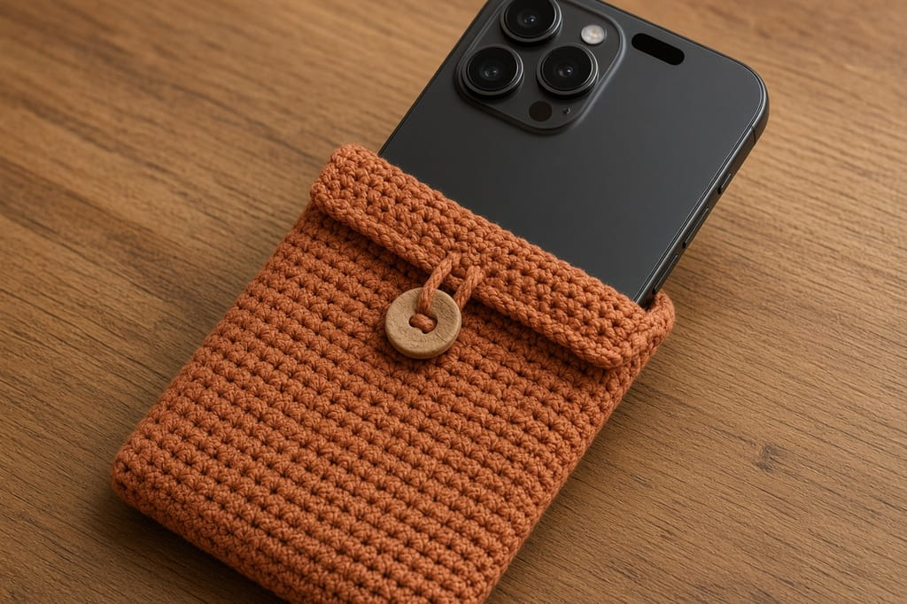

A sleeve only works if this phone slides in. The iPhone 18 Pro Max body is **3.07 inches wide (78.0 mm)**, **6.43 inches tall (163.4 mm)**, and **0.34 inch thick (8.75 mm)**, per [Apple’s tech specs](https://support.apple.com/en-us/148591). Those numbers are the bare phone, not a stitch count.

Crochet a dense [single crochet](/basic-crochet-stitches/) rectangle to that width, fold it, and seam the sides. Cream, terracotta, sage, navy, black, or stripes all use the same rectangle.

## What you need

- Worsted-weight cotton. One small skein is enough. Fuzzy yarn pills inside the sleeve. [Yarn weight chart](/yarn-weight-chart/).
- A hook that makes a firm fabric, often US G/6 (4.0 mm) or H/8 (5.0 mm). Drop a size if you can see through the stitches. [Hook chart](/crochet-hook-size-conversion-chart/).
- The phone, with no extra case on it.
- Yarn needle and scissors.

US terms (`sc`). Abbreviations are on the [chart](/crochet-abbreviations-chart/).

## The size you are hitting

| Apple’s body size | What it means for the sleeve |
| --- | --- |
| Width 3.07 in (78.0 mm) | Unstretched fabric should cover this, plus a little for the side seams |
| Height 6.43 in (163.4 mm) | Folded length should cover this and leave a short collar |
| Depth 0.34 in (8.75 mm) | The opening has to clear the thickness and the camera plateau |

Apple also lists finishes Black, Silver, Glacier, and Burgundy. Yarn color is separate. A black phone does not need a black sleeve.

Lay the phone on the fabric after a few rows. If it overhangs, add chains and start again. A chain that only matches 3.07 inches with no ease will be tight once you seam.

## Step 1: chain the width

Chain until the foundation, held flat and not stretched, is just over 3.07 inches. Single crochet in the second chain from the hook and across. Chain 1, turn. That stitch count is every later row.

Keep the starting chain looser than the rows. A tight chain cups the bottom edge and the phone will not sit square.

## Step 2: work the rectangle

Single crochet across, chain 1, turn. Stop when the rectangle is a little more than **twice 6.43 inches**. You fold it in half. The extra rows are the collar so the camera plateau is not jammed in the fold.

Check the phone on the fabric before you seam. Width still covers 3.07 inches without stretching. Folded length covers 6.43 inches and a short lip past the top.

The turning chain is one chain and it does not count as a stitch. Work the first sc into the last real stitch.

## Step 3: fold and seam

Fold in half. Whipstitch each side from the fold to the opening. Leave the top open.

Slide the iPhone 18 Pro Max in before you weave the tails. It should go in without force and stay when you tip the sleeve once. If the opening fights you, the last rows were tighter than the middle. Redo those rows a little looser. Do not stretch the finished sleeve onto the phone.

Weave ends on the inside. See [weaving in ends](/weaving-in-ends-and-blocking/). Do not pin this wider than the phone to block it.

## Color

**Solid.** One color the whole way. Best first sleeve, because you can see the stitches.

**Two-tone.** Work to the fold line in color A, then [change color](/changing-yarn-color-crochet/) and finish in color B.

**Stripes.** Change every 4 rows. Two-row stripes turn into noise on a piece this small. Cut the old color unless the next stripe is only two rows away. A carried strand snags on the phone.

Stop with two loops of the old color on the hook, yarn over with the new color, and pull through.

Stay in the same yarn weight for every color. A thinner stripe changes the width and the phone jams there.

## Optional flap

Fit the open sleeve first. Then join yarn at the center of the back opening, single crochet a short flap (about 6 to 8 rows), and narrow it by decreasing one stitch at each end every other row. On the last row, chain a loop that slips over your button, slip stitch back, and fasten off. Sew the button on the front.

Skip the flap if you take the phone out all day. An open top is faster, and the camera plateau needs that open collar anyway.

## Mistakes

**Using a stitch count from a smaller phone.** 3.07 by 6.43 inches is this model. A sleeve made for a regular iPhone will not take the Pro Max.

**Seaming too tight.** The side seams are what the phone has to pass. Snug, not cinched.

**Cutting a camera hole.** The plateau sits at the top. A collar fixes it. A hole in the wrong place does not.

**Fuzzy yarn.** It looks soft and grabs the phone. Cotton is the better default.

## Frequently asked

**Does this include a case already on the phone?**

No. Apple’s 3.07 by 6.43 inches is the bare body. If you keep a thin case on, measure that width and height instead and crochet to those.

**Will a left-handed crocheter do anything different?**

No. Same rectangle. Holding the hook is covered in [left-handed crochet](/left-handed-crochet/).

**Can I sell the sleeve?**

A plain sleeve you sized from Apple’s published measurements is yours to make. Do not copy someone else’s charted motif onto it.
