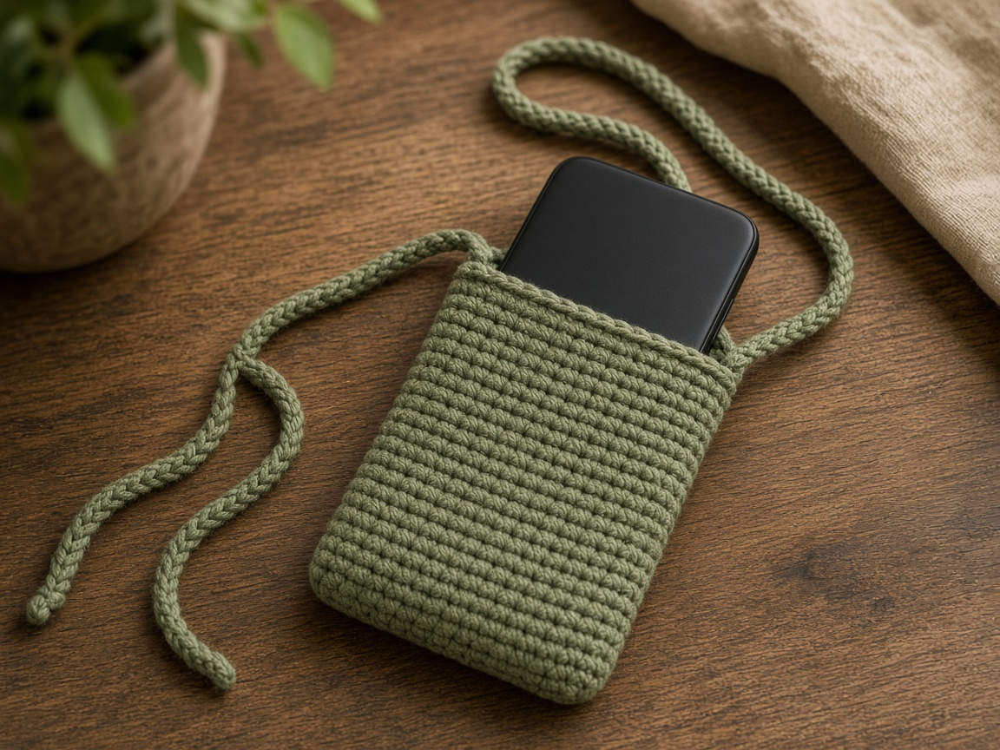
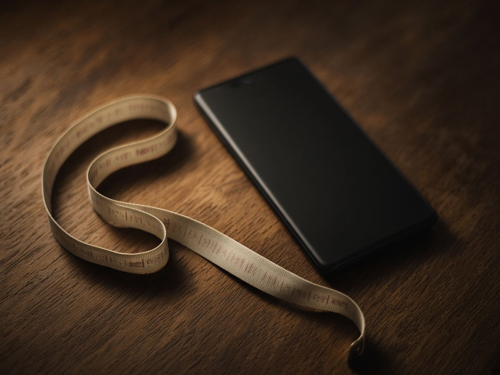
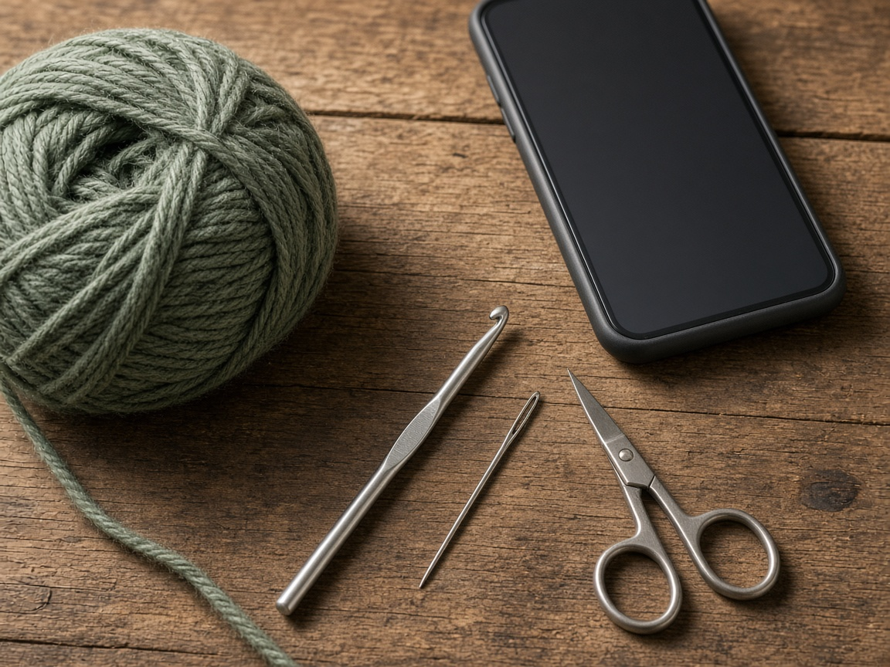
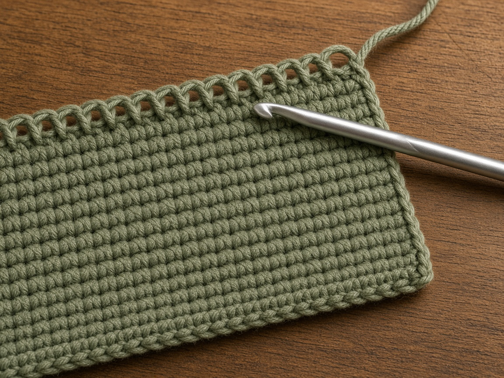
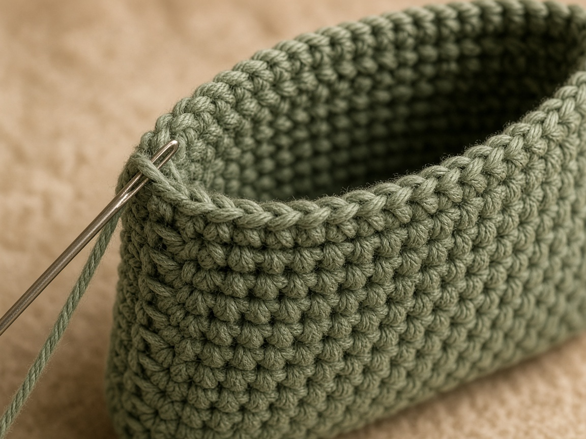
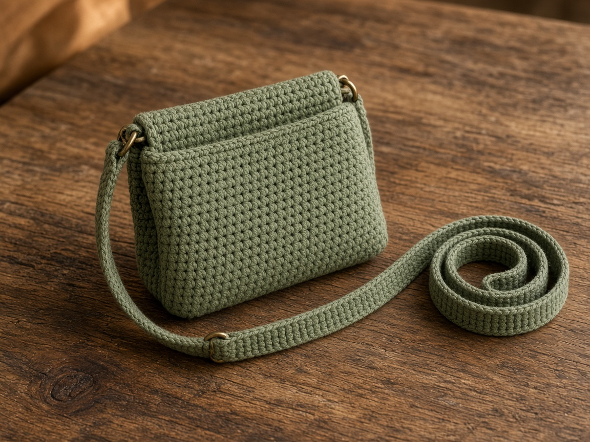

A phone in a coat pocket comes out when you sit down. A sleeve on a strap stays on your body, across the chest, where you can feel it. The sleeve is a folded rectangle of single crochet. It is cotton. It is not a waterproof case, and it is not a screen protector. Water goes through the stitches. Grit caught in the yarn can scratch glass.

Measure the phone you own, including a case if that case stays on. The stitch counts below are one example. US terms. US single crochet is UK double crochet. [Abbreviations](/crochet-abbreviations-chart/). The photos are illustrations. This sleeve has not been fitted on a phone in yarn. Inches and yardage are estimates from the gauge.

## Measure

Three numbers, in inches:

- Width of the phone.
- Height of the phone.
- Thickness, if it is more than about half an inch. A thick case needs that thickness added to the width.

Example, not a fit guide: a phone **3 inches** wide and **6 inches** tall. Add about **1/2 inch** to the width for the seams and the thickness. Plan the sleeve about **1/2 inch** taller than the phone so the top edge does not sit flush on the glass. For that example, the rectangle is **14 stitches** wide (about 3.5 inches) and **65 rows** long (about 13 inches), which folds into a sleeve about **6.5 inches** tall.

Your phone changes both numbers.

1. Width in inches, plus 1/2 inch, plus any extra thickness, times your stitches per inch. That is the stitch count.
2. Height in inches, plus 1/2 inch, times 2, times your rows per inch. That is the row count. The times-2 is the fold.

The strap is separate. Measure from the shoulder where the strap will sit, across the chest, to the hip where you want the phone. Example: **48 inches**. Bodies are not the example. Use your tape.

## Materials

- Worsted cotton. About **180 yards** for the example sleeve and a 48 inch strap. A longer strap needs more. This was not weighed off a finished piece. [Yarn weights](/yarn-weight-chart/).
- US G/6 (4.0 mm) hook, or the hook that hits gauge. A looser hook makes holes the phone can be seen through. [Hook chart](/crochet-hook-size-conversion-chart/).
- Yarn needle, scissors. A button only if you add the flap.

Beginner. The rectangle is the same stitch as a [book sleeve](/how-to-crochet-a-book-sleeve/). The length is in the strap. One sitting for the sleeve, and another for the strap if you count rows as you go.

## Gauge (estimate)

**4 sc = 1 inch. 5 rows = 1 inch.**

Unverified on a phone. Swatch. [Gauge](/crochet-gauge/) is the difference between a sleeve the phone enters and a sleeve you have to stretch, which then will not hold.

At that gauge, 14 stitches are about **3.5 inches**. 65 rows are about **13 inches**. 5 strap stitches are about **1.25 inches** wide. 240 strap rows are about **48 inches**. If your swatch is off, redo the three lines in the measure section. Do not keep the 14 and the 65.

## Rectangle

Ch 1 does not count as a stitch.

For the example phone, chain 15.

**Row 1:** Sc in the 2nd chain from the hook and across. Ch 1, turn. (14)

**Rows 2–65:** Sc in each stitch. Ch 1, turn. (14)

Lay the phone on the fabric after about 20 rows. The width should cover the phone without stretching. If the phone hangs over the sides, start again with more chains. A tight starting chain cups the bottom. Keep that chain looser than the rows.

Count every 10 rows. One extra stitch at the end of a row becomes a wedge, and the fold will not sit straight.

## Seam

Fold so row 1 meets row 65. The fold is the bottom. Sew both side edges through both layers, from the fold to the last row. Leave the top open.

Slide the phone in before you weave the tails. It should enter without force and stay when you tip the sleeve once. If it will not enter, the rectangle is narrow or the seams were pulled tight. Redo it. Do not stretch cotton single crochet over the phone and hope the seam relaxes. It will relax in the wash, and then the phone will be loose.

The top stays open so you can take the phone out. An open top also means a hard swing of the strap can throw the phone. If that is the day you are dressing for, add the flap below. If you take the phone out all day, skip the flap.

## Strap

A chain is not a strap. A chain grows, and the phone ends up at your knee by the end of the day.

Chain 6.

**Row 1:** Sc in the 2nd chain from the hook and across. Ch 1, turn. (5)

**Row 2:** Sc in each stitch. Ch 1, turn. (5)

Repeat row 2 until the strap matches your tape. For the **48 inch** example, at 5 rows to the inch, that is about **240 rows**. Check against the tape every 20 rows so you can stop when it fits, even if that is not 240.

Sew one end of the strap to each side of the opening, at the top of the side seam. Whipstitch the last inch of the strap to the inside of the sleeve, through several rows, not through one loop at the corner. The strap is one piece. It goes across the body. It is not two short handles.

Put the strap on before you call the length final. The phone should sit where you measured, not at the seam of your jeans and not under your arm. Take the sewing out and remove rows if it hangs too low. You cannot shorten a sewn strap by pulling on it.

## Optional flap

Fit the open sleeve first. Join yarn at the center of the back opening. On a 14-stitch edge, that is about stitch 5.

**Row 1:** Sc in the next 6 stitches. Ch 1, turn. (6)

**Rows 2–6:** Sc in each stitch. Ch 1, turn. (6)

**Row 7:** Sc in the first stitch, chain 8, slip stitch in the last stitch of the row to make a loop. Fasten off.

Sew a button on the front, placed with the phone inside, so the loop reaches. A button sewn on the flat rectangle often sits too high once the phone fills the sleeve.

This will not keep a phone dry. Rain, a spilled drink, and a damp counter all go through single crochet. Take the phone out. Do not wear the sleeve in a pool, a shower, or a heavy storm and expect the phone to survive.

## Mistakes

**Sizing from a different phone.** A sleeve that fit a small phone will not take a larger one, and a sleeve made for a larger one will drop a smaller one out of the opening. Measure the one in your hand.

**A chain strap.** It stretches. Single crochet the strap, and check the length on your body.

**Fuzzy yarn.** It looks soft and holds grit against the glass. Cotton.

**Sewing the strap to the top edge only.** The first snag pulls the corner open and the phone leaves. Sew down the side for about an inch.

## Care

Take the phone out. Hand wash cool. Dry flat. Put the phone back only when the sleeve is dry. Damp cotton against a phone is a bad way to store it, and a damp strap against a shirt will leave a wet line across your chest.

## Frequently asked

**Will it fit every phone?**

No. The 14 by 65 rectangle and the 240-row strap are for the example at the gauge above. Measure your phone and your strap length, then redo the multiplication.

**Can I sell them?**

Finished sleeves, yes. Do not republish the rows as your pattern. Do not stitch a phone brand onto the sleeve as if the company made it.

**Is it safe in the rain?**

No. Use a bag that is actually water resistant, and leave this sleeve for dry days. The same limit is true of the [tumbler sleeve](/how-to-crochet-a-tumbler-sleeve/): cotton is a layer, not a seal.

## Next

A pocket for the odds and ends that should not share a sleeve with a phone is the [makeup pouch](/how-to-crochet-a-makeup-pouch/). A flat cover for a book uses the same rectangle idea: [book sleeve](/how-to-crochet-a-book-sleeve/). A larger open carry is the [granny square tote](/how-to-crochet-a-granny-square-tote/).
