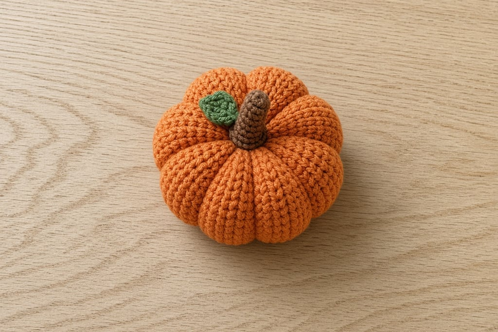
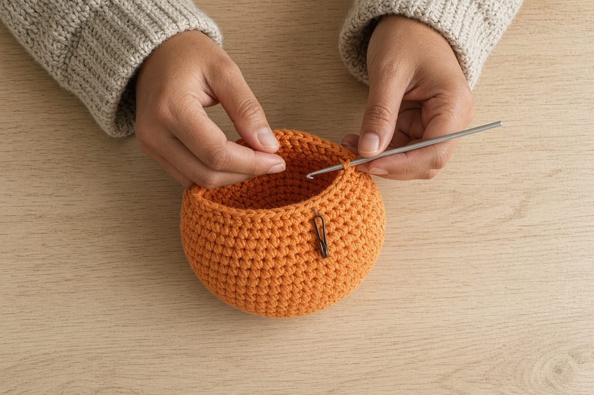
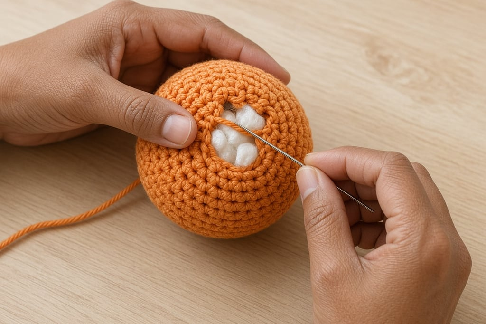
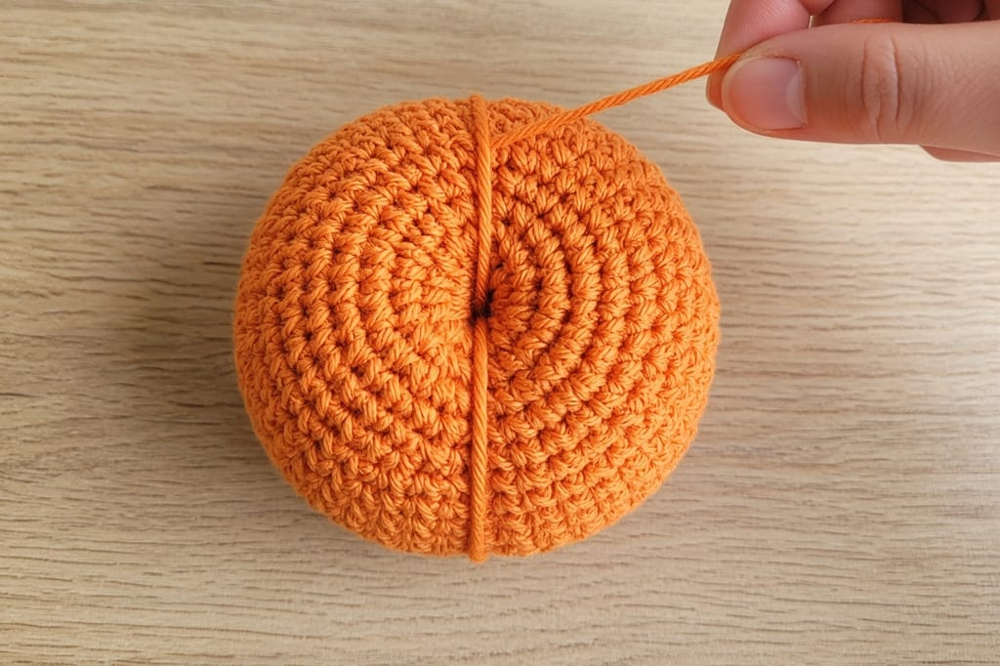

A crochet pumpkin is a stuffed sphere with vertical grooves and a short stem on top. The sphere is ordinary amigurumi math. The grooves come from a finishing trick, not from fancy stitches. If you can work [in the round](/crochet-in-the-round/) and make a [basic increase](/crochet-increase-decrease/), you can make one.

Hook size, yarn weight, and stuffing amount change the final diameter, so treat the stitch counts as a shape recipe rather than a promise of a specific inch measurement until you have made one and measured it yourself.

## What you need

- Worsted-weight yarn ([yarn weight chart](/yarn-weight-chart/)) in orange for the body, a scrap of brown or green for the stem
- A hook that matches your yarn — often a US G/6 (4.0 mm) or H/8 (5.0 mm); see the [hook size chart](/crochet-hook-size-conversion-chart/)
- Stuffing
- Yarn needle
- Stitch marker

Abbreviations follow US terms. If any look unfamiliar, open the [abbreviations chart](/crochet-abbreviations-chart/).

## Step 1: start the sphere (increase)

Work in a spiral. Mark the first stitch of every round.

**Rnd 1.** Magic ring, 6 sc. (6)

**Rnd 2.** 2 sc in each st around. (12)

**Rnd 3.** *Sc in next st, 2 sc in next st; repeat from * around. (18)

**Rnd 4.** *Sc in next 2 sts, 2 sc in next st; repeat from * around. (24)

**Rnd 5.** *Sc in next 3 sts, 2 sc in next st; repeat from * around. (30)

**Rnd 6.** *Sc in next 4 sts, 2 sc in next st; repeat from * around. (36)

For a small desk pumpkin, stop increasing here. For a larger one, keep adding six stitches each round (next would be *sc in next 5, 2 sc in next*). That six-increase rule is what keeps the circle flat until you build height. More on the math is in [increases and decreases](/crochet-increase-decrease/).

## Step 2: work even, decrease, and stuff

Work even (one sc in each stitch) for enough rounds that the height of the tube is a little less than the diameter of the circle. Pumpkins are slightly squat, not tall.

Then reverse the increase math:

**Decrease round example from 36 sts.** *Sc in next 4 sts, sc2tog; repeat from * around. (30)

Continue decreasing by six stitches each round until you have 12 stitches left. Stuff firmly as the opening shrinks — a soft pumpkin collapses when you add the ribs.

Finish with *sc2tog* around to 6 stitches, fasten off leaving a long tail, and close the hole by weaving the tail through the front loops of the last six stitches and pulling tight.

**Stuff denser than you think.** Ribbing compresses the body. Soft stuffing turns into a dented orange blob once the grooves are pulled in.

## Step 3: cinch the grooves

Thread a long strand of the body color (or a slightly darker orange) onto a yarn needle. Anchor it at the bottom center. Take the needle straight up the outside to the top center, then down through the middle of the pumpkin and out the bottom again. Pull until a groove forms. Repeat around the pumpkin, spacing the wraps evenly — six or eight sections look classic.

Pull each wrap snug enough to show a clear valley, not so tight that the top and bottom pucker into points. Tie off at the bottom and bury the ends inside.

## Step 4: make and sew the stem

 worked separately, then sewn on.")

With brown or green, magic ring 6 sc. Work 3–5 rounds even. Stuff lightly or leave hollow. Sew to the top center over the ribbing ends so the stem covers the gathering point.

A chain-6 loop sewn flat also reads as a stem if you want something faster; the tube looks more like a real pumpkin stalk.

## Mistakes that flatten the pumpkin

**Increasing too fast.** Jumping stitch counts without the even spacing of six increases per round makes a wavy disc that will not become a smooth sphere.

**Working even for too long.** A tall cylinder with pumpkin ribs still looks like a stuffed tube. Keep the even section short.

**Under-stuffing before ribbing.** The grooves need resistance. Stuff, then rib.

**Ribbing with a contrasting color you did not mean to show.** Matching or slightly darker yarn hides the wrap. Bright green wraps read as decoration, which is fine if that is intentional.

**Closing the top before stuffing.** Leave an opening you can still reach into.

## Frequently asked

### Do I need a pattern with exact finished inches?

Not to learn the shape. Exact inches belong on a finished sample measured after stuffing and ribbing. Use stitch counts and the “slightly squat” rule, then measure your own first pumpkin and write the number down for next time.

### Can I use blanket yarn?

You can, with a larger hook, but the fabric is floppy and the ribs show less. Worsted or a sturdy aran weight holds grooves better for a first try.

### Why is my pumpkin pointed at the top?

The last decrease rounds were rushed, or the stem was sewn onto a poorly closed hole. Slow down on the final decreases and close the hole tightly before sewing the stem.

### What should I make next?

Try a [ghost amigurumi](/crochet-ghost-amigurumi-for-beginners/), the [bat](/bat-amigurumi-wings-body-and-ears/), or flat color practice on [Halloween granny squares](/halloween-granny-square-variations/). For a reel-friendly pocket project, make the [Halloween card wallet](/halloween-crochet-card-wallet/).
