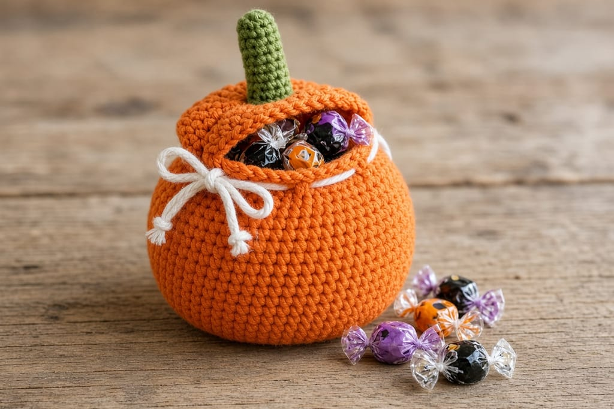
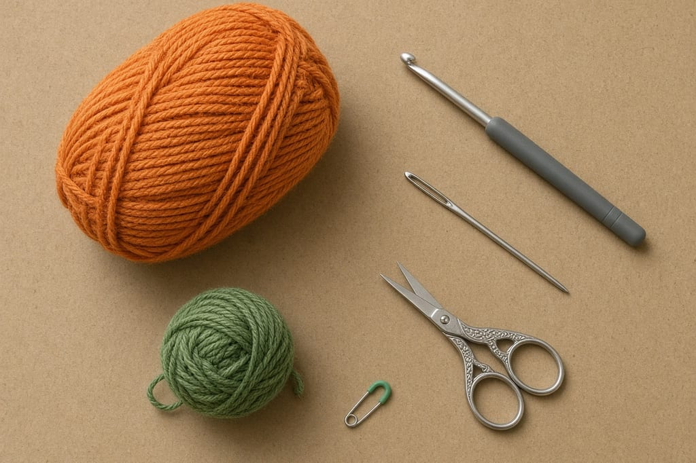
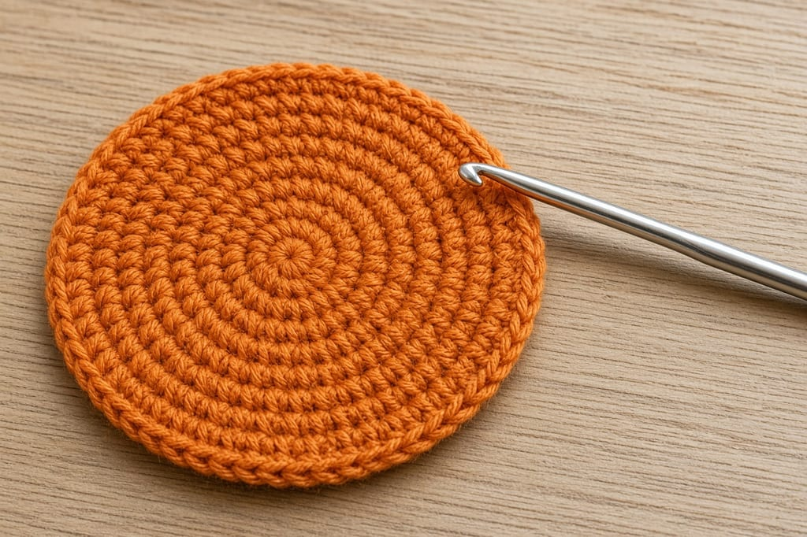
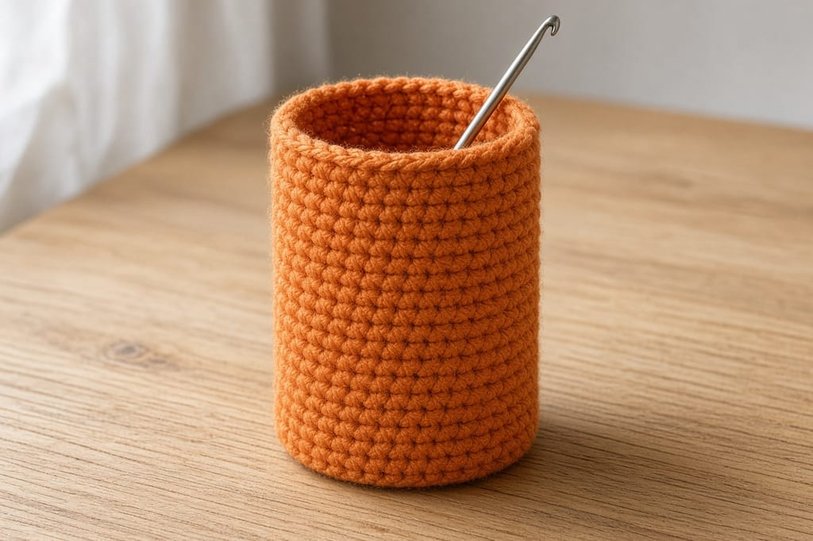
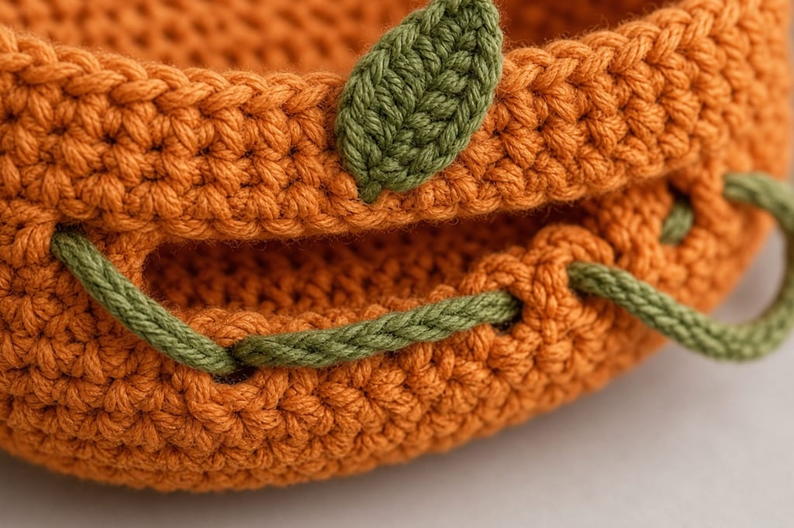
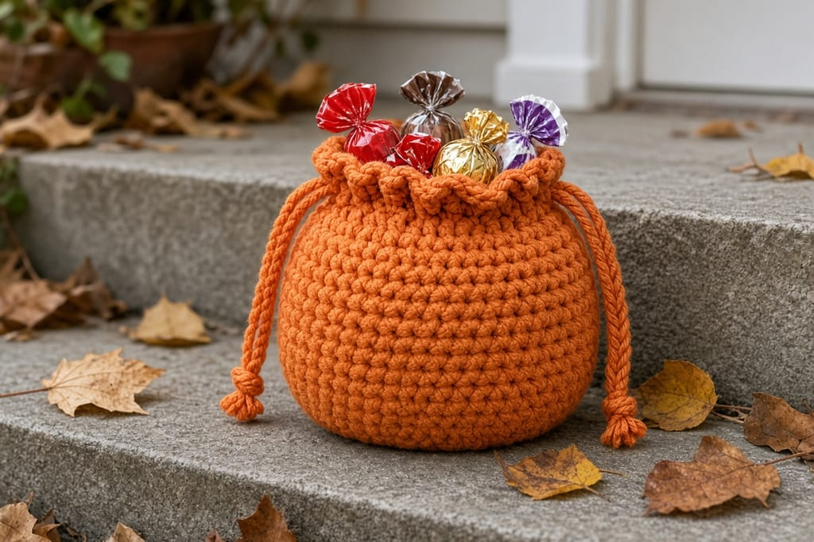

A treat bag only works if the candy stays in when a kid swings it. This one is a small orange tube with a flat base, a drawstring, and a green stem sewn where it will not block the cord.

It holds a handful of wrapped candy, not a pillowcase full. US terms. US single crochet is UK double crochet. See the [abbreviations chart](/crochet-abbreviations-chart/).

Photos are illustrations. The inches are estimates from the gauge. This bag has not been filled and measured in real yarn. Test it with the candy you mean to put in it.

## Materials

- Worsted cotton, orange, about **80 yards**. Green, about **10 yards**. [Yarn weight chart](/yarn-weight-chart/).
- US G/6 (4.0 mm) hook. [Hook chart](/crochet-hook-size-conversion-chart/).
- Yarn needle, scissors, stitch marker.

Beginner. About 2 to 3 hours. A stuffed pumpkin with segments is a different project: [how to crochet a pumpkin](/how-to-crochet-a-pumpkin-step-by-step/). This page is a bag.

## Gauge and size (estimates)

**4 sc = 1 inch. 5 rounds = 1 inch.**

The base stops at 48 stitches, about **12 inches** around and about **3.8 inches** across. Twenty even rounds are about **4 inches** of wall. That is a small gift pouch. For more candy, follow the taller note later. Do not stretch the fabric and call that extra room.

## Base and body

Spiral. Do not join. Mark the first stitch. Same start as [crochet in the round](/crochet-in-the-round/).

**Round 1:** 6 sc in a magic ring. (6)

**Round 2:** inc in each. (12)

**Round 3:** (sc, inc) 6 times. (18)

**Round 4:** (2 sc, inc) 6 times. (24)

**Round 5:** (3 sc, inc) 6 times. (30)

**Round 6:** (4 sc, inc) 6 times. (36)

**Round 7:** (5 sc, inc) 6 times. (42)

**Round 8:** (6 sc, inc) 6 times. (48)

Each round adds 6 stitches. Round 8 uses 7 stitches per repeat, 6 repeats, 42 stitches from Round 7 plus 6 increases = 48.

**Rounds 9–28:** sc in each stitch. (48)

Twenty rounds, no increases. The count stays 48.

## Drawstring

**Round 29:** (sc, ch 1, skip 1) 24 times. (24 sc and 24 chain spaces)

Each repeat uses 2 stitches. Twenty-four repeats use all 48. If you are not on 48 at the end of Round 28, do not start this round. Find the extra or missing stitch first.

**Rounds 30–31:** sc in each sc and each chain space. (48)

Fasten off.

Chain 90 in orange for the cord. Weave it through the Round 29 spaces. Both ends come out at the front. Pull them. The rim should gather. A wrapped candy should not fall through the closed top.

## Stem

Green. This is a short tube, not a leaf.

**Round 1:** 5 sc in a magic ring. (5)

**Rounds 2–5:** sc in each. (5)

Fasten off. Sew the open end to the outside of the rim, between two drawstring holes, so the needle does not sew a hole shut. The stem is decoration. It does not hold the candy.

## Finishing

Weave ends inside. Put in the candy you plan to give. If the bag is too short, you needed more even rounds before Round 29, not a harder pull on the cord.

## What to put in it

Wrapped hard candy is the safe load. A few chocolate pieces are fine on a cool porch and a bad idea in a warm car, because the pouch does nothing to keep them cool. Skip anything sticky and unwrapped. It glues the cotton and you will not get it out of the stitches.

Do not hang this bag from a costume and call it a trick-or-treat sack. The 4-inch wall, at the gauge above, fills after a short stop. The taller change later on this page is still a pouch. A pillowcase or a real bucket is the right tool for a full route.

If you are handing the bag to a child, check the cord tails. Trim them so they are long enough to tie and short enough that they are not a loop around a neck. Knot each tail so the cord cannot pull back through the holes.

The stem uses about 10 yards because a 5-stitch tube is small. If your green scrap is shorter, stop at Round 3. A shorter stem still reads as a pumpkin as long as it is green and it is not sewn through a drawstring hole.

## Changes

**Taller.** Work Rounds 9–36 instead of 9–28, still at 48, then do the drawstring round.

**Wider.** After Round 8, work (7 sc, inc) 6 times. (54) Then work even on 54. The drawstring repeat count becomes 27, because 54 is still even.

**No stem.** The bag still closes. Skip the green.

## Mistakes

**Sewing the stem through a chain space.** The cord snags. Sew between the holes.

**A joined round plus a chain.** That bumps the count off even and the eyelet round fails. Stay in a spiral.

**Worsted acrylic that pills.** Candy wrappers stick to it. Cotton is the better default.

## Care

Hand wash cool, dry flat, empty it first. Do not claim the bag is waterproof. Single crochet cotton slows a drip. It does not keep chocolate dry in rain.

## Frequently asked

**Can a toddler use this as a trick-or-treat bag?**

Only for a few pieces at one house. The 4-inch wall fills up fast. The taller change is still a small pouch.

**Is the stem structural?**

No. The drawstring closes the bag.

**Can I sell finished bags?**

Yes. Do not republish this pattern.

## Next

A coin-sized version of the same drawstring is the [ghost coin pouch](/how-to-crochet-a-ghost-coin-pouch/). A flat Halloween holder for cards is the [card wallet](/halloween-crochet-card-wallet/).
