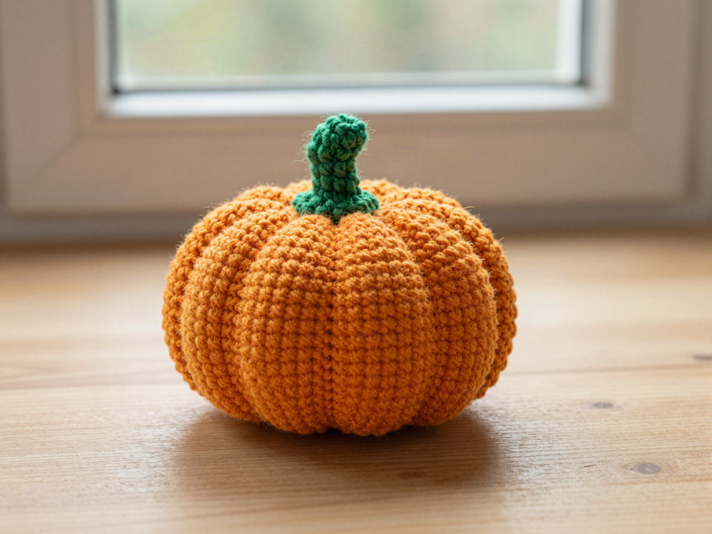
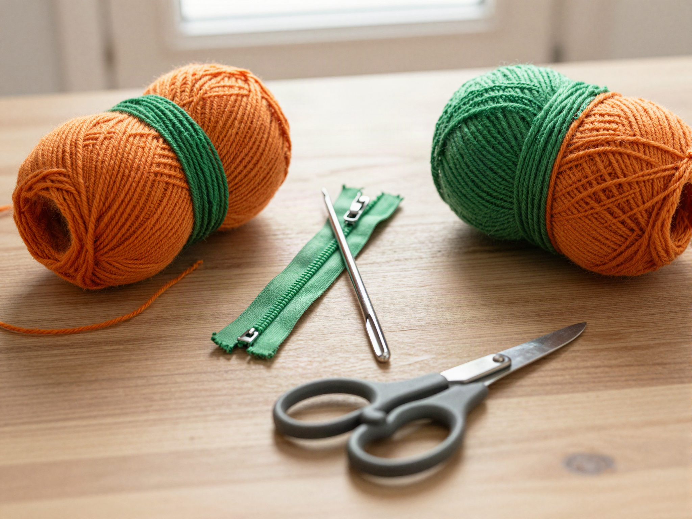
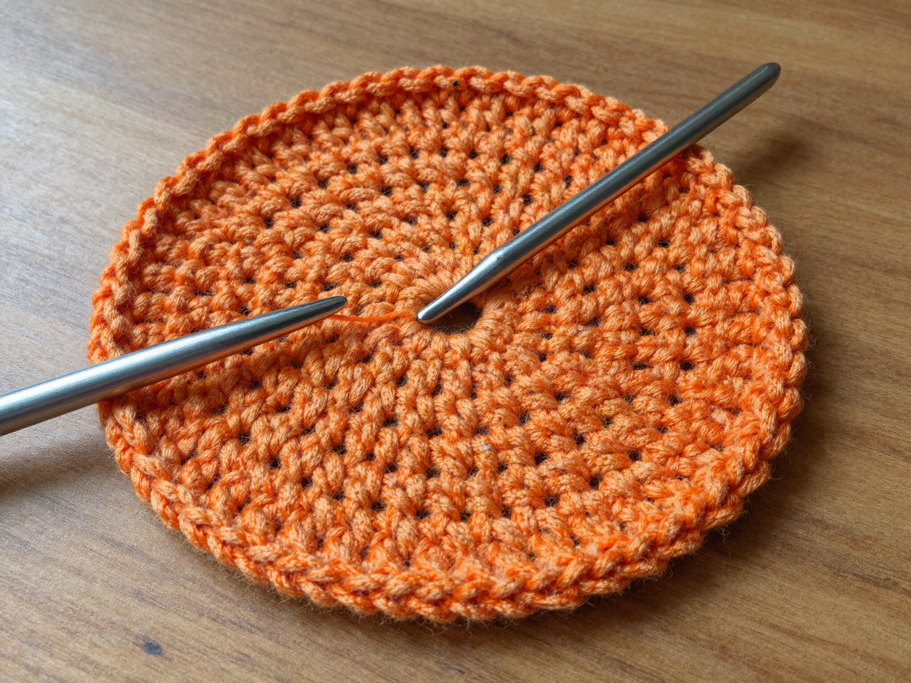
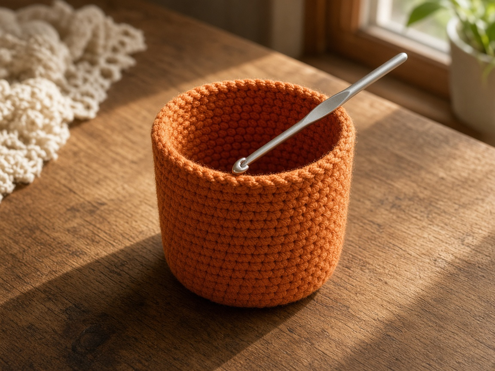
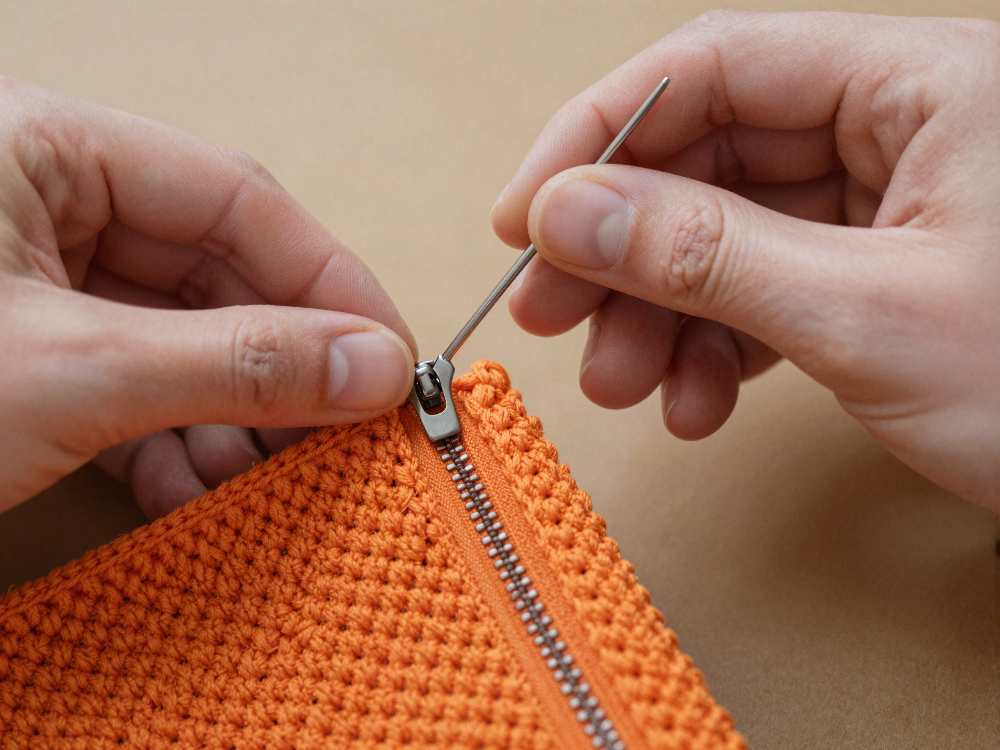
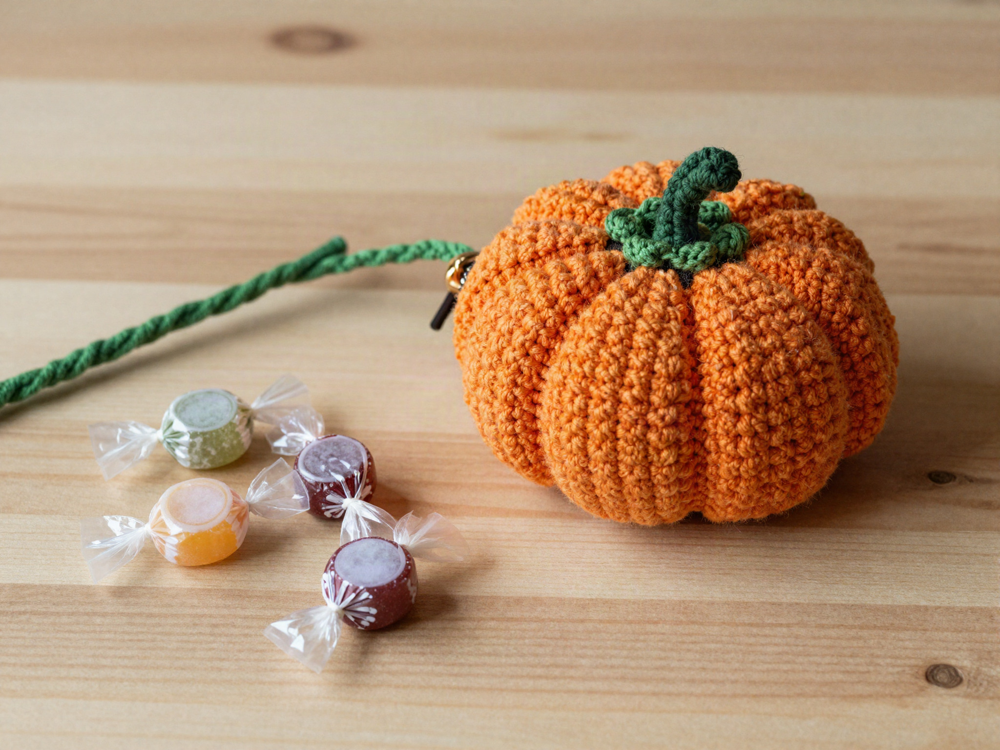

Wrapped candy and lip balm disappear in a tote. A small pumpkin pouch keeps them in one place, and the zipper stops the candy from walking out when the bag tips. It is a Halloween project that still works in November if you leave the stem on and stop calling it a pumpkin.

US terms. US single crochet is UK double crochet. [Abbreviations](/crochet-abbreviations-chart/). The photos are illustrations. This pouch has not been stitched and weighed in yarn, so the inches and the yardage are estimates from the gauge below. Zip the pouch around the candy you actually carry before you weave the ends in for good.

## What you are making

A flat circle becomes a cup. The cup is the pouch. A short zipper closes the top, and a few green stitches sit on the outside as a stem. It is not a stuffed pumpkin. If you want a solid round pumpkin, use the [pumpkin pattern](/how-to-crochet-a-pumpkin-step-by-step/) instead. A drawstring version, with no zipper, is the [pumpkin treat bag](/how-to-crochet-a-pumpkin-treat-bag/).

The example is about **3.5 inches across and 3 inches tall**, at the gauge below. That holds a handful of wrapped candy or a lip balm and a few coins. It will not hold a phone.

## Materials

- Worsted weight cotton, orange. About **70 yards** for the example. [Yarn weights](/yarn-weight-chart/).
- A few yards of green worsted, for the stem only.
- US G/6 (4.0 mm) hook, or the hook that hits the gauge. [Hook chart](/crochet-hook-size-conversion-chart/).
- A closed-end zipper about **5 inches** long. Longer is fine. You will sew only the length of the opening.
- Yarn needle, sewing needle, thread that matches the zipper tape, scissors.

Cotton holds a zipper better than a fuzzy acrylic. Acrylic still works if that is what you have. Do not use a metal zipper if you plan to toss the pouch in a wash with hooks and snaps. Nylon coil is the quieter choice.

Beginner, once you can single crochet in the round. The sewing is the part that takes patience, not the crochet. Plan an evening.

## Gauge (estimate)

**4 sc = 1 inch. 5 rounds = 1 inch.**

Nothing here was measured off a finished pouch. If your swatch is not 4 single crochet to the inch, do not keep the stitch counts and hope. [Gauge](/crochet-gauge/) is the whole fit. A pouch that is an inch too wide still works. A pouch that is an inch too short will not take the zipper without buckling.

## Base

Ch 1 does not count as a stitch. Work in a spiral and mark the first stitch of the round, or join each round. The counts below are for joined rounds. If you spiral, do not add the slip stitch, and do not chain 1.

**Round 1:** 6 sc in a [magic ring](/crochet-in-the-round/). Join. (6)

**Round 2:** 2 sc in each stitch. (12)

**Round 3:** (sc, 2 sc in the next) around. (18)

**Round 4:** (2 sc, 2 sc in the next) around. (24)

**Round 5:** (3 sc, 2 sc in the next) around. (30)

**Round 6:** (4 sc, 2 sc in the next) around. (36)

**Round 7:** (5 sc, 2 sc in the next) around. (42)

**Round 8:** (6 sc, 2 sc in the next) around. (48)

At 4 sc to the inch, 48 stitches are about **12 inches** around, which is a circle about **3.8 inches** across. Lay a tape on it. If the circle is already cupping, you increased too fast or your tension is tight. If it is ruffling, you increased too much for your yarn. Stop one round early rather than forcing a wavy base into a pouch.

## Sides

Work even. One single crochet in each stitch, no increases.

**Rounds 9–23:** sc in each stitch. (48)

That is 15 even rounds. At 5 rounds to the inch, the wall is about **3 inches** tall. Stop earlier if you want a squat pumpkin. Add rounds if the zipper tape is wide and eating the height. Count once in the middle. A pouch that quietly gained a stitch will not sit flat under a zipper.

Fasten off. Weave the orange end down the inside.

## Zipper

The opening is a circle. A zipper is a straight line. You are not going to zip a perfect circle. Pinch the top so two opposite stitches meet, and sew the zipper along that opening as a gentle oval, not around the entire rim.

1. Zip the zipper. Closed zippers are easier to place.
2. Set the tape inside the rim so the teeth sit just below the top round.
3. Pin or clip the center, then the two ends. The ends of a 5 inch zipper will not reach all the way around 12 inches of rim. That is correct. The unsewn sides stay as crochet.
4. With sewing thread, whipstitch the tape to the single crochet. Catch the tape, not the teeth.
5. Open the zipper and check that the pull does not catch a stitch. If it does, you sewed too close to the teeth. Take that section out and move it.

Do not crochet the zipper in. The holes in zipper tape are not made for a G hook, and a crocheted seam usually puckers.

## Stem

With green, join anywhere on the outside, just beside the zipper, not on the tape.

Chain 8. Slip stitch in the second chain from the hook and back along the chain. Slip stitch into the pouch to anchor it. Fasten off. The stem should stick up. If it flops into the zipper pull, it is too long. Unravel and chain 6 instead.

## Mistakes

**Sewing the zipper shut.** You stitched through both sides of the tape and the teeth never open. Open it every few stitches while you sew.

**A wavy base.** Too many increases for your gauge. The pouch will rock on a table. Frog back to the last flat round.

**Stem on the zipper tape.** The pull snags it on the first close. The stem sits on crochet only.

**Fuzzy yarn and a short zipper.** The teeth swallow the fuzz. Cotton or a smooth acrylic, and a zipper that is actually long enough to see.

## Care

Empty it. Hand wash cool if the zipper is nylon. Dry flat, zipper open, so the tape does not dry curled. Do not iron the coil.

## Frequently asked

**Can I skip the zipper?**

Yes. Thread a chain drawstring through round 21 the way the [ghost coin pouch](/how-to-crochet-a-ghost-coin-pouch/) does, and skip the stem if it gets in the way of the cord.

**Will it hold a phone?**

No. This circumference is for candy and small tins. A phone needs its own measurements: [phone case](/how-to-crochet-a-phone-case/).

**Is the orange color part of the pattern?**

No. Any worsted works. Orange reads as a pumpkin. Cream reads as a plain pouch with a green loop, which is still a useful pouch.

## Next

A taller white bag for more candy is the [ghost treat bag](/how-to-crochet-a-ghost-candy-bag/). A flat card pocket, if you would rather skip the zipper, is the [card wallet](/halloween-crochet-card-wallet/).
