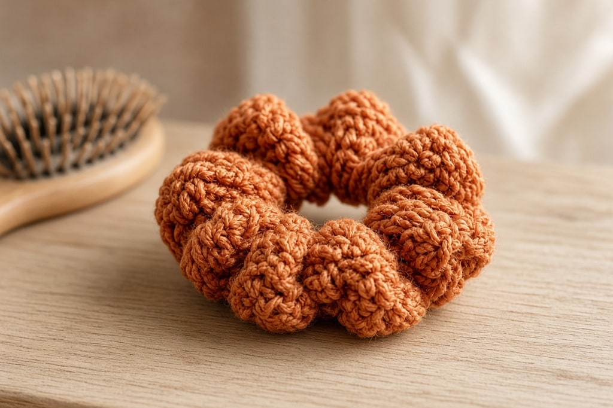
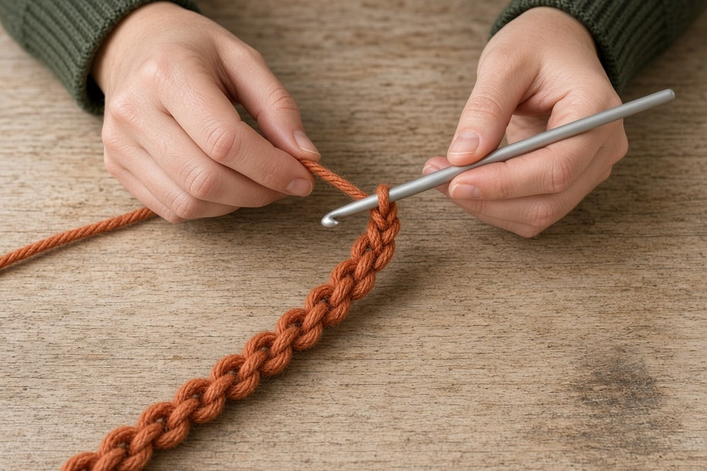
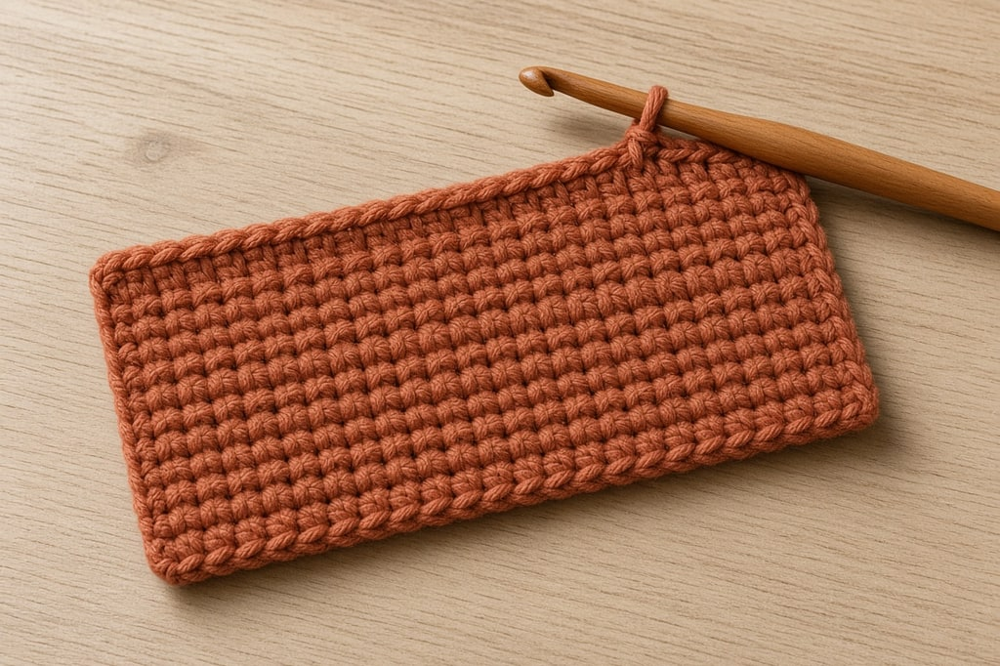
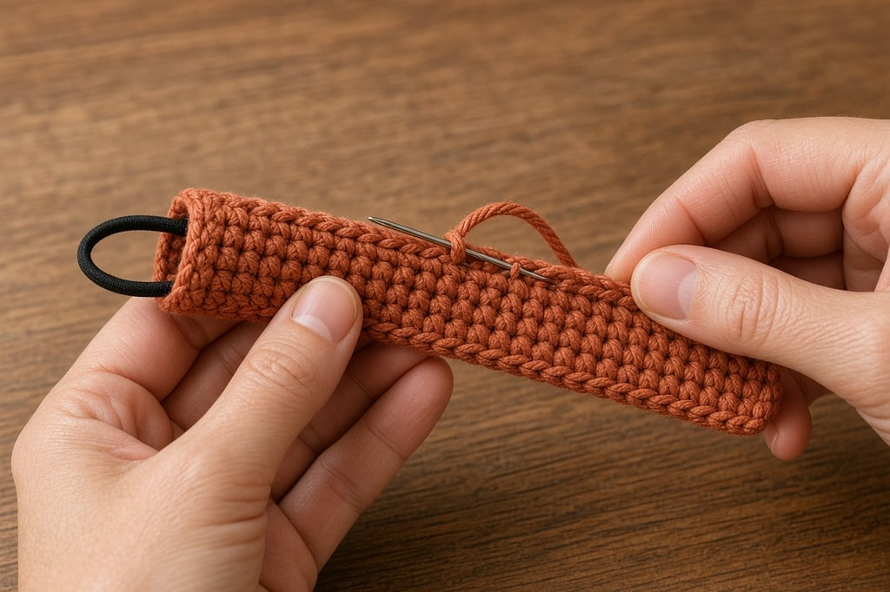
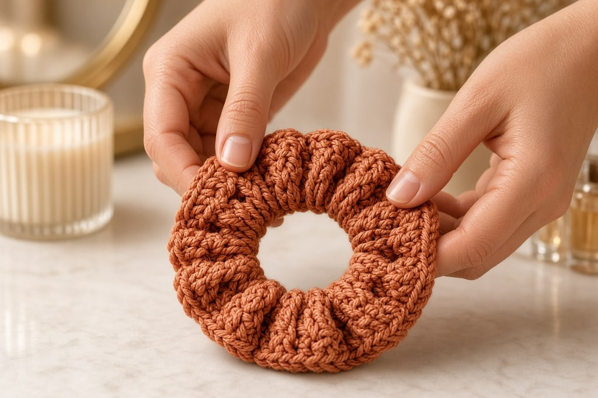

A crochet scrunchie is the rare beginner project that people actually wear. It finishes in one evening, uses scrap yarn, and shows up constantly on Pinterest and reels — which is why it earns a spot here beside the seasonal amigurumi.

You are not inventing a new stitch. You crochet a flat strip, sew it into a tube around a regular elastic hair tie, and bury the ends. If you can [single crochet](/basic-crochet-stitches/) in rows, you can make one tonight.

The version below is the strip method, not crochet worked directly onto the elastic. Working onto the elastic is faster for some people and tighter for others. The strip is easier to photograph, easier to frog, and easier to size when your first try comes out wrong.

## What you need

- Worsted-weight yarn, about **30–40 yd** — [yarn weight chart](/yarn-weight-chart/)
- Hook matched to the yarn, often US G/6 (4.0 mm) or H/8 (5.0 mm) — [hook size chart](/crochet-hook-size-conversion-chart/)
- **One elastic hair tie** (the thin covered kind, not a bare rubber band)
- Yarn needle
- Scissors

US abbreviations throughout. Open the [abbreviations chart](/crochet-abbreviations-chart/) if any look unfamiliar.

## Finished size

Aim for a fabric strip about **14–16 in long × 2.5–3 in wide** before you seam it around the elastic. Soft acrylic or cotton both work. Fuzzy yarn hides stitches on camera but eats elastic stretch — save it for a second make.

## Step 1: chain the length

Chain until the chain measures about **14–16 in** when held relaxed (often **ch 50–60** in worsted). Do not stretch the chain to measure it.

Turn. Sc in the second chain from the hook and in each chain across. That stitch count is your width for every row.

**Too short and the gathers look stingy.** Too long and the scrunchie gets bulky and hard to twist twice. Start near 15 in and adjust after your first one.

## Step 2: work the rectangle

Work rows of **single crochet**, ch 1 and turn at the end of every row (turning chain does not count as a stitch). Keep the stitch count identical every row.

Stop when the strip is about **2.5–3 in** tall — usually **8–12 rows**. The fabric should feel soft, not stiff. If it cups, your chains are tight; frog and chain looser, or go up a hook size for the foundation only.

Optional: work the last two rows in a contrast color for a stripe that reads cleanly in a reel.

## Step 3: seam into a tube around the elastic

Lay the elastic along the long center of the wrong side of the strip. Fold the long edges together so they meet, with the elastic trapped inside. Whipstitch or mattress-stitch the long edges closed along the full length, catching both edges and keeping the elastic free to slide inside the tube.

Do not sew through the elastic. If you catch it, the scrunchie will not stretch.

Join the two short ends of the tube with a few firm stitches so you have one continuous ring. Weave ends into the seam — [weaving in ends](/weaving-in-ends-and-blocking/) covers the clean method.

## Step 4: even the gathers

Slide the crochet fabric around the elastic until the gathers look even all the way around. Twist once in your hands the way you would a store-bought scrunchie. If the fabric fights you, the strip was too short or the seam too tight — note it for the next one.

## Color ideas that pin well

Solid bright yarn on a plain background wins on phone cameras. Black yarn hides every stitch and looks like a blob in a reel thumbnail. Pastels work if the light is clean. A thin contrast stripe on the last two rows gives the eye a line to follow without a second project’s worth of colorwork — same join used in [changing yarn color](/changing-yarn-color-crochet/).

If you are batching for gifts, pick three colors and make three in one sitting. The second and third go faster than the first because the seam is the only part that needs attention.

## Mistakes that make a sad scrunchie

**Sewing through the elastic.** Instant dead stretch. Seam fabric only.

**Strip too narrow.** It looks like a skinny yarn doughnut and photographs poorly. Give yourself at least 2.5 in of width.

**Giant stiff gauge.** Go up a hook size. Scrunchies need drape.

**Leaving yarn tails outside.** They catch in hair. Bury them in the seam.

**Using a brittle dollar-store elastic.** It snaps after a week and the crochet looks guilty. Use a soft covered hair tie you would actually wear bare.

## Frequently asked

### How long does this take?

Under an hour once you know single crochet. Film-friendly checkpoints: finished rectangle, elastic inside, even gathers, hair twist test.

### Can I use velvet or fur yarn?

Yes for looks, harder for first makes. The stitches disappear and seaming gets guessy. Make one in smooth worsted first.

### Will it damage hair?

No more than a normal fabric scrunchie if the elastic is soft and the seam has no knots on the outside. Skip metal hair ties.

### Can kids make these?

If they can keep an even single crochet for ten rows, yes — with help on the seam so the needle does not go through the elastic. It is a better first wearable than a hat.

### What should I make next?

A [simple flower](/how-to-crochet-a-simple-flower/) sewn onto a second scrunchie, a [mug cozy](/crochet-mug-cozy-for-beginners/) for gifts, or stay seasonal with the [Halloween card wallet](/halloween-crochet-card-wallet/).
