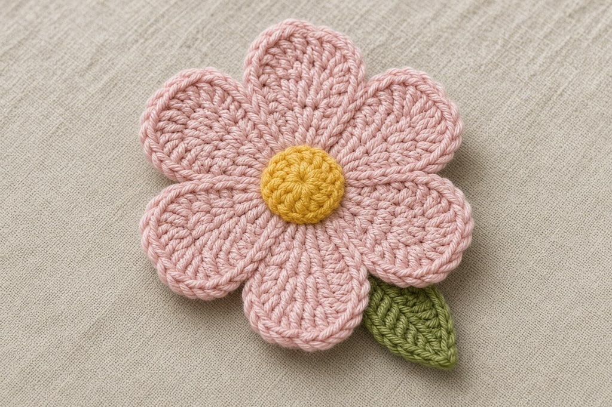
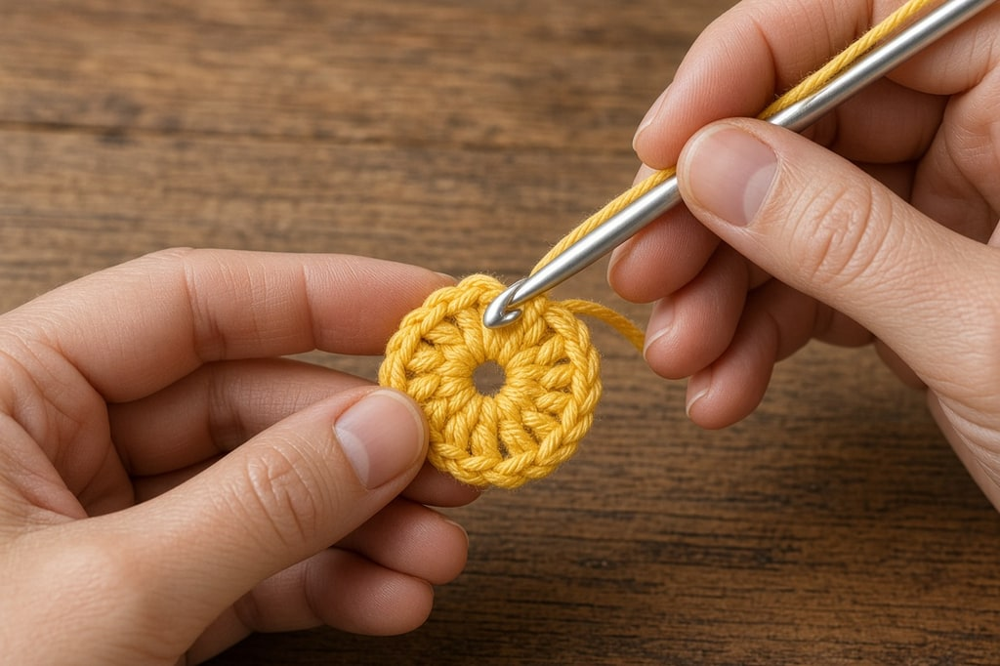
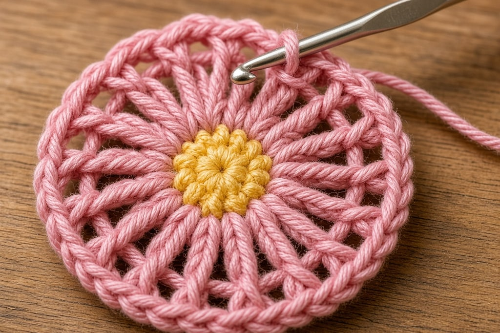
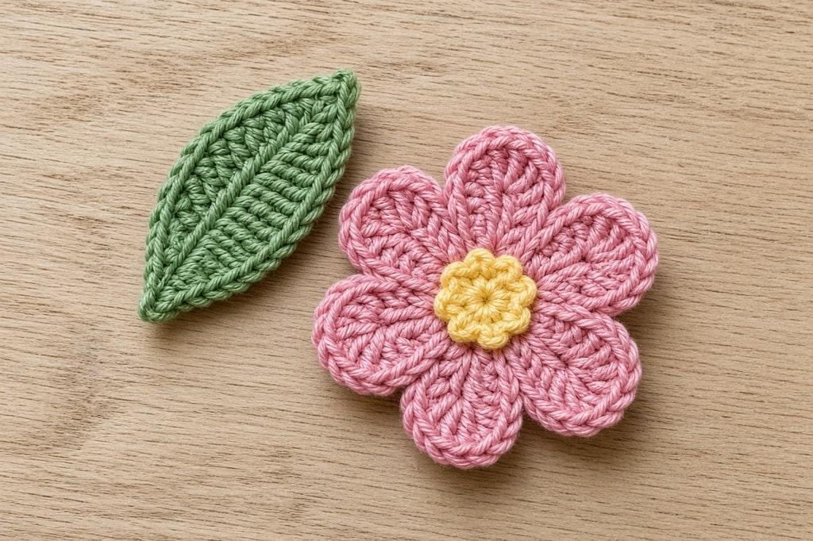
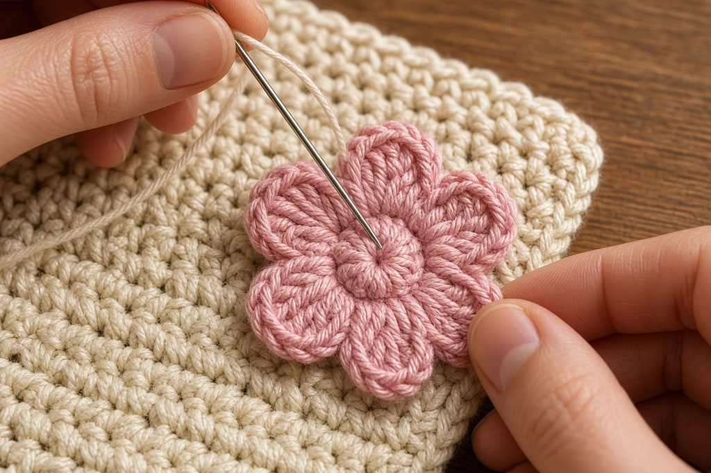

A flat crochet flower is a traffic magnet because it finishes small, photographs bright, and attaches to almost anything — scrunchie, mug cozy, beanie, gift wrap, Halloween card wallet. You are making an appliqué, not a botanical masterpiece.

This version is one center plus one petal round. If you can work a [magic ring](/crochet-in-the-round/) and a few double crochets, you can finish a flower in about fifteen minutes.

Five petals is the sweet spot for “reads as a flower from three feet away.” Four looks sparse. Six still works if you start with six center stitches — just keep petal count and center stitches matched so the circle stays honest.

## What you need

- Worsted-weight yarn in **petal color** and scrap **center color** (yellow or cream) — [yarn weight chart](/yarn-weight-chart/)
- Optional scrap **green** for a leaf
- Hook matched to the yarn, often US G/6 (4.0 mm) or H/8 (5.0 mm) — [hook size chart](/crochet-hook-size-conversion-chart/)
- Yarn needle

US terms. [Abbreviations chart](/crochet-abbreviations-chart/) if anything is unfamiliar.

## Finished size

About **2–2.5 in** across in worsted. Smaller hook or DK yarn makes a neater appliqué for thin straps; thicker yarn makes a bold reel prop.

## Step 1: make the center

With center color:

**Rnd 1.** Magic ring, 5 sc. Join with sl st to first sc. (5)

Pull the ring closed firmly. Fasten off center color, leaving a short tail to weave later — or carry it if you prefer fewer ends.

If magic rings still fight you, ch 2 and work 5 sc in the second chain from the hook, then join. The center will have a tiny hole; that is fine under petals.

## Step 2: work the petals

Join petal color in any center stitch.

**Petal.** Into the same stitch: *ch 2, 3 dc, ch 2, sl st.* That is one petal.

Move to the next center stitch and repeat until you have **5 petals**. Join with a slip stitch to the base of the first petal. Fasten off with a long tail for sewing.

You should see five distinct lobes. If a petal looks skinny, your dc are too tight — loosen the yarn overs. If petals cup hard, go up a hook size.

**Count out loud: one petal per center stitch.** Five center stitches, five petals. Skip a stitch and you get a gap that looks like a missing tooth on camera.

## Step 3: optional leaf

With green: ch 7. Sc in second ch from hook, hdc in next, dc in next 2, hdc in next, sc in last. Fasten off with a tail. Sew under one side of the flower so only part of the leaf shows.

Skip the leaf for the fastest reel. Add it when you want a gift-ready flat lay.

## Step 4: sew it on

Thread the long petal-color tail. Sew through the flower center into the host fabric (scrunchie, cozy, hat), then catch the base of each petal once so the flower cannot flip. Weave ends on the back.

Do not glue it for wearables — glue cracks. Sewing holds through washes better.

## Where to put them

Sew flowers onto a [scrunchie](/how-to-crochet-a-scrunchie/), the flap of a [mug cozy](/crochet-mug-cozy-for-beginners/), a plain beanie, a gift bag, or the corner of a [Halloween card wallet](/halloween-crochet-card-wallet/) when you want a non-ghost option. For Christmas reels, make white petals with a gold or pale yellow center and pin them next to a [snowflake](/how-to-crochet-a-snowflake/).

Batch work: finish ten centers first, then all the petal rounds, then sew. Assembly-line order is faster than completing each flower start to finish when you are stocking a craft fair or a teacher gift set.

## Mistakes that flatten the charm

**Leaving the magic ring loose.** The center becomes a hole. Pull it shut before petals.

**Six petals on five stitches.** You will steal stitches and warp the circle. Match petal count to center stitches.

**Sewing only the center.** Petals flip up in a bag. Anchor petal bases.

**Giant yarn on a tiny strap.** Scale down with DK if the flower wider than the item looks silly.

**Blocking with an iron on acrylic.** You will melt the petals. Steam from above or skip blocking — flat flowers rarely need it.

## Frequently asked

### How long does one flower take?

About fifteen minutes after the first one. Batch five in an evening for a gift set.

### Can I make a rose instead?

A rose is a different construction (a long ruffled strip rolled up). This page is the flat appliqué that beginners finish. Master this, then graduate.

### What colors pin best?

Bright solids on a neutral background. Variegated yarn muddies petal edges on phone cameras.

### Do I need to know double crochet?

Yes for this petal shape. If you only know single crochet, learn dc in [basic stitches](/basic-crochet-stitches/) first — five minutes of practice, then come back.

### What should I make next?

Sew one onto a [scrunchie](/how-to-crochet-a-scrunchie/) or [mug cozy](/crochet-mug-cozy-for-beginners/). For seasonal makes, try a [pumpkin](/how-to-crochet-a-pumpkin-step-by-step/) or [snowflake](/how-to-crochet-a-snowflake/).
